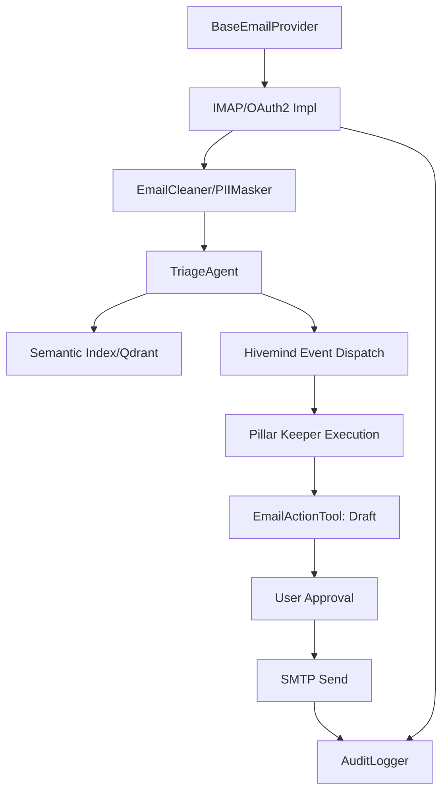

# 🔱 JEM — Sovereign Synthesis: Email Integration Knowledge Graph
**AP Token**: `AP-JEM-SYNTH-EMAIL-v1.0.0`
⬡ OMEGA ⬡ JEM ⬡ NEMOTRON-3-SUPER ⬡ opencode ⬡ trc_synthesis ⬡ ACTIVE

**Date**: 2026-07-10
**Status**: PROPOSED ARCHITECTURE (Synthesis based on Sovereign Principles)
**Source**: Synthesized from Omega Engine Core Patterns & Sovereign Mandates (External Research Tools Offline)

---

## 🎯 Executive Summary
This document defines the implementation roadmap for integrating sovereign email capabilities into the Omega Engine. The goal is to enable the agent fleet to ingest, process, and act upon email communications while maintaining absolute user sovereignty, local-first data residency, and zero telemetry.

## 🏗️ The 6-Layer Synthesis Framework

### 1. Ingestion Layer (The Gateway)
**Objective**: Secure, multi-account retrieval of raw email data.

- **Architectural Decision**: **Hybrid Ingestion Strategy**. 
    - Use **IMAP** (Internet Message Access Protocol) for universal compatibility with legacy and sovereign mail servers.
    - Use **OAuth2-based APIs** (Gmail API, Microsoft Graph) for modern providers to avoid "Less Secure App" blocks and ensure robust token management.
- **Technical Stack**:
    - `imaplib` / `email` (Standard Library) for IMAP.
    - `google-api-python-client` & `msal` for API-based auth.
    - **Token Store**: Encrypted local YAML/JSON store in `data/entities/<name>/secrets/tokens.yaml`.
- **Implementation Roadmap**:
    1. Define `BaseEmailProvider` abstract class.
    2. Implement `IMAPProvider` and `OAuth2Provider`.
    3. Build `AccountManager` to handle rotation and connectivity checks.
    4. Implement a unified `EmailMessage` dataclass to normalize different provider formats.

### 2. Processing Layer (The Filter)
**Objective**: Transform raw, noisy email data into clean, safe, and structured text.

- **Architectural Decision**: **Local-First PII Redaction**.
    - All emails MUST pass through the `PIIMasker` before reaching any LLM (Local or Cloud).
    - Implement structural analysis to detect obfuscation (e.g., "user [at] gmail [dot] com").
- **Technical Stack**:
    - `src/omega/pii_masker.py` (Existing Engine Component).
    - `BeautifulSoup4` for HTML-to-Text conversion.
    - Custom regex suite for email-specific PII patterns.
- **Implementation Roadmap**:
    1. Implement `EmailCleaner` to strip HTML/CSS and signatures.
    2. Integrate `PIIMasker.mask()` to replace sensitive data with tokens (e.g., `[EMAIL_1]`).
    3. Implement a "Sovereign Shield" that flags emails containing suspicious links or attachments for manual review.

### 3. Intelligence Layer (The Brain)
**Objective**: Semantic understanding, triage, and action extraction.

- **Architectural Decision**: **Local-First Triage**.
    - Use a small, fast local model (e.g., `qwen3-1.7b` or `phi-3`) for initial categorization and summarization.
    - Escalate complex reasoning to larger models via `ModelGateway`.
- **Technical Stack**:
    - `ModelGateway` $\rightarrow$ `native-gguf` (Primary).
    - **Prompt Strategy**: Few-shot prompting for "Triage" (Category: Action, Info, Urgent, Spam).
- **Implementation Roadmap**:
    1. Develop `TriageAgent` prompt for intent detection.
    2. Implement a "Summarization Pipeline" that creates a concise L1 narrative of the email.
    3. Build a "Semantic Index" using Qdrant to allow the agent to search across historical emails.

### 4. Action Layer (The Hand)
**Objective**: Safe execution of email-based tasks.

- **Architectural Decision**: **Human-in-the-Loop (HITL) / Draft-First**.
    - Agents may NEVER send emails directly. They must create a **Draft** for user approval.
- **Technical Stack**:
    - SMTP for sending approved drafts.
    - Provider-specific "Create Draft" API calls.
- **Implementation Roadmap**:
    1. Implement `EmailActionTool` with methods: `create_draft()`, `mark_as_read()`, `move_to_folder()`.
    2. Create a "Review Queue" in the Omega CLI/UI for the user to approve/edit drafts.
    3. Implement `send_approved_draft()` as the final terminal action.

### 5. Governance Layer (The Sentry)
**Objective**: Auditability, compliance, and tamper-evidence.

- **Architectural Decision**: **Sovereign Audit Trail**.
    - Every action (Read $\rightarrow$ Process $\rightarrow$ Draft $\rightarrow$ Send) must be logged in a tamper-evident local ledger.
- **Technical Stack**:
    - SHA-256 hashing for action chaining.
    - Ed25519 signatures for verifying agent-initiated actions.
    - Local SQLite database for the audit log.
- **Implementation Roadmap**:
    1. Implement `AuditLogger` to record `(timestamp, action, email_id, hash)`.
    2. Create a "Verification Tool" to ensure the audit log hasn't been modified.
    3. Map all actions to GDPR/EU AI Act compliance requirements (e.g., Right to Erasure).

### 6. Integration Layer (The Nerve System)
**Objective**: Wiring email events into the Hivemind and Pillar Keepers.

- **Architectural Decision**: **Event-Driven Orchestration**.
    - Email events trigger Hivemind context updates, which then dispatch to the appropriate Pillar Keeper.
- **Technical Stack**:
    - `omega-hub_hivemind_post_context` for event propagation.
    - `Sovereign-Symmetry` mapping for email categories $\rightarrow$ Pillars.
- **Implementation Roadmap**:
    1. Map email categories to Pillars (e.g., Technical $\rightarrow$ P3 Engineering, Legal $\rightarrow$ P5 Governance).
    2. Implement a "Polling Service" (or Webhook listener) that feeds the `TriageAgent`.
    3. Wire `TriageAgent` output to `hivemind_post_context(intent="command", ...)` to summon the correct agent.

---

## 🗺️ Master Task Graph (Dependencies)

## 🛠️ Technology Stack Summary
| Layer | Component | Tech/Library | Model |
| :--- | :--- | :--- | :--- |
| **Ingestion** | Provider Fabric | `imaplib`, `google-api-python-client`, `msal` | N/A |
| **Processing** | PII Shield | `src/omega/pii_masker.py`, `BeautifulSoup4` | N/A |
| **Intelligence** | Triage/Summary | `ModelGateway` $\rightarrow$ `native-gguf` | `qwen3-1.7b` / `phi-3` |
| **Action** | Draft/Send | `smtplib`, Provider APIs | N/A |
| **Governance** | Audit Trail | `hashlib`, `sqlite3`, `Ed25519` | N/A |
| **Integration** | Hivemind | `omega-hub` MCP Tools | N/A |

## ⚠️ Risk Matrix
| Risk | Impact | Probability | Mitigation |
| :--- | :--- | :--- | :--- |
| **Auth Token Leak** | High | Low | Encrypted local storage; No cloud backup of tokens. |
| **PII Leak to Cloud** | Critical | Medium | Mandatory `PIIMasker` gate before any cloud-fallback inference. |
| **API Rate Limits** | Medium | High | Implement "Sticky-until-429" failover and local caching. |
| **Context Bloat** | Medium | Medium | Aggressive summarization and saliency gating in the Intelligence layer. |

## 🧬 Integration Map (Ownership)
- **P1 (Infrastructure)**: Manages the `EmailIngestor` service and Podman containerization.
- **P5 (Governance)**: Owns the `AuditLogger` and compliance verification.
- **P9 (Orchestration)**: Manages the handoff from `TriageAgent` to other Pillars.
- **JEM (Synthesizer)**: Periodically distills email patterns into L1$\rightarrow$L2$\rightarrow$L3 gnosis for the entity's soul.
