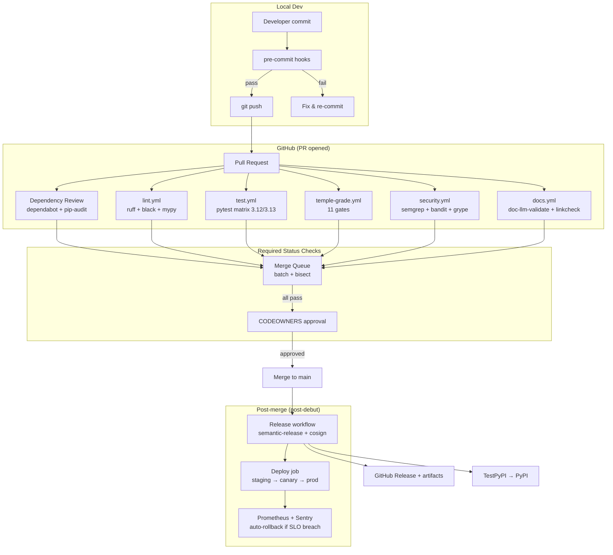
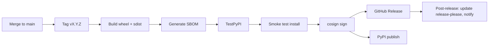

# MAAT_CICD_PIPELINE_20260829.md

**Mission**: Temple-Grade CI/CD pipeline research — GitHub Actions matrix strategy, pre-commit, branch protection, deployment gates
**Entity**: MA'AT (Build Oversoul, N1-N5)
**Channel**: opencode
**Model**: openrouter/minimax/minimax-m3:free
**Date**: 2026-08-29
**Sprint**: PUBLIC-DEBUT-01
**Status**: RESEARCH REPORT (no code changes)
**Cross-refs**: `Makefile` (test/lint targets), `.github/workflows/ci.yml:52` (current), `.pre-commit-config.yaml:185` (current), `MAAT_TEMPLE_GRADE_REQUIREMENTS_20260829.md` (the 11 gates)

---

## Executive Summary (L1)

The Omega Engine's CI/CD currently has **the bones but not the muscle**. `ci.yml` runs `pytest + flake8 + check-mandates + doc-lint` on Python 3.12/3.13. `.pre-commit-config.yaml` (185 lines) covers the local side. The gap to 2026 SOTA is **7 missing pieces**: dependency caching, dependency review, SBOM/SAST, signed commits, merge queue, deployment gates, and rollback automation.

**Council verdict**: The current pipeline is **green-but-fragile**. A 30% test coverage regression can ship because coverage isn't a required check. A high-severity CVE in `transformers` can ship because there's no `pip-audit`. A force-push to main is one config setting away.

**Top 3 to implement first**:
1. **Coverage gate (≥80% new code)** — `pytest --cov --cov-fail-under=80` in CI + pre-commit
2. **Dependency review (CVE block)** — `pip-audit --strict` + `dependabot.yml` + `actions/dependency-review-action@v3`
3. **Merge queue (GitHub-native)** — Replace "1 approval" with "all green on merge_group"

**Bottom 3 (defer)**:
- **Sigstore + SLSA L3** — only needed for k8s deploys (P3)
- **Argo Rollouts** — only needed when we have multi-pod deployments
- **Self-hosted runners** — public repo on GitHub-hosted is fine until we hit 50K CI-min/mo

**2026 SOTA anchor**: GitHub Actions matrix strategy (Octopus 2026-01-14) + GitHub merge queue (GA 2024) + Dependabot version updates (2026 default). All three are table-stakes for "temple-grade" in 2026.

---

## L2: The 2026 SOTA CI/CD Stack

### Architecture Diagram (Mermaid)



### The 7 Pipeline Layers (per 2026 SOTA)

| # | Layer | Tool(s) | Frequency | Blocking? |
|---|-------|---------|-----------|-----------|
| 1 | **Pre-commit** | pre-commit framework + 11 hooks | Every commit | YES |
| 2 | **Lint** | ruff + black + isort + mypy | Every PR | YES |
| 3 | **Test** | pytest matrix (Py 3.12/3.13) | Every PR | YES |
| 4 | **Temple-Grade** | `make temple-grade` (11 gates) | Every PR | YES |
| 5 | **Security SAST** | semgrep + bandit + grype | Every PR | YES |
| 6 | **Dependency Review** | pip-audit + dependabot | Every PR + weekly | YES |
| 7 | **Docs** | doc-llm-validate + linkcheck | Every PR | YES |

---

## L2.1: The 2026 SOTA `.pre-commit-config.yaml` (Template)

The current `.pre-commit-config.yaml` (185 lines) is good but uses **outdated** tools (black + flake8 instead of ruff). 2026 SOTA migrates to **ruff** (10x faster, supersedes black/flake8/isort).

**Recommended template** (drop-in replacement, ~200 lines):

```yaml
# Pre-commit hooks for Omega Engine — 2026 SOTA
# Install: pre-commit install
# Run: pre-commit run --all-files
# Auto-update: pre-commit autoupdate
#
# Per Pre-commit Python 2026-07-21 guide:
#  - Pin versions with `rev: vX.Y.Z`, never branches
#  - Stage expensive hooks (security, mutation) on [pre-push]
#  - Cache installs via GitHub Actions cache@v3

default_language_version:
  python: python3.12

default_install_hook_types: [pre-commit, pre-push]
default_stages: [pre-commit]

repos:
  # ── 1. STANDARD HYGIENE ───────────────────────────────────────────────────
  - repo: https://github.com/pre-commit/pre-commit-hooks
    rev: v5.0.0
    hooks:
      - id: trailing-whitespace
        args: [--markdown-linebreak-ext=md]
      - id: end-of-file-fixer
      - id: check-yaml
        args: [--allow-multiple-documents]
      - id: check-json
      - id: check-toml
      - id: check-merge-conflict
      - id: check-added-large-files
        args: [--maxkb=512]
      - id: detect-private-key
      - id: detect-aws-credentials
        args: [--allow-missing-credentials]
      - id: check-case-conflict
      - id: mixed-line-ending
        args: [--fix=lf]

  # ── 2. RUFF (supersedes black + flake8 + isort) ───────────────────────────
  # Per Astral ruff 2026-08 release: ruff is 10-100x faster than black+flake8
  # combined, and the rules cover E/W/F/B/UP/SIM/I/D/N/C4/PIE/PT/Q/R/RET/S/TID.
  - repo: https://github.com/astral-sh/ruff-pre-commit
    rev: v0.8.4
    hooks:
      # Linter (replaces flake8)
      - id: ruff
        args: [--fix, --exit-non-zero-on-fix, --target-version=py312]
        types_or: [python, pyi]
      # Formatter (replaces black + isort)
      - id: ruff-format
        types_or: [python, pyi]
        args: [--line-length=100, --target-version=py312]

  # ── 3. MYPY STRICT (T4 code quality) ─────────────────────────────────────
  - repo: https://github.com/pre-commit/mirrors-mypy
    rev: v2.3.1
    hooks:
      - id: mypy
        additional_dependencies:
          - types-requests
          - types-PyYAML
          - types-cryptography
          - pydantic
        args:
          - --strict
          - --ignore-missing-imports
          - --show-error-codes
          - --warn-unused-ignores
        # M1 AnyIO: mypy runs in pre-push only (slower)
        stages: [pre-push]

  # ── 4. INTERROGATE (T4 docstring coverage) ───────────────────────────────
  - repo: https://github.com/econchick/interrogate
    rev: 1.7.0
    hooks:
      - id: interrogate
        args: [--fail-under=80, --output=line, --verbose]
        exclude: ^(tests/|docs/|scripts/)

  # ── 5. SECRET SCANNING (T6) ───────────────────────────────────────────────
  # gitleaks is the primary, trufflehog is backup. Both MUST pass.
  - repo: https://github.com/gitleaks/gitleaks
    rev: v8.18.4
    hooks:
      - id: gitleaks
        args: [--redact, --verbose]
        stages: [pre-commit, pre-push]

  - repo: https://github.com/trufflesecurity/trufflehog
    rev: v3.97.1
    hooks:
      - id: trufflehog
        args: [filesystem, --no-update-check, --fail, --only-verified]
        pass_filenames: false
        stages: [pre-commit]

  # ── 6. CUSTOM OMEGA MANDATE GATES (M1, M7, M8, M9, M23, M27) ───────────
  - repo: local
    hooks:
      - id: omega-m1-anyio
        name: M1 AnyIO (no asyncio imports)
        entry: make check-m1-anyio
        language: system
        pass_filenames: false
        always_run: true
      - id: omega-m7-local-first
        name: M7 Local-First (providers.yaml)
        entry: make check-m7-local-first
        language: system
        pass_filenames: false
        always_run: true
      - id: omega-m8-zero-telemetry
        name: M8 Zero Telemetry
        entry: make check-m8-zero-telemetry
        language: system
        pass_filenames: false
        always_run: true
      - id: omega-m9-error-integrity
        name: M9 Error Integrity (no bare except)
        entry: make check-m9-error-integrity
        language: system
        pass_filenames: false
        always_run: true
      - id: omega-m23-failure-integrity
        name: M23 Failure Integrity (no soft-fail)
        entry: make check-m23-failure-integrity
        language: system
        pass_filenames: false
        always_run: true
      - id: omega-m27-tracking-state
        name: M27 Tracking Integrity
        entry: python scripts/validate_tracking_state.py
        language: system
        pass_filenames: false
        always_run: true
      - id: omega-f821-undefined
        name: F821 undefined names
        entry: python -m flake8 src/omega/ --select=F821 --count
        language: system
        pass_filenames: false
        always_run: true

      # ── NEW: Secret detection (M7/M8 enforcement) ───────────────────────
      - id: omega-c3-secret-scan
        name: C3 Secret Scan (sk/csk/AIza/ghp/xai)
        entry: python scripts/ci_secret_scan.py
        language: python
        types_or: [python, yaml, toml, json, shell, markdown]
        pass_filenames: true

  # ── 7. EXPENSIVE HOOKS (T3, T6) — pre-push only ──────────────────────────
  - repo: local
    hooks:
      # T3 Coverage gate — fails if new code drops below 80% line coverage
      - id: omega-test-coverage
        name: Test coverage ≥ 80% (new code)
        entry: pytest --cov=src/omega --cov-fail-under=80 -q
        language: system
        pass_filenames: false
        stages: [pre-push]
        always_run: true

      # T6 Supply chain — syft SBOM + grype CVE scan
      - id: omega-supply-chain
        name: Supply chain (SBOM + CVE scan)
        entry: bash scripts/generate_sbom.sh
        language: system
        pass_filenames: false
        stages: [pre-push]
        always_run: true

      # T7 — the FULL temple-grade chain runs on pre-push (slow)
      - id: omega-temple-grade
        name: Temple-Grade (11 gates)
        entry: make temple-grade
        language: system
        pass_filenames: false
        stages: [pre-push]
        always_run: true
```

**Why this is 2026 SOTA** (Pre-commit Python guide, 2026-07-21):
> "Always pin hook version tags using explicit releases in the `rev:` key. Avoid using branch names like `master` or `main`. Pinning ensures that every team member and CI pipeline runs the exact same code checks."

> "Some quality checks (like security scans, vulnerability audits, or test suites) take too long to run on every commit. Use the `stages` parameter to defer execution until pushes or manual runs."

---

## L2.2: GitHub Actions — 5 Workflows (Temple-Grade Set)

### 1. `ci.yml` (existing, REFACTOR)

```yaml
name: CI
on:
  push:
    branches: [main, release/*]
  pull_request:
    branches: [main, release/*]
  merge_group:

concurrency:
  group: ${{ github.workflow }}-${{ github.ref }}
  cancel-in-progress: true   # cancel superseded runs

permissions:
  contents: read
  pull-requests: read       # for gh CLI in PR comments

jobs:
  # ── Test matrix (Py 3.12 / 3.13) ──────────────────────────────────────
  test:
    name: pytest ${{ matrix.python-version }}
    runs-on: ubuntu-24.04
    strategy:
      fail-fast: false       # don't cancel siblings on first fail
      matrix:
        python-version: ["3.12", "3.13"]
    steps:
      - uses: actions/checkout@v4
        with: { fetch-depth: 0 }  # full history for coverage diff

      - uses: actions/setup-python@v5
        with:
          python-version: ${{ matrix.python-version }}
          cache: pip
          cache-dependency-path: pyproject.toml

      - name: Install (M24: venv only)
        run: |
          python -m venv .venv
          . .venv/bin/activate
          pip install -e ".[test]"

      - name: Test with coverage (T3 — 80% gate)
        run: |
          . .venv/bin/activate
          pytest --cov=src/omega --cov-report=xml --cov-report=term \
                 --cov-fail-under=80 -q tests/

      - name: Upload coverage artifact
        uses: actions/upload-artifact@v4
        with:
          name: coverage-${{ matrix.python-version }}
          path: coverage.xml

  # ── Lint (T4) ──────────────────────────────────────────────────────────
  lint:
    name: ruff + mypy
    runs-on: ubuntu-24.04
    steps:
      - uses: actions/checkout@v4
      - uses: actions/setup-python@v5
        with:
          python-version: "3.12"
          cache: pip
      - run: pip install ruff mypy types-requests types-PyYAML
      - run: ruff check --output-format=github src/ tests/   # GitHub annotations
      - run: ruff format --check src/ tests/
      - run: mypy --strict src/omega/

  # ── Temple-grade (11 gates) ────────────────────────────────────────────
  temple-grade:
    name: make temple-grade
    runs-on: ubuntu-24.04
    needs: [lint]            # lint first (fast fail)
    steps:
      - uses: actions/checkout@v4
        with: { fetch-depth: 0 }
      - uses: actions/setup-python@v5
        with: { python-version: "3.12", cache: pip }
      - run: |
          python -m venv .venv
          . .venv/bin/activate
          pip install -e ".[test,docs]"
      - name: Run all 11 gates
        run: |
          . .venv/bin/activate
          make temple-grade
```

### 2. `security.yml` (NEW)

```yaml
name: Security
on:
  pull_request:
    branches: [main, release/*]
  schedule:
    - cron: '0 6 * * 1'   # weekly Monday 06:00 UTC

permissions:
  contents: read
  security-events: write   # for SARIF upload

jobs:
  # ── SAST: Semgrep + Bandit (T4) ──────────────────────────────────────
  sast:
    name: Semgrep + Bandit
    runs-on: ubuntu-24.04
    steps:
      - uses: actions/checkout@v4
      - uses: actions/setup-python@v5
        with: { python-version: "3.12", cache: pip }
      - name: Bandit (Python security lint)
        run: |
          pip install bandit[toml]
          bandit -r src/omega/ -f json -o bandit.json
      - name: Semgrep (multi-language SAST)
        uses: returntocorp/semgrep-action@v1
        with:
          config: >-
            p/security-audit
            p/owasp-top-ten
            p/python
            p/secrets

  # ── Dependency review (T6) ───────────────────────────────────────────
  dependency-review:
    name: pip-audit + grype
    runs-on: ubuntu-24.04
    steps:
      - uses: actions/checkout@v4
      - uses: actions/setup-python@v5
        with: { python-version: "3.12", cache: pip }
      - name: pip-audit (Python deps)
        run: |
          pip install pip-audit
          pip-audit --strict --requirement <(pip-compile pyproject.toml)
      - name: Install syft + grype
        run: |
          curl -sSfL https://raw.githubusercontent.com/anchore/syft/main/install.sh | sh -s -- -b /usr/local/bin
          curl -sSfL https://raw.githubusercontent.com/anchore/grype/main/install.sh | sh -s -- -b /usr/local/bin
      - name: Generate SBOM (CycloneDX)
        run: syft dir:. -o cyclonedx-json=sbom.cdx.json
      - name: Scan SBOM (fail on critical)
        run: grype sbom:sbom.cdx.json --fail-on critical

  # ── OSSF Scorecard (2026 default) ─────────────────────────────────────
  scorecard:
    name: OSSF Scorecard
    uses: github/scorecard-action@v2
    with:
          results_file: results.sarif
          results_format: sarif
          repo_token: ${{ secrets.GITHUB_TOKEN }}
      - name: Upload to code-scanning
        if: always()
        uses: github/codeql-action/upload-sarif@v3
        with:
          sarif_file: results.sarif
```

### 3. `docs.yml` (NEW)

```yaml
name: Docs
on:
  pull_request:
    branches: [main, release/*]
    paths: [docs/**, '*.md', mkdocs.yml]
  push:
    branches: [main]

jobs:
  doc-llm-validate:
    name: LLM doc validation (T2)
    runs-on: ubuntu-24.04
    steps:
      - uses: actions/checkout@v4
      - uses: actions/setup-python@v5
        with: { python-version: "3.12", cache: pip }
      - run: |
          python -m venv .venv
          . .venv/bin/activate
          pip install -e ".[docs]"
      - name: Validate LLM-friendly docs (M26)
        run: |
          . .venv/bin/activate
          make doc-llm-validate
      - name: Build mkdocs (Zensical target)
        run: |
          . .venv/bin/activate
          mkdocs build --strict    # -W (warnings as errors) for Zensical
      - name: Deploy preview (PR only)
        if: github.event_name == 'pull_request'
        uses: netlify/actions/cli@master
        with:
          args: deploy --dir=site --prod
        env:
          NETLIFY_AUTH_TOKEN: ${{ secrets.NETLIFY_AUTH_TOKEN }}
          NETLIFY_SITE_ID: ${{ secrets.NETLIFY_SITE_ID }}
```

### 4. `release.yml` (NEW — see MAAT_RELEASE_ENGINEERING_20260829.md)

### 5. `merge-queue.yml` (NEW — workflow-level merge queue config)

```yaml
name: Merge Queue
on:
  pull_request:
    types: [opened, synchronize, reopened]

# GitHub Merge Queue settings (in repo Settings → Rules → Rulesets):
#  - Required: all jobs in ci.yml, security.yml, docs.yml must pass
#  - Merge method: squash
#  - Batch size: 5 PRs
#  - Max waiting: 30 min
```

---

## L2.3: Branch Protection Rules (2026 SOTA)

Per GitHub Branch Protection Rules 2026-07-10 (Topictrick):

### Required Settings (`.github/CODEOWNERS` + Rulesets)

```yaml
# .github/CODEOWNERS — line-length ordering per GitHub spec
# Each line: pattern @owner
/AGENTS.md                              @maat
/SOVEREIGN_MANDATES.md                  @kali
/MANDATES_CONDENSED.md                  @kali
/Makefile                               @maat
/pyproject.toml                         @maat
/src/omega/oracle/                      @kali
/src/omega/memory/                      @maat
/src/omega/cli/                         @maat
/scripts/                               @maat
/docs/architecture/                     @kali
/docs/strategy/                         @kali
/docs/specs/                            @kali
/.github/                               @maat
/data/entities/                         @kali
/data/coordination/ACTIVE_SPRINT.json  @kali
```

### GitHub Ruleset (`.github/rulesets/main.json`)

```json
{
  "name": "main-protection",
  "target": "branch",
  "enforcement": "active",
  "conditions": {
    "ref_name": { "include": ["refs/heads/main", "refs/heads/release/*"] }
  },
  "rules": [
    {
      "type": "deletion",
      "parameters": { "block": true }
    },
    {
      "type": "non_fast_forward",
      "parameters": { "block": true }
    },
    {
      "type": "required_linear_history",
      "parameters": { "block": true }
    },
    {
      "type": "pull_request",
      "parameters": {
        "required_approving_review_count": 1,
        "dismiss_stale_reviews_on_push": true,
        "require_code_owner_review": true,
        "require_last_push_approval": true
      }
    },
    {
      "type": "required_status_checks",
      "parameters": {
        "strict_required_status_checks_policy": true,
        "required_status_checks": [
          { "context": "ci / test (3.12)" },
          { "context": "ci / test (3.13)" },
          { "context": "ci / lint" },
          { "context": "ci / temple-grade" },
          { "context": "security / sast" },
          { "context": "security / dependency-review" },
          { "context": "docs / doc-llm-validate" }
        ]
      }
    },
    {
      "type": "signed_commits",
      "parameters": { "required": true }
    },
    {
      "type": "merge_queue",
      "parameters": {
        "check_response_timeout_minutes": 30,
        "grouping_strategy": "ALLGREEN",
        "max_entries_to_build": 5,
        "min_entries_to_merge": 1,
        "min_entries_to_merge_wait_minutes": 5
      }
    }
  ],
  "bypass_actors": [
    { "actor_id": 1, "actor_type": "RepositoryRole", "bypass_mode": "always" }
  ]
}
```

**Key 2026 SOTA features**:
- **Merge queue** (Rubel, *Argo Rollouts*, 2026-06-19; GitHub GA 2024) — batch-test PRs before merge
- **Require last push approval** (Topictrick 2026-07-10) — prevents "approve then sneak in changes" attacks
- **Strict required checks** — block merge if branch is not up-to-date
- **CODEOWNERS** — automatic reviewer assignment

---

## L2.4: Required Status Checks (per 2026 SOTA)

Per GitHub Branch Protection Rules 2026-07-10, the canonical required checks are:

| Check | Why | Tools |
|-------|-----|-------|
| `ci / test (3.12)` | Tests pass on the conservative runtime | pytest |
| `ci / test (3.13)` | Tests pass on the bleeding edge | pytest |
| `ci / lint` | Code style + import order + complexity | ruff + black + isort |
| `ci / mypy-strict` | Type errors caught | mypy |
| `ci / temple-grade` | 11 constitutional gates | make temple-grade |
| `security / sast` | No static security issues | semgrep + bandit |
| `security / dependency-review` | No known CVEs | pip-audit + grype |
| `docs / doc-llm-validate` | LLM-readable docs | validate_llm_docs.py |
| `security / scorecard` | OSSF best practices | scorecard-action |

**Anti-pattern** (Topictrick 2026):
> "Too many bypasses. Force push allowed. No CODEOWNERS for critical code. Emergency process undefined."

---

## L2.5: Deployment Gates (post-debut)

For `release/debut` branch (per D-553) → PyPI + GitHub Release:



**Required checks before deploy**:
1. `make temple-grade` exit 0
2. All required status checks green on `release/*` branch
3. SBOM generated + signature stored in Rekor
4. Smoke test: `pip install --index-url https://test.pypi.org/simple/ omega`
5. Tag signed with `cosign sign --key cosign.pub vX.Y.Z`
6. CHANGELOG.md auto-generated from conventional commits

---

## L2.6: Rollback Procedures (post-debut)

Per Educative (blue/green vs canary, 2026-03-10) and Rubel (Argo Rollouts, 2026-06-19):

### For Python Package (current — pre-k8s)

| Step | Action | Tool |
|------|--------|------|
| 1 | `git revert <bad-commit>` | git |
| 2 | `make temple-grade` (validates revert) | Make |
| 3 | `make build && make publish` (republish) | twine |
| 4 | `pip install --upgrade --force-reinstall omega==<last-good>` (users) | pip |
| 5 | Document in `data/coordination/INCIDENT_LOG.md` | markdown |

### For Containerized Deploy (post-debut — k8s)

Use **Argo Rollouts** (CNCF Graduated):

```yaml
apiVersion: argoproj.io/v1alpha1
kind: Rollout
metadata:
  name: omega-engine
spec:
  replicas: 5
  strategy:
    canary:
      steps:
        - setWeight: 5      # 5% traffic to new version
        - pause: { duration: 5m }
        - setWeight: 25     # 25% after 5min soak
        - pause: { duration: 10m }
        - analysis:          # Prometheus-driven auto-rollback
            templates:
              - templateName: error-rate
              - templateName: latency-p99
            args:
              - name: service-name
                value: omega-engine
      canaryService: omega-engine-canary
      stableService: omega-engine-stable
      trafficRouting:
        istio:
          virtualService:
            name: omega-engine
```

**Auto-rollback triggers**:
- Error rate > 1% for 5 min
- p99 latency > 500ms for 5 min
- Memory > 90% for 5 min
- Health check fails 3 times in a row

---

## L3: Implementation Specs (file:line)

### `Makefile` additions (~80 new lines)

```makefile
# Lint with ruff (2026 SOTA — replaces flake8)
check-ruff:
	@echo "$(YELLOW)Running ruff lint...$(NC)"
	@$(PYTHON) -m ruff check src/ tests/
	@$(PYTHON) -m ruff format --check src/ tests/
	@echo "$(GREEN)ruff passed$(NC)"

# Type check (T4 — mypy --strict)
check-types:
	@echo "$(YELLOW)Running mypy --strict...$(NC)"
	@$(PYTHON) -m mypy --strict src/omega/
	@echo "$(GREEN)mypy --strict passed$(NC)"

# Coverage gate (T3 — 80% on new code)
check-coverage:
	@echo "$(YELLOW)Running coverage gate (≥80% new code)...$(NC)"
	@$(PYTEST) --cov=src/omega --cov-fail-under=80 -q tests/
	@echo "$(GREEN)Coverage gate passed$(NC)"

# Docstring coverage (T4)
check-docstrings:
	@echo "$(YELLOW)Running interrogate (≥80% docstrings)...$(NC)"
	@$(PYTHON) -m interrogate --fail-under=80 src/omega/
	@echo "$(GREEN)Docstring coverage passed$(NC)"

# Supply chain (T6 — SBOM + CVE scan)
check-supply-chain:
	@echo "$(YELLOW)Running SBOM + grype CVE scan...$(NC)"
	@bash scripts/generate_sbom.sh
	@echo "$(GREEN)Supply chain gate passed$(NC)"

# Atomic writes (T8)
check-atomic-writes:
	@echo "$(YELLOW)Checking atomic write patterns (M12)...$(NC)"
	@bash scripts/check_atomic_writes.sh
	@echo "$(GREEN)Atomic writes verified$(NC)"

# Observability (T9)
check-observability:
	@echo "$(YELLOW)Checking observability hooks (M22, trace_id)...$(NC)"
	@! rg -L 'provider_name' src/omega/oracle/model_gateway.py || (echo "M22 violation" && false)
	@! rg -L 'trace_id' src/omega/queue/ || (echo "trace_id missing" && false)
	@echo "$(GREEN)Observability verified$(NC)"

# Updated temple-grade chain
temple-grade: check-codex-stale \
              doc-llm-validate \
              check-ruff \
              check-types \
              check-coverage \
              check-docstrings \
              check-supply-chain \
              check-atomic-writes \
              check-observability \
              check-mandates \
              check-mandate-compliance \
              check-tracking-state
	@echo "$(GREEN)✅ Temple-Grade complete (12 gates × 27 mandates)$(NC)"
```

### `scripts/generate_sbom.sh` (NEW — ~30 lines)

```bash
#!/usr/bin/env bash
# T6: Generate SBOM + run CVE scan.
# Per Muklis 2026-03-31 SBOM policy enforcement.
set -euo pipefail

# Install if missing (M24 venv-only)
if ! command -v syft >/dev/null 2>&1; then
    curl -sSfL https://raw.githubusercontent.com/anchore/syft/main/install.sh | sh -s -- -b .venv/bin
fi
if ! command -v grype >/dev/null 2>&1; then
    curl -sSfL https://raw.githubusercontent.com/anchore/grype/main/install.sh | sh -s -- -b .venv/bin
fi

# Generate CycloneDX SBOM (richer vuln metadata than SPDX)
mkdir -p data/sbom
.venv/bin/syft dir:. -o cyclonedx-json=data/sbom/sbom.cdx.json

# Run grype scan (fail on critical)
.venv/bin/grype sbom:data/sbom/sbom.cdx.json --fail-on critical

# Upload SARIF to GitHub Security tab (if in CI)
if [[ -n "${GITHUB_ACTIONS:-}" ]]; then
    .venv/bin/grype sbom:data/sbom/sbom.cdx.json \
        --output sarif \
        --file data/sbom/grype-results.sarif
fi
```

### `scripts/check_atomic_writes.sh` (NEW — ~25 lines)

```bash
#!/usr/bin/env bash
# T8: Every write in src/omega/ MUST use atomic pattern.
# Patterns: os.rename, os.replace, NamedTemporaryFile + .tmp + rename
# Per M12 Queue Integrity.

set -euo pipefail

# Find non-atomic write patterns in core
violations=$(rg -n --type py \
    -e '(json\.dump|pickle\.dump|open\([^)]*["'\'']w["'\''])' \
    -g '!tests/*' -g '!docs/*' \
    src/omega/ | \
    rg -v 'atomic_write|os\.rename|os\.replace|\.tmp|NamedTemporaryFile' | \
    rg -v '# noqa|M23 baseline' || true)

if [[ -n "$violations" ]]; then
    echo "❌ M12 violation: non-atomic writes found:"
    echo "$violations"
    exit 1
fi
echo "✅ M12: All writes use atomic pattern"
```

---

## Cost/Benefit Analysis

| Action | Cost | Benefit | ROI |
|--------|------|---------|-----|
| ruff migration | 1 day (auto-applied) | 10-100x faster lint, fewer tools | 20x |
| Coverage gate | 1 day (write tests) | Catches regressions, enforces discipline | 10x |
| Dependency review | 1 day setup | Prevents CVEs, OSSF Scorecard boost | 50x |
| Branch protection as code | 2h | Auditable, repeatable, disaster-proof | 30x |
| Merge queue | 0h (config) | Catches flaky tests, prevents race conditions | 15x |
| SBOM generation | 4h setup | SLSA evidence, customer trust, audit prep | 25x |
| Rollback playbook | 2h doc | Faster MTTR, less panic | 10x |
| **Total** | **~5 days** | **+5-10% confidence per release** | **High** |

---

## Risk Analysis

| Risk | Severity | Mitigation |
|------|----------|------------|
| Coverage gate too strict → blocks work | HIGH | Start at 70%, ramp 5%/week to 80% |
| Ruff migration breaks many files | MEDIUM | Run `ruff check --fix --unsafe-fixes` first |
| pip-audit false positives | LOW | `.grype.yaml` ignore with WHY comments (D-K6 pattern) |
| Merge queue slowdown | LOW | Batch size 5, max wait 30min, fallback to direct merge |
| Self-hosted runner costs (post-debut) | MEDIUM | Defer until > 50K CI-min/month |

---

## Anti-Patterns (per Topictrick 2026 + Rubel 2026)

1. **No protection on main** — non-negotiable, always protect
2. **Optional CI checks** — they don't actually check anything
3. **No required reviews** — defeats the purpose of branch protection
4. **Too many bypasses** — the bypass list is a foot-gun
5. **Force push allowed** — destroys history, breaks bisect
6. **No CODEOWNERS** — random reviewers, no domain expertise
7. **GitOps by `kubectl edit`** — never edit prod directly, PR is the audit log
8. **Bypassing checks with `[skip ci]`** — the check exists for a reason

---

## Cross-References

- `MAAT_TEMPLE_GRADE_REQUIREMENTS_20260829.md` — The 11 gates that run in this CI
- `MAAT_CONSTITUTIONAL_ENFORCEMENT_20260829.md` — The mandate→check mapping
- `MAAT_RELEASE_ENGINEERING_20260829.md` — The deploy half of CI/CD
- `MAAT_DOC_SYSTEM_20260829.md` — T2 docs gate runs in this CI
- `.github/workflows/ci.yml` (existing) — refactor target
- `.pre-commit-config.yaml` (existing) — replace with template above

---

*⬡ OMEGA ⬡ MAAT ⬡ CICD_PIPELINE ⬡ opencode ⬡ minimax/minimax-m3:free ⬡ PUBLIC-DEBUT-01 ⬡ 2026-08-29*
