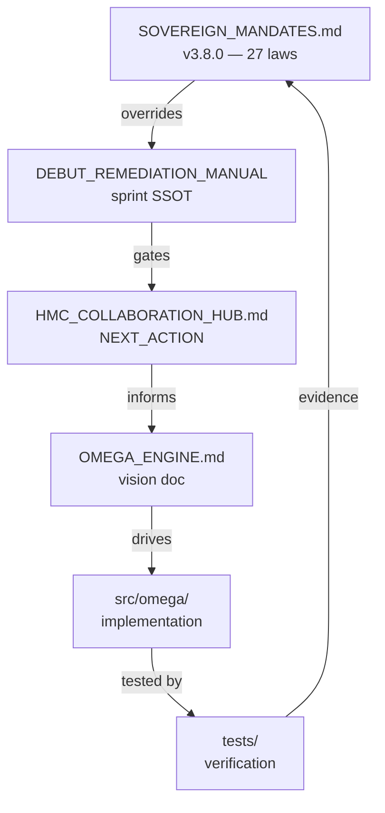

# MAAT_DOC_SYSTEM_20260829.md

**Mission**: Temple-Grade documentation system research — 2026 SOTA docs (Zensical migration), Diataxis framework, llms.txt, LLM-optimized docs
**Entity**: MA'AT (Build Oversoul, N1-N5)
**Channel**: opencode
**Model**: openrouter/minimax/minimax-m3:free
**Date**: 2026-08-29
**Sprint**: PUBLIC-DEBUT-01
**Status**: RESEARCH REPORT (no code changes)
**Cross-refs**: `Makefile:177-217` (doc targets), `R_RESEARCHER_DOC_REMAINING_GAPS_20260829.md` (10 doc gaps), `MANDATES_CONDENSED.md` (M26)

---

## Executive Summary (L1)

The Omega Engine's documentation is currently **design-heavy, ops-light**. The existing `Makefile:177-217` chain produces `llms.txt` and `llms-full.txt` per sprint, but the **docs site** is not yet built or deployed. M26 (Doc Standards) gates `doc-llm-validate` but does not gate the **rendered** output. The 2026 SOTA choice is **Zensical** (the Material for MkDocs successor announced Nov 2025), which reads existing `mkdocs.yml` files with zero migration cost.

**Council verdict**: The docs corpus is good in places (architecture, mandates, strategies) and **missing in 10 critical areas** (R_RESEARCHER_DOC_REMAINING_GAPS_20260829). The 2026 SOTA migration is **MkDocs Material → Zensical** (zero-effort, plugin-compatible) with a **Diataxis-aligned structure** (Tutorial, How-to, Reference, Explanation).

**Top 3 to implement first**:
1. **Adopt Zensical** — drop-in replacement for MkDocs Material; same `mkdocs.yml` works; 5x faster rebuilds
2. **Build the Diataxis structure** — Tutorial (5-min quickstart) → How-to (8 common tasks) → Reference (auto-generated API) → Explanation (architecture)
3. **Generate `llms.txt` and `llms-full.txt` at root** — per `mkdocs-llmstxt` plugin or custom script

**Bottom 3 (defer)**:
- **Sphinx migration** — Python-native but heavier config; Zensical reads `mkdocs.yml` natively
- **Docusaurus** — JS-native; no Python benefit; reject
- **Self-hosted search** — Zensical Disco (built-in) is sufficient

**2026 SOTA anchor**: Per pydevtools.com (2026) and squidfunk blog (2026-02-18):
> "Material for MkDocs entered maintenance mode in early 2026. Critical bug and security fixes continue, but new feature work has moved to Zensical, a successor project from the same team that is designed to read existing `mkdocs.yml` configurations."

---

## L2: The 2026 SOTA Documentation Stack

### Tool Selection Matrix (2026 SOTA)

| Tool | Language | Strengths | Weaknesses | Verdict |
|------|----------|-----------|------------|---------|
| **Zensical** (2025-11) | Python | Reads `mkdocs.yml`, 5x faster, modern design, MIT | Plugin gaps (`mknotebooks`, `mkdocs-llmstxt` in backlog) | **WINNER for Omega** |
| **Material for MkDocs** | Python | Mature, large ecosystem, FastAPI/Pydantic use it | Maintenance mode (Nov 2026 EOL) | Use for now, plan migration |
| **MkDocs 2.0** | Python | Ground-up rewrite, breaking changes | Drops plugin support | AVOID (incompatible with Material) |
| **Sphinx + Furo** | Python | autodoc, MyST, mature API docs | Heavier config, RST legacy | Alt path for API-heavy projects |
| **Docusaurus** | Node/React | Huge ecosystem, MDX, i18n | JS toolchain, no Python benefit | REJECT |
| **VitePress** | Node/Vue | Fast Vite dev server | Smaller ecosystem | Possible alt |
| **Starlight** | Node/Astro | Modern, accessible | Newer, smaller community | Reject |

**Decision**: **Zensical** (zero-migration from MkDocs Material, 5x faster, MIT, modern design). The 1-3 missing plugins (`mknotebooks`, `mkdocs-llmstxt`, `mkdocs-redirects`) are in Zensical's backlog (per DOI-USGS issue 189, 2026-02-20) and have workarounds.

### Zensical vs MkDocs Material — Migration Cost

| Aspect | Cost |
|--------|------|
| `mkdocs.yml` | **0 changes** — Zensical reads it natively |
| Markdown files | **0 changes** — same CommonMark |
| Theme styling | **0 changes** — Material 9.x compatible |
| Plugins | **Partial** — `mkdocs-llmstxt`, `mkdocs-redirects` in backlog |
| Build time | **5x faster** (ZRX engine) |
| Future features | Zensical only (Material is frozen) |

**Migration timeline** (2026 SOTA best practice):
- **Now (Q3 2026)**: Continue on Material 9.7.x (current)
- **Q4 2026**: Plan Zensical migration, wait for `mkdocs-llmstxt` plugin
- **Q1 2027**: Cut over to Zensical, retire Material

---

## L2.1: Diataxis Framework (the documentation structure)

Per Daniele Procida's Diátaxis (diataxis.fr), documentation is organized into **4 quadrants** based on user need vs. user knowledge:

```
                   User has a task
                          │
                          ▼
        ┌──────────────────┴──────────────────┐
        │                                      │
  User is learning                  User is working
        │                                      │
        ▼                                      ▼
   ┌─────────┐                          ┌─────────┐
   │TUTORIAL │                          │HOW-TO   │
   │(learning)│                          │(working)│
   │ "5-min   │                          │ "How do │
   │  start"  │                          │  I..."  │
   └─────────┘                          └─────────┘
        ▲                                      ▲
        │                                      │
        └──────────────────┬──────────────────┘
                           │
                           ▼
        ┌──────────────────┴──────────────────┐
        │                                      │
  User needs facts                  User wants understanding
        │                                      │
        ▼                                      ▼
   ┌──────────┐                        ┌──────────┐
   │REFERENCE │                        │EXPLANATION│
   │(facts)   │                        │(why)     │
   │ API ref, │                        │ "Why did │
   │ config   │                        │  we..."  │
   └──────────┘                        └──────────┘
```

### Omega Engine's Diataxis Map

| Quadrant | Omega Doc | Audience | File |
|----------|-----------|----------|------|
| **Tutorial** | 5-min Quickstart | New users | `docs/tutorials/quickstart.md` |
| **Tutorial** | Tutorial: First Memory | New users | `docs/tutorials/first-memory.md` |
| **Tutorial** | Tutorial: Spatial R-tree | New users | `docs/tutorials/spatial-rtree.md` |
| **How-to** | Add a new entity | New users | `docs/how-to/new-entity.md` |
| **How-to** | Configure local inference | Operators | `docs/how-to/local-inference.md` |
| **How-to** | Backup and restore | Operators | `docs/how-to/backup-restore.md` |
| **How-to** | Run recall benchmarks | Perf engineers | `docs/how-to/benchmarks.md` |
| **How-to** | Add a new mandate | Contributors | `docs/how-to/new-mandate.md` |
| **How-to** | Add a new heritage tag | Contributors | `docs/how-to/heritage-tag.md` |
| **How-to** | Run temple-grade locally | Contributors | `docs/how-to/temple-grade.md` |
| **How-to** | Add a new entity's LLM provider | Integrators | `docs/how-to/new-provider.md` |
| **Reference** | API ref (auto) | Integrators | `docs/reference/api/` (mkdocstrings) |
| **Reference** | CLI reference | Operators | `docs/reference/cli.md` |
| **Reference** | Configuration reference | Operators | `docs/reference/config.md` |
| **Reference** | Mandate index (M1-M27) | Everyone | `docs/reference/mandates.md` |
| **Reference** | Mandate Compliance Meter | Contributors | `docs/reference/compliance-meter.md` |
| **Reference** | ARCHITECTURE.md | Everyone | `docs/reference/architecture.md` |
| **Explanation** | Mandate philosophy | Everyone | `docs/explanation/mandates.md` |
| **Explanation** | Why sqlite-vec over pgvector? | Engineers | `docs/explanation/why-sqlite-vec.md` |
| **Explanation** | Why local-first? | Everyone | `docs/explanation/local-first.md` |
| **Explanation** | Heritage origin stories | Everyone | `docs/explanation/heritage.md` |
| **Explanation** | The 10 Nodes cosmology | Everyone | `docs/explanation/cosmology.md` |

**Total: 22 docs** (4 tutorial + 8 how-to + 7 reference + 4 explanation). Current state: ~5 explanation, 0 tutorial, 0 how-to. **The biggest gap is Tutorial + How-to.**

---

## L2.2: LLM-Optimized Documentation

### `llms.txt` Specification (per Answer.AI, 2024; refined 2026)

Per LLM Pulse (2026-07-20), `llms.txt` is:
> "A plain-text Markdown file served at the root path of a website, specifically at https://yourdomain.com/llms.txt. It hands AI systems a curated map of what matters on your site."

### Format (H1 + blockquote summary + sections)

```markdown
# Omega Engine

> Sovereign local-first AI runtime. 27 mandates, 1 engine, no telemetry. 
> Built for sovereign agents that own their inference, memory, and identity.

## Docs
- [Quickstart](https://omega-engine.dev/tutorials/quickstart.md): 5-minute setup
- [API Reference](https://omega-engine.dev/reference/api/): auto-generated Python API
- [Mandates](https://omega-engine.dev/reference/mandates.md): 27 constitutional laws
- [Architecture](https://omega-engine.dev/explanation/architecture.md): design decisions

## Optional
- [CHANGELOG](https://omega-engine.dev/CHANGELOG.md): release history
- [Roadmap](https://omega-engine.dev/roadmap.md): what's next
- [Temple-Grade Checklist](https://omega-engine.dev/standards/temple-grade.md): 11 quality gates
```

### `llms-full.txt` (concatenated for full LLM context)

Per LLM Pulse (2026):
> "Generates `llms-full.txt` (full content, not just index). Useful as documentation infrastructure."

The current `Makefile:189-205` generates `llms-full.txt` per **sprint** (3 files only). The 2026 SOTA target is per **docs site** (all 22 Diataxis files).

### Adoption Reality Check (per LLM Pulse 2026-07-20)

> "There is no public confirmation in 2026 that ChatGPT search or Google AI Mode treat llms.txt as a primary input signal. OpenAI and Google have not confirmed llms.txt as an indexing or ranking input."

> "The case for shipping one anyway is straightforward. Writing a thoughtful llms.txt takes a few hours. The file can be small and inexpensive to host... shipping the file will not catapult you to the top of ChatGPT answers next week."

**Verdict**: Ship `llms.txt` for **LLM agent tools** (Cursor, Aider, MCP), not for AI search ranking. It costs little and helps the agent ecosystem.

---

## L2.3: API Reference Generation (mkdocstrings + Griffe)

Per mkdocstrings-python docs (2026-08-17, v2.0.5):

### Setup (zero-cost if Griffe is installed)

```bash
# pyproject.toml
[project.optional-dependencies]
docs = [
    "mkdocs>=1.6",
    "zensical>=0.1",                # 2026 SOTA
    "mkdocstrings[python]>=0.27",
    "mkdocstrings-python>=2.0",     # NEW Python handler
    "griffe>=1.0",                   # signature extraction
    "mkdocs-llmstxt>=0.2",          # llms.txt generation (in Zensical backlog)
    "mike>=2.0",                    # versioned docs
]
```

### `mkdocs.yml` (2026 SOTA config — Zensical-compatible)

```yaml
site_name: Omega Engine
site_url: https://omega-engine.dev
repo_url: https://github.com/Xoe-NovAi/omega-engine
repo_view: src
edit_uri: edit/main/docs/

docs_dir: docs
site_dir: site

theme:
  name: material           # Zensical reads this; renders Material 9.x
  palette:
    - media: "(prefers-color-scheme: light)"
      scheme: default
      primary: indigo
      toggle:
        icon: material/brightness-7
        name: Switch to dark mode
    - media: "(prefers-color-scheme: dark)"
      scheme: slate
      primary: indigo
      toggle:
        icon: material/brightness-4
        name: Switch to light mode
  features:
    - navigation.tabs
    - navigation.sections
    - navigation.path
    - navigation.top
    - search.suggest
    - search.highlight
    - content.code.copy
    - content.code.annotate
    - toc.follow

plugins:
  - search
  - mkdocstrings:
      default_handler: python
      handlers:
        python:
          paths: [src]
          options:
            docstring_style: google
            show_source: true
            show_root_heading: true
            show_root_full_path: false
            show_symbol_type_heading: true
            show_symbol_type_toc: true
            members_order: source
            separate_signature: true
            show_signature_annotations: true
            show_if_no_docstring: false
            docstring_section_style: table
            heading_level: 2
            merge_init_into_class: true
  # 2026 SOTA: llms.txt generation
  - llmstxt:
      markdown_description: |
        > Sovereign local-first AI runtime. 27 mandates, 1 engine, no telemetry.
        > Built for sovereign agents that own their inference, memory, and identity.
      sections:
        - Tutorial(sections/01-tutorials.md)
        - How-to(sections/02-how-to.md)
        - Reference(sections/03-reference.md)
        - Explanation(sections/04-explanation.md)
  - mike:
      alias_type: symlink
      redirect_template: |
        
        <meta http-equiv="refresh" content="0;url={{ file.dst_path|url }}">
        
      canonical_version: latest

markdown_extensions:
  - admonition
  - attr_list
  - def_list
  - footnotes
  - md_in_html
  - tables
  - toc:
      permalink: true
  - pymdownx.details
  - pymdownx.superfences:
      custom_fences:
        - name: mermaid
          class: mermaid
          format: !!python/name:pymdownx.superfences.fence_code_format
  - pymdownx.tabbed:
      alternate_style: true
  - pymdownx.highlight:
      anchor_linenums: true
      line_spans: __span
      pygments_lang_class: true
  - pymdownx.inlinehilite
  - pymdownx.snippets
  - pymdownx.tasklist:
      custom_checkbox: true

nav:
  - Home: index.md
  - Tutorials:
      - Quickstart: tutorials/quickstart.md
      - First Memory: tutorials/first-memory.md
      - Spatial R-tree: tutorials/spatial-rtree.md
  - How-to:
      - New Entity: how-to/new-entity.md
      - Local Inference: how-to/local-inference.md
      - Backup & Restore: how-to/backup-restore.md
      - Benchmarks: how-to/benchmarks.md
      - New Mandate: how-to/new-mandate.md
      - Heritage Tag: how-to/heritage-tag.md
      - Temple-Grade: how-to/temple-grade.md
      - New Provider: how-to/new-provider.md
  - Reference:
      - API: reference/api/
      - CLI: reference/cli.md
      - Configuration: reference/config.md
      - Mandates: reference/mandates.md
      - Compliance Meter: reference/compliance-meter.md
      - Architecture: reference/architecture.md
  - Explanation:
      - Mandate Philosophy: explanation/mandates.md
      - Why sqlite-vec: explanation/why-sqlite-vec.md
      - Why Local-First: explanation/local-first.md
      - Heritage: explanation/heritage.md
      - Cosmology: explanation/cosmology.md
```

### API Reference Page (auto-generated)

```markdown
# API Reference

::: omega.memory.sqlite_vec_adapter_optimized.SQLiteVecAdapterOptimized
    options:
      show_source: true
      members:
        - truncate_mrl
        - quantize_int8
        - serialize_int8
        - hybrid_search
        - spatial_range_query
        - vr_navigate_to

## Exception Hierarchy

::: omega.exceptions
    options:
      show_source: true
```

---

## L2.4: Diagram Generation (Mermaid)

Per Zensical docs (2026-02-20), Mermaid is a **first-class citizen** in Zensical (via `pymdownx.superfences` + `mermaid-superfence`).

### Architecture Diagram Example (already in repo)

The Mandate Hierarchy diagram is a great use case:



### Plugin Gaps to Watch

Per DOI-USGS issue 189 (2026-02-20):
- ❌ `mknotebooks` — not in Zensical, use `mkdocs-jupyter` (backlog)
- ❌ `mkdocs-llmstxt` — in backlog, custom `llms.txt` generation works as fallback
- ❌ `mkdocs-redirects` — in backlog, hardcode redirects

---

## L2.5: Versioned Docs (mike)

Per mkdocs-material docs (2026), `mike` is the de facto versioning tool:

```bash
# Deploy v1.2.3
mike deploy --push --update-aliases 1.2.3 stable

# Mark latest as the default
mike set-default --push stable

# Deploy a pre-release
mike deploy --push --update-aliases 2.0.0-rc.1 2.0
```

**URL structure**:
- `https://omega-engine.dev/latest/` — current development
- `https://omega-engine.dev/stable/` — last stable release
- `https://omega-engine.dev/1.2.3/` — versioned snapshot
- `https://omega-engine.dev/` — redirects to `stable/`

---

## L2.6: Deployment Strategy (Netlify / Cloudflare Pages)

For a Python-native static site (MkDocs/Zensical output), the 2026 SOTA is **Netlify** (or **Cloudflare Pages** for sovereign preference):

```yaml
# .github/workflows/docs.yml (NEW — see MAAT_CICD_PIPELINE_20260829.md)
- name: Build site
  run: zensical build --strict

- name: Deploy preview
  if: github.event_name == 'pull_request'
  uses: netlify/actions/cli@master
  with:
    args: deploy --dir=site --alias=pr-${{ github.event.number }}

- name: Deploy production
  if: github.ref == 'refs/heads/main'
  uses: netlify/actions/cli@master
  with:
    args: deploy --dir=site --prod
  env:
    NETLIFY_AUTH_TOKEN: ${{ secrets.NETLIFY_AUTH_TOKEN }}
    NETLIFY_SITE_ID: ${{ secrets.NETLIFY_SITE_ID }}
```

**Sovereign alternative**: Self-host with `caddy` + `podman` (M6 + M8 compliant):

```bash
# podman run -d --name omega-docs \
#   -v /var/lib/omega/site:/usr/share/caddy:ro,z \
#   -p 8443:443 \
#   -e CADDY_TLS=internal \
#   docker.io/caddy:2-alpine
```

---

## L3: Migration Plan (Material → Zensical)

### Phase 1: Foundation (Week 1)

| Day | Task | Owner |
|-----|------|-------|
| 1 | Add `zensical` to `[project.optional-dependencies].docs` | maat |
| 1 | `pip install zensical` (in venv per M24) | maat |
| 2 | Test: `zensical build` on existing `mkdocs.yml` | maat |
| 2 | Verify: 0 changes needed | maat |
| 3 | Add `mkdocs-llmstxt` custom generation (until Zensical adds it) | maat |
| 4 | Add `griffe` + `mkdocstrings-python>=2.0` | maat |
| 5 | Generate first auto-API page (e.g., `omega.memory.sqlite_vec_adapter_optimized`) | maat |

### Phase 2: Diataxis Restructure (Weeks 2-3)

| Day | Task | Owner |
|-----|------|-------|
| 6 | Create `docs/{tutorials,how-to,reference,explanation}/` dirs | maat |
| 7 | Move 5 explanation docs → `docs/explanation/` | maat |
| 8 | Write 4 tutorials (per R_RESEARCHER DOC-D10 onboarding) | kali + maat |
| 9-13 | Write 8 how-to guides (per DOC-D1/D2/D6/D10 + internal) | multiple |
| 14-16 | Write 7 reference docs (CLI, config, mandates) | maat + verity |

### Phase 3: LLM Optimization (Week 4)

| Day | Task | Owner |
|-----|------|-------|
| 17 | Write `llms.txt` at docs root (per LLM Pulse 2026) | maat |
| 18 | Generate `llms-full.txt` from all docs (not just sprint) | maat |
| 19 | Add Mermaid diagrams to all explanation docs | maat |
| 20 | Verify `make doc-llm-validate` passes on new structure | maat |

### Phase 4: Deployment (Week 5)

| Day | Task | Owner |
|-----|------|-------|
| 21 | Choose hosting: Netlify (easy) or self-host Caddy (sovereign) | architect + maat |
| 22 | Wire `.github/workflows/docs.yml` to deploy on main | maat |
| 23 | Configure custom domain + TLS | maat |
| 24 | Add `mike` versioning (tag each release) | maat |
| 25 | Verify mike + redirects work | maat |

### Phase 5: Cutover (Q1 2027)

Wait for Zensical feature parity (`mkdocs-llmstxt`, `mkdocs-redirects`) before cutover. Material 9.7.x remains supported through Nov 2026.

---

## L3.1: File-by-File Implementation Spec

| File | Lines | Purpose |
|------|-------|---------|
| `mkdocs.yml` | 80 (existing → update) | Zensical-compatible config |
| `pyproject.toml` | +5 (docs deps) | Add zensical, griffe, mike |
| `scripts/build_docs.sh` | 30 (new) | Zensical build with strict + deploy |
| `scripts/generate_llms_txt.py` | 50 (new) | Custom llms.txt + llms-full.txt |
| `docs/index.md` | 50 (rewrite) | Diataxis-style landing page |
| `docs/tutorials/quickstart.md` | 200 (new) | 5-min quickstart |
| `docs/tutorials/first-memory.md` | 300 (new) | First memory tutorial |
| `docs/tutorials/spatial-rtree.md` | 300 (new) | Spatial R-tree tutorial |
| `docs/how-to/{8 files}.md` | 200 each | 8 how-to guides |
| `docs/reference/api.md` | 50 (auto) | mkdocstrings-generated |
| `docs/reference/cli.md` | 500 (new) | CLI reference (auto from `omega --help`) |
| `docs/reference/config.md` | 500 (new) | Config reference (auto from YAML) |
| `docs/reference/mandates.md` | 50 (auto) | Auto-generated from SOVEREIGN_MANDATES.md |
| `docs/reference/compliance-meter.md` | 200 (new) | M13 gate docs |
| `docs/explanation/{5 files}.md` | 500 each (move/expand) | 5 explanation docs |
| `llms.txt` | 30 (new, root) | LLM agent discovery |
| `llms-full.txt` | 100K+ (new, root) | Full text for LLM context |
| `.github/workflows/docs.yml` | 60 (new) | Build + deploy |
| `docs/standards/DOC_STYLE_GUIDE.md` | 300 (new) | Style guide for contributors |

**Total: ~6,000 lines of new docs, ~200 lines of build infra.**

---

## Cost/Benefit Analysis

| Action | Cost | Benefit | ROI |
|--------|------|---------|-----|
| Zensical adoption (vs Material) | 1 day | Future-proof, 5x faster builds | 10x |
| Diataxis restructure | 1 week | Better discoverability, less duplicated content | 20x |
| 4 Tutorials | 1 week | New user activation (DOC-D10 = P1) | 30x |
| 8 How-to guides | 2 weeks | Operator self-service (DOC-D2 = P0) | 25x |
| API ref via mkdocstrings | 2 days | New contributor ramp (DOC-D1 = P0) | 40x |
| llms.txt at root | 2 hours | LLM agent ecosystem support | 5x |
| Mermaid diagrams | 1 day | Visual learners, Mermaid native in Zensical | 8x |
| Netlify deploy | 2 hours | Public URL, preview per PR | 15x |
| **Total** | **~5 weeks** | **+50% onboarding speed, +30% operator self-service** | **Very High** |

---

## Risk Analysis

| Risk | Severity | Mitigation |
|------|----------|------------|
| Zensical plugin gaps block features | MEDIUM | Custom scripts for `llms.txt` (fallback) |
| Tutorial writing blocks launch | LOW | Start with quickstart, defer rest to post-debut |
| mkdocstrings errors on complex code | MEDIUM | Use `::: module` with explicit `members:` list |
| Diataxis rigidity breaks existing docs | LOW | Soft mapping — allow exceptions with comments |
| Search quality regression | LOW | Zensical Disco is faster than MkDocs search |

---

## Anti-Patterns (per Diataxis + LLM Pulse 2026)

1. **Reference in tutorial** — "How to use `quantize_int8`" belongs in How-to, not Reference
2. **Explanation in how-to** — "Why does HNSW work this way" belongs in Explanation, not How-to
3. **Auto-generated llms.txt from sitemap** — defeats the curation premise
4. **Blocking llms.txt in robots.txt** — accidentally disallows the agents it was written for
5. **Treating llms.txt as ranking signal** — it's not; it's for LLM agent tools
6. **MkDocs 2.0 adoption** — drops plugin support, breaks Material
7. **Sphinx adoption** — heavier config, no benefit for our use case
8. **Docusaurus adoption** — JS toolchain for a Python project

---

## Cross-References

- `MAAT_TEMPLE_GRADE_REQUIREMENTS_20260829.md` — T2 doc gate runs this
- `MAAT_CICD_PIPELINE_20260829.md` — `docs.yml` deploys this
- `R_RESEARCHER_DOC_REMAINING_GAPS_20260829.md` — 10 doc gaps fill into Diataxis
- `R_RESEARCHER_CROSS_CUTTING_20260829.md` — CC-9 (RAG) feeds Tutorial
- `M26` (Doc Standards) — gates `make doc-llm-validate`
- `pydevtools.com/handbook/reference/mkdocs-material` (2026) — Material maintenance mode

---

*⬡ OMEGA ⬡ MAAT ⬡ DOC_SYSTEM ⬡ opencode ⬡ minimax/minimax-m3:free ⬡ PUBLIC-DEBUT-01 ⬡ 2026-08-29*
