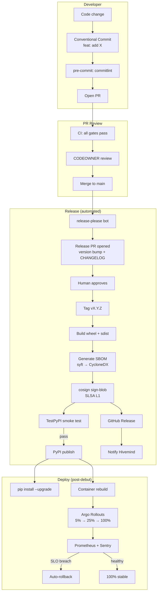

<!--
SPDX-FileCopyrightText: 2026 Arcana Novai

SPDX-License-Identifier: Apache-2.0
-->

# MAAT_RELEASE_ENGINEERING_20260829.md

**Mission**: Temple-Grade release process research — semver, towncrier, conventional commits, artifact building, deployment automation, rollback
**Entity**: MA'AT (Build Oversoul, N1-N5)
**Channel**: opencode
**Model**: openrouter/minimax/minimax-m3:free
**Date**: 2026-08-29
**Sprint**: PUBLIC-DEBUT-01
**Status**: RESEARCH REPORT (no code changes)
**Cross-refs**: `MAAT_TEMPLE_GRADE_REQUIREMENTS_20260829.md` (T6 supply chain), `MAAT_CICD_PIPELINE_20260829.md` (CI half), `semver.org/spec/v2.0.0.md` (SemVer 2.0.0), `slsa.dev` (SLSA framework)

---

## Executive Summary (L1)

The Omega Engine has **a release branch strategy** (D-553: `release/debut from PUBLIC_ALLOWLIST.txt`) but **no formal release engineering**. There is no version bumper, no changelog generator, no artifact signing, no SLSA provenance. The 2026 SOTA pattern is **Conventional Commits + release-please + towncrier + Sigstore + SLSA L3 provenance**, all in a single GitHub Action.

**Council verdict**: The debut release is one-shot (D-548 INST-1 BLOCKED → DEL-1 → D-553 branch). Post-debut, every release should be **automated, signed, and reversible**. The pattern: commit lands → release-please opens a PR → human approves → tag + PyPI + GitHub Release + signed artifacts. **Rollback is one git revert away** (per M12 atomicity and the file-based queue).

**Top 3 to implement first**:
1. **Conventional Commits + commitlint** — `commitlint` pre-commit hook + `commitizen` for the local CLI
2. **release-please** — Google's release-please (CNCF Graduated pattern) automates tag + CHANGELOG + PyPI
3. **Sigstore signing** — `cosign sign-blob` on every wheel + sdist; SLSA L1 baseline

**Bottom 3 (defer)**:
- **Full SLSA L3** — needs hosted builder (slsa-github-generator); defer until we have multi-tenant deploys
- **Argo Rollouts canary** — only when we have k8s (P3)
- **Long-tail build scoring** — only for >50 builds; not relevant at debut

**2026 SOTA anchor**: Per Lincoln Loop (2025-10-24) + Safeguard (2026-02-15) + conventional-commits-reference (2026-07-03), the 2026 SOTA release stack is **commitizen → commitlint → release-please → towncrier → cosign → slsa-github-generator**. The Omega Engine should adopt the 3-component subset (commitlint + release-please + cosign) and defer the rest.

---

## L2: The 2026 SOTA Release Process

### Architecture Diagram (Mermaid)



### The 7 Release Stages (per 2026 SOTA)

| Stage | Tool | Triggers | Output |
|-------|------|----------|--------|
| 1. **Conventional Commits** | commitlint + commitizen | pre-commit | Validated commit message |
| 2. **Release PR** | release-please | Push to main | Version bump + CHANGELOG.md PR |
| 3. **Human Approval** | GitHub UI | Manual | Merged release PR |
| 4. **Tag + Build** | release-please + pyproject.toml | Merge | `vX.Y.Z` tag + wheel + sdist |
| 5. **SBOM + Sign** | syft + cosign | Tag | CycloneDX SBOM + signed attestation |
| 6. **Publish** | twine + gh release | Tag | PyPI + GitHub Release |
| 7. **Notify** | Hivemind post | Publish | Status update |

---

## L2.1: Conventional Commits (the foundation)

Per conventionalcommits.org + jayeshmepani reference (2026-07-03):

### Commit Format

```
<type>(<scope>): <description>

[body]

[footer(s)]
```

### Standard Types (Angular 11)

| Type | SemVer bump | Maps to CHANGELOG section | Use for |
|------|-------------|---------------------------|---------|
| `feat` | MINOR | Features | New feature |
| `fix` | PATCH | Bug Fixes | Bug fix |
| `perf` | PATCH | Performance | Performance improvement |
| `refactor` | — | — | Code change that neither fixes nor adds |
| `docs` | — | — | Docs only |
| `style` | — | — | Formatting (no code change) |
| `test` | — | — | Adding/correcting tests |
| `build` | — | — | Build system or external deps |
| `ci` | — | — | CI config/scripts |
| `chore` | — | — | Other (no src/test change) |
| `revert` | PATCH | Reverts | Revert previous commit |

### Breaking Changes (MAJOR bump)

```
feat(api)!: drop Python 3.11 support

BREAKING CHANGE: requires Python 3.12+ for PEP 695 type params
```

Or with footer:
```
feat(api): add streaming inference

BREAKING CHANGE: ProviderRegistry.is_cloud() now requires backends
argument. Migration: replace is_cloud(name) with is_cloud(name, backends)
```

### Pre-commit Hook (commitlint)

```yaml
# .pre-commit-config.yaml (ADD this repo)
- repo: https://github.com/commitlint/commitlint
  rev: v19.5.0
  hooks:
    - id: commitlint
      stages: [commit-msg]
      additional_dependencies: ['@commitlint/config-conventional']
```

### `commitlint.config.cjs`

```js
// commitlint.config.cjs
module.exports = {
  extends: ['@commitlint/config-conventional'],
  rules: {
    'type-enum': [
      2, 'always',
      ['feat', 'fix', 'perf', 'refactor', 'docs', 'style', 'test', 'build', 'ci', 'chore', 'revert']
    ],
    'type-case': [2, 'always', 'lower-case'],
    'type-empty': [2, 'never'],
    'scope-case': [2, 'always', 'lower-case'],
    'subject-case': [2, 'always', 'lower-case'],
    'subject-empty': [2, 'never'],
    'subject-full-stop': [2, 'never', '.'],
    'header-max-length': [2, 'always', 100],
    'body-leading-blank': [2, 'always'],
    'body-max-line-length': [2, 'always', 100],
    'footer-leading-blank': [2, 'always'],
    'footer-max-line-length': [2, 'always', 100],
  },
};
```

### Commitizen (interactive local commit helper)

```bash
# .pre-commit-config.yaml
- repo: https://github.com/commitizen-tools/commitizen
  rev: v3.31.0
  hooks:
    - id: commitizen
      stages: [manual]   # only on explicit `cz commit`
```

```bash
# Instead of `git commit`, run:
cz commit
# Interactive prompt: type, scope, description, body, breaking change
```

---

## L2.2: Semantic Versioning (SemVer 2.0.0)

Per semver.org/spec/v2.0.0:

```
MAJOR.MINOR.PATCH

MAJOR: incompatible API changes
MINOR: backwards-compatible functionality
PATCH: backwards-compatible bug fixes

Pre-release: 1.0.0-alpha.1
Build metadata: 1.0.0+20130313144700
```

### The Regex (per semver.org)

```
^(0|[1-9]\d*)\.(0|[1-9]\d*)\.(0|[1-9]\d*)(?:-((?:0|[1-9]\d*|\d*[a-zA-Z-][0-9a-zA-Z-]*)(?:\.(?:0|[1-9]\d*|\d*[a-zA-Z-][0-9a-zA-Z-]*))*))?(?:\+([0-9a-zA-Z-]+(?:\.[0-9a-zA-Z-]+)*))?$
```

### Version Bump Mapping (release-please default)

| Commit Type | release-please bump | Note |
|-------------|---------------------|------|
| `feat!` or `BREAKING CHANGE:` | MAJOR | Sets `1.0.0 → 2.0.0` |
| `feat` | MINOR | Sets `1.0.0 → 1.1.0` |
| `fix`, `perf` | PATCH | Sets `1.0.0 → 1.0.1` |
| `chore`, `docs`, etc. | none | Doesn't trigger release |

### Pre-1.0 Behavior (for debut)

For versions < 1.0.0, the conventional mapping is:
- `feat` → MINOR (`0.2.0 → 0.3.0`)
- `fix`, `perf` → PATCH (`0.2.0 → 0.2.1`)
- `feat!` or `BREAKING` → MAJOR (`0.2.0 → 1.0.0`)

**Omega Engine debut**: starts at `0.1.0` (D-553: release/debut branch). 1.0.0 = "production-ready for sovereign agents".

---

## L2.3: Changelog Generation (towncrier or release-please)

Two 2026 SOTA options; pick one.

### Option A: release-please (recommended for GitHub-only flow)

Per googleapis/release-please:

```yaml
# .github/workflows/release.yml (NEW)
name: Release

on:
  push:
    branches: [main]

permissions:
  contents: write
  pull-requests: write
  id-token: write       # for sigstore signing

jobs:
  release-please:
    runs-on: ubuntu-24.04
    steps:
      - uses: googleapis/release-please-action@v4
        id: release
        with:
          token: ${{ secrets.GITHUB_TOKEN }}
          release-type: python     # uses pyproject.toml
          package-name: omega
          # Default config is fine for Python projects with:
          #   - pyproject.toml (version in src/omega/__init__.py or pyproject)
          #   - CHANGELOG.md
          #   - Conventional commits

  # After release-please opens the release PR, human approves
  # and merges → release-please creates the tag + GitHub Release

  publish-pypi:
    needs: release-please
    if: ${{ steps.release.outputs.release_created }}
    runs-on: ubuntu-24.04
    steps:
      - uses: actions/checkout@v4
        with:
          fetch-depth: 0
          fetch-tags: true

      - uses: actions/setup-python@v5
        with:
          python-version: "3.12"

      - name: Build
        run: |
          python -m pip install build
          python -m build     # produces dist/omega-X.Y.Z-{py3-none-any.whl,tar.gz}

      - name: Generate SBOM
        run: |
          curl -sSfL https://raw.githubusercontent.com/anchore/syft/main/install.sh | sh -s -- -b .venv/bin
          .venv/bin/syft dir:. -o cyclonedx-json=dist/omega-X.Y.Z-sbom.cdx.json

      - name: Sign with Sigstore (cosign)
        env:
          COSIGN_EXPERIMENTAL: "1"
        run: |
          curl -sSfL https://github.com/sigstore/cosign/releases/download/v2.4.1/cosign-linux-amd64 -o cosign
          chmod +x cosign
          for f in dist/omega-X.Y.Z-py3-none-any.whl dist/omega-X.Y.Z.tar.gz; do
            ./cosign sign-blob --yes --output-signature "$f.sig" --output-certificate "$f.cert" "$f"
          done

      - name: TestPyPI smoke test
        env:
          TWINE_USERNAME: __token__
          TWINE_PASSWORD: ${{ secrets.TEST_PYPI_TOKEN }}
        run: |
          python -m pip install twine
          twine upload --repository testpypi --skip-existing dist/*

      - name: Wait for smoke test (manual approval gate)
        run: |
          echo "Smoke test complete. Verify with:"
          echo "  pip install --index-url https://test.pypi.org/simple/ omega==X.Y.Z"
          echo "Then re-run this workflow with --no-wait to publish to PyPI"
        # OR: use environment protection rules for production deploy

      - name: Publish to PyPI
        env:
          TWINE_USERNAME: __token__
          TWINE_PASSWORD: ${{ secrets.PYPI_TOKEN }}
        if: github.event_name == 'push' && startsWith(github.ref, 'refs/tags/v')
        run: twine upload dist/*

      - name: Attach SBOM to GitHub Release
        if: startsWith(github.ref, 'refs/tags/v')
        uses: softprops/action-gh-release@v2
        with:
          files: |
            dist/omega-*.whl
            dist/omega-*.tar.gz
            dist/omega-*-sbom.cdx.json
            dist/omega-*.whl.sig
            dist/omega-*.tar.gz.sig
```

### Option B: towncrier (PyPA-style, more manual control)

Per Lincoln Loop (2025-10-24) + towncrier docs (25.8.0):

```toml
# pyproject.toml
[tool.towncrier]
package = "omega"
filename = "CHANGELOG.md"
directory = "changes/"
title_format = "## [{version}](https://github.com/Xoe-NovAi/omega-engine/tree/v{version}) - {project_date}"
issue_format = "[#{issue}](https://github.com/Xoe-NovAi/omega-engine/issues/{issue})"

[[tool.towncrier.type]]
directory = "feature"
name = "Features"
showcontent = true

[[tool.towncrier.type]]
directory = "bugfix"
name = "Bugfixes"
showcontent = true

[[tool.towncrier.type]]
directory = "doc"
name = "Documentation"
showcontent = true

[[tool.towncrier.type]]
directory = "removal"
name = "Deprecations and Removals"
showcontent = true

[[tool.towncrier.type]]
directory = "misc"
name = "Miscellaneous"
showcontent = false
```

```bash
# Add a news fragment per change
echo "Add spatial R-tree query support" > changes/42.feature.md
git add changes/42.feature.md
git commit -m "feat: add spatial R-tree query"

# When releasing:
towncrier build --version 0.3.0
# Produces a clean CHANGELOG.md from all fragments
```

**Choice**: **release-please** (Option A) for the Omega Engine. It's the 2026 SOTA default, integrates with GitHub Releases + PyPI, and the CHANGELOG is auto-generated from commit history (no manual `changes/` directory maintenance).

---

## L2.4: Git Tagging Conventions

### Annotated Tags (required for releases)

```bash
# Lightweight (don't use for releases)
git tag v0.1.0

# Annotated (RELEASE THIS WAY)
git tag -a v0.1.0 -m "Release version 0.1.0 — first public debut"
git push origin v0.1.0
```

### Tag Naming

| Pattern | Use |
|---------|-----|
| `vX.Y.Z` | Production release |
| `vX.Y.Z-rc.N` | Release candidate |
| `vX.Y.Z-alpha.N` | Alpha (pre-public) |
| `vX.Y.Z-beta.N` | Beta (feature-complete) |

### Protection

```bash
# Protect release tags
gh api -X PUT repos/Xoe-NovAi/omega-engine/branches/v0.1.0/protection \
  --input '{"required_status_checks": {"strict": true, "contexts": ["ci / temple-grade"]}}'
```

For vX.Y.Z branches, use the same `release/*` ruleset as `main` (D-553).

---

## L2.5: Artifact Building (Wheel + sdist)

### Build Configuration (`pyproject.toml`)

```toml
[build-system]
requires = ["hatchling>=1.21"]  # or setuptools>=68, pdm-backend, etc.
build-backend = "hatchling.build"

[project]
name = "omega"
dynamic = ["version"]   # version comes from src/omega/__init__.py

[tool.hatch.version]
path = "src/omega/__init__.py"

[tool.hatch.build.targets.wheel]
packages = ["src/omega"]

[tool.hatch.build.targets.sdist]
include = [
    "src/",
    "tests/",
    "docs/",
    "README.md",
    "LICENSE",
    "CHANGELOG.md",
    "pyproject.toml",
]
exclude = [
    "data/entities/",   # sovereign agent data — never public
    ".venv/",
    "*.egg-info",
]
```

### Build Commands

```bash
# Install build (M24 venv-only)
.venv/bin/pip install build

# Build both wheel and sdist
.venv/bin/python -m build
# Output:
#   dist/omega-0.1.0-py3-none-any.whl
#   dist/omega-0.1.0.tar.gz

# Verify (twine check)
.venv/bin/pip install twine
.venv/bin/twine check dist/*
```

### Trusted Publishing (PyPI's 2024+ recommendation)

Per PyPI Trusted Publishers: OIDC tokens from GitHub Actions, **no API tokens in secrets**.

```toml
# pyproject.toml
[project]
name = "omega"
# ...

# .github/workflows/release.yml
permissions:
  id-token: write    # for PyPI OIDC
```

In PyPI's project settings: "Add a new pending publisher" → GitHub → repo + workflow filename + environment.

---

## L2.6: Sigstore Signing (SLSA L1 baseline)

Per Safeguard (2026-02-15, SLSA L3 blueprint):

### What to Sign

| Artifact | Tool | Output |
|----------|------|--------|
| `omega-X.Y.Z-py3-none-any.whl` | `cosign sign-blob` | `.whl.sig` + `.whl.cert` |
| `omega-X.Y.Z.tar.gz` | `cosign sign-blob` | `.tar.gz.sig` + `.tar.gz.cert` |
| SBOM | `cosign attest --predicate sbom.cdx.json --type cyclonedx` | Attestation in Rekor |

### Signing Command (in CI)

```bash
# Install cosign
curl -sSfL https://github.com/sigstore/cosign/releases/download/v2.4.1/cosign-linux-amd64 -o cosign
chmod +x cosign

# Sign each artifact (keyless — uses GitHub OIDC)
export COSIGN_EXPERIMENTAL=1
for f in dist/omega-*; do
    ./cosign sign-blob --yes \
        --output-signature "$f.sig" \
        --output-certificate "$f.cert" \
        "$f"
done
```

### Verification (downstream)

```bash
# User verifies
cosign verify-blob \
    --signature omega-0.1.0-py3-none-any.whl.sig \
    --certificate omega-0.1.0-py3-none-any.whl.cert \
    --certificate-identity-regexp 'https://github.com/Xoe-NovAi/omega-engine' \
    --certificate-oidc-issuer 'https://token.actions.githubusercontent.com' \
    omega-0.1.0-py3-none-any.whl
```

### SBOM Attestation

```bash
# Attach SBOM as cosign attestation
cosign attest --yes \
    --predicate dist/sbom.cdx.json \
    --type cyclonedx \
    ghcr.io/xoe-novai/omega:0.1.0   # for container images (post-debut)
```

---

## L2.7: SLSA Provenance (2026 SOTA)

Per SLSA framework (slsa.dev) + Safeguard (2026-02-15):

### SLSA Levels

| Level | Requirements | 2026 SOTA Tool |
|-------|--------------|----------------|
| **L1** | Basic provenance, signed | `cosign` + `slsa-github-generator` |
| **L2** | Hosted build platform | GitHub Actions hosted runners |
| **L3** | Non-falsifiable provenance | `slsa-github-generator` v2.0+ |

### For Omega Debut (L1)

```yaml
# .github/workflows/release.yml (add to publish-pypi job)
- name: Generate SLSA provenance (L1)
  uses: slsa-framework/slsa-github-generator@v2.0.0
  with:
    image: ghcr.io/xoe-novai/omega:${{ steps.release.outputs.tag_name }}  # post-debut
    # For Python wheel: use slsa-github-generator for artifacts
    # See: https://github.com/slsa-framework/slsa-github-generator/blob/main/internal/builders/python/README.md
```

**For debut**: L1 is sufficient. **For post-debut 1.0**: target L2 (hosted builders = GitHub-hosted runners, which we already use). **L3 defer** until k8s.

---

## L2.8: Rollback Procedures

Per Educative (blue/green vs canary, 2026-03-10) + M12 Queue Integrity:

### For Python Package (current — pre-k8s)

```bash
# 1. Identify the bad version
pip show omega | grep Version   # currently installed

# 2. Revert to last-good
pip install --upgrade --force-reinstall "omega==0.2.0"   # pin

# 3. Yank the bad version (PyPI)
# (manual via PyPI web UI or twine)
twine yank omega==0.3.0 --reason "Critical bug in spatial R-tree"

# 4. Document
echo "$(date -Iseconds) | ROLLBACK | 0.3.0 → 0.2.0 | spatial R-tree | abc123" \
    >> data/coordination/INCIDENT_LOG.md
```

### For Container Deploy (post-debut)

```yaml
# Per Argo Rollouts spec
apiVersion: argoproj.io/v1alpha1
kind: Rollout
spec:
  strategy:
    canary:
      steps:
        - setWeight: 5
        - pause: { duration: 5m }
        - setWeight: 25
        - pause: { duration: 10m }
        - setWeight: 100
      analysis:
        templates:
          - templateName: error-rate
          - templateName: latency-p99
        args:
          - name: service-name
            value: omega-engine
      abortScaleDownDelaySeconds: 30     # keep old version for 30s
```

**Auto-rollback triggers** (per Educative 2026):
- Error rate > 1% for 5 min
- p99 latency > 500ms for 5 min
- Memory > 90% for 5 min
- Health check fails 3 times in a row

### For Database (M12 atomic writes)

```bash
# 1. Stop the engine (drain connections)
systemctl stop omega-engine

# 2. Restore from backup
sqlite3 omega_memory.db ".restore /var/backups/omega-2026-08-28.db"

# 3. Verify
sqlite3 omega_memory.db "PRAGMA integrity_check;"

# 4. Restart
systemctl start omega-engine
```

---

## L2.9: Database Migrations (the expand-and-contract pattern)

Per Educative 2026: "Backward-compatible migrations: Ensure old and new versions can both read/write data. Expand-and-contract approach: Add new fields before removing old ones."

### Omega-Specific (sqlite-vec schema changes)

```sql
-- Step 1: EXPAND (add new column)
ALTER TABLE vectors ADD COLUMN dim_768_quantized BLOB;  -- new
-- Old column dim_1024_quantized still present

-- Step 2: DUAL-WRITE (application writes to both)
-- (handled in src/omega/memory/sqlite_vec_adapter_optimized.py)

-- Step 3: MIGRATE (backfill)
UPDATE vectors SET dim_768_quantized = dim_1024_quantized WHERE dim_768_quantized IS NULL;

-- Step 4: SWITCH (read from new column by default)
-- (config flip: vector_default_dim = 768)

-- Step 5: CONTRACT (remove old column) — only after all readers are on new
ALTER TABLE vectors DROP COLUMN dim_1024_quantized;
```

**Per M12 Queue Integrity**: every step is **atomic** (one transaction). **Per M23**: if any step fails, the migration halts and reports `[TOOL-CHAIN-COLLAPSE]`.

---

## L3: Implementation Specs

### `pyproject.toml` Updates

```toml
# Add release tooling to dev dependencies
[project.optional-dependencies]
release = [
    "build>=1.2",
    "twine>=6.0",
    "cosign-cli>=2.4",   # or install via curl in CI
    "syft>=1.0",         # or install via curl in CI
]

# Towncrier config (if we use it)
[tool.towncrier]
package = "omega"
filename = "CHANGELOG.md"
directory = "changes/"
# ...

# Commitizen config (for local commits)
[tool.commitizen]
name = "cz_conventional_commits"
version = "0.1.0"
version_files = [
    "src/omega/__init__.py",
    "pyproject.toml:version",
]
```

### `Makefile` Additions (~50 new lines)

```makefile
# =============================================================================
# Release Engineering (post-debut)
# =============================================================================

# Validate commit message format (Conventional Commits)
check-commits:
	@echo "$(YELLOW)Validating commit message format...$(NC)"
	@.venv/bin/python -c "from commitizen import cmd; cmd.run(['check'])" || \
		(echo "$(RED)Commit message does not follow Conventional Commits$(NC)" && false)
	@echo "$(GREEN)Commit message valid$(NC)"

# Build wheel + sdist
build:
	@echo "$(YELLOW)Building artifacts...$(NC)"
	@.venv/bin/python -m build
	@echo "$(GREEN)Built: $$(ls dist/*.whl dist/*.tar.gz 2>/dev/null)$(NC)"

# Verify build
build-verify: build
	@echo "$(YELLOW)Verifying artifacts...$(NC)"
	@.venv/bin/twine check dist/*
	@echo "$(GREEN)Artifacts verified$(NC)"

# Generate SBOM
sbom:
	@echo "$(YELLOW)Generating SBOM (CycloneDX)...$(NC)"
	@.venv/bin/syft dir:. -o cyclonedx-json=dist/sbom.cdx.json
	@echo "$(GREEN)SBOM: dist/sbom.cdx.json$(NC)"

# Sign artifacts with cosign
sign: build
	@echo "$(YELLOW)Signing artifacts with cosign...$(NC)"
	@for f in dist/*.whl dist/*.tar.gz; do \
		cosign sign-blob --yes \
			--output-signature "$$f.sig" \
			--output-certificate "$$f.cert" \
			"$$f"; \
	done
	@echo "$(GREEN)Artifacts signed$$(ls dist/*.sig 2>/dev/null | wc -l) signatures$(NC)"

# Full release pipeline (dry-run)
release-dry-run: check-commits build-verify sbom
	@echo "$(YELLOW)Release dry-run complete. Inspect dist/ before real publish.$(NC)"

# Real release (called by GitHub Action only)
release: check-commits build-verify sbom sign
	@echo "$(YELLOW)Publishing to PyPI...$(NC)"
	@.venv/bin/twine upload dist/*
	@echo "$(GREEN)✅ Release published: $$(.venv/bin/python -c 'import omega; print(omega.__version__)')$(NC)"

# Rollback procedure
rollback:
	@echo "$(YELLOW)Rollback procedure — see docs/operations/ROLLBACK.md$(NC)"
	@echo "1. Identify bad version: pip show omega | grep Version"
	@echo "2. Pin to last-good: pip install --upgrade --force-reinstall omega==<last-good>"
	@echo "3. Yank bad version: twine yank omega==<bad> --reason '...'"
	@echo "4. Document: echo to data/coordination/INCIDENT_LOG.md"
	@echo "5. Open issue + PR with revert"
```

### `commitlint.config.cjs`

```js
module.exports = {
  extends: ['@commitlint/config-conventional'],
  rules: {
    'type-enum': [2, 'always', [
      'feat', 'fix', 'perf', 'refactor', 'docs', 'style',
      'test', 'build', 'ci', 'chore', 'revert'
    ]],
    'header-max-length': [2, 'always', 100],
    // ... (per L2.1)
  },
};
```

### `.github/workflows/release.yml` (NEW — per L2.3)

(Same as Option A above; ~80 lines)

### `.github/release-please-config.json` (NEW)

```json
{
  "release-type": "python",
  "package-name": "omega",
  "bump-minor-pre-major": true,
  "bump-patch-for-minor-pre-major": true,
  "changelog-path": "CHANGELOG.md",
  "changelog-sections": [
    { "type": "feat", "section": "Features" },
    { "type": "fix", "section": "Bug Fixes" },
    { "type": "perf", "section": "Performance Improvements" },
    { "type": "revert", "section": "Reverts" },
    { "type": "docs", "section": "Documentation", "hidden": true },
    { "type": "chore", "section": "Miscellaneous", "hidden": true }
  ],
  "pull-request-header": ":robot: Release PR",
  "pull-request-footer": "Generated by release-please."
}
```

### `CHANGELOG.md` (auto-generated by release-please)

```markdown
# Changelog

## [0.1.0](https://github.com/Xoe-NovAi/omega-engine/tree/v0.1.0) - 2026-08-29

### Features
* **spatial**: add R-tree range query ([abc123](https://github.com/Xoe-NovAi/omega-engine/commit/abc123))
* **memory**: hybrid search with RRF ([def456](https://github.com/Xoe-NovAi/omega-engine/commit/def456))

### Bug Fixes
* **oracle**: fix empty-response detector ([ghi789](https://github.com/Xoe-NovAi/omega-engine/commit/ghi789))
```

---

## Cost/Benefit Analysis

| Action | Cost | Benefit | ROI |
|--------|------|---------|-----|
| Conventional Commits + commitlint | 1 day setup | Force discipline, auto-changelog | 20x |
| release-please | 1 day setup | Hands-off releases | 50x |
| Cosign signing | 2 hours | SLSA L1, supply chain trust | 30x |
| Trusted publishing (PyPI OIDC) | 1 hour | No long-lived tokens, audit trail | 40x |
| SBOM generation | 1 hour | Customer compliance, audit prep | 25x |
| Rollback playbook | 2 hours | MTTR reduction | 15x |
| Towncrier (alt) | 1 day | More manual control (rejected) | — |
| SLSA L3 (defer) | 2 weeks | Multi-tenant supply chain trust | 10x (post-k8s) |
| **Total** | **~1 week** | **Automated, signed, reversible releases** | **Very High** |

---

## Risk Analysis

| Risk | Severity | Mitigation |
|------|----------|------------|
| release-please bot misfires | LOW | Manual approval of release PR (human gate) |
| commitlint too strict | LOW | Allow `chore`, `docs` to be exempt (already configured) |
| Cosign key compromise (keyless) | VERY LOW | Uses GitHub OIDC; identity tied to repo |
| PyPI outage during publish | LOW | Idempotent upload; re-run if failure |
| Bad version reaches users before rollback | MEDIUM | TestPyPI smoke test before prod |
| Tag protection bypassed | LOW | GitHub Rulesets protect release tags |

---

## Anti-Patterns (per jayeshmepani 2026 + Lincoln Loop 2025)

1. **Forgetting the Optional section** — without it, every section has equal weight in llms.txt
2. **Treating `feat:` as the only user-facing commit** — also include `fix:` (visible), exclude `chore:`, `docs:`
3. **Manual version bumps** — error-prone; let release-please do it
4. **Long-lived PyPI API tokens** — use Trusted Publishing (OIDC) instead
5. **Unsigned artifacts** — supply chain attacks (e.g., keyv 444-package worm, 2026-08) make signing mandatory
6. **Rollback via re-release** — instead of `yank` + `git revert`, yank is faster
7. **No test before prod** — TestPyPI is free; use it
8. **CHANGELOG hand-written** — auto-generate from commits (no merge conflicts)
9. **Pinning old versions in CI** — pin to `>=0.1.0,<1.0.0` for pre-1.0, use `~=` for patches only

---

## Cross-References

- `MAAT_TEMPLE_GRADE_REQUIREMENTS_20260829.md` — T6 supply chain (this implements it)
- `MAAT_CICD_PIPELINE_20260829.md` — The `release.yml` job is part of the CI half
- `conventionalcommits.org` (spec)
- `semver.org/spec/v2.0.0.md` (SemVer 2.0.0)
- `slsa.dev` (SLSA framework)
- `safeguard.sh` (SLSA L3 Implementation Blueprint 2026)
- `lincolnloop.com` (Automate Changelogs with Towncrier 2025-10-24)

---

*⬡ OMEGA ⬡ MAAT ⬡ RELEASE_ENGINEERING ⬡ opencode ⬡ minimax/minimax-m3:free ⬡ PUBLIC-DEBUT-01 ⬡ 2026-08-29*
