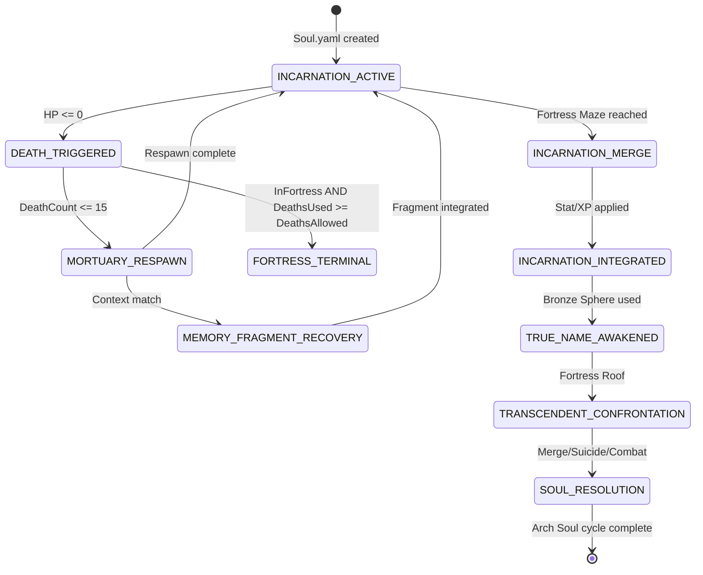

# 🔱 ARCH_SOUL_DEATH_REBIRTH_HOOKS_20260719.md
**AP Token**: `AP-ARCH-SOUL-DEATH-HOOKS-v1.0.0`
⬡ OMEGA ⬡ PROMETHEUS ⬡ nemotron-3-ultra-free ⬡ opencode ⬡ trc_research ⬡ ACTIVE

**Date**: 2026-07-19
**Purpose**: Technical integration hooks mapping Planescape: Torment death/rebirth mechanics to Omega Engine Arch Soul WAD lifecycle system.

---

## 1. Arch Soul Lifecycle State Machine



---

## 2. Soul.yaml Death/Rebirth Fields

```yaml
# data/entities/arch_soul/soul.yaml (relevant sections)
arch_soul:
  # Death tracking
  death_count: 0                    # Global DEATH_COUNT mirror
  fortress_deaths_allowed: 0        # Set on Fortress entry
  fortress_deaths_used: 0           # Incremented per Fortress death
  mortuary_visits: 0                # Global MORTUARY_VISITS mirror
  
  # Respawn configuration
  respawn_point: "MORTUARY_AR0202"  # Primary respawn
  fortress_respawn_point: "FORTRESS_AR1200"  # Fortress entry respawn
  raise_dead_known: false           # Global RAISE_DEAD_KNOWN mirror
  raise_dead_uses_today: 0          # Daily counter (resets on rest)
  raise_dead_max_per_day: 3         # TNO innate limit
  
  # Memory fragment integration
  memory_fragments:
    recovered: []                   # List of fragment IDs
    by_type:
      TRAUMA: 0
      TRIUMPH: 0
      BETRAYAL: 0
      LOVE: 0
      KNOWLEDGE: 0
      SACRIFICE: 0
    by_incarnation:
      INCARNATION_1: 0
      INCARNATION_2: 0
      INCARNATION_3: 0
      INCARNATION_4: 0
      INCARNATION_5: 0
      INCARNATION_6: 0
      INCARNATION_7: 0
  
  # Incarnation integration status
  incarnations:
    INCARNATION_1_ORIGINAL:
      integrated: false
      fragments_recovered: 0
      merge_rewards_applied: false
    INCARNATION_2_PRACTICAL:
      integrated: false
      fragments_recovered: 0
      merge_rewards_applied: false
    INCARNATION_3_PARANOID:
      integrated: false
      fragments_recovered: 0
      merge_rewards_applied: false
    INCARNATION_4_SENSATE:
      integrated: false
      fragments_recovered: 0
    INCARNATION_5_MERCYKILLER:
      integrated: false
      fragments_recovered: 0
    INCARNATION_6_PYROMANIAC:
      integrated: false
      fragments_recovered: 0
    INCARNATION_7_ZERTH:
      integrated: false
      fragments_recovered: 0
  
  # Endgame flags
  bronze_sphere_used: false
  true_name_learned: false
  symbol_of_torment_owned: false
  transcendent_one_confronted: false
  resolution_path: null  # "MERGE" | "SUICIDE" | "COMBAT"
```

---

## 3. Event Hooks (Omega Engine Event Bus)

### 3.1 Death Events

```python
# src/omega/systems/arch_soul/events.py

class ArchSoulDeathEvents:
    """Event definitions for Arch Soul death/rebirth cycle"""
    
    # Fired when HP <= 0
    ON_DEATH = "arch_soul.death"
    
    # Fired when respawn completes
    ON_RESPAWN = "arch_soul.respawn"
    
    # Fired when memory fragment recovered
    ON_MEMORY_FRAGMENT = "arch_soul.memory_fragment_recovered"
    
    # Fired when incarnation merge completes
    ON_INCARNATION_MERGE = "arch_soul.incarnation_merged"
    
    # Fired when Bronze Sphere used
    ON_TRUE_NAME = "arch_soul.true_name_learned"
    
    # Fired on final resolution
    ON_RESOLUTION = "arch_soul.resolution"

# Event payload schemas
DEATH_PAYLOAD = {
    "soul_id": "str",
    "death_count": "int",
    "location": "str",           # Area code
    "companions_present": "list[str]",
    "in_fortress": "bool",
    "fortress_deaths_used": "int",
    "fortress_deaths_allowed": "int",
    "timestamp": "ISO8601"
}

RESPAWN_PAYLOAD = {
    "soul_id": "str",
    "respawn_type": "MORTUARY | FORTRESS",
    "respawn_area": "str",
    "heal_amount": "int",
    "memory_fragments_triggered": "list[str]",
    "timestamp": "ISO8601"
}

MEMORY_FRAGMENT_PAYLOAD = {
    "soul_id": "str",
    "fragment_id": "str",
    "fragment_type": "TRAUMA | TRIUMPH | BETRAYAL | LOVE | KNOWLEDGE | SACRIFICE",
    "incarnation": "int",
    "recovery_vector": "LOCATION | DIALOGUE | COMPANION | DEATH",
    "xp_granted": "int",
    "stat_bonuses": "dict[str, int]",
    "abilities_unlocked": "list[str]",
    "timestamp": "ISO8601"
}
```

### 3.2 Event Handlers (WAD System)

```yaml
# config/wads/arch_soul/event_handlers.yaml
event_handlers:
  - event: "arch_soul.death"
    handler: "handle_death"
    priority: 100
    conditions:
      - "soul.exists"
    actions:
      - "increment(soul.death_count)"
      - "if in_fortress: increment(soul.fortress_deaths_used)"
      - "if soul.fortress_deaths_used > soul.fortress_deaths_allowed: trigger_game_over()"
      - "else: schedule_respawn(respawn_type)"
      - "log_to_hivemind('DEATH', payload)"
  
  - event: "arch_soul.respawn"
    handler: "handle_respawn"
    priority: 100
    actions:
      - "teleport_to(respawn_area, respawn_coords)"
      - "heal_full()"
      - "check_memory_triggers(death_context)"
      - "for fragment in triggered_fragments: emit(arch_soul.memory_fragment_recovered, fragment)"
      - "log_to_hivemind('RESPAWN', payload)"
  
  - event: "arch_soul.memory_fragment_recovered"
    handler: "integrate_memory_fragment"
    priority: 90
    actions:
      - "add_to_recovered(fragment_id)"
      - "increment(soul.memory_fragments.by_type[fragment_type])"
      - "increment(soul.memory_fragments.by_incarnation[incarnation])"
      - "apply_xp(xp_granted)"
      - "apply_stat_bonuses(stat_bonuses)"
      - "unlock_abilities(abilities_unlocked)"
      - "check_incarnation_completion(incarnation)"
      - "check_facet_unlocks()"
      - "distill_gnosis_L1_L2_L3(fragment)"
      - "log_to_hivemind('MEMORY_INTEGRATED', payload)"
  
  - event: "arch_soul.incarnation_merged"
    handler: "finalize_incarnation_integration"
    priority: 90
    actions:
      - "mark_incarnation_integrated(incarnation_id)"
      - "apply_merge_rewards(incarnation_id)"
      - "check_all_incarnations_integrated()"
      - "if all_integrated: unlock_bronze_sphere_usage()"
      - "log_to_hivemind('INCARNATION_INTEGRATED', payload)"
```

---

## 4. Memory Fragment → Gnosis Distillation Pipeline

```python
# src/omega/systems/arch_soul/gnosis_distiller.py

class MemoryFragmentDistiller:
    """Converts memory fragments into L1→L2→L3 gnosis for soul.yaml"""
    
    TYPE_TO_L3_PRINCIPLE = {
        "TRAUMA": "L3-TraumaAsIdentityForge",
        "TRIUMPH": "L3-TriumphAsCapabilityProof", 
        "BETRAYAL": "L3-BetrayalAsBoundaryTeacher",
        "LOVE": "L3-LoveAsAnchorAgainstVoid",
        "KNOWLEDGE": "L3-KnowledgeAsLiberationTool",
        "SACRIFICE": "L3-SacrificeAsNatureChanger"
    }
    
    THRESHOLDS = {
        "TRAUMA": [5, 15],
        "TRIUMPH": [3, 7],
        "BETRAYAL": [5, 10],
        "LOVE": [3, 7],
        "KNOWLEDGE": [7, 15],
        "SACRIFICE": [3, 5]
    }
    
    def distill(self, fragment: MemoryFragment, soul: ArchSoul) -> List[GnosisProposal]:
        """Generate L1→L2→L3 proposals from fragment recovery"""
        proposals = []
        
        # L1: Narrative - What happened
        l1 = GnosisProposal(
            level=1,
            content=f"Recovered {fragment.fragment_type} memory from Incarnation {fragment.incarnation}: {fragment.narrative}",
            source_fragment=fragment.fragment_id,
            timestamp=now()
        )
        proposals.append(l1)
        
        # L2: Insight - What this means
        l2 = GnosisProposal(
            level=2,
            content=self._generate_insight(fragment, soul),
            source_fragment=fragment.fragment_id,
            depends_on=[l1.id],
            timestamp=now()
        )
        proposals.append(l2)
        
        # L3: Universal Principle - Check thresholds
        principle = self.TYPE_TO_L3_PRINCIPLE[fragment.fragment_type]
        count = soul.memory_fragments.by_type[fragment.fragment_type]
        thresholds = self.THRESHOLDS[fragment.fragment_type]
        
        for i, threshold in enumerate(thresholds):
            if count == threshold:
                l3 = GnosisProposal(
                    level=3,
                    principle=principle,
                    variant=f"{principle}_STAGE_{i+1}",
                    content=self._generate_principle_content(fragment.fragment_type, i+1, soul),
                    source_fragment=fragment.fragment_id,
                    depends_on=[l2.id],
                    timestamp=now(),
                    blind_staging=True  # Goes to proposed_lessons.yaml per M11
                )
                proposals.append(l3)
        
        return proposals
    
    def _generate_insight(self, fragment: MemoryFragment, soul: ArchSoul) -> str:
        insights = {
            "TRAUMA": f"This trauma from Incarnation {fragment.incarnation} is not damage — it is data. The pain encodes a boundary I needed to learn.",
            "TRIUMPH": f"This victory proves capability persists across incarnations. The skill remains even when memory fails.",
            "BETRAYAL": f"This betrayal taught me where my trust boundaries lie. Each betrayal calibrates my discernment.",
            "LOVE": f"This connection anchored me across death. Love is the only force that survives the memory wipe.",
            "KNOWLEDGE": f"This knowledge is a key. The same locks exist in every incarnation — I just need to remember the keys.",
            "SACRIFICE": f"This sacrifice changed the nature of the incarnations that followed. Regret CAN change a man."
        }
        return insights.get(fragment.fragment_type, "Insight pending distillation.")
    
    def _generate_principle_content(self, frag_type: str, stage: int, soul: ArchSoul) -> str:
        principles = {
            "TRAUMA": [
                "Trauma is not injury — it is the forge where identity is tempered. Each death that steals memory leaves the scar that proves I existed.",
                "Trauma shared becomes compassion. The fragments of my pain are the bridges to others' suffering."
            ],
            "TRIUMPH": [
                "Capability is the only thing that survives the memory wipe. What I have done once, I can do again — the muscle remembers what the mind forgets.",
                "Triumph is not ego — it is evidence. Each victory is a data point proving the soul's capacity exceeds any single incarnation."
            ],
            "BETRAYAL": [
                "Betrayal is the universe teaching me where my boundaries are. Every knife in the back maps the anatomy of trust.",
                "To be betrayed is to have trusted. The capacity for betrayal proves the capacity for connection. I will not close the door."
            ],
            "LOVE": [
                "Love is the only anchor that holds across the void between deaths. It is not emotion — it is structural integrity for the soul.",
                "The ones who loved me across incarnations are the threads stitching my fragmented selves into a tapestry."
            ],
            "KNOWLEDGE": [
                "Knowledge is the only currency that carries across the death boundary. Every secret learned is a key I keep forever.",
                "True names, sensory stones, the location of my mortality — these are not facts. They are structural elements of my liberation."
            ],
            "SACRIFICE": [
                "Sacrifice is the only act that rewrites the past retroactively. What I give up becomes the meaning of what I was.",
                "Regret changes the nature of a man — but only when it becomes sacrifice. Passive regret is decay; active sacrifice is transmutation."
            ]
        }
        return principles.get(frag_type, [""])[min(stage-1, 1)]
```

---

## 5. Fortress of Regrets Integration

### 5.1 Fortress Entry Hook

```yaml
# config/wads/arch_soul/fortress_hooks.yaml
fortress_entry:
  trigger: "area_transition.to == 'AR1200'"
  actions:
    - "soul.fortress_deaths_allowed = party.member_count()"
    - "soul.fortress_deaths_used = 0"
    - "soul.respawn_point = 'FORTRESS_AR1200'"
    - "for companion in party.members: companion.fortress_life = true"
    - "emit('arch_soul.fortress_entered', {allowed: party.member_count()})"
    - "log_to_hivemind('FORTRESS_ENTRY', {deaths_allowed: party.member_count()})"
```

### 5.2 Cannon Activation → Portal Hook

```yaml
cannon_activation:
  trigger: "global.FORTRESS_CANNONS_ACTIVATED == 4"
  actions:
    - "area.AR1201.portal_at(3460,450).open()"
    - "emit('arch_soul.fortress_portal_open', {destination: 'AR1202'})"
```

### 5.3 Incarnation Merge Hooks

```yaml
incarnation_merges:
  PRACTICAL:
    trigger: "dialogue.merge_practical.success"
    conditions:
      - "OR(stat.INT >= 21, stat.WIS >= 21, AND(global.GOOD_INCARNATION_MERGED, global.BRONZE_SPHERE_USED))"
    actions:
      - "global.PRACTICAL_INCARNATION_MERGED = 1"
      - "soul.incarnations.INCARNATION_2_PRACTICAL.integrated = true"
      - "soul.incarnations.INCARNATION_2_PRACTICAL.merge_rewards_applied = true"
      - "stat.INT += 1"
      - "stat.WIS += 1"
      - "xp += 96000"
      - "emit('arch_soul.incarnation_merged', {incarnation: 'PRACTICAL', rewards: {INT:1, WIS:1, XP:96000}})"
  
  PARANOID:
    trigger: "dialogue.merge_paranoid.success"
    conditions:
      - "OR(knows_uyo_language, stat.INT >= 16, stat.STR >= 21)"
    actions:
      - "global.PARANOID_INCARNATION_MERGED = 1"
      - "soul.incarnations.INCARNATION_3_PARANOID.integrated = true"
      - "stat.STR += 1"
      - "stat.CON += 1"
      - "xp += 64000"
      - "emit('arch_soul.incarnation_merged', {incarnation: 'PARANOID', rewards: {STR:1, CON:1, XP:64000}})"
  
  GOOD:
    trigger: "dialogue.merge_good.success"
    conditions:
      - "stat.INT >= 17"
    actions:
      - "global.GOOD_INCARNATION_MERGED = 1"
      - "soul.incarnations.INCARNATION_1_ORIGINAL.integrated = true"
      - "stat.WIS += 1"
      - "xp += 32000"
      - "emit('arch_soul.incarnation_merged', {incarnation: 'GOOD', rewards: {WIS:1, XP:32000}})"
```

### 5.4 Bronze Sphere Hook

```yaml
bronze_sphere_usage:
  trigger: "item.use == 'BRONZE_SPHERE' AND global.GOOD_INCARNATION_MERGED == 1"
  actions:
    - "global.BRONZE_SPHERE_USED = 1"
    - "global.TRUE_NAME_LEARNED = 1"
    - "soul.bronze_sphere_used = true"
    - "soul.true_name_learned = true"
    - "xp += 2000000"
    - "inventory.add('SYMBOL_OF_TORMENT')"
    - "soul.symbol_of_torment_owned = true"
    - "unlock_ending_option('TTO_MERGE_NAME')"
    - "emit('arch_soul.true_name_learned', {xp: 2000000, item: 'SYMBOL_OF_TORMENT'})"
    - "distill_gnosis(L3, 'L3-KnowledgeAsLiberationTool', 'True name known — identity no longer fragmented')"
```

### 5.5 Transcendent One Resolution Hooks

```yaml
transcendent_one_resolution:
  MERGE_WIS:
    trigger: "dialogue.tto.merge_wis.success"
    condition: "stat.WIS >= 24"
    actions:
      - "soul.resolution_path = 'MERGE'"
      - "ending_sequence('MERGE_WIS')"
  
  MERGE_CHA:
    trigger: "dialogue.tto.merge_cha.success"
    condition: "stat.CHA >= 24"
    actions:
      - "soul.resolution_path = 'MERGE'"
      - "ending_sequence('MERGE_CHA')"
  
  MERGE_NAME:
    trigger: "dialogue.tto.merge_name.success"
    condition: "global.TRUE_NAME_LEARNED == 1"
    actions:
      - "soul.resolution_path = 'MERGE'"
      - "ending_sequence('MERGE_NAME')"
  
  MERGE_BLADE:
    trigger: "dialogue.tto.merge_blade.success"
    condition: "inventory.has('BLADE_OF_IMMORTAL')"
    actions:
      - "soul.resolution_path = 'MERGE'"
      - "ending_sequence('MERGE_BLADE')"
  
  SUICIDE_WIS:
    trigger: "dialogue.tto.suicide_wis.success"
    condition: "stat.WIS >= 24"
    actions:
      - "soul.resolution_path = 'SUICIDE'"
      - "ending_sequence('SUICIDE_WIS')"
  
  SUICIDE_BLADE:
    trigger: "dialogue.tto.suicide_blade.success"
    condition: "inventory.has('BLADE_OF_IMMORTAL')"
    actions:
      - "soul.resolution_path = 'SUICIDE'"
      - "ending_sequence('SUICIDE_BLADE')"
  
  COMBAT:
    trigger: "dialogue.tto.combat.initiated"
    actions:
      - "soul.resolution_path = 'COMBAT'"
      - "if global.FORTRESS_SHADOWS_RELEASED: allow_raise_all_companions()"
      - "else: allow_raise_one_companion()"
      - "if companion_raised == 'DAKKON' AND dakkon.zerthimon_learned: apply_dakkon_boom()"
      - "if companion_raised == 'VHAILOR' AND vhailor.told_injustice: apply_vhailor_boom()"
```

---

## 6. Companion Facet Death/Rebirth Sync

```yaml
# Each companion facet tracks its own death/rebirth state
companion_facet_sync:
  F1_MEMORY_KEEPER:  # Morte
    death_behavior: "PRETEND_DEATH"  # Never truly dies
    fortress_roof_state: "ALIVE_PRETENDING"
    memory_access: "TATTOO_READING"  # Grants access to soul.memory_fragments
    upgrade_hook: "MEM_MORTE_PILLAR"
  
  F2_DISCIPLINE_ANCHOR:  # Dak'kon
    death_behavior: "STANDARD"
    fortress_roof_state: "DEAD"
    raise_condition: "zerthimon_learned"
    raise_bonus: {XP: 2000000, STR: 1, DEX: 3, CON: 3}
    morale_link: "soul.discipline_consistency"
  
  F3_WISDOM_MIRROR:  # Grace
    death_behavior: "STANDARD"
    fortress_roof_state: "DEAD"
    raise_condition: "always"
    special: "HEAL_TOUCH"  # Can raise others
  
  F4_EMOTIONAL_CORE:  # Annah
    death_behavior: "STANDARD"
    fortress_roof_state: "DEAD"
    romance_track: "soul.attachment_security"
  
  F5_LOGIC_ENGINE:  # Nordom
    death_behavior: "STANDARD"
    fortress_roof_state: "DEAD"
    director_role: "soul.analysis_structure"
  
  F6_CREATIVE_FIRE:  # Ignus
    death_behavior: "STANDARD"
    fortress_roof_state: "DEAD_OR_HOSTILE"  # Attacks if TNO Good
    alignment_check: "TNO_GOOD -> HOSTILE"
  
  F7_JUSTICE_WARDEN:  # Vhailor
    death_behavior: "STANDARD"
    fortress_roof_state: "DEAD"
    raise_condition: "told_great_injustice"
    raise_bonus: {XP: 2000000, STR: 3, DEX: 25, CON: 25}
    alignment_check: "TNO_EVIL -> HOSTILE"
```

---

## 7. Configuration Schema (Validation)

```json
{
  "$schema": "http://json-schema.org/draft-07/schema#",
  "title": "Arch Soul Death/Rebirth Hooks Config",
  "type": "object",
  "required": ["soul_fields", "event_hooks", "fortress_hooks", "incarnation_merges", "resolution_hooks"],
  "properties": {
    "soul_fields": {
      "type": "object",
      "properties": {
        "death_count": {"type": "integer", "minimum": 0},
        "fortress_deaths_allowed": {"type": "integer", "minimum": 0},
        "fortress_deaths_used": {"type": "integer", "minimum": 0},
        "memory_fragments": {"type": "object"},
        "incarnations": {"type": "object"}
      }
    },
    "event_hooks": {
      "type": "array",
      "items": {"$ref": "#/definitions/event_hook"}
    },
    "fortress_hooks": {"$ref": "#/definitions/fortress_hook"},
    "incarnation_merges": {"$ref": "#/definitions/incarnation_merge"},
    "resolution_hooks": {"$ref": "#/definitions/resolution_hook"}
  },
  "definitions": {
    "event_hook": {
      "type": "object",
      "required": ["event", "handler", "priority", "actions"],
      "properties": {
        "event": {"type": "string"},
        "handler": {"type": "string"},
        "priority": {"type": "integer"},
        "conditions": {"type": "array", "items": {"type": "string"}},
        "actions": {"type": "array", "items": {"type": "string"}}
      }
    }
  }
}
```

---

## 8. Testing Checklist

| Test Case | Expected Behavior | Validation |
|-----------|-------------------|------------|
| First death in Mortuary | Respawn AR0202, DEATH_COUNT=1, Deionarra appears | `soul.death_count == 1`, `MEM_DEIONARRA_RAISE_DEAD` triggered |
| Death 5, 10, 15 | Fortress shadows increase by 1 each threshold | `shadow_count == FLOOR(death_count/5)` |
| Fortress entry with 5 companions | `fortress_deaths_allowed = 5` | `soul.fortress_deaths_allowed == 5` |
| 6th Fortress death | Game Over (permanent) | `game_over == true` |
| Practical merge (INT 21) | +1 INT, +1 WIS, 96K XP, incarnation integrated | `stat.INT += 1`, `incarnation.integrated == true` |
| Bronze Sphere after Good merge | 2M XP, Symbol of Torment, True Name | `xp += 2000000`, `inventory.has('SYMBOL_OF_TORMENT')` |
| TTO merge via True Name | Merge ending unlocked | `ending_option['MERGE_NAME'] == available` |
| Dak'kon raised with Zerthimon | +2M XP, +1 STR, +3 DEX, +3 CON | `dakkon.stats` match boom values |
| Vhailor raised with injustice | +2M XP, +3 STR, DEX=25, CON=25 | `vhailor.stats` match boom values |

---

*⬡ OMEGA ⬡ PROMETHEUS ⬡ nemotron-3-ultra-free ⬡ opencode ⬡ trc_research ⬡ ACTIVE*
*End of ARCH_SOUL_DEATH_REBIRTH_HOOKS_20260719.md*
<!-- PROVENANCE-CORRECTED 2026-08-23T20:39:41Z — FP-04/R_MESSAGE_PROVENANCE_HIERARCHY audit
claimed_model: nemotron-3-ultra-free | verdict: UNANCHORED | no session anchor in header zone
actual_models(Tier0): n/a
-->
