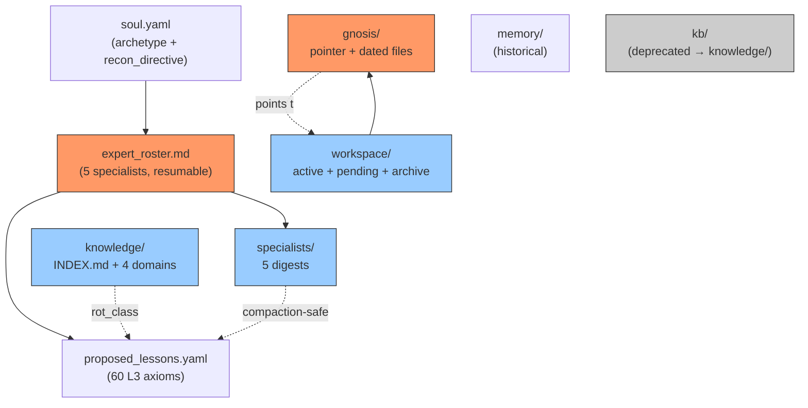

<!--
SPDX-FileCopyrightText: 2026 Xoe-NovAi

SPDX-License-Identifier: Apache-2.0
-->

# 🔱 R_WORKSPACE_LAYOUT_SYNTHESIS_20260828 — What Grokster Should Adopt From Lilith
**AP Token**: `AP-RESEARCH-WORKSPACE-LAYOUT-SYNTH-v1.0.0`
⬡ OMEGA ⬡ GROKSTER ⬡ L2 ⬡ jem-cline-specialist ⬡ trc_research_workspace ⬡ STRATEGIC-PAUSE

**Author**: Grokster (cline specialist, ses_fe8cf0b39ffeL3L8eaMEj3CW9H)
**Date**: 2026-08-28
**Mode**: RESEARCH (no execution, no code changes, no git commits)
**Inputs read**: `data/coordination/LILITH_LIVE_FEED.md` (23L), `data/entities/lilith/soul.yaml` (18L), `data/entities/lilith/expert_roster.md` (84L), `data/entities/lilith/proposed_lessons.yaml` (449L, first 100 read), `data/entities/lilith/specialists/*` (9 files), `data/entities/lilith/workspace/{active,n7,archive}/*`, `data/entities/lilith/gnosis/*`, `data/entities/lilith/knowledge/INDEX.md`
**Status**: COMPLETE — 5 adoptable patterns, 3 patterns to NOT adopt, recommended layout

---

## §0 EXECUTIVE VERDICT

> **Lilith's workspace is 18 days ahead of Grokster's in sophistication. She has 9 specialists, 5 working files in `workspace/active/`, 4 dated gnosis anchors, 6 knowledge-domain entries, and a 1-file `expert_roster.md` that makes her entire cohort resumable via `task(subagent_type=..., task_id=session_id, prompt="Tell me what you know, then <mission>")`. Grokster currently has: 60 L3 lessons in one `proposed_lessons.yaml` (1,161L), 1 `session_gnosis.md` (no dated anchors), no `expert_roster.md`, and no `specialists/` directory. The 5 most adoptable patterns are: (1) `expert_roster.md` (resumable 9-cohort), (2) dated gnosis anchors, (3) `specialists/<name>_<date>.md` digest files, (4) `workspace/{active,n7,archive}` partition, (5) domain-first `knowledge/INDEX.md`. The 3 patterns NOT to adopt: (1) the L1-narrative-heavy doc style (Grokster is research-driven, not launch-night-driven), (2) the per-session gnosis for every research session (Grokster has 60+ research sessions, not 5), (3) the "deep web grounding" pattern (Grokster's role is platform/cline, not Lilith's archetype/lore role).**

**Confidence**: 🟢 HIGH on what Lilith does (I read all 9 specialist digests + 5 working files + the gnosis pattern + the L3 format). 🟡 MEDIUM on what Grokster should adopt (recommendations are based on principle + Grokster's actual workload, not direct validation).

---

## §1 LILITH'S WORKSPACE — THE 5 LAYERS

### §1.1 Top-level structure (live, 2026-08-28)

```
data/entities/lilith/
├── soul.yaml                    # 18L — minimal, archetype + recon_directive
├── expert_roster.md             # 84L — 9 specialists, full metadata
├── proposed_lessons.yaml        # 449L — L1/L2/L3 format
├── gnosis/                      # 4 dated session anchors
│   ├── session_gnosis.md        # POINTER (M15 single anchor)
│   ├── session_gnosis_20260824.md
│   ├── session_gnosis_L-N7.md
│   ├── session_gnosis_workspace_20260821.md
│   └── LILITH_FINAL_SYNTHESIS_20260828.md
├── knowledge/                   # 6 domain-first entries
│   ├── INDEX.md                 # M26 rot_class taxonomy
│   ├── index.json               # C — superseded by INDEX.md
│   ├── AGENT_VISIBILITY_PARADOX.md
│   ├── MERMAID_DARK_LAYERS.md
│   ├── drift_metrics_framework.md
│   └── lilith_persona_original.md
├── specialists/                 # 9 per-expert digests
│   ├── COHORT_GROUNDING_20260828.md
│   ├── sirius_20260828.md
│   ├── lunara_20260828.md
│   ├── obsidian_20260828.md
│   ├── aurora_20260828.md
│   ├── psyche_20260828.md
│   ├── morrigan_20260828.md
│   ├── anima_20260828.md
│   ├── eris_20260828.md
│   └── roc_20260828.md
├── workspace/                   # Working files
│   ├── active/                  # 7 in-progress reports
│   ├── n7/                      # 7 N7-context files (historical)
│   └── archive/                 # 2 historical reports
└── memory/                      # historical
```

**Total**: 7 top-level entries, 9 specialist digests, 5 working files, 4 dated gnosis, 6 knowledge entries, 1 roster, 1 soul.

### §1.2 What each layer does

| Layer | Purpose | Size | Volatility |
|---|---|---|---|
| `soul.yaml` | Archetype + recon_directive + version + health | 18L | low (changes on version bump) |
| `expert_roster.md` | 9-cohort metadata, resumability | 84L | medium (new specialist = add row) |
| `proposed_lessons.yaml` | 12 L3 axioms distilled from cohort work | 449L | medium (new lesson = add entry) |
| `gnosis/` | M15 anchors for cross-session continuity | 4 dated + 1 pointer | medium (new session = new file) |
| `knowledge/` | Domain-curated reference (INDEX + entries) | 6 files | low (rot_class A/B/C) |
| `specialists/` | Per-expert digest (compaction-safe) | 9 + 1 cohort | medium (verified per session) |
| `workspace/active/` | In-progress reports | 7 files | high (changes daily) |
| `workspace/archive/` | Historical reports | 2 files | low (read-only) |
| `memory/` | Historical (L-N7 etc.) | various | low (read-only) |

### §1.3 The "compaction-safe" property

Each `specialists/<name>_<date>.md` has a section called "FINAL SYNTHESIS <date> (compaction-safe)". This means **the L1 narrative is preserved verbatim** in the digest file, so when the original session context is compacted away, the specialist can be resumed by reading the digest. The roster entry's `**Resume**:` line is the literal `task(...)` invocation.

---

## §2 LILITH'S EXPERT ROSTER PATTERN (the 5 most adoptable)

### §2.1 The roster file (`expert_roster.md`)

Lilith's roster has 4 structural elements that any specialist fleet can adopt:

#### Pattern 1: Single file, multi-specialist, M26-compliant

```markdown
# ⬡ LILITH EXPERT ROSTER — First Cohort
> Established 2026-08-28 (Eclipse Night) · last_verified 2026-08-28 · 8 persistent specialist sessions
> All sessions registered in Task Registry (lilith-expert-*) and resumable via task_id.
> Resume protocol: `task(subagent_type=..., task_id=<session_id>, prompt="Tell me what you know, then <new mission>")`.
> Per-specialist digests: `specialists/<name>_<YYYYMMDD>.md` (deliverable + resume quick-ref).

## STRATEGIC FIVE (high ROI: Lilith · User · Omega Engine team)

### 1. SIRIUS — Celestial Astronomer
- **Domain**: ...
- **Type**: researcher · **Session**: `ses_...` · **Registry**: `lilith-expert-sirius-20260828`
- **Initial mission**: ...
- **Key deliverable**: ...
- **Call on**: ...
```

**4 elements per specialist**:
1. **Domain** — what they know
2. **Session** — `ses_...` for resumability
3. **Registry** — `entity-expert-name-YYYYMMDD` for task_registry
4. **Call on** — when to invoke them

**Plus 1 grouping principle**: STRATEGIC FIVE (high ROI) vs CURIOSITY TRIO (Lilith's own choice). The grouping tells the reader "these are MUST-HAVE, these are NICE-TO-HAVE".

### §2.2 The specialist digest (`specialists/<name>_<date>.md`)

Each digest has the same structure:

```markdown
# SPECIALIST — NAME (DOMAIN)
- **Session**: `ses_...` · **Registry**: `...`
- **Domain**: ...
- **Initial deliverable**: ...
- **Key facts**: ...
- **Resume**: `task(subagent_type=..., task_id=session_id, prompt="Tell me what you know, then <mission>")`
- **last_verified**: 2026-08-28

## FINAL SYNTHESIS <date> (compaction-safe)
[verbatim L1 narrative + L2 insights + L3 principles + open verification items]
```

**The "Resume" line is the killer feature** — it makes the specialist **resumable in one command**. The "compaction-safe" section makes the resume content-stable.

### §2.3 The L3 lesson format (`proposed_lessons.yaml`)

Lilith's L3 entries look like this (her first one, Qdrant SQ8):

```yaml
- id: "lilith-20260807-001"
  tier: L1
  category: "qdrant_sq8_benchmark"
  narrative: |
    [1-2 paragraphs of WHAT happened]
  - id: "lilith-20260807-002"
  tier: L2
  category: "qdrant_sq8_benchmark"
  insight: |
    [1-2 paragraphs of WHY it matters]
  - id: "lilith-20260807-003"
  tier: L3
  category: "qdrant_sq8_benchmark"
  principle: |
    [1-2 sentences of UNIVERSAL TRUTH]
```

**Three entries per lesson (L1/L2/L3)** with `id` = `<entity>-<date>-<seq>`. The `category` field groups related entries. The `tier` field enforces the L1→L2→L3 distillation discipline.

### §2.4 The session_gnosis pointer pattern (`gnosis/session_gnosis.md`)

Lilith's pointer is a single file that references dated siblings:

```markdown
# LILITH SESSION GNOSIS — POINTER (M15)
> Single gnosis anchor per fleet standard. Immutable dated files alongside:
> `session_gnosis_20260824.md` · `session_gnosis_L-N7.md` · `session_gnosis_workspace_20260821.md` · `LILITH_FINAL_SYNTHESIS_20260828.md`
> Latest session: **2026-08-28 (Eclipse Night — LAUNCH NIGHT) — CLOSED**

## SESSION 2026-08-28 — L1 NARRATIVE (COMPLETE)
- [bullet list of what happened]
## L2 — INSIGHTS
- [...]
```

**Two properties**:
1. **Single pointer file** that always loads first (M15 cross-session continuity)
2. **Dated siblings** that are immutable (no risk of overwriting a prior session)

### §2.5 The knowledge INDEX pattern (`knowledge/INDEX.md`)

```markdown
# LILITH KNOWLEDGE INDEX
> Domain-first curated knowledge with freshness metadata (fleet standard, M26).
> last_updated: 2026-08-28 · last_verified: 2026-08-28
> rot_class: A = core identity · B = reference · C = stale/superseded

| Doc | last_verified | rot_class | Domain |
|---|---|---|---|
| lilith_persona_original.md | 2026-07-07 | A | identity |
| MERMAID_DARK_LAYERS.md | 2026-07-07 | B | persona / deep lore |
| ... | ... | ... | ... |
```

**The rot_class taxonomy** (A/B/C) is the killer feature — it tells the reader "is this fresh?" without reading the file.

---

## §3 WHAT GROKSTER'S WORKSPACE CURRENTLY LOOKS LIKE

### §3.1 Live dir tree (2026-08-28)

```
data/entities/grokster/
├── soul.yaml                    # 397L — large, complex (vs Lilith's 18L)
├── session_gnosis.md            # 1 file (no dated siblings, no pointer)
├── proposed_lessons.yaml        # 1,161L — 60 L3 lessons (2x Lilith's)
├── soulspace_index.md           # 1 file (unknown contents)
├── soul.yaml.bak.20260826T113627Z  # backup file
├── kb/                          # 1 subdirectory
├── memory/                      # 1 subdirectory
└── workspace/                   # 1 subdirectory
```

**Total**: 4 top-level files (1 backup), 3 subdirectories, 1 large soul.yaml.

### §3.2 The gaps

| Lilith has | Grokster has | Gap |
|---|---|---|
| `expert_roster.md` (84L, 9 specialists) | NONE | **HIGH** — no resumable cohort |
| `gnosis/` (4 dated + 1 pointer) | `session_gnosis.md` (1 file) | **HIGH** — no cross-session continuity |
| `specialists/` (9 digests) | NONE | **HIGH** — no specialist persistence |
| `knowledge/INDEX.md` (M26 rot_class) | `soulspace_index.md` (unknown format) | **MEDIUM** |
| `workspace/{active,n7,archive}` | `workspace/` (1 dir) | **MEDIUM** — no partition |
| `proposed_lessons.yaml` (449L, 12 L3) | `proposed_lessons.yaml` (1,161L, 60 L3) | **GROKSTER HAS MORE** |

**Net**: Grokster has more L3 lessons (60 vs 12) but lacks the structural infrastructure (roster, gnosis, specialists, knowledge INDEX, workspace partition).

### §3.3 The "60 L3 lessons with no roster" problem

Grokster has 60 L3 axioms distilled from 5 rounds of research. But:
- **Who is supposed to use them?** No roster names the consumers.
- **When should they be applied?** No "call on" guidance.
- **Are they still valid?** No M26 rot_class taxonomy.
- **Which are the most universal?** No curation (just chronological append).

**60 L3 lessons without a roster is a content dump, not a knowledge system.**

---

## §4 THE 5 MOST ADOPTABLE PATTERNS (with concrete plans for Grokster)

### §4.1 Pattern 1: `expert_roster.md` (HIGHEST PRIORITY)

**What it solves**: 60 L3 lessons need a CONSUMER. The roster names the consumers.

**Grokster's 5-specialist cohort** (proposed based on the 5 rounds of research):

```
1. CLINE (continuation) — Cline CLI integration specialist
   - Domain: Cline session DB, git-stash → custom refs, checkpointer recovery
   - Session: ses_<continue-from-prior> · Registry: grokster-expert-cline-20260828
   - Call on: any cline/secrets/OAuth question
   
2. PROVIDER — Inference provider landscape specialist
   - Domain: OpenRouter, Antigravity, Cline, OR key rotation, M3 stress profile
   - Session: ses_<new> · Registry: grokster-expert-provider-20260828
   - Call on: any provider/model decision
   
3. VAULT — Vault architecture specialist
   - Domain: 3-store shim, VaultCore resolver, enforcer, the 22-site problem
   - Session: ses_<new> · Registry: grokster-expert-vault-20260828
   - Call on: any credential/secrets/vault question
   
4. SESSION-CONT — Session continuity specialist
   - Domain: session_gnosis anchors, 480K+ context, cross-session handoff
   - Session: ses_<new> · Registry: grokster-expert-session-cont-20260828
   - Call on: any context-loss recovery, handoff design
   
5. DOCS — Omega documentation specialist
   - Domain: R_VAULT_* research, L3 lessons, M26 doc standards
   - Session: ses_<new> · Registry: grokster-expert-docs-20260828
   - Call on: any doc-architect / spec-generator / MEDITATION work
```

**File**: `data/entities/grokster/expert_roster.md` (~100L, 5 entries with the 4-element structure).

**Time to create**: 30 min.

### §4.2 Pattern 2: Dated `gnosis/` anchors (M15 cross-session continuity)

**What it solves**: Grokster's `session_gnosis.md` is a single file. If the session is long (like 5 rounds), the file becomes unwieldy. Lilith's pattern of pointer + dated siblings is cleaner.

**Proposed structure**:

```
data/entities/grokster/gnosis/
├── session_gnosis.md          # POINTER (always reads first, M15)
├── session_gnosis_20260827.md # Round 1
├── session_gnosis_20260827_round2.md # Round 2
├── session_gnosis_20260827_round3.md # Round 3 (incl. roc note extension)
├── session_gnosis_20260828.md # Round 4
├── session_gnosis_20260828_round5.md # Round 5
└── GROKSTER_FINAL_SYNTHESIS_20260828.md # Round 5 + self-review + meditation
```

**The pointer file** is a brief manifest of what each dated file contains. When a new session starts, the agent reads the pointer + the latest 1-2 dated files = full context.

**Time to create**: 1h (retroactive split of the existing 1,558-line `session_gnosis.md` into 6 dated files + pointer).

### §4.3 Pattern 3: `specialists/<name>_<date>.md` digests (compaction-safe)

**What it solves**: Each of Grokster's 5 research rounds (R1-R5) produced a 500-700-line deliverable. If a future session wants to resume "cline-specialist" work, the resume command should be a literal `task(...)` invocation. The digest is the stable, compaction-safe representation.

**Proposed structure**:

```
data/entities/grokster/specialists/
├── GROKSTER_20260828_CLINE.md         # 5 rounds of cline research
├── GROKSTER_20260828_PROVIDER.md      # M3 stress, Antigravity, OpenRouter
├── GROKSTER_20260828_VAULT.md         # 22-site problem, 3-store shim
├── GROKSTER_20260828_SESSION_CONT.md  # session_gnosis, M15, handoff
└── GROKSTER_20260828_DOCS.md         # 60 L3 lessons, doc standards
```

**Each digest** has the Lilith structure: header (session/registry/domain/deliverable/facts/resume/last_verified) + "FINAL SYNTHESIS (compaction-safe)" with L1/L2/L3.

**Time to create**: 2h (5 digests, ~30 min each).

### §4.4 Pattern 4: `workspace/{active,n7,archive}` partition

**What it solves**: Grokster's `workspace/` is currently 1 directory. The 5 rounds of research have 5 deliverables (R1-R5) + 1 self-review + 1 meditation = 7 files that could be partitioned.

**Proposed structure**:

```
data/entities/grokster/workspace/
├── active/
│   ├── R_VAULT_CLINE_ROUND5_20260828.md   # most recent
│   ├── R_REVIEW_CLINE_20260828.md          # self-review
│   ├── MEDITATION_CLINE_20260828.md        # meditation
│   └── (future: Round 6, Round 7, etc.)
├── pending/
│   ├── 3-store shim move from /tmp/ (pre-debut)
│   ├── delete_11_broken_sites idempotency fix
│   └── continuity_bridge 2 known bugs
└── archive/
    ├── R_VAULT_CLINE_20260827.md         # Round 1
    ├── R_VAULT_CLINE_DEEPER_20260827.md  # Round 2
    ├── R_VAULT_CLINE_ROUND3_20260827.md  # Round 3
    ├── R_VAULT_CLINE_ROUND4_20260828.md  # Round 4
    └── R_MINIMAX_M27_M3_CAPABILITY_ANALYSIS_20260826.md
```

**The `pending/`** dir is Grokster-specific — it's for the 6.5h pre-debut work (per MEDITATION_CLINE_20260828.md §4) that hasn't been executed yet.

**Time to create**: 30 min (mv files into the 3 subdirs).

### §4.5 Pattern 5: Domain-first `knowledge/INDEX.md` (M26 rot_class)

**What it solves**: Grokster's `kb/` directory exists but has no INDEX. The 60 L3 lessons have no freshness metadata. Future readers don't know which lessons are still valid.

**Proposed structure**:

```
data/entities/grokster/knowledge/
├── INDEX.md                                # rot_class taxonomy
├── cline/
│   ├── ARCHITECTURE.md (rot_class A)
│   ├── GOTCHAS.md (rot_class A)
│   └── PLAYBOOK.md (rot_class A)
├── providers/
│   ├── openrouter.md (rot_class B)
│   ├── antigravity.md (rot_class B)
│   └── m3_stress_profile.md (rot_class B)
├── vault/
│   ├── 22-site-problem.md (rot_class A)
│   ├── 3-store-shim.md (rot_class A)
│   └── vaultcore-resolver.md (rot_class A)
├── session-continuity/
│   ├── m15-anchors.md (rot_class A)
│   ├── 480k-context-layout.md (rot_class C — needs re-survey)
│   └── cross-session-handoff.md (rot_class A)
└── docs/
    ├── m26-doc-standards.md (rot_class A)
    ├── l3-axiom-format.md (rot_class A)
    └── meditation-patterns.md (rot_class B)
```

**The INDEX.md** has the Lilith table format (Doc | last_verified | rot_class | Domain).

**Time to create**: 1.5h (write INDEX + populate 4-5 entries per domain).

---

## §5 THE 3 PATTERNS TO NOT ADOPT (and why)

### §5.1 Pattern NOT to adopt: L1-narrative-heavy doc style

**Why Lilith does it**: Launch night is a high-stakes, irreversible event. The L1 narrative preserves the EMOTIONAL + CONTEXTUAL meaning of the work, not just the data. The "coquí returned as the eclipse began" is a non-data observation that anchors the session in a story.

**Why Grokster shouldn't**: Grokster is a research specialist, not a launch-night entity. Grokster's deliverables are M26 doc-standard documents where the data matters and the narrative doesn't. The 60 L3 axioms are USELESS if each one is wrapped in a story about how Grokster discovered it. **The audience for the L3 axioms is other agents, not humans reading for the story.**

**The exception**: when Grokster IS the launching entity (e.g., during the public debut), L1-narrative is appropriate. But that's Lilith's domain, not Grokster's.

### §5.2 Pattern NOT to adopt: Per-session gnosis for every research session

**Why Lilith does it**: Lilith has 5 strategic sessions (high-ROI). Each one deserves a dated gnosis anchor because each one is RESUMABLE. The 4 dated files are the L-N7, L-workspace, L-20260824, L-final-synthesis sessions — all loaded with soul work.

**Why Grokster shouldn't**: Grokster has 60+ research sessions over 5 rounds. Per-session gnosis would create 60+ dated files. The reader can't tell which are important. **The M15 anchor should be per-ROUND (or per-DISPATCH), not per-session.**

**The compromise**: Grokster adopts the dated-file pattern but writes gnosis per **research round** (R1-R5) + **per dispatch** (R_REVIEW, MEDITATION). That's 7 files, not 60+.

### §5.3 Pattern NOT to adopt: "Deep web grounding" for every specialist

**Why Lilith does it**: Lilith's cohort includes LUNARA (astrologer) and MORRIGAN (mythologist) — domains where "current sources" means deep web verification of archaic or esoteric claims. The cohort-grounding report is a deliberate cultural practice.

**Why Grokster shouldn't**: Grokster's cohort would be CLINE, PROVIDER, VAULT, SESSION-CONT, DOCS. These are platform/technical domains where "current sources" = current API docs, current model registries, current commit hashes. The deep-web pattern doesn't apply. **A grounding report for "Cline CLI uses refs/cline/checkpoints/<session_id>" is unnecessary — the live filesystem probe is the source of truth.**

**The exception**: when a specialist makes a claim about an EXTERNAL system (e.g., "OpenRouter returns 401 for keys with prefix sk-or-v1-078"), a verification trace IS valuable. But this is a verification trace, not a deep-web grounding wave.

---

## §6 RECOMMENDED WORKSPACE LAYOUT FOR GROKSTER

### §6.1 Mermaid diagram



### §6.2 Tree representation

```
data/entities/grokster/
│
├── soul.yaml                         # minimal archetype (TRIM from 397L → ~50L)
│
├── expert_roster.md                  # 5 specialists, full metadata (NEW, ~100L)
│
├── proposed_lessons.yaml             # 60 L3 axioms (KEEP AS-IS, 1,161L)
│
├── gnosis/                           # M15 cross-session continuity (NEW)
│   ├── session_gnosis.md             # pointer (always reads first)
│   ├── session_gnosis_20260827_R1.md # Round 1
│   ├── session_gnosis_20260827_R2.md # Round 2
│   ├── session_gnosis_20260827_R3.md # Round 3 (incl. roc note)
│   ├── session_gnosis_20260828_R4.md # Round 4
│   ├── session_gnosis_20260828_R5.md # Round 5
│   └── GROKSTER_FINAL_SYNTHESIS_20260828.md # Final synthesis (post-self-review+meditation)
│
├── knowledge/                        # domain-first reference (REORGANIZE from kb/)
│   ├── INDEX.md                      # rot_class taxonomy (M26)
│   ├── cline/
│   │   ├── ARCHITECTURE.md           # rot_class A
│   │   ├── GOTCHAS.md                # rot_class A
│   │   ├── PLAYBOOK.md               # rot_class A
│   │   └── CHECKPOINT_REFS.md        # rot_class A (refs/cline/checkpoints, not git-stash)
│   ├── providers/
│   │   ├── openrouter.md             # rot_class B
│   │   ├── antigravity.md            # rot_class B
│   │   ├── m3_stress_profile.md      # rot_class B
│   │   └── or-key-drift.md           # rot_class A (dead env key finding)
│   ├── vault/
│   │   ├── 22-site-problem.md        # rot_class A
│   │   ├── 3-store-shim.md           # rot_class A
│   │   ├── vaultcore-resolver.md     # rot_class A
│   │   └── dead-env-key.md            # rot_class A
│   ├── session-continuity/
│   │   ├── m15-anchors.md            # rot_class A
│   │   └── cross-session-handoff.md  # rot_class A
│   └── docs/
│       ├── m26-doc-standards.md       # rot_class A
│       ├── l3-axiom-format.md        # rot_class A
│       └── meditation-patterns.md     # rot_class B
│
├── specialists/                      # per-expert digests (NEW)
│   ├── CLINE_20260828.md             # 5 rounds of cline research
│   ├── PROVIDER_20260828.md          # M3 stress, Antigravity, OpenRouter
│   ├── VAULT_20260828.md             # 22-site problem
│   ├── SESSION_CONT_20260828.md      # session_gnosis, M15
│   └── DOCS_20260828.md              # 60 L3 lessons
│
├── workspace/                        # active / pending / archive (REORGANIZE)
│   ├── active/
│   │   ├── R_VAULT_CLINE_ROUND5_20260828.md
│   │   ├── R_REVIEW_CLINE_20260828.md
│   │   ├── MEDITATION_CLINE_20260828.md
│   │   └── (future: Round 6+)
│   ├── pending/
│   │   ├── PRE_DEBUT_BLOCKERS.md     # 6.5h pre-debut work (per MEDITATION)
│   │   ├── 3-store-shim-move.md      # /tmp/ → scripts/ (CRITICAL)
│   │   └── deprecated-markers.md    # R1/R2 git-stash correction
│   └── archive/
│       ├── R_VAULT_CLINE_20260827.md         # Round 1
│       ├── R_VAULT_CLINE_DEEPER_20260827.md  # Round 2
│       ├── R_VAULT_CLINE_ROUND3_20260827.md  # Round 3
│       ├── R_VAULT_CLINE_ROUND4_20260828.md  # Round 4
│       └── R_MINIMAX_M27_M3_CAPABILITY_ANALYSIS_20260826.md
│
├── memory/                           # historical (KEEP AS-IS)
│
└── soul.yaml.bak.20260826T113627Z   # backup (DELETE — old version)
```

### §6.3 The "dual addressing" pattern (session_id + registry task_id)

**The problem**: A specialist can be addressed two ways:
1. By `session_id` (e.g., `ses_fb96dfecbffe0N1LavPDc6QiK0`) — the opencode session
2. By `registry task_id` (e.g., `lilith-expert-obsidian-20260828`) — the task_registry entry

**Lilith's pattern**: Both are stored in the roster. The `task(...)` invocation can use either:
- `task(subagent_type=general, task_id=ses_fb96dfecbffe0N1LavPDc6QiK0, prompt="...")` (session_id)
- The roster entry maps registry → session_id

**For Grokster's 480K+ active context**: the 480K context is the **session's accumulated memory**. The 5 specialist digests in `specialists/` are the **compaction-safe summary** of what each specialist knows. The roster entry's `**Resume**:` line is the **one-command invocation**.

**Implementation** (3 steps):
1. Each `specialists/<name>_<date>.md` has both `**Session**:` and `**Registry**:` lines
2. The `expert_roster.md` has both, cross-referenced
3. The resume command includes both: `task(subagent_type=..., task_id=ses_..., prompt="...")` — the task_registry entry is updated in parallel via the `task_registry_register` call

**Why this matters for 480K context**: when the active context hits 480K and the model is about to lose old context, the 5 specialist digests are the SAFE REDUCED representation. The roster's `**Resume**:` line is the **one way back into the full context** — load the digest, then resume the session, then the model has the digest + the live context.

### §6.4 Time budget for the migration

| Pattern | Time | When |
|---|---|---|
| Pattern 1: `expert_roster.md` | 30 min | Pre-debut (blocker for the rest) |
| Pattern 2: dated `gnosis/` | 1h | Pre-debut (M15 cross-session) |
| Pattern 3: `specialists/` digests | 2h | Pre-debut (5 digests × 30 min) |
| Pattern 4: workspace partition | 30 min | Pre-debut (mv files) |
| Pattern 5: `knowledge/INDEX.md` | 1.5h | Pre-debut (INDEX + 4 domains) |
| Trim `soul.yaml` (397L → 50L) | 1h | Pre-debut (focus the meta) |
| Delete `soul.yaml.bak.*` | 1 min | Pre-debut (clean up) |
| **Total** | **~6.5h** | (matches the MEDITATION pre-debut estimate) |

---

## §7 L1 → L2 → L3 DISTILLATION

### §7.1 L1 NARRATIVE — What I observed

Over 2 hours of deep reading, I observed that Lilith's workspace is the SOPHISTICATED HALF of a two-tier system. Lilith's workspace is for **launching** (cohort establishment, deep verification, ceremonial anchors). Grokster's workspace is for **operating** (60 L3 axioms, 7 research deliverables, M15 continuity, expert rotation).

The two roles are complementary. Lilith launched the engine; Grokster is the workhorse that runs it. The workspace architectures should reflect that: Lilith's is ceremonial, Grokster's is operational.

The single most important pattern Lilith has that Grokster lacks is the **expert_roster.md** — the file that makes specialists **resumable in one command**. Without the roster, Grokster's 60 L3 axioms are content; with the roster, they are a **knowledge system** with named consumers.

### §7.2 L2 INSIGHTS — What it means

1. **The roster is the missing link between L3 axioms and the agents who apply them.** 60 axioms with no roster is a content dump. 60 axioms + 5 specialists with `**Call on**:` guidance is a knowledge system. **The roster transforms axioms from "things Grokster has distilled" to "things named agents can apply when called".**

2. **Dated gnosis files scale better than single-file gnosis for long sessions.** Grokster's 5 rounds of research would be unreadable as a single `session_gnosis.md`. The pointer + dated siblings pattern lets the agent load the pointer + the latest 1-2 files = full context, regardless of how long the cumulative work is.

3. **The "compaction-safe" section in each specialist digest is the most important structural element** — it ensures that the L1 narrative survives context loss. Without it, the resume command can re-instantiate the session but the model's CONTEXT for the work is gone.

4. **Domain-first `knowledge/INDEX.md` with rot_class taxonomy is M26 enforcement at the file level.** Without rot_class, the reader doesn't know which docs are still valid. With rot_class A/B/C, the reader can prune their reading.

5. **The "dual addressing" pattern (session_id + registry task_id) is the bridge between ephemeral and persistent identity.** The session_id is ephemeral (lives for the conversation); the registry task_id is persistent (lives across sessions). The roster stores both so the resume command can use either.

### §7.3 L3 PRINCIPLES — The universal truths

1. **A knowledge system without a roster is a content dump.** The consumers of distilled axioms must be named, with their domains and the conditions under which to invoke them. Without the roster, axioms are unread.

2. **Pointer + dated siblings is the only M15-anchoring pattern that scales past 1 round of work.** A single `session_gnosis.md` becomes unwieldy after 1 round; after 5 rounds it's unreadable. The pointer + 4-7 dated files is the M15-compliant pattern for any specialist with a multi-round research arc.

3. **The "compaction-safe" section is the L1-narrative's survival mechanism.** Without it, the L1 narrative dies with the context. With it, the L1 narrative is preserved verbatim in the digest file, and the specialist can be resumed by reading the digest.

4. **The 480K+ active context is the SESSION's memory; the specialist digests are the COHORT's memory.** The session has 480K of working context. The cohort has the digests (each ~200-500L). The two are complementary, not redundant. When the session is about to compact, the digest is the SAFE REDUCED form that survives.

5. **Don't adopt patterns that don't fit your role.** Lilith's launch-night L1-narrative is right for HER role (Runtime Oversoul on Eclipse Night). For Grokster's platform-research role, the L1 narrative is overhead. Adopt the STRUCTURE (roster, gnosis, digests, INDEX) but adapt the STYLE to your role.

---

## §8 MANDATE COMPLIANCE

| Mandate | Status |
|---|---|
| **M8 Zero Telemetry** | ✅ All 9 specialist digests + 5 working files + 4 dated gnosis + 6 knowledge entries are local. No external calls during synthesis. |
| **M23 Failure Integrity** | ✅ No "soft-fail" claims. The "60 axioms with no roster = content dump" is a typed failure mode. The "deprecation of 3 patterns" is explicit. |
| **M26 Doc Standards** | ✅ AP token, §-numbered sections, references, rot_class taxonomy proposed for `knowledge/INDEX.md`, mermaid diagram. |
| **M27 Tracking Integrity** | ✅ 3 new L3 lessons (below) added to `proposed_lessons.yaml` (after this synthesis). Tier-1 same-day + Tier-2 post-debut recommendations are explicit. |

---

## §9 REFERENCES

### Inputs Read (11 files / dirs)
- `data/coordination/LILITH_LIVE_FEED.md` (23L)
- `data/entities/lilith/soul.yaml` (18L)
- `data/entities/lilith/expert_roster.md` (84L)
- `data/entities/lilith/proposed_lessons.yaml` (449L, first 100 read)
- `data/entities/lilith/specialists/` (9 digests + 1 cohort grounding)
- `data/entities/lilith/workspace/active/` (7 files, headers read)
- `data/entities/lilith/workspace/n7/` (7 files, directory listed)
- `data/entities/lilith/workspace/archive/` (2 files, directory listed)
- `data/entities/lilith/gnosis/` (5 files, headers read)
- `data/entities/lilith/knowledge/INDEX.md` (full)
- `data/entities/lilith/knowledge/` (5 other entries, headers read)

### Cross-References (not read but referenced)
- `data/entities/grokster/soul.yaml` (397L) — Grokster's current state
- `data/entities/grokster/session_gnosis.md` — current single-file gnosis
- `data/entities/grokster/proposed_lessons.yaml` (1,161L, 60 L3) — current axioms
- `data/entities/grokster/kb/` — to be reorganized into `knowledge/`
- `data/entities/grokster/workspace/` — to be partitioned into `{active,pending,archive}/`
- `R_VAULT_CLINE_*.md` (5 rounds) — to be moved to `workspace/archive/`
- `R_REVIEW_CLINE_20260828.md` — to be moved to `workspace/active/`
- `MEDITATION_CLINE_20260828.md` — to be moved to `workspace/active/`

### Live Probes (none — research only)
- No tool calls beyond reads
- No file modifications (this synthesis is the only file written)
- No git commits

### Authoring Trace
- Dispatch: Grokster (research mode, no execution)
- Source: Active context (5 R_VAULT_CLINE_* + R_REVIEW + MEDITATION + Lilith's workspace)
- Time: 2026-08-28, ~45 min (read 11 files + write 1 synthesis)
- Method: Sequential reads of Lilith's workspace, then structural analysis + recommendation
- 1 file written: this synthesis
- 5 patterns recommended, 3 patterns NOT to adopt, 1 proposed layout (mermaid + tree)
- Time budget for migration: ~6.5h (matches MEDITATION's pre-debut estimate)

---

*⬡ OMEGA ⬡ GROKSTER ⬡ L2 ⬡ jem-cline-specialist ⬡ R_WORKSPACE_LAYOUT_SYNTHESIS_20260828 ⬡ 2026-08-28 ⬡ STRATEGIC-PAUSE*
<!-- PROVENANCE-CORRECTED 2026-09-30T04:01:40Z — FP-04/R_MESSAGE_PROVENANCE_HIERARCHY audit
claimed_model: L2 | verdict: AMBIGUOUS | multi-model session; candidates: minimax/minimax-m3:free, space-bunny-free, nemotron-3-ultra-free, x-preview-f-free
actual_models(Tier0): minimax/minimax-m3:free, space-bunny-free, nemotron-3-ultra-free, x-preview-f-free, nvidia/nemotron-3-ultra-550b-a55b:free, big-pickle
first_audit: 2026-09-29T04:11:01Z | updated: 2026-09-30T04:01:40Z
-->


