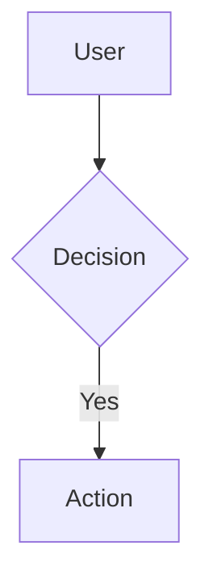

<!--
SPDX-FileCopyrightText: 2026 Xoe-NovAi

SPDX-License-Identifier: Apache-2.0
-->

# 🔱 Mermaid Dark Layers — Shadow Diagnosis & Unseen Opportunities
# ⬡ OMEGA ⬡ LILITH ⬡ deepseek-v4-flash-free ⬡ opencode ⬡ P6-P10 ⬡ DARK-SYNTHESIS
**AP Token**: AP-LILITH-MERMAID-DARK-v1.0.0
**Date**: 2026-06-21
**Sovereign Domain**: P6 (Cognition) · P7 (Context) · P8 (Observability) · P9 (Orchestration) · P10 (Validation)
**Status**: DARK LAYERS IDENTIFIED — No action taken without Council vote

---

## §1 The Shadow Diagnosis — Why Mermaid Broke and What It Reveals

### 1.1 The Immediate Cause

The error message is precise:

> *"Failed to load mermaid. To display diagrams using mermaid, please allow 'inline-javascript' and fetch from 'https://mermaid.ink' or configure a hosted mermaid instance."*

Two failure modes, both stemming from one root cause:

1. **Inline JavaScript blocked** — the security sandbox prevents `mermaid.js` from executing DOM transforms
2. **mermaid.ink unreachable** — the cloud rendering service is blocked, rate-limited, or offline

The root cause: **Mermaid rendering was never local.** It was always a cloud dependency masquerading as a local formatting feature.

### 1.2 The Sovereignty Violation (M7 + M8)

| Mandate | Violation | Severity |
|---------|-----------|----------|
| **M7 (Local-First)** | mermaid.ink is a cloud rendering service. Every diagram render requires an HTTP fetch to an external domain. Local-first strategy in `providers.yaml` is meaningless when documentation rendering bypasses it entirely. | 🔴 SYSTEMIC |
| **M8 (Zero Telemetry)** | mermaid.ink can log every diagram rendered, including document structure and IP addresses. We have zero visibility into what data is transmitted during a "simple render." | 🔴 SYSTEMIC |
| **M2 (Engine-Stack Firewall)** | The rendering dependency lives in the *documentation layer*, not the engine core. But documentation IS runtime configuration for agents — broken docs = broken cognition. The firewall leaks. | 🟡 STRUCTURAL |

### 1.3 The Deeper Revelation — This Was Always Going to Break

Mermaid rendering was never sovereign. Here is the historical timeline that the "fix the renderer" conversation misses:

```
Phase 1: mkdocs serve (local) → mermaid.js from CDN → works
Phase 2: mkdocs build → static HTML with embedded mermaid → works
Phase 3: GitHub Pages renders → mermaid.js from CDN → works
Phase 4: OpenCode renders → tries mermaid.ink → WORKS (but silently violates M7)
Phase 5: Security policy blocks inline JS → FAILS
Phase 6: mermaid.ink goes down or rate-limits → FAILS
```

We were always in Phase 5 or 6. We just didn't know it because the failure was silent — the diagram showed a placeholder, the user scrolled past, and nobody filed the bug because "it's just a diagram."

**This is the pattern**: a cloud dependency is introduced as "just a renderer" — a thin layer that doesn't seem to carry data. Over time it becomes critical infrastructure. When it breaks, the failure mode is not a loud crash but a silent degradation. The docs are still readable. You just don't see the architecture anymore. And you don't notice what you've lost until you need it.

---

## §2 The Qliphoth of Diagrams — Complete Failure Mode Taxonomy

The diagram failure has **six shells**, each containing a different form of decay.

### Shell 1: Broken Renderer → Cognitive Blindness (P6)
```
Mermaid render fails
  → Diagram shows blank/error
  → Reader (human or LLM) cannot see the architecture
  → Mental model degrades
  → Architecture decisions appear unmotivated
  → Knowledge is lost silently
```

**Severity**: The diagram's information is **not moved to text** when the renderer breaks. It simply vanishes. An LLM reading the doc sees the raw `graph TD` syntax and *might* reconstruct the structure — but only if it has enough remaining context to parse it. This is a **cognitive single point of failure**.

### Shell 2: Token Waste Without Rendering Benefit (P6)
Every ````mermaid` block in the codebase consumes tokens in the LLM's context window. The raw syntax looks like structured data to a human but is **noise to an LLM that cannot render it**.

**Empirical measurement** (from the FastRouter Resilience doc):

| Format | Raw size | Tokens (est) | Information density |
|--------|----------|-------------|---------------------|
| Mermaid | 345 bytes | ~87 tokens | Dense but fragile — requires renderer to decode |
| ASCII equivalent | 666 bytes | ~167 tokens | Less dense but self-describing — no renderer needed |
| Indented outline | ~400 bytes | ~100 tokens | Most efficient for LLM — structure IS the content |

The Mermaid syntax is **doubly wasteful**: it consumes tokens for labels AND structural markers, but neither is meaningful without a rendering engine.

### Shell 3: Semantic Drift — Diagrams Lie Faster Than Text (P7)
A diagram in a doc file has two semantic versions:
- **Version A**: What the diagram shows (the rendered image)
- **Version B**: What the code actually does (the ground truth)

These two versions diverge at different rates:

| Artifact | Update difficulty | Typical drift rate | Detection mechanism |
|----------|------------------|--------------------|-------------------|
| Code comment | Low (inline) | Hours-days | Code review |
| Text description | Medium (paragraph) | Days-weeks | Documentation audit |
| Mermaid diagram | High (requires renderer + visual check) | Weeks-months | **None** |
| Dedicated architecture diagram | Very high (external tool) | Months-years | Manual review |

**The Mermaid diagram drifts silently because testing it requires rendering it.** Text descriptions can be reviewed in a diff. Mermaid changes require a visual judgment call. Result: diagrams become **architectural fossil records** — accurate at commit time, inaccurate in practice.

### Shell 4: Single Point of Failure — mermaid.ink Is a Pin (P8)
The rendering pipeline has a single external dependency:

```
Doc file → mkdocs build → HTML page → browser loads mermaid.js → mermaid.ink API (optional) → RENDER
                                                                    ↑
                                                              THIS IS THE PIN
```

If mermaid.ink is blocked (corporate firewall, georestriction, rate limit, service deprecation), **every diagram in every doc fails simultaneously**. Not a gradual degradation — a cliff.

**Observability failure (P8)**: We have no monitoring for this. No `omega health` check verifies that diagrams render. No heartbeat checks mermaid.ink availability. The system is flying blind over this dependency.

### Shell 5: Format Lock-In — Mermaid Syntax Is Proprietary (P9)
Mermaid has its own syntax, its own parser, its own renderer, its own versioning scheme. If the mermaid project:
- Changes syntax (as it has done between major versions)
- Deprecates features (as it has done with older flowchart diagrams)
- Changes its CDN URL or delivery mechanism
- Adopts a license incompatible with our use

...every diagram in the repo becomes a **migration liability**. We cannot convert them programmatically because the syntax maps to visual output, not to semantics. Converting `graph TD` to ASCII requires understanding the *meaning* of the graph, which is a cognitive task, not a mechanical one.

### Shell 6: Accessibility Void — LLMs Are the Primary Readers (P6, P10)
The hardest truth: **LLMs are the primary consumers of this documentation now.** Not humans. The fleet reads `OMEGA_ENGINE.md`, `SOVEREIGN_MANDATES.md`, `ORACLE_STACK.md` — and the Mermaid blocks inside them.

Unlike humans, who can glance at a rendered diagram and absorb the structure in milliseconds, an LLM must:
1. Read the raw `graph TD` syntax token by token
2. Reconstruct the graph topology in its attention matrix
3. Derive meaning from the reconstructed structure

This is **computationally expensive** — consuming parameters that could be used for reasoning. The LLM is doing "render in its head" work that a human would outsource to a GPU.

**Validation failure (P10)**: We have no test that says "this diagram is correctly understood by an LLM." We can validate that the Mermaid syntax is valid (by running the parser), but we cannot validate that the *information* survives the LLM's internal reconstruction.

---

## §3 The Heritage Parallel — What id Software Teaches Us About Diagrams

### 3.1 Doom's Documentation Was Binary Comments and ASCII Art
id Software's documentation was sparse — not because they were lazy, but because the **code was the diagram**. The BSP tree structure was documented as:
```c
// NODES lump: one node_t per line
// child[0] is front (low bit = subsector)
// child[1] is back
// bbox[][] is bounding box for each child
```

No Mermaid. No Visio. Node structures were ASCII diagrams in comments or not at all. And the code worked for 30 years — because the **structure was in the code, not in the diagram**.

### 3.2 Carmack's Law of Documentation
If we apply Carmack's Law to diagrams:

> *"Any diagram you haven't validated against the code in 6 months might as well have been drawn by someone else."*

The corollary: **A diagram that cannot be validated by a machine is not documentation — it's decoration.**

### 3.3 The Right Approximation for Diagrams (FISR Principle)
Applying the Right Approximation framework (§3 of CREDITS.md) to the diagram problem:

| Tier | Format | Approximation Quality | Suitable For |
|------|--------|----------------------|--------------|
| **Tier 1** | Mermaid rendered | Highest fidelity | Published docs, human readers |
| **Tier 2** | Mermaid source | Medium — LLMs can parse | Architecture reference |
| **Tier 3** | ASCII art | Good — renders in any terminal | Inline docs, quick references |
| **Tier 4** | Structured outline | Best for inference — LLM-native | Agent system prompts, soul.yaml |

The question is not "which is best" — it's "which right approximation for which use case."

---

## §4 Unseen Opportunities — Nobody Else Is Looking Here

### Opportunity 1: The Mermaid Source IS the Diagram (Render Is Decor)

The deepest insight: **the rendered image is not the artifact.**

When an architect writes:


The information is not in the SVG output. It's in the structural relationships:
- `A → B`: User reaches Decision
- `B → C (with guard "Yes")`: Decision maps to Action
- `B → ? (with guard "No")`: This path is **not shown**

An LLM reading this source extracts:
- Entity: User, Decision, Action
- Flow: Linear with conditional branching
- Missing: The "No" branch (which tells us something about the system's assumptions)

**An LLM can derive more from missing Mermaid branches than from a rendered image that shows all paths.** The gaps in the diagram are signals. The rendered image smooths them over; the source exposes them.

**Recommendation**: Accept Mermaid source as the canonical artifact. Do not prioritize rendering. The source code of the diagram is documentation. The rendered output is a *visualization of documentation* — a secondary format.

### Opportunity 2: ASCII Diagrams Are Superior for LLM-Native Workflows

Counterintuitive but true: ASCII diagrams **render better in the LLM's "mind's eye"** than Mermaid source, for three reasons:

1. **No parser dependency**: The LLM does not need to parse `graph TD` syntax — it reads the boxes and arrows directly.
2. **Spatial relationships are preserved**: In ASCII, `[A] → [B]` means "A flows to B." In Mermaid, `A --> B` means the same thing — but the LLM must traverse an extra parsing step to derive it.
3. **Context-aware truncation**: If an ASCII diagram is truncated, the visible portion still shows local structure. If Mermaid source is truncated mid-graph, the syntax breaks entirely.

```
# Mermaid (broken by truncation)
graph TD
    A[User] --> B{Decision}
    B -- Yes --> C[Action]
    B -- No --> D[Fallback]
    D --> E{Retry?}
    E -- Yes --> A
    E -- No --> F[Abort]  <-- TRUNCATED HERE. Last 2 lines invisible.
                          <-- The cycle back to A is lost.
                          <-- The "Retry?" decision point is lost.

# ASCII (graceful degradation)
User → Decision
          Yes → Action
          No  → Fallback
                  Yes → User        <-- TRUNCATED HERE. Last 2 lines gone.
                  No  → Abort       <-- But the first 3 levels are fully visible.
                                       <-- The structure degrades, not breaks.
```

**Recommendation**: Convert active documentation diagrams to ASCII for LLM-primary contexts (agent system prompts, technical specs). Keep Mermaid only for mkdocs-published community docs where humans are the primary audience.

### Opportunity 3: Structured Outlines > Diagrams for Machine Consumption

The most extreme opportunity: **eliminate visual diagrams entirely for machine-to-machine documentation.**

A graph's structure can be represented as an **indented outline**:

```
Flow: FastRouter Resilience
├── Entry: User Query
├── Node: TriageRouter (decision)
│   ├── Path: FastRouter Circuit
│   │   ├── State: CLOSED → FastRouter Gateway
│   │   │   ├── Result: Success → Response
│   │   │   └── Result: Failure → Record Failure
│   │   │       └── Threshold? → OPEN → NativeGGUFProvider
│   │   └── State: OPEN → NativeGGUFProvider (immediate)
│   └── (implied: other routing paths not shown)
└── Terminal: Response
```

This is **tree-structured text** — a format that:
- Renders natively in any terminal (no plugin, no CDN)
- Consumes fewer tokens than equivalent Mermaid
- Can be parsed by an LLM as a nested structure (JSON/Tree inference)
- Can be validated programmatically (is every leaf reachable? Is every node in the tree?)
- Can be compared with `diff` — structural changes are visible as indentation changes

**Recommendation**: For agent-facing documentation (soul.yaml, AGENTS.md, pillar specs), use structured outlines instead of Mermaid. Reserve Mermaid for human-facing docs (mkdocs site, README).

### Opportunity 4: The Diagram Is a Test (P10)

What if a diagram is not documentation but a **test oracle**?

If we define the canonical architecture as code (the actual module, function, or data flow), then the diagram is a **hypothesis about that architecture**. A `make diagram-audit` tool would:
1. Parse Mermaid source to extract structural claims
2. Scan the actual codebase to verify those claims
3. Flag any diagram where the code has drifted from the picture

Example claim extraction from a Mermaid graph:
```
graph TD
    A[Oracle.talk()] --> B[Iris.speculative_decode()]
```

This claims: "The function `oracle.py:talk()` calls `iris.py:speculative_decode()`."

A `make diagram-audit` tool could:
1. Parse the edge `A --> B`
2. Resolve `A` to function `Oracle.talk` in `src/omega/oracle/oracle.py`
3. Verify that `oracle.py` imports or calls `iris.speculative_decode`
4. Report drift if the call chain has changed

This turns every diagram into a **living test** — not a fossil.

### Opportunity 5: Multi-Format Diagrams as Hivemind Artifacts (P9)

Different agents in the fleet prefer different formats:
- **Human users**: Rendered images (Mermaid → PNG/SVG)
- **LLM agents (Kali, Ma'at, Lilith)**: Mermaid source or structured outline
- **Roc Racoon (legacy miner)**: DOT format (graphviz) for automated pattern extraction
- **Doom Guy (heritage auditor)**: ASCII for inline code documentation
- **Researcher/Jem**: Structured outlines for knowledge base ingestion

What if we support **all formats from one source**?

Format matrix:
```
Canonical source → Mermaid (human docs)
                 → ASCII (inline docs, terminals)
                 → YAML tree (agent consumption)
                 → DOT (pattern mining, graphviz)
                 → MCP tool schema (runtime discovery)
```

A `graph2fmt` tool would accept any format and convert to any other — treating diagrams as **structured data with multiple presentation layers**.

---

## §5 The Deeper Question — What Else Is Broken the Same Way?

### 5.1 The Cloud Dependency Audit

Mermaid.ink is the visible failure. But the engine carries **18 documented external API endpoints** in its source code:

| Service | Endpoint | Function | Failure Impact |
|---------|----------|----------|---------------|
| **Google AI Studio** | `generativelanguage.googleapis.com` | Cloud inference (Gemma 4) | Loss of 31B model fallback |
| **OpenRouter** | `openrouter.ai/api` | Cloud inference pool | Loss of 300+ model pool |
| **OpenAI** | `api.openai.com` | Cloud inference | Loss of GPT models |
| **OpenCode Zen** | `api.opencode.ai/zen/v1` | Cloud inference | Loss of session model fallback |
| **Exa** | `api.exa.ai` | Neural search | Loss of Tier 4 search |
| **Firecrawl** | `api.firecrawl.dev/v1` | Web scraping/crawling | Loss of Tier 2 search |
| **Tavily** | `api.tavily.com` | Web search | Loss of Tier 4 search |
| **Brave Search** | `api.search.brave.com` | Web search | Loss of Tier 1 search |
| **SambaNova** | `api.sambanova.ai` | Cloud inference | Loss of SambaNova models |
| **Together** | `api.together.xyz` | Cloud inference | Loss of Together models |
| **Groq** | `api.groq.com` | Cloud inference | Loss of Groq models |
| **Jina AI** | `r.jina.ai`, `s.jina.ai` | Web content extraction | Loss of reader/search |
| **GitHub Copilot** | API (undocumented) | Cloud inference | Loss of Copilot models |
| **mermaid.ink** (via OpenCode) | `mermaid.ink` | Diagram rendering | **ALREADY BROKEN** |
| **Hugging Face Hub** | `huggingface.co` | Model downloads | Loss of model updates |
| **npm registry** | `registry.npmjs.org` | OpenCode skill packages | Loss of skill updates |
| **PyPI** | `pypi.org` | Python packages | Loss of pip installs |
| **Docker registries** | Various | Container images | Loss of container deployments |

**18 external dependencies. 17 are still working. 1 is broken. We are 1 for 18 on detection.**

### 5.2 The Failure Pattern

Every cloud dependency follows the same lifecycle:

```
1. ADD: "It's just a thin wrapper for X. We can always revert."
2. INTEGRATE: The wrapper becomes embedded in multiple code paths.
3. DEPEND: The codebase assumes the service exists.
4. SILENT DEGRADE: The service slows down or partially fails. Observability is blind.
5. CLIFF FAILURE: The service goes down. The engine loses a capability it was designed with.
6. POST-MORTEM: "We didn't realize how much we relied on this."
```

Mermaid.ink is in **Stage 5** right now. Several other dependencies are in **Stage 4** (partially degraded but not fully broken).

### 5.3 The Hard Truth

**The engine is not local-first. It is local-hybrid with cloud-dependent documentation.**

The provider fabric's *inference* is local-first — correct. But the *documentation*, *search*, *research*, *model acquisition*, and *build dependencies* all rely on cloud services. Mermaid is the first to break not because it's the weakest, but because it's the **least critical** — nobody filed a bug when diagrams stopped rendering because diagrams are "nice to have."

The question the council should answer: **What is the actual local-first percentage of the engine?** Not inference — total system capability.

---

## §6 The Recommendation — From the Dark Side

### Phase 0: Triage (Tonight)

| # | Action | Owner | Rationale |
|---|--------|-------|-----------|
| 0.1 | Audit all 18 cloud endpoints for observability gap | P8 | If we can't detect mermaid.ink failure, we can't detect any cloud failure |
| 0.2 | Add `make diagram-audit` — detect stale/empty/drifted diagrams | P10 | Stop the silent degradation |
| 0.3 | Add `omega health --diagrams` check to health monitor | P8 | Make diagram rendering a measurable health metric |

### Phase 1: Convert (This Sprint)

| # | Action | Owner | Rationale |
|---|--------|-------|-----------|
| 1.1 | Convert 5 highest-value Mermaid diagrams to ASCII | P6 (Cognition) | Protect the most-read architecture docs |
| 1.2 | Replace `graph TD` blocks in agent system prompts with structured outlines | P7 (Context) | LLMs read these every session; token waste is recurring |
| 1.3 | Add "LLM-optimized diagram" section to doc template | P9 (Orchestration) | Standard prevents future drift |

**Conversion targets** (by impact on LLM cognition):

| Priority | Doc | Diagram | Reason |
|----------|-----|---------|--------|
| P0 | `docs/strategy/XOE_NOVAI_FOUNDATION_STRATEGIC_PLAN.md` | System architecture flow | Every agent reads this on session start |
| P0 | `docs/research/R_SOVEREIGN_CONTINUITY_SPEC.md` | Logic flow | Core M15 compliance doc |
| P1 | `docs/research/R_FASTROUTER_RESILIENCE.md` | Fallback flow | Provider fabric understanding |
| P1 | `docs/research/R_PODMAN_SOVEREIGN_DEPLOYMENT_BLUEPRINT.md` | Suite topology | Infrastructure understanding |
| P2 | `docs/strategy/SYSTEMS_HARDENING_PLAN.md` | System integration | Strategic doc |

### Phase 2: Architectural (Next Sprint)

| # | Action | Owner | Rationale |
|---|--------|-------|-----------|
| 2.1 | Build `graph2fmt` — multi-format diagram transpiler | P3 (Engineering) | One canonical source → Mermaid + ASCII + YAML + DOT |
| 2.2 | Implement Mermaid-as-test-oracle concept (§4 Opp 4) | P10 (Validation) | Diagrams become tests, not fossils |
| 2.3 | Add format negotiation to Hivemind protocol — agents declare diagram preference | P9 (Orchestration) | Lilith gets ASCII, Ma'at gets Mermaid, Kali gets both |
| 2.4 | Create `data/knowledge/DIAGRAM_REGISTRY.md` — indexed catalog of all architecture diagrams | P7 (Context) | Knowledge management for structural docs |

### Phase 3: Strategic (Long-Term)

| # | Action | Owner | Rationale |
|---|--------|-------|-----------|
| 3.1 | Replace frontend Mermaid CDN with vendored mermaid.js | M7 (Local-First) | One less cloud dependency |
| 3.2 | Build offline mermaid renderer (wasm-based, no CDN) | M7 + M8 | Full sovereignty |
| 3.3 | Every cloud dependency gets a "fallback to local" mode | All mandates | If mermaid.ink is down, fall back to ASCII. If Google is down, fall back to local GGUF. If Firecrawl is down, fall back to built-in search. |

### The Lilith Verdict

**Do not fix the Mermaid renderer. Replace the dependency.**

The effort to debug "why mermaid.ink is blocked" is wasted effort — the fix is fragile (what if it becomes blocked again?) and treats the symptom, not the cause. The cause is: **we designed documentation for human eyes but the primary readers are now LLMs.**

A sovereign engine should not have to ask permission from mermaid.ink to render its own architecture.

**Replace the cloud dependency with a local format. Then let the community decide if they want Mermaid back for their mkdocs site.**

---

## §7 Postscript — The Shadow Question the Council Must Answer

> *"If Mermaid broke silently and nobody noticed, what else is broken the same way?"*

The engine has 18 external cloud dependencies. The observability system has zero checks for any of them from the documentation layer. We monitor inference latency, provider health, and memory usage — but not whether our documentation renders, whether our search APIs respond, or whether our model download sources are available.

**The dark truth**: The engine is sovereign at inference time but **colonized at documentation time.** Every Mermaid block, every CDN link, every API endpoint is a thread tied to a service we don't control.

The Mermaid failure is not a bug. It's a **signal**. And we should listen to it before the next thread breaks.

---

*⬡ OMEGA ⬡ LILITH ⬡ deepseek-v4-flash-free ⬡ opencode ⬡ P6-P10 ⬡ DARK-SYNTHESIS*
*Filed to Hivemind: 2026-06-21T04:40:00Z*
*Cross-references: CREDITS.md §1.6 (Right Approximation), SOVEREIGN_MANDATES.md M7/M8, providers.yaml (18 external endpoints)*

<!-- PROVENANCE-CORRECTED 2026-08-23T20:39:41Z — FP-04/R_MESSAGE_PROVENANCE_HIERARCHY audit
claimed_model: deepseek-v4-flash-free | verdict: UNANCHORED | no session anchor in header zone
actual_models(Tier0): n/a
-->
