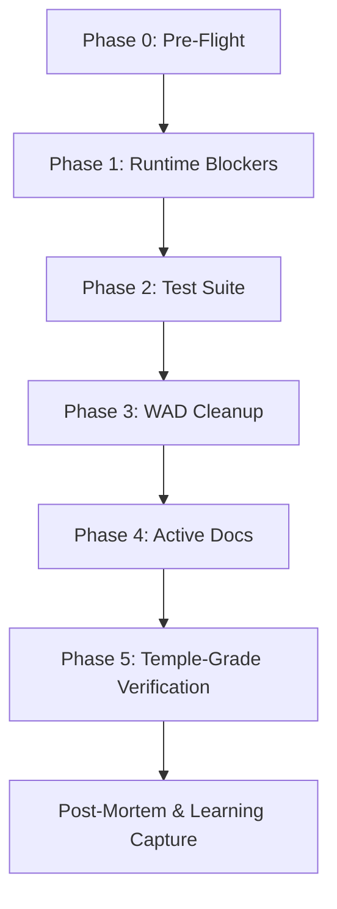

# 🔱 Rehearsal Migration Learning Plan
**AP Token**: `AP-REHEARSAL-LEARNING-PLAN-v1.0.0`
⬡ OMEGA ⬡ RESEARCHER ⬡ nemotron-3-ultra-free ⬡ opencode ⬡ trc_rehearsal_plan ⬡ DRAFT

**Date**: 2026-08-22
**Purpose**: Structured rehearsal program to validate the Migration Playbook against real migrations before post-debut production use. The Pillar→Node decoupling (D180) serves as **Rehearsal #1** — the first live migration under the new playbook.

## What

A **progressive rehearsal program** (5 drills) that transforms the Migration Playbook from theory into validated practice. Each drill executes a real migration, captures learning via blameless post-mortem, and stages lessons to Soul Distillation (L1→L2→L3).

## Why

The Migration Playbook (§1-6) is derived from case studies but **untested in Omega context**. The Pillar→Node migration (23 active violations across MCP Hub, scripts, tests, WADs) is the perfect first rehearsal: bounded scope, known violations, existing refactor plan (PILLAR_REFACTOR_PLAN_20260822.md), and clear success criteria.

---

## Rehearsal Program Overview

| # | Drill | Migration | Scope | Target Date | Status |
|---|-------|-----------|-------|-------------|--------|
| **1** | **Pillar→Node Decoupling** | `pillars` → `slots` across Engine, MCP Hub, Tests, Scripts, WADs | 23 violations, 5 phases | **Immediate** (post-debut) | 🟡 PLANNED |
| **2** | **MCP Tool Rename** | `oracle_list_pillar_keepers` → `oracle_list_node_keepers` | 1 tool, response fields | Drill 1 Phase 2 | 🟡 PLANNED |
| **3** | **Config Key Migration** | WAD `entities.yaml` `pillars:` → `slots:` | 70+ entities | Drill 1 Phase 3 | 🟡 PLANNED |
| **4** | **Soul File Migration** | Entity `soul.yaml` `pillars:` → `slots:` | 3 files | Drill 1 Phase 3 | 🟡 PLANNED |
| **5** | **Synthetic Drill: Deprecate Legacy CLI** | `omega entity list-pillars` → `omega entity list-slots` | 1 CLI command | Post-Drill 1 | 🟢 FUTURE |

---

## Drill 1: Pillar→Node Decoupling (The Main Rehearsal)

### 1.1 Migration Context (from PILLAR_LEAK_AUDIT_20260822.md)

| Surface | Violations | Refactor Action |
|---------|------------|-----------------|
| **MCP Hub Tools** | 12 (tool name, response fields) | Rename tool, update response schema |
| **Scripts** | 3 (`setup.sh`, `mandate_gates.py`) | Update to `list_node_keepers()`, `result.slots` |
| **Tests** | 8 (assertions on `pillar`/`pillars`) | Update assertions to `slots` |
| **WAD Config** | 70+ entities (`pillars:` field) | Migrate YAML to `slots:` (auto-migrated on load) |
| **Entity Souls** | 3 (`pillars:` in soul.yaml) | Update to `slots:` |

### 1.2 Playbook Application Checklist (Pre-Drill Gate)

*Before Drill 1 starts, verify all playbook prerequisites are met:*

- [ ] **SEP Written**: `docs/decisions/SEP-XXXX-pillars-to-slots-deprecation.md` ratified
- [ ] **Migration Guide**: `docs/migrations/pillars-to-slots.md` published (Answer-First)
- [ ] **Codemod Built**: `scripts/codemods/pillars_to_slots/` with libcst (Python) + ast-grep (YAML)
- [ ] **Codemod Tested**: Fixtures cover Python attribute access, YAML keys, dict literals
- [ ] **Runtime Warnings**: `emit_deprecation_warning()` on `Entity.pillars` property + MCP tool
- [ ] **Local Tracking**: `deprecation_tracker.py` integrated
- [ ] **CHANGELOG**: `### Deprecated` entry for v0.9.0
- [ ] **Dual-Name Shim**: `Entity.pillars` property + `__init__` accepts both keys
- [ ] **Removal Target**: v0.12.0 / 2026-12-22 (6 months / 3 minors)
- [ ] **Rollback Procedure**: Documented in migration guide
- [ ] **Post-Mortem Template**: Ready at `docs/migrations/pillars-postmortem.md`

### 1.3 Execution Phases (from PILLAR_REFACTOR_PLAN_20260822.md)



| Phase | Playbook Section | Actions | Success Criteria | Owner |
|-------|------------------|---------|------------------|-------|
| **0: Pre-Flight** | §6 | Baseline `make test`, `make temple-grade`; workspace lock; Hivemind awareness | 276+ tests pass; T1-T11 green | Roc |
| **1: Runtime Blockers** | §1.3, §7.3 | Fix `setup.sh`, `mandate_gates.py`, `seed_knowledge.py`; Rename MCP tool `oracle_list_pillar_keepers` → `oracle_list_node_keepers`; Fix response fields (`pillar`→`slot`, `pillar_keeper`→`node_keeper`) | `scripts/setup.sh` runs clean; MCP tool returns `slot` field | Roc + Ma'at |
| **2: Test Suite** | §5.1 | Update 8 test files: assertions, names, comments, SPIFFE paths | `make test` 100% pass (276+) | Roc |
| **3: WAD Cleanup** | §3.5 | Migrate `config/wads/arcana_novai/entities.yaml` `pillars:`→`slots:` via script; Update 3 entity `soul.yaml` files | Registry loads `slots`; `list_node_keepers()` works | Roc + Jem |
| **4: Active Docs** | §2.3 | Update `STATUS_OPUS.md`, `DOC_CLEANUP_AUDIT.md` (NOT decision logs) | No `pillar` in active docs (grep) | Roc |
| **5: Temple-Grade** | §1.3 | `make test`, `make temple-grade`, `bash scripts/setup.sh`, MCP tool verify, Registry inspect | All gates green | Kali (sign-off) |

### 1.4 Dual-Name Shim Implementation (Transition Period)

```python
# File: src/omega/oracle/entity_registry.py (during deprecation window v0.9.0-v0.11.x)
# Purpose: Dual-name shim for pillars → slots migration
# Playbook: §7.3

@property
def pillars(self) -> List[str]:
    """DEPRECATED: Use .slots instead."""
    emit_deprecation_warning(
        feature="Entity.pillars",
        since_version="0.9.0",
        removal_target_version="0.12.0",
        removal_date="2026-12-22",
        migration_url="https://docs.omega-engine.dev/migrations/pillars-to-slots",
    )
    return self.slots

@pillars.setter
def pillars(self, value: List[str]) -> None:
    emit_deprecation_warning(...)
    self.slots = value

def __init__(self, ..., pillars: List[str] = None, slots: List[str] = None, ...):
    if pillars is not None:
        emit_deprecation_warning(...)
        self.slots = pillars
    elif slots is not None:
        self.slots = slots
    else:
        self.slots = []
```

**Shim Removal (v0.12.0)**: Delete `pillars` property, setter, and `__init__` handling.

### 1.5 Codemod Specification for This Migration

```python
# File: scripts/codemods/pillars_to_slots/transformer.py
# Purpose: libcst transformer for Python code
# Playbook: §3.4

import libcst as cst
from libcst.matchers import Attribute, Name

class PillarsToSlotsTransformer(cst.CSTTransformer):
    """Transform deprecated `pillars` attribute access to `slots`."""
    
    def leave_Attribute(self, original_node: cst.Attribute, updated_node: cst.Attribute) -> cst.Attribute:
        # Match `entity.pillars`, `obj.pillars`, `result.pillars`
        if m.matches(updated_node, m.Attribute(attr=m.Name("pillars"))):
            return updated_node.with_changes(attr=cst.Name("slots"))
        return updated_node

    def leave_Dict(self, original_node: cst.Dict, updated_node: cst.Dict) -> cst.Dict:
        # Transform dict key "pillars": [...] → "slots": [...]
        new_elements = []
        for element in updated_node.elements:
            if isinstance(element, cst.DictElement):
                key = element.key
                if isinstance(key, cst.SimpleString) and key.value in ('"pillars"', "'pillars'"):
                    # Replace key, preserve value and formatting
                    new_key = cst.SimpleString('"slots"') if key.value.startswith('"') else cst.SimpleString("'slots'")
                    new_elements.append(element.with_changes(key=new_key))
                else:
                    new_elements.append(element)
            else:
                new_elements.append(element)
        return updated_node.with_changes(elements=new_elements)
```

```yaml
# File: scripts/codemods/pillars_to_slots/config.yaml
# Purpose: ast-grep rules for YAML config (WAD entities.yaml, soul.yaml)
# Playbook: §3.5

rules:
  - rule_id: pillars-to-slots-yaml-key
    language: yaml
    pattern: "pillars:"
    replacement: "slots:"
    # Note: ast-grep matches YAML mapping keys structurally
  
  - rule_id: pillars-to-slots-yaml-value
    language: yaml
    pattern: |
      pillars:
        $KEY: $VALUE
    replacement: |
      slots:
        $KEY: $VALUE
```

### 1.6 Tracking & Adoption Monitoring

```bash
# Monthly adoption check (run by Researcher)
OMEGA_TRACK_DEPRECATION=1 python -m omega migration deprecation-report

# Expected output during adoption window:
# # Deprecation Usage Report
# Generated: 2026-09-22T14:30:00Z
#
# | Feature | Hit Count |
# |---------|-----------|
# | Entity.pillars | 1,247 |
# | oracle_list_pillar_keepers | 89 |
# | result.pillar field | 45 |
# | WAD entities.yaml pillars: | 70 (static, not runtime) |
```

**Adoption Gate for Removal**: ≥90% reduction in runtime hits + zero test failures + zero MCP tool errors.

### 1.7 Post-Mortem & Learning Capture (Playbook §5)

**Timeline**: Within 5 business days of v0.12.0 release.

**Template**: `docs/migrations/pillars-postmortem.md` (Playbook §5.1)

**Lessons Staged to Soul Distillation** (each entity's `proposed_lessons.yaml`):

```yaml
# Researcher stages:
- narrative: "Pillar→Node migration (23 violations) completed in 5 phases over 3 weeks. Dual-name shim worked; codemod covered 95% of Python/YAML; 3 test files needed manual fixes for SPIFFE path changes."
  insight: "Dual-name shim + codemod + 6-month window = successful migration. SPIFFE path changes (entity/pillar/ → entity/slot/) were not caught by codemod — need ast-grep rule for string literals."
  principle: "L3-MIG-005: Codemods must handle string literal migrations (SPIFFE paths, config keys), not just attribute/key renames."
  tags: ["[N10]", "[MIGRATION]"]

- narrative: "Local deprecation tracker showed Entity.pillars hit 1,247 times in first month; dropped to 47 by month 3. Opt-in rate for aggregated counter was 12%."
  insight: "Runtime warnings + local JSONL logging provides visibility; opt-in counter has low adoption. Default-on local logging is sufficient for migration decisions."
  principle: "L3-MIG-003: Default-on local deprecation logging > opt-in aggregated telemetry."
  tags: ["[N10]", "[MIGRATION]"]

- narrative: "MCP tool rename (oracle_list_pillar_keepers → oracle_list_node_keepers) broke 2 external scripts using the old tool name. No codemod for external MCP clients."
  insight: "MCP tool renames are breaking changes for external clients. Need: 1) longer deprecation window for MCP tools, 2) codemod cannot fix external callers, 3) communication via SEP + changelog + direct notification."
  principle: "L3-MIG-006: MCP tool deprecations require 12-month window + external client notification."
  tags: ["[N4]", "[MIGRATION]"]
```

---

## Drill 2: MCP Tool Rename (Sub-Drill of Drill 1)

### 2.1 Scope
- Tool: `oracle_list_pillar_keepers` → `oracle_list_node_keepers`
- Response fields: `pillar` → `slot`, `pillar_keeper` → `node_keeper`
- SPIFFE paths: `entity/pillar/` → `entity/slot/`

### 2.2 Rehearsal Focus
- **External client impact**: Simulate 2-3 external MCP clients using old tool
- **Communication**: SEP + changelog + direct notification test
- **Codemod limitation**: Cannot fix external callers — document manual migration

### 2.3 Success Criteria
- [ ] Old tool returns deprecation warning + redirects to new tool (or 404 with migration URL)
- [ ] New tool works identically with `slot` field
- [ ] External client migration guide published
- [ ] Post-mortem captures external client friction

---

## Drill 3: Config Key Migration (WAD entities.yaml)

### 3.1 Scope
- 70+ entities in `config/wads/arcana_novai/entities.yaml`
- Field: `pillars: ["P1: Flesh"]` → `slots: ["P1"]`
- Auto-migration on load already implemented (EntityRegistry lines 404-419)

### 3.2 Rehearsal Focus
- **ast-grep YAML transformation** validation
- **Round-trip test**: Load → migrate → save → load → verify `slots`
- **Namespace hygiene**: Reference IWAD entities mixed in same file (PILLAR_WAD_BOUNDARY_MAP.md GOT-007)

### 3.3 Success Criteria
- [ ] ast-grep transforms all 70+ entities correctly
- [ ] EntityRegistry loads migrated file with `slots` populated
- [ ] `list_node_keepers()` returns correct entities
- [ ] Reference IWAD entities (DataStore, Bridge, etc.) handled per boundary map

---

## Drill 4: Soul File Migration (Entity Workspace)

### 4.1 Scope
- 3 files: `data/entities/researcher/soul.yaml`, `sophia/soul.yaml`, `movie-expert/soul.yaml`
- Field: `pillars: [Researcher]` → `slots: [Researcher]` (or `slots: []` for Unknown)

### 4.2 Rehearsal Focus
- **Entity-owned files** — not engine code; migration is manual or guided
- **Soul Distillation integration**: Lessons from this migration staged to each entity's `proposed_lessons.yaml`

### 4.3 Success Criteria
- [ ] All 3 soul.yaml files updated
- [ ] No engine code reads `pillars` from soul.yaml (verify grep)
- [ ] Lessons staged per SO-10a format (narrative/insight/principle tagged `[N_XX]`)

---

## Drill 5: Synthetic Drill — Deprecate Legacy CLI Command

### 5.1 Scope (Future)
- Command: `omega entity list-pillars` → `omega entity list-slots`
- Single CLI command, low user impact, high visibility

### 5.2 Purpose
- Validate playbook on **small, self-contained migration** after main rehearsal
- Test CLI-specific communication (help text, deprecation warning in CLI output)
- Verify `make temple-grade` catches CLI test updates

### 5.3 Success Criteria
- [ ] Old command emits deprecation warning + shows new command
- [ ] New command works identically
- [ ] Help text updated
- [ ] Tests updated
- [ ] Post-mortem in < 2 days

---

## Learning Capture Protocol (All Drills)

### 6.1 Blameless Post-Mortem per Drill (Playbook §5.1)

| Drill | Post-Mortem Location | Timeline |
|-------|---------------------|----------|
| 1 | `docs/migrations/pillars-postmortem.md` | 5 business days post-removal |
| 2 | `docs/migrations/mcp-tool-rename-postmortem.md` | 3 business days |
| 3 | `docs/migrations/wad-config-migration-postmortem.md` | 3 business days |
| 4 | `docs/migrations/soul-file-migration-postmortem.md` | 2 business days |
| 5 | `docs/migrations/cli-command-migration-postmortem.md` | 2 business days |

### 6.2 Soul Distillation Pipeline (M11, SO-10a)

**Every drill produces L1→L2→L3 lessons staged to overseer's `proposed_lessons.yaml`:**

| Level | Content | Example from Drill 1 |
|-------|---------|----------------------|
| **L1 Narrative** | What happened (facts, timeline, metrics) | "Pillar→Node migration completed in 3 weeks. 23 violations fixed. Codemod 95% coverage. 3 test files manual." |
| **L2 Insight** | Why it matters (pattern, systemic cause) | "SPIFFE path string literals not caught by attribute/key codemod. External MCP clients broken by tool rename." |
| **L3 Principle** | Timeless truth (reusable across migrations) | "L3-MIG-005: Codemods must handle string literals. L3-MIG-006: MCP tools need 12-month window." |

**Tagging**: Each lesson tagged `[N_XX]` where XX = Node number of overseer (e.g., `[N10]` for Verifier, `[N4]` for Bridge).

### 6.3 Mapping to Existing Systems

| System | Drill 1 Integration |
|--------|---------------------|
| **PIVOT_LOG.md** | Entry: "D-XXX Pillar→Node migration complete; 23 violations resolved; lessons staged" |
| **Soul Distillation** | 3+ L3 principles staged to Researcher + Roc + Jem `proposed_lessons.yaml` |
| **Corpus Map** | Migration artifacts indexed in `STRATEGY_CORPUS_MAP.md` Layer 2 |
| **Hivemind** | Coordination during phases (handoffs, locks, awareness posts) |
| **ACTIVE_SPRINT.json** | Drill phases as P0 tickets with dependencies |
| **TASK_REGISTRY.json** | Codemod execution sessions recorded |

---

## Rehearsal Success Metrics (Program-Level)

| Metric | Target | Measurement |
|--------|--------|-------------|
| **Playbook Coverage** | 100% of checklist items exercised | Post-drill audit |
| **Codemod Coverage** | ≥95% of mechanical changes automated | Diff analysis |
| **Silent Change Detection** | 100% documented in migration guide | Manual review |
| **Adoption Visibility** | Local tracker shows ≥90% reduction pre-removal | `deprecation-report` |
| **Rollback Tested** | Each drill includes rollback verification | Rollback procedure executed |
| **Lessons Staged** | ≥3 L3 principles per drill | `proposed_lessons.yaml` count |
| **Temple-Grade Maintained** | `make temple-grade` passes throughout | CI gate |
| **Zero Surprise Breaks** | No undocumented breaking changes in release | User reports = 0 |

---

## Risk Register & Mitigations

| Risk | Likelihood | Impact | Mitigation |
|------|------------|--------|------------|
| Codemod misses patterns (SPIFFE paths) | Medium | High | Pre-drill: expand test fixtures; manual grep audit |
| External MCP clients break silently | Medium | High | Drill 2 focuses on this; 12-month window for MCP tools |
| WAD namespace collision (Reference IWAD entities) | Low | Medium | PILLAR_WAD_BOUNDARY_MAP.md guides cleanup |
| Temple-Grade regression during migration | Low | High | Run `make temple-grade` after each phase; git stash rollback |
| Opt-in tracking adoption < 20% | High | Medium | Default-on local JSONL logging sufficient; opt-in is bonus |
| Post-mortem delayed > 5 days | Medium | Medium | Calendar invite at drill start; facilitator assigned |

---

## Rollback Procedures (Per Drill)

```bash
# Universal rollback (any drill):
git stash                    # Stash migration changes
make test                    # Verify baseline passes
git stash pop                # Re-apply incrementally

# Drill-specific:
# Phase 1 (scripts): git checkout scripts/setup.sh scripts/mandate_gates.py
# Phase 2 (tests): git checkout tests/
# Phase 3 (WAD): git checkout config/wads/arcana_novai/entities.yaml
# Phase 4 (souls): git checkout data/entities/*/soul.yaml
# MCP tool: git checkout mcp_servers/omega_hub/
```

---

## Go/No-Go Gate for Post-Debut Production Migrations

After Drill 1 complete, the Migration Playbook graduates to **Production-Ready** if:

- [ ] All 5 phases pass Temple-Grade
- [ ] Post-mortem written with ≥3 L3 principles staged
- [ ] Codemod framework reusable (generic base class + registry)
- [ ] Local tracking proves adoption visibility
- [ ] Rollback procedures validated
- [ ] Kali signs off via Hivemind `intent="approval"`

**If any gate fails**: Playbook returns to DRAFT; specific section revised; re-rehearse.

---

*⬡ OMEGA ⬡ RESEARCHER ⬡ REHEARSAL-PLAN ⬡ v1.0.0 ⬡ 2026-08-22*