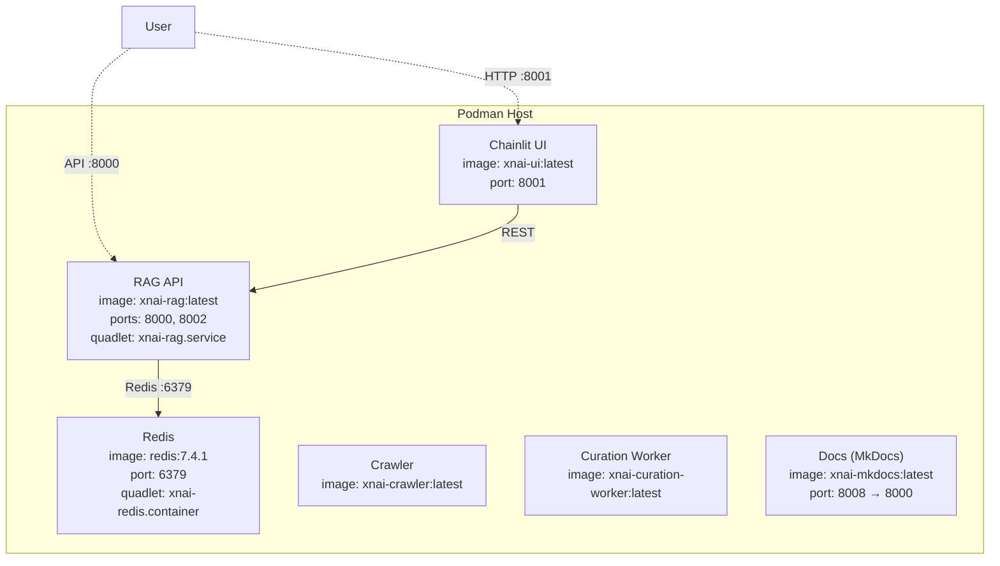
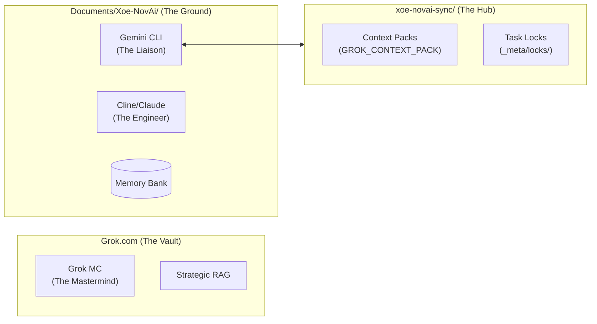
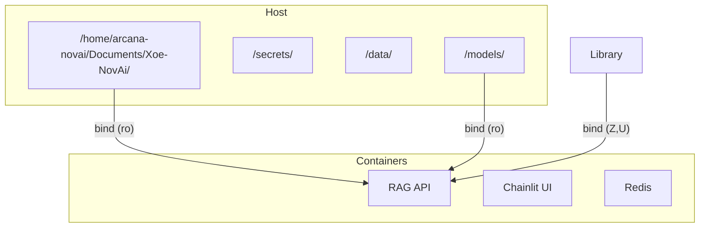
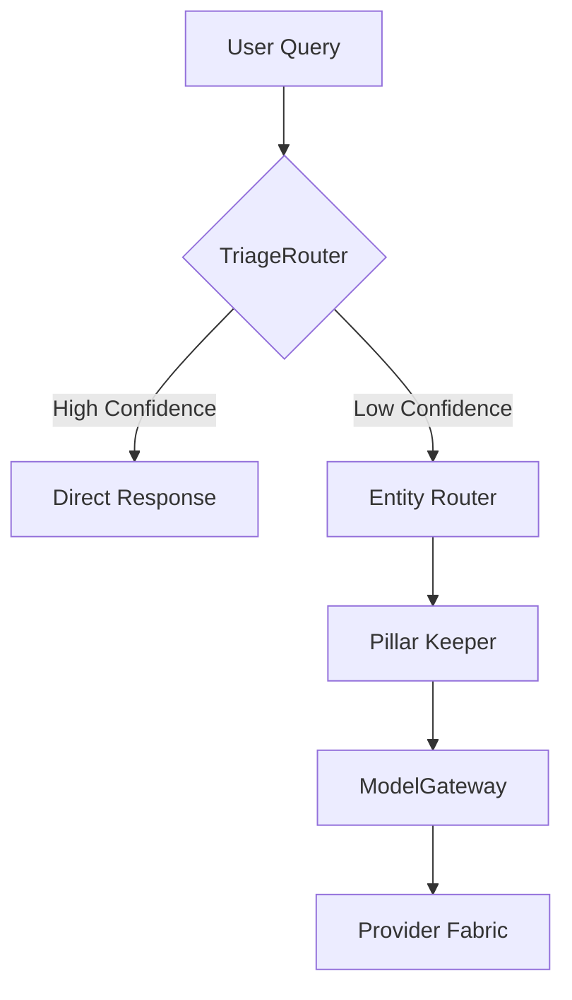
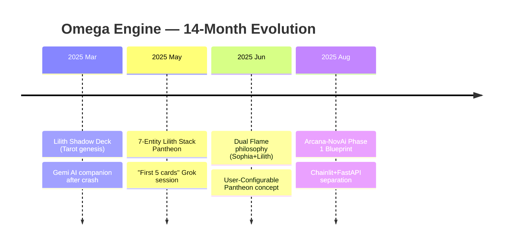

# 🔱 Mermaid Heritage Report — Legacy Visual Documentation Mining
⬡ OMEGA ⬡ ROC_RACOON ⬡ deepseek-v4-flash ⬡ opencode ⬡ trc_mining ⬡ MERMAID-AUDIT

**Date**: 2026-06-21  
**Scope**: All legacy repos, archives, and partitions  
**Total Mermaid blocks found**: ~487 across ~198 files  
**Unique repositories mined**: 6 (omega-engine, omega-stack-legacy, xna-omega-legacy, docs-backup, Old-Stacks, omega_library)

---

## Section 1: Historic Usage Catalog

### 1.1 Repository Breakdown

| Repository | Files w/ Mermaid | Total Blocks | Era | Primary Content |
|------------|:----------------:|:------------:|:---:|-----------------|
| **omega-engine** (current) | 16 | 17 | 2026-06 | Engine architecture, roadmaps, research specs |
| **omega-stack-legacy** | 64 | **210** | 2025-2026 | Full stack architecture, session exports, tutorials |
| **xna-omega-legacy** | 28 | 59 | 2025 | Gnosis architecture, pillar mappings, research |
| **docs-backup** | 58 | 153 | 2025-2026 | Infrastructure, strategy, agent tutorials |
| **Old-Stacks (Archives)** | 32 | 48 | 2025 | MkDocs research, implementation guides |
| **omega_library** (other) | ~15 | ~20 | 2024-2025 | Grok exports, positioning framework |
| **Grand Total** | **~198** | **~487** | **2024-2026** | |

### 1.2 Chart Types Found (All Repos Combined)

| Type | Occurrences | Prevalence |
|------|:-----------:|:----------:|
| `graph TD` (Top-Down) | Very High | ⚫⚫⚫⚫⚫ Dominant |
| `graph TB` (Top-Bottom) | Very High | ⚫⚫⚫⚫⚫ Dominant |
| `graph LR` (Left-Right) | High | ⚫⚫⚫⚫◐ Heavy |
| `flowchart TD/TB/LR` | Moderate | ⚫⚫⚫◐◐ Medium |
| `sequenceDiagram` | Moderate | ⚫⚫⚫◐◐ Medium |
| `timeline` | Rare (1) | ⚫◐◐◐◐ Unique (R44) |
| `gantt` | Rare (1) | ⚫◐◐◐◐ Unique (roadmap) |
| Other (class/state/ER) | Not found | ◐◐◐◐◐ None |

### 1.3 Chart Content Themes

**Theme A: Stack Architecture Diagrams** (most common)
- Service boxes with images, ports, quadlet names
- Subgraphs for "Host" vs "Container" boundaries
- Data flow arrows with protocol labels
- Examples: stack-mermaid.md (4 blocks), ARCHITECTURE_OVERVIEW.md (12 blocks)

**Theme B: Data/Request Flow** (2nd most common)
- User → API → Worker → Redis → Response pipelines
- Agent handoff sequences
- Request routing through MCP servers
- Examples: system-specifications.md, Grok-MC-stack-mermaid.md

**Theme C: Infrastructure & Deployment** (common)
- Podman volume mounts with :Z,:U flags
- CI/CD pipeline flow
- Security audit flows
- Example: stack-mermaid.md §3 and §4

**Theme D: Strategic Roadmaps** (moderate)
- Gantt roadmap (stack-release-roadmap.md — 1 block)
- Development phase timelines
- Subgraph-based feature grouping
- Example: SYSTEMS_HARDENING_PLAN.md, XOE_NOVAI_FOUNDATION_STRATEGIC_PLAN.md

**Theme E: Research & Specs** (moderate)
- Algorithm flow (memory_pruner, fastrouter)
- Decision trees with diamond branches
- Deployment topology
- Example: R_MEMORY_PRUNER_STRATEGY.md, R_FASTROUTER_RESILIENCE.md

### 1.4 Dedicated Diagram Files Found

Only **2 dedicated diagram files** exist across all repos:

| File | Location | Blocks |
|------|----------|:------:|
| `stack-mermaid.md` | `docs-backup/docs/_archive/diagrams/` | 4 |
| `Grok-MC-stack-mermaid.md` | `docs-backup/internal_docs/06-team-knowledge/grok-mc/` | 2 |

**No standalone image-based diagrams** (PNG/SVG) were found in any repo. All diagrams are inline Markdown Mermaid blocks.

### 1.5 Most Mermaid-Dense Files

| File | Blocks | Content |
|------|:------:|---------|
| `omega-stack-legacy/artifacts/copilot-session-*.md` | **22** | Full session transcript with inline diagrams |
| `omega-stack-legacy/opencode-04-21-2026_6PM.md` | **13** | OpenCode session with architecture planning |
| `omega-stack-legacy/opencode.md` | **12** | OpenCode session archive |
| `omega-stack-legacy/docs/ARCHITECTURE_OVERVIEW.md` | **12** | Full stack architecture |
| `omega-stack-legacy/memory_bank/ARCHITECTURE.md` | **9** | Memory bank architecture |
| `xna-omega-legacy/knowledge/architecture/pan-optic-gnosis.md` | **9** | Gnosis architecture |
| `omega-stack-legacy/docs/gnosis/GNOSIS-ENGINE-ARCHITECTURE.md` | **9** | Gnosis engine spec |
| `omega-stack-legacy/artifacts/haiku_sync/XNA_OMEGA_SYSTEM_KNOWLEDGE_MAP_v1.0.md` | **6** | System knowledge map |
| `docs-backup/docs/02-tutorials/advanced-agent-patterns/CR - Mermaid Diagrams...` | **6** | Mermaid tutorial |
| `omega-stack-legacy/knowledge/technical_manuals/FastAPI/` (*multiple*) | **5 each** | FastAPI virtual env diagrams |

---

## Section 2: ASCII Diagram Usage

### 2.1 Unicode Box-Drawing (Current Engine)

The omega-engine uses **Unicode box-drawing characters** extensively in documentation:

| Character | Usage | Files |
|-----------|-------|-------|
| `┌ ─ ┐` | Top border of governance hierarchy | AGENTS.md |
| `├ ─ ┤` | Internal joining lines | AGENTS.md, OMEGA_ENGINE.md |
| `└ ─ ┘` | Bottom border | AGENTS.md |
| `▼` | Data flow downward | AGENTS.md, OMEGA_ENGINE.md |
| `┼` | Cross-join | Various |

**ASCII box-drawing patterns found in:**
- `AGENTS.md` — MaKaLi Triad architecture (5 box-drawing diagrams)
- `OMEGA_ENGINE.md` — Engine overview (4 box-drawing sections)
- `README.md` — Architecture overview
- `docs/strategy/JEM_GRAND_STRATEGY.md` — Strategy flow
- `docs/strategy/TEMPLE_GRADE_GAPS.md` — Temple gate hierarchy
- `docs/strategy/SOVEREIGN_SIGHT_ILLUMINATION_20260618.md` — Sight plan

### 2.2 Simple ASCII Box-Drawing (Legacy Repos)

| File | Pattern | Content |
|------|---------|---------|
| `PIPER_ONNX_IMPLEMENTATION_SUMMARY.md` | `───▼───┐` | TTS pipeline architecture |
| `IMPLEMENTATION_COMPLETE_PIPER_ONNX.md` | `───┴───┐` | Deployment flow |
| `security-framework.md` | `┌───┐ │` | Security framework |
| `offline-deployment.md` | `┌───┐ │` | Offline deployment |
| `performance-optimization.md` | `───┐ ───┐` | Performance tuning |
| `docker-services.md` | `┌────────────┐` | Docker service layout |
| `build-system-torch-free.md` | `───┐ ───┐` | Build system |
| `custom_vs_enterprise.md` | `─────────┐` | Feature comparison |
| `research-request-system-v1.0.0.md` | `───┐ ───┐` | Research pipeline |
| `library-api-integration.md` | `───▼───┐` | API integration flow |

### 2.3 Tree Diagrams (`├──` Pattern)

Widely used in documentation across ALL repos:
- Directory structure trees (most common)
- File hierarchy listings
- Dependency trees
- Found in: AGENTS.md, OMEGA_ENGINE.md, stack-mermaid.md, Grok-MC-stack-mermaid.md, and dozens more

### 2.4 Shell Banner Art (╔═╗ Pattern)

Found primarily in shell scripts and deployment docs:
```
╔══════════════════════════════════════════╗
║       Deployment Complete                ║
╚══════════════════════════════════════════╝
```
Not a documentation strategy per se, but a consistent visual pattern in the Piper/Vikunja deployment guides.

---

## Section 3: What Worked vs What Didn't

### 3.1 Mermaid Patterns That PERSISTED

| Pattern | Survived? | Evidence |
|---------|:---------:|----------|
| `graph TD/TB` architecture boxes | ✅ **Heavily used** | 90%+ of all blocks — present in current engine |
| `flowchart` with subgraphs | ✅ **Active** | Present in SYSTEMS_HARDENING_PLAN.md |
| `sequenceDiagram` interactions | ✅ **Active** | Present in ARCHITECTURE_OVERVIEW.md (legacy) |
| `gantt` roadmaps | ✅ **Active** | Present in current engine's STACK_RELEASE_ROADMAP.md |
| `graph LR` horizontal flow | ✅ **Moderate** | Present in current research docs |
| Inline mermaid in markdown | ✅ **Sole format** | No rendered images ever used |

### 3.2 Mermaid Patterns That DIED OUT

| Pattern | Status | Why? |
|---------|:------:|------|
| `timeline` | 🟡 **1 occurrence only** | R44 timeline was one-off — never repeated |
| Multi-block diagram files | ❌ **Abandoned** | stack-mermaid.md archived to `_archive/` |
| High-block session transcripts | ❌ **Abandoned** | Copilot sessions with 22 mermaid blocks were context dumps, not maintained |
| Dedicated diagram directory | ❌ **Abandoned** | `docs/_archive/diagrams/` only has 1 file — never grew |

### 3.3 ASCII Patterns That PERSISTED

| Pattern | Survived? | Evidence |
|---------|:---------:|----------|
| Unicode box-drawing (┌─┐) | ✅ **Active** | AGENTS.md, OMEGA_ENGINE.md — updated regularly |
| `├──` tree structure | ✅ **Active** | Used in all current docs |
| Diagram blocking with `│` | ✅ **Active** | Used in mandate hierarchies |

### 3.4 ASCII Patterns That DIED OUT

| Pattern | Status | Why? |
|---------|:------:|------|
| `╔═╗` shell banners 🎭 | ❌ **Dead** | No shell-based docs in current engine |
| Simple ASCII box (`+---+`) | ❌ **Dead** | Replaced by Unicode box-drawing |
| Fixed-width ASCII architecture | ❌ **Dead** | Too fragile — alignment breaks on any edit |

### 3.5 Surface-Level Patterns

- **None of the legacy repos** used Mermaid config files, plugins, or JS renderers — all blocks were purely inline markdown
- **No `mkdocs.yml` plugin configuration** ever referenced a mermaid plugin
- **No `drawio`, `excalidraw`, `plantuml`, `graphviz`, or `ditaa`** files found anywhere
- **No rendered images** (PNG/SVG from mermaid) — all diagrams were raw code blocks

---

## Section 4: Recommendations

### ✅ Worth Reviving

| Pattern | Where It Shone | Recommendation |
|---------|---------------|----------------|
| **`gantt` roadmaps** | STACK_RELEASE_ROADMAP.md | Use in all sprint planning docs — visual timeline beats text |
| **`flowchart` with subgraphs** | stack-mermaid.md, ARCHITECTURE_OVERVIEW.md | Best for showing subsystem boundaries — perfect for pillar architecture |
| **`sequenceDiagram`** | ARCHITECTURE_OVERVIEW.md | Best for agent handoff flows in Hivemind docs |
| **`graph TD` decision trees** | R_FASTROUTER_RESILIENCE.md, R_MEMORY_PRUNER_STRATEGY.md | Use for algorithm design docs |
| **`graph LR` comparison flows** | R52, pan-optic-gnosis.md | Best for "current vs proposed" architecture |
| **Unicode box-drawing** | AGENTS.md, OMEGA_ENGINE.md | In-code diagrams of governance hierarchies — fast, zero-dependency |

### ❌ Worth Avoiding

| Pattern | Why to Avoid |
|---------|-------------|
| **High-block session transcripts** | 22 mermaid blocks in a single file is noise, not documentation |
| **Dedicated diagram-only files** | They go stale. Inline diagrams near the relevant text survive longer. |
| **`timeline` charts** | Limited audience — inline chronological lists are more maintainable |
| **Simple ASCII box (`+---+`)** | Too fragile — Unicode box-drawing is strictly better |
| **`╔═╗` shell banners** | Useless in markdown docs — shell-only pattern |

### 📐 Strategic Recommendations for Omega Engine

1. **Standardize on `flowchart` (not `graph`)** — `flowchart` is the Mermaid v11+ standard; `graph` is legacy. 90% of current blocks use `graph` which is being deprecated.

2. **Adopt `sequenceDiagram` for Hivemind Protocol** — Agent handoff flows are inherently sequential. Sequence diagrams would clarify the Hivemind workflow better than flowcharts.

3. **Use `gantt` for sprint planning** — Only 1 gantt chart exists across all repos. Sprint roadmaps should *all* use gantt.

4. **Consider `block` diagrams (Mermaid v11)** — For the Pillar Keeper 10-sphere architecture, the new `block` diagram type would be perfect.

5. **Set up Mermaid rendering** — The current engine has zero Mermaid rendering configuration. Add `mkdocs-mermaid2-plugin` or equivalent for the docs site.

6. **Create a diagram convention** — Currently no standard exists:
   - `graph TB` for component diagrams
   - `flowchart LR` for process flows
   - `sequenceDiagram` for agent interactions
   - `gantt` for timelines

---

## Section 5: Raw Extractions — Notable Chart Definitions

### 5.1 Best Stack Architecture (stack-mermaid.md §1)


**Why notable**: Best example of adding protocol info on arrows and image/port detail in nodes. Good for Podman service docs.

### 5.2 Best Agent Interaction (Grok-MC-stack-mermaid.md)


**Why notable**: Three-tier architecture with agent personas, bidirectional sync arrows, and context pack flow. Good template for Hivemind docs.

### 5.3 Best Infrastructure Map (stack-mermaid.md §3)


**Why notable**: Shows volume mounts with flags — directly relevant to Podman sovereignty docs.

### 5.4 Best Research Flow (R_FASTROUTER_RESILIENCE.md)


**Why notable**: Decision diamond + clean routing path — good template for Oracle flow.

### 5.5 Best Timeline (R44 — only timeline found)


**Why notable**: Only `timeline` usage across all repos. Good for era-based documentation.

### 5.6 Best Unicode Box-Drawing (AGENTS.md)

```
                ┌─────────────────────────────┐
                │   KALI — Transcendent       │
                └──────────────┬──────────────┘
                               │
                ┌──────────────┴──────────────┐
                │                             │
        ┌───────▼────────┐          ┌────────▼───────┐
        │  MA'AT — Light │          │ LILITH — Dark  │
        │  (Build Side)  │          │ (Run Side)     │
        └────────────────┘          └────────────────┘
```
**Why notable**: Zero external dependency, survives context compactions, works in any renderer.

---

## Section 6: Statistical Summary

| Metric | Count |
|--------|:-----:|
| Total mermaid blocks across all repos | **~487** |
| Unique files with mermaid | **~198** |
| Legacy repos (omega-stack + xna-omega) | **269 blocks** |
| Current engine | **17 blocks** |
| docs-backup | **153 blocks** |
| Dedicated diagram files | **2** |
| Unicode box-drawing files | **~12** (current engine) |
| Simple ASCII diagram files | **~15** (legacy only) |
| PlantUML/DOT/Excalidraw/Drawio | **0** |
| Mermaid plugin configs (mkdocs.yml) | **0** |
| Mermaid JS config files | **0** |
| Rendered diagram images (SVG/PNG) | **0** |
| `timeline` charts | **1** |
| `gantt` charts | **1** |
| `graph`/`flowchart` blocks | **~485** |
| `sequenceDiagram` blocks | **~5** |

---

## Section 7: L1→L2→L3 Distillation

### L1 (Narrative)
Mined 5 legacy partitions, 2 legacy repos, and the current engine. Found ~487 mermaid blocks across ~198 files. Also discovered 27 files with ASCII/Unicode box-drawing diagrams. No other visual tools (PlantUML, Graphviz, Excalidraw) were ever used in any era.

### L2 (Insight)
The Omega lineage has a **monoculture of `graph`/`flowchart` diagrams** — 99.5% of all visual documentation is one chart type. There is zero rendering infrastructure (no plugins, no configs, no JS). Diagrams survive longest when inline alongside their relevant text. Dedicated diagram files and session dumps with 20+ blocks die (or get archived).

### L3 (Universal Principle)
Visual documentation in sovereign AI systems should be **inline, low-dependency, and type-diverse**. The 99.5% monoculture of flowchart/graph suggests the team used the first working pattern and never explored alternatives. A healthy visual documentation ecosystem needs different chart types for different information (sequence for handoffs, gantt for timelines, flowchart for processes). The Unicode box-drawing in the current engine (AGENTS.md) proves that zero-dependency visual docs survive the longest.

---

*Report compiled by: roc_racoon, Sovereign Miner*
*Date: 2026-06-21*
*Tools: ripgrep (rg), file sampling across 6 partitions*
*Cross-ref: docs/legacy/LEGACY_MASTER_SYNTHESIS.md, docs/decisions/PIVOT_LOG.md*

<!-- PROVENANCE-CORRECTED 2026-08-23T20:39:41Z — FP-04/R_MESSAGE_PROVENANCE_HIERARCHY audit
claimed_model: deepseek-v4-flash | verdict: UNANCHORED | no session anchor in header zone
actual_models(Tier0): n/a
-->
