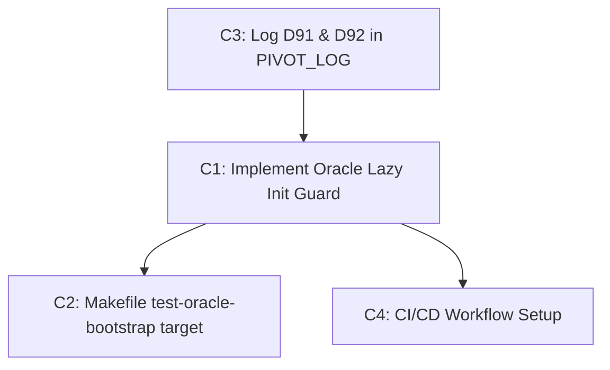

<!--
SPDX-FileCopyrightText: 2026 Arcana Novai

SPDX-License-Identifier: Apache-2.0
-->

# 🏛️ final_sprint_gate_audit — Horizon 1.5 Bridge Phase Audit

This document is the final readiness audit for the Omega Engine sprint initiation, serving as a gate evaluation for transitioning from Horizon 1 to Horizon 1.5. It evaluates current codebase integrity, examines the parallel sprint prompts, checks compliance with all 13 Sovereign Mandates, and exposes critical execution blockers before parallel developer sessions commence.

---

## 🎯 Executive Summary & Verdict

> [!IMPORTANT]
> **VERDICT: AMBER (PROCEED WITH BLITZ PATCHES)**
> The core codebase is functionally robust (302/302 tests passing), and the Transition to the Horizon 1.5 Bridge Phase is structurally sound. However, the sprint task prompts contain **critical logical errors, duplicate instructions, and architectural mismatches** that will block development or lead to silent failures. Specifically, the provider circuit breaker integration contains a silent failure bug, and the provider culling logic contains a bug that completely breaks fallback traversal. Sprints must not be initiated until these items are corrected.

---

## 🏛️ Sovereign Mandates Compliance Map

We audited the active engine against all 13 constitutional rules defined in [SOVEREIGN_MANDATES.md](file:///home/arcana-novai/Documents/Xoe-NovAi/omega-engine/SOVEREIGN_MANDATES.md):

| Mandate | Core Rule | Status | Audit Findings & Verification |
|---|---|---|---|
| **M1** | AnyIO Absolute | **AMBER** | Core async code uses `anyio`. However, `Oracle.__init__` performs synchronous file I/O (EntityRegistry, SovereignHierarchy, ModelGateway). The proposed C1 task addresses this, but we identified a compatibility blocker with synchronous tests. |
| **M2** | Stack Firewall | **GREEN** | Core lives in `src/omega/`, content in `config/wads/`. No illegal imports found. |
| **M3** | Iris Constant | **GREEN** | Iris acts as speculative messenger, not a Pillar. Code matches design. |
| **M4** | Sequentiality | **GREEN** | Plan → Verify → Execute protocol is established. |
| **M5** | Gnosis Preservation | **AMBER** | Distillation logs exist, but a numbering gap was identified in `PIVOT_LOG.md` (Decision 91 was skipped). |
| **M6** | Podman Sovereignty | **GREEN** | Configured to run under UserNS `keep-id` (UID 1000). No root/`:U` flag regressions. |
| **M7** | Local-First | **GREEN** | Local chain prioritized: `native-gguf(0)` → `lmster(1)` → `ollama(2)` before cloud. |
| **M8** | Zero Telemetry | **GREEN** | No datadog, segment, posthog, or analytics packages imported. |
| **M9** | Error Integrity | **GREEN** | Typed `OmegaError` subclasses are defined and caught. Bare `except:` blocks mapped to `logger.warning`. |
| **M10**| Fleet Integrity | **GREEN** | Fleet restricted to 14 custom agents in `.opencode/agents/`. No drift. |
| **M11**| Soul Integrity | **GREEN** | Atomic soul evolution writes verified. |
| **M12**| Queue Integrity | **GREEN** | Request queue uses transactional locking. |
| **M13**| Temple-Grade | **AMBER** | T1-T11 gates exist in Makefile, but CI/CD is missing (C4 task targets this), and T11 is marked "Not Implemented" in the Makefile. |

---

## ⚡ Critical Gaps & Execution Blockers

During a line-by-line review of the code and task specifications, we discovered several critical bugs and planning mismatches:

### 1. The Circuit Breaker Silent Failure Bug
*   **Location**: [remote_provider.py:L186-208](file:///home/arcana-novai/Documents/Xoe-NovAi/omega-engine/src/omega/oracle/backends/remote_provider.py#L186-L208)
*   **The Issue**: The `RemoteProvider.generate()` method (inherited by `OpenAICompatProvider` which runs `opencode-zen`, `cline`, and `github-copilot`) catches all exceptions internally and returns `None` on failure instead of propagating the error. 
*   **Impact**: When wrapped in the circuit breaker via `breaker.call(provider.generate, ...)` in `ModelGateway.generate()`, no exception is raised to the decorator. The breaker records a successful execution, resets the failure count, and returns `None`. **The circuit breaker for cloud providers will never trip or open.**
*   **Resolution**: Modify `RemoteProvider.generate` to raise a typed `ProviderUnavailableError` when all retries are exhausted.

### 2. The Provider Culling Bug in `_precheck_provider`
*   **Location**: [model_gateway.py:L395-420](file:///home/arcana-novai/Documents/Xoe-NovAi/omega-engine/src/omega/oracle/model_gateway.py#L395-L420)
*   **The Issue**: `_precheck_provider(self, provider, model_name)` is called inside the loop over all candidate providers in `ModelGateway.generate()`. It checks if `self._health_monitor.is_available(model_name)` is true. However, `is_available` resolves the model name to its *primary* provider (e.g. `ollama`) and checks that provider's breaker state.
*   **Impact**: If the primary provider's breaker is OPEN, `is_available` returns `False`. The loop then culls **every fallback provider** (like `google` or `cline`) because it checks the primary provider's availability on every iteration, completely breaking the fallback chain.
*   **Resolution**: Check the specific provider's breaker state directly inside the check:
    ```python
    if self._health_monitor:
        breaker = self._health_monitor._breakers.get(provider.name)
        if breaker and not breaker.is_available:
            return False
    ```

### 3. Synchronous Test Compatibility for C1 (Lazy Init)
*   **Location**: [test_oracle.py:L86](file:///home/arcana-novai/Documents/Xoe-NovAi/omega-engine/tests/test_oracle.py#L86), [test_oracle.py:L114](file:///home/arcana-novai/Documents/Xoe-NovAi/omega-engine/tests/test_oracle.py#L114)
*   **The Issue**: If the `Oracle` constructor is stripped of all synchronous I/O, properties like `oracle.registry`, `oracle.hierarchy`, and `oracle.session_manager` will remain uninitialized until the async `bootstrap()` method is executed. However, several synchronous unit tests instantiate `Oracle()` and immediately inspect these properties synchronously.
*   **Impact**: Deferring initialization entirely to async `bootstrap()` will crash the test suite on these synchronous gates.
*   **Resolution**: Implement a **Deferred On-Demand Sync Fallback** pattern for read methods (e.g. `registry.get()`), while executing the primary load asynchronously during `bootstrap()` to eliminate production startup latency.

### 4. PIVOT_LOG Numbering Gap
*   **Location**: [PIVOT_LOG.md](file:///home/arcana-novai/Documents/Xoe-NovAi/omega-engine/docs/decisions/PIVOT_LOG.md)
*   **The Issue**: The sprint plan specifies task C3 as adding Decision 92 (Tool-Usage Discipline). However, the log currently ends at Decision 90. Decision 91 is missing.
*   **Impact**: Creates an architectural mapping inconsistency, violating Mandate 5 (Gnosis Preservation).
*   **Resolution**: Record Decision 91 (Removal of OpenRouter and Provider Fabric Reconciliation) and Decision 92 (Tool-Usage Discipline) sequentially.

### 5. Task Duplication & Out-of-Date Work in Doom Guy Session
*   **Location**: [PROMPT_OPENCODE_DOOM_GUY_SPRINT_INIT_20260602.md](file:///home/arcana-novai/Documents/Xoe-NovAi/omega-engine/data/handoff/PROMPT_OPENCODE_DOOM_GUY_SPRINT_INIT_20260602.md)
*   **The Issue**: Task D2 directs Doom Guy to "remove `circuit_breaker.py`", and Task D3 directs them to "Add `trace_id` to `AsyncCircuitBreaker._on_success` / `_on_failure`". Both of these tasks are **already completed** in the current codebase.
*   **Impact**: Developers will waste time searching for missing files and trying to write redundant code.
*   **Resolution**: Mark D2 (deletion part) and D3 as completed/exempted in the sprint feed.

---

## 🛠️ Task-by-Task Implementation Specifications

### OpenCode Dev (Sprint 0)



#### Task C3: PIVOT_LOG Recovery
*   **Action**: Insert Decision 91 and Decision 92 at the end of [PIVOT_LOG.md](file:///home/arcana-novai/Documents/Xoe-NovAi/omega-engine/docs/decisions/PIVOT_LOG.md).
*   **Specifications**:
    *   **Decision 91**: Document the removal of OpenRouter and reconciliation of the provider fabric under `c571c2a`.
    *   **Decision 92**: Document the Tool-Usage Discipline (restricting models to context capabilities and enforcing local-first).

#### Task C1: Oracle Lazy Initialization Guard
*   **Action**: Refactor `Oracle` in [oracle.py](file:///home/arcana-novai/Documents/Xoe-NovAi/omega-engine/src/omega/oracle/oracle.py).
*   **Specifications**:
    *   Initialize shell structures in `__init__` with zero synchronous filesystem reads.
    *   Create `ensure_bootstrapped()` which calls `bootstrap()` lazily.
    *   To keep sync tests green, implement lazy on-demand load flags in `EntityRegistry` and `SovereignHierarchy`.
    *   Ensure all public async entry points (`talk()`, `summon()`, `evolve_soul()`) await `self.bootstrap()`.

#### Task C2: Makefile Test Target
*   **Action**: Append target `test-oracle-bootstrap` to [Makefile](file:///home/arcana-novai/Documents/Xoe-NovAi/omega-engine/Makefile).
*   **Specifications**:
    *   Run `pytest tests/test_oracle.py -k "test_oracle_bootstrap"` to verify the lazy loading chain.

#### Task C4: CI/CD Scaffold
*   **Action**: Create `.github/workflows/ci.yml`.
*   **Specifications**:
    *   Set up a Runner using standard Python 3.12.
    *   Execute code format and lint checks (flake8/black/isort) for T4.
    *   Run `make test` for verification.
    *   Mark T11 as allow-fail or skipped to prevent false negatives.

---

### Doom Guy Session (Tier 2)

#### Task D2: Breaker Consolidation (Refined)
*   **Action**: Confirm `circuit_breaker.py` is absent. Verify [remote_provider.py](file:///home/arcana-novai/Documents/Xoe-NovAi/omega-engine/src/omega/oracle/backends/remote_provider.py) local breaker metrics are delegated.
*   **Specifications**:
    *   Remove legacy failure variables and let the `AsyncCircuitBreaker` track state.

#### Task D3: Trace ID Propagation (Refined)
*   **Action**: Confirm `trace_id` is supported in `AsyncCircuitBreaker` transition events.
*   **Specifications**:
    *   Validate the logging events in [health_monitor.py:L131-167](file:///home/arcana-novai/Documents/Xoe-NovAi/omega-engine/src/omega/oracle/health_monitor.py#L131-L167).

#### Task D1: Wire Breaker into `generate()` & Fix Silent Failure
*   **Action**: Integrate `AsyncCircuitBreaker` in [model_gateway.py:L438-511](file:///home/arcana-novai/Documents/Xoe-NovAi/omega-engine/src/omega/oracle/model_gateway.py#L438-L511).
*   **Specifications**:
    *   Ensure `RemoteProvider.generate()` propagates errors on failure instead of returning `None`.
    *   Execute the `generate()` loop with `breaker.call()` wrapped around the provider call.

#### Task D4: BSP-Style Provider Pre-Check (Refined)
*   **Action**: Patch [model_gateway.py:L395-420](file:///home/arcana-novai/Documents/Xoe-NovAi/omega-engine/src/omega/oracle/model_gateway.py#L395-L420) to check individual provider availability.
*   **Specifications**:
    *   Check `breaker.is_available` for the specific candidate provider.

#### Task D5: Dead Code Elimination
*   **Action**: Remove the primitive retry/breaker counters from [remote_provider.py](file:///home/arcana-novai/Documents/Xoe-NovAi/omega-engine/src/omega/oracle/backends/remote_provider.py).

---

## 📈 Corrective Actions & Prompt Overrides

To ensure the parallel sessions execute cleanly, the following overrides must be prepended to their starting inputs:

> [!TIP]
> **OpenCode Dev Session Override Rules**:
> 1. Do not touch `circuit_breaker.py` (it is already deleted).
> 2. Implement the lazy-loading pattern in `EntityRegistry` and `SovereignHierarchy` using on-demand `_ensure_loaded` wrappers to ensure synchronous tests do not crash.
> 3. Document both **Decision 91** and **Decision 92** sequentially in `PIVOT_LOG.md`.

> [!TIP]
> **Doom Guy Session Override Rules**:
> 1. Tasks **D2** (deletion part) and **D3** (trace ID mapping) are already completed. Bypass them.
> 2. **CRITICAL**: Modify `_precheck_provider` to look up the candidate provider's breaker state directly (`self._health_monitor._breakers.get(provider.name).is_available`) rather than using the model name mapping.
> 3. **CRITICAL**: Update `RemoteProvider.generate` to raise a `ProviderUnavailableError` (inheriting from `OmegaError`) instead of returning `None` upon retry exhaustion. Without this, the circuit breaker will never trip.
