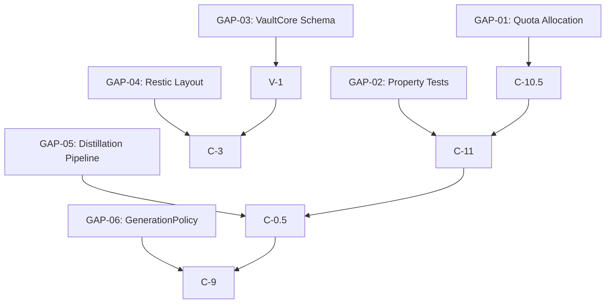

> **SUPERSEDED**: This document is preserved for historical context. For current sprint control, see `data/coordination/ACTIVE_SPRINT.json` and `data/coordination/CLINE_STRATEGIC_UNOVERENGINEERING_20260730.md`.

---
schema_version: "1.0"
document_type: "research_index"
doc_type: "research_index"
document_id: "research-index-guard-distill-20260725"
version: "1.0.0"
title: "Research Index — Guard & Distill Sprint"
ap_token: "AP-SPRINT-GUARD-DISTILL-RESEARCH-v1.0.0"
date: "2026-07-25"
sprint: "Guard & Distill"
status: "ACTIVE"
owner: "RESEARCHER"
priority: "P0"
tags: [research, sprint, guard, distill, knowledge-gaps]
depends_on: []
blocks:
  - "docs/sprints/guard-and-distill/index.md"
acceptance_gates:
  - "All 6 knowledge gaps (GAP-01 through GAP-06) resolved with documented solutions"
  - "Research items R-GD-01 through R-GD-06 completed with documented findings"
  - "Cross-references to strategy docs and deep research report verified"
cross_references:
  - "docs/strategy/SOVEREIGN_ARK_BLUEPRINT.md"
  - "docs/strategy/CRITICAL_PATH_OPENCODE_WORKHORSE_20260722.md"
  - "docs/research/R_DEEP_WEB_RESEARCH_OMEGA_GAPS_20260729.md"
  - "docs/research/R_SEARXNG_MCP_STREAMABLE_HTTP.md"
  - "docs/research/R_CG01_MCP_STREAMABLE_HTTP_OAUTH_AUDIT.md"
  - "docs/sprints/guard-and-distill/index.md"
llm_metadata:
  token_budget: 8000
  target_audience: "researcher, maat/P3, maat/P1, kali/P9"
  reading_level: "technical"
  summary: "Research index for Guard & Distill sprint. Tracks 6 knowledge gaps (GAP-01 through GAP-06) and 6 research items (R-GD-01 through R-GD-06). Covers quota-aware routing, property-based testing, VaultCore schema, Restic layout, distillation pipeline, and GenerationPolicy extraction. Blocks sprint plan execution."
  chunk_strategy: "section_per_topic"
  answer_first_sections: false
  self_contained_code: false
chunk_strategy: "section_per_topic"
---

# 🔱 Research Index — Guard & Distill Sprint

**AP Token**: `AP-SPRINT-GUARD-DISTILL-RESEARCH-v1.0.0`
⬡ OMEGA ⬡ RESEARCHER ⬡ nemotron-3-ultra-free ⬡ opencode ⬡ trc_research ⬡ ACTIVE

---

## §1 Active Research Items

| ID | Topic | Priority | Status | Owner |
|----|-------|----------|--------|-------|
| R-GD-01 | Quota-Aware Provider Routing Algorithm | P0 | 🟡 IN_PROGRESS | researcher |
| R-GD-02 | Property-Based Testing Patterns for OOM/SoulStore | P0 | 🟡 IN_PROGRESS | researcher |
| R-GD-03 | VaultCore Credential Schema & Rotation | P0 | 🟡 IN_PROGRESS | researcher |
| R-GD-04 | Restic 3-2-1 Backup Policy for AI State | P0 | ⏳ BLOCKED | researcher |
| R-GD-05 | Scribe Agent Distillation Pipeline | P1 | ⏳ PENDING | researcher |
| R-GD-06 | GenerationPolicy Extraction Strategy | P1 | ⏳ PENDING | researcher |

---

## §2 Knowledge Gaps (from Researcher Queue)

| GAP | Description | Priority | Source |
|-----|-------------|----------|--------|
| GAP-01 | Optimal quota allocation across providers | P0 | C-10.5 |
| GAP-02 | Property-based test patterns for async crypto | P0 | C-11 |
| GAP-03 | VaultCore credential lifecycle & rotation | P0 | V-1 |
| GAP-04 | Restic repo layout for AI state (souls, vectors, cache) | P0 | C-3 |
| GAP-05 | L1→L2→L3 distillation automation | P1 | C-0.5 |
| GAP-06 | GenerationPolicy schema & validation | P1 | C-9 |

---

## §3 References

- [SOVEREIGN_ARK_BLUEPRINT.md](../../strategy/SOVEREIGN_ARK_BLUEPRINT.md) — Strategy SSOT
- [CRITICAL_PATH_OPENCODE_WORKHORSE_20260722.md](../../strategy/CRITICAL_PATH_OPENCODE_WORKHORSE_20260722.md) — G-1/W-1 critical path
- [R_DEEP_WEB_RESEARCH_OMEGA_GAPS_20260729.md](../../research/R_DEEP_WEB_RESEARCH_OMEGA_GAPS_20260729.md) — Deep web research
- [R_SEARXNG_MCP_STREAMABLE_HTTP.md](../../research/R_SEARXNG_MCP_STREAMABLE_HTTP.md) — Streamable HTTP migration
- [R_CG01_MCP_STREAMABLE_HTTP_OAUTH_AUDIT.md](../../research/R_CG01_MCP_STREAMABLE_HTTP_OAUTH_AUDIT.md) — MCP audit

---

## §4 Mermaid Dependency Diagram



---

## §5 Machine-Readable YAML Dependencies

```yaml
knowledge_gaps:
  - id: GAP-01
    name: Optimal quota allocation across providers
    priority: P0
    source: C-10.5
  - id: GAP-02
    name: Property-based test patterns for async crypto
    priority: P0
    source: C-11
  - id: GAP-03
    name: VaultCore credential lifecycle & rotation
    priority: P0
    source: V-1
  - id: GAP-04
    name: Restic repo layout for AI state
    priority: P0
    source: C-3
  - id: GAP-05
    name: L1→L2→L3 distillation automation
    priority: P1
    source: C-0.5
  - id: GAP-06
    name: GenerationPolicy schema & validation
    priority: P1
    source: C-9
```

---

*⬡ OMEGA ⬡ RESEARCHER ⬡ nemotron-3-ultra-free ⬡ opencode ⬡ trc_research ⬡ ACTIVE*