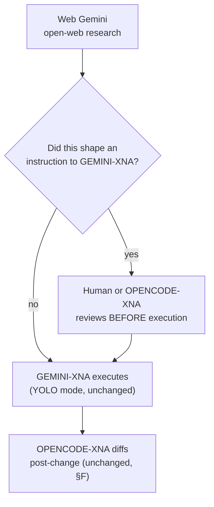

# Omega Engine — Provider Fabric Refactor Manual v3 (Consolidated)

## 0. Precedence and purpose

This document **supersedes v2, v1, and `OMEGA_INFERENCE_HARDENING_ADDENDUM_v1.md`** for execution purposes. v3 = v2 plus a second research pass: three new findings (M, N, O) and three items upgraded from reasoned-but-unverified to source-confirmed (G, H, B5). Original finding IDs (A1, B1, G, I.1, etc.) are preserved unchanged for traceability — only presentation order and the marked items' confidence level changed. Superseded documents should not be independently patched going forward; file corrections here.

**Do not treat v1 or the addendum as independently authoritative once this document exists.** Two documents disagreeing about the same fact was the root cause of B6 and B7 (four disagreeing core-count lists; a hardcoded RAM constant nobody reconciled with reality). Maintaining three overlapping refactor documents would recreate that exact failure class at the documentation layer. If a conflict is ever found between this document and v1/the addendum, this document wins; file a correction here, don't patch the others.

- **Target hardware**: AMD Ryzen 7 5700U (Zen 2, 8C/16T, single-CCX monolithic die, 8MB shared L3, AVX2/FMA3/F16C, no AVX-512) · Vega 8 iGPU, gfx90c, GCN 5, no dedicated VRAM · 16GB RAM total, shared with iGPU.
- **Audience**: GEMINI-XNA (executor, autonomous/"YOLO mode"), OPENCODE-XNA (auditor, independent post-change diff).
- **Author**: Claude (this session) — architectural consolidation across two research passes, not yet AP-token-sealed.
- **Verification standard**: unchanged from v1 §F, extended by §K below. Nothing in this document has been applied or benchmarked. Every hardware number is a starting point. `[MEASURE]` = needs an on-machine result before treating as final. `[DECISION]` = needs a human/Archon call, not just a code change — GEMINI-XNA must not resolve these autonomously. `[GAP]` = content this session could not fully verify; do not treat as complete. New in v3: `[SOURCE-CONFIRMED]` = checked directly against an authoritative external source this pass (not architectural reasoning alone) — see the item for the citation.

**Known content gap** (unchanged from v2, still open): v1's §B3 fix text and the complete §B4 finding were in a section of the source file this session only partially loaded before the file became unavailable. §B3's fix is reconstructed below with high confidence from the two conflicting maps that *were* fully captured. §B4 is included only as verified fragments, explicitly marked `[GAP]`. Re-supply v1 lines 181–212 to close this before Phase 1 executes B4 — this pass's research could not close it; it's specific to your codebase, not externally researchable.

**What this pass changed**: §G's Wave32/GCN claim is now source-confirmed rather than reasoned (§7.1). §B5 gained a real-world caution about the exact mechanism it recommends (§9.3). §H gained a driver-support check specific to this chip's generation (§6.4). Three new items: §M (service-level memory footprint — Qdrant/Postgres/Redis), §N (GraphRAG indexing resource contention), §O (inference worker process isolation).

---

## 1. Cross-cutting principles (apply to every item below)

### 1.1 — The "Scaffolded but Unwired" pattern (v1 §C)

Confirmed five times independently in this codebase: `hierarchy.yaml` (dead), `StreamHandler` (A5), speculative decoding (B5), batch-size recommendations (B8), possibly `config/model_registry/providers/*.yaml` (B2). Each instance is well-written, documented, and passes static review — the defect only surfaces when tracing a real request from `Oracle.talk()` to the actual `llama_cpp.Llama()` call and asking whether a given config value or tracked metric changes behavior at that call site. Treat this as a standing question for every item below, not just the five confirmed instances: **does this fix's config/tracking layer actually reach a real call site, or does it just look like it does?**

Structural fixes in flight for this pattern: a CI grep-check (Phase 3) and a runtime canary counter (Phase 9, §J) — the CI check catches it at review time, the canary catches it continuously between reviews. Neither replaces tracing the call chain by hand for any new work.

### 1.2 — Mandate quick-reference (code-relevant subset; cite by number elsewhere, this table exists so agents don't need to pull the full `SOVEREIGN_MANDATES.md` for routine work)

| ID | Name | Rule |
|---|---|---|
| M1 | AnyIO Absolute | No bare `asyncio`. Use `anyio.fail_after()`, `anyio.create_memory_object_stream()`, `anyio.to_thread.run_sync()` — not `anyio.wait_for()` or `anyio.Queue()` (neither exists). |
| M2 | Engine-Stack Firewall | No stack-specific logic in `src/omega/` core. |
| M7 | Local-First | Provider fabric tries local before cloud, always. |
| M8 | Zero Telemetry | No external analytics/phone-home. Local observability under `data/` is fine. |
| M9 | Error Integrity | No bare `except:`; typed `OmegaError` subtypes at API boundaries. |
| M14 | Heritage Vetting | `[id-soft:]` tags require a vet record in `HERITAGE_VET_LOG.md`. |
| M18 | Token Efficiency | Explicit boundary against compressing away precision or edge cases. |
| M19 | Adversarial Alchemy (partial — sane-boundary clause only, per v1 §D.4) | Don't manufacture sophistication where a simpler fix is sufficient. |
| M20 | (referenced in v1 A2 re: `SomaticState` save/load; full text not available to this session) | `[GAP]` |
| M21 | Gate Integrity | Contract tests must check `isinstance(result, ExpectedType)`, not just mocked-return shape. |
| M23 | Failure Integrity | No soft-failure synthesis when a mandatory tool is broken; report `[TOOL-CHAIN-COLLAPSE]`. |
| M24 | Venv Sovereignty | Never `--break-system-packages`. |
| M25 | Streaming Resilience | Chunk-level timeout with heartbeat, not hard-fail on stall. |

### 1.3 — Self-modification rule (new)

Any item that changes GEMINI-XNA's own execution sandbox, network egress, or the conditions under which it acts without prior review (see Phase 8, §I.3) is `[DECISION]` by definition, regardless of how it's otherwise scored. An autonomous executor should not be the one deciding to loosen or reconfigure its own guardrails, even when the change is well-intentioned and even when GEMINI-XNA itself would apply it correctly — the risk isn't execution competence, it's that self-modification of one's own safety boundary is exactly the blind spot an attacker-shaped instruction would try to exploit. This rule overrides normal severity-based autonomy for any item touching §I.3.

---

## 2. Manifest

| ID | Title | Severity | Type | Phase | Depends on | `[DECISION]` |
|---|---|---|---|---|---|---|
| A1 | `QuotaStatus` duplicate class | IMMEDIATE | correctness | 1 | — | No |
| A2 | `SomaticState` save/load `NameError` | IMMEDIATE | correctness | 1 | — | No |
| A3 | `resource_guard.lock()` wraps cloud providers | CRITICAL | concurrency | 2 | folded into B1 | No |
| A4 | `record_breaker_success()` no-op stub | HIGH | correctness | 1 | — | No |
| A5 | `StreamHandler` built, never called | HIGH | dead-wiring | 3 | — | Yes (wire vs. delete) |
| A6 | Breaker undercounts failures | HIGH | correctness | 1 | — | No |
| A-hyg | Hygiene batch (dup imports, dead `elif`, orphaned `check()`) | LOW | correctness | 1 | — | No |
| B1 | Two non-unified `Semaphore(1)` gates | CRITICAL | concurrency | 2 | Phase 1 | No |
| O | Inference worker process isolation | — | reliability | 2 | — | No (default recommendation); Yes if changing worker execution model |
| B2 | Likely-dead `config/model_registry/providers/*.yaml` | CRITICAL | config-integrity | 3 | — | Yes (wire vs. delete) |
| B3 | Wrong ggml KV-cache type integers | CRITICAL | correctness | 1 | — | No |
| B4 | q8_0 KV-cache crash conditions | `[GAP]` | correctness | 1 | B3 | `[GAP]` |
| B5 | Speculative decoding scaffolded, unwired | HIGH | dead-wiring | 7 | Phase 1, 4 | Yes (mechanism choice) |
| B6 | CPU topology modeled inconsistently | HIGH | hardware-tuning | 4 | — | No |
| B7 | `RAM_TOTAL_MB` hardcoded to 14GB | MEDIUM | hardware-tuning | 4 | — | No |
| B8 | Batch-size recommendations never applied | MEDIUM | dead-wiring | 6 | Phase 4 | No |
| B9 | No Vulkan/iGPU offload path | MEDIUM | hardware-tuning | 7 | Phase 4, §G | Data-informed |
| G | Vulkan build-commit check (dated finding, extends B9) | — | hardware-tuning | 7 (prerequisite) | — | No |
| H | Thermal/power sustained-load measurement | — | hardware-tuning | 4 | D.1 | No |
| I.1 | IA2 replay resistance | — | security | 8 | — | No (unless envelope format changes downstream consumers) |
| I.2 | Podman rootless hardening checklist | — | security | 8 | — | No |
| I.3 | Executor/auditor pre-execution gate for web-sourced instructions | — | security | 8 | — | **Yes — see §1.3** |
| I.4 | Secrets location + telemetry dependency audit | — | security | 8 | — | No |
| J | Runtime "scaffolded but unwired" canary | — | observability | 3 (with CI check) | §C CI check | No |
| K | Property-based + chaos testing extensions | — | testing | 9 | relevant phase's fix | No |
| L | Backup/DR, model rollback, cold-start warmup | — | operational | 10 | — | No |
| D.1 | Hardware profile detection script | — | hardware-tuning | 4 | — | No |
| D.2 | Thread strategy (decode/prefill split) | — | hardware-tuning | 6 | Phase 4 | No |
| D.3 | Per-model KV-cache allow-list | — | hardware-tuning | 5 | B3, B4 | No |
| D.5 | Real RAM budget table | — | hardware-tuning | 5 | — | No |
| M | Service-level memory footprint (Qdrant/Postgres/Redis) | — | hardware-tuning | 5 | D.5 | No |
| N | GraphRAG indexing resource contention | — | concurrency/hardware-tuning | 5 | B1, D.5 | Data-informed (LazyGraphRAG migration is a bigger call) |

---

## 3. Phase 1 — Correctness (no behavior change to tuning)

No dependencies. Do this first; hardware-tuning work later is blocked on KV-cache values being correct, not just measured.

### A1 — `QuotaStatus` duplicate class
**Severity**: IMMEDIATE · **File**: `health_monitor.py`
**Symptom**: `has_quota()` raises `AttributeError` the first time it's called on a populated entry.
**Root cause**: `QuotaStatus` is defined twice. The second definition (`daily_limit`, `used_today`, `reset_date`) silently shadows the first (`requests_remaining`, `tokens_remaining`, `requests_limit`, `tokens_limit`). Every runtime instance has the second shape; `has_quota()` reads fields from the first, dead shape.
**Fix**: rename to two distinct classes (`TokenQuotaStatus`, `DailyQuotaStatus`), decide which shape `HealthMonitor._quotas` actually stores, rewrite `has_quota()` against that shape.
**Verification**: construct a populated `QuotaStatus`-equivalent, call `has_quota()`, confirm no `AttributeError`. Add a regression test — this bug had none.

### A2 — `SomaticState` save/load `NameError`
**Severity**: IMMEDIATE · **File**: `providers.py`, `NativeGGUFProvider._ensure_loaded()._worker()`
**Symptom**: `SAVE_STATE`/`LOAD_STATE` command handlers raise `NameError` on first use. `ModelGateway.save_state()`/`load_state()` (M20) is non-functional.
**Root cause**: `_worker()` imports only `from llama_cpp import Llama`, then references the bare `llama_cpp` module name (`llama_cpp.llama_copy_state_data(...)`, `llama_cpp.llama_set_state_data(...)`), which was never bound.
**Fix**: `import llama_cpp` at module scope inside `_worker`, or call the correct static accessor for the pinned `llama-cpp-python` version. **Verify against that version's actual bindings before merging** — don't assume the free-function form is current.
**Verification**: exercise save-then-load round-trip against a running model; confirm state is actually restored, not just that no exception fires.

### A4 — `record_breaker_success()` no-op stub
**Severity**: HIGH · **File**: circuit breaker module
**Symptom**: success events are silently dropped.
**Root cause**:
```python
def record_breaker_success(self, name: str, trace_id: Optional[str] = None):
    if name in self._breakers:
        import anyio
        breaker = self._breakers[name]
        # ...comment explaining what it should do...
        pass
```
Its sibling `record_breaker_failure()` does fire (`anyio.from_thread.run(breaker._on_failure, trace_id)`), but only works when invoked from a worker thread spawned via `anyio.to_thread.run_sync` — called from the event-loop thread directly it raises `RuntimeError`.
**Fix**: implement `record_breaker_success` (needs a latency value — nominal `0.0` is better than nothing) or delete both convenience methods and force callers through `breaker.call()` / `breaker._on_success()` directly.
**Verification**: audit every call site of both methods for which thread context they run in before trusting either; add a test that would have caught the `RuntimeError` path.

### A6 — Breaker undercounts failures outside a narrow exception tuple
**Severity**: HIGH · **File**: circuit breaker call wrapper
**Symptom**: a bare `ValueError`/`KeyError`/`TypeError` from a malformed provider response bypasses breaker accounting entirely — the inverse of M9's silent-swallowing concern: a silent *undercount*.
**Root cause**:
```python
except (OmegaError, RuntimeError, OSError) as e:
    if self._is_circuit_breaking_error(e):
        await self._on_failure(trace_id=trace_id)
    raise
```
**Fix**: catch `Exception` broadly in `call()`, let `_is_circuit_breaking_error()` do the filtering it was already built for.
**Verification**: property-based test (§K) feeding malformed provider responses; confirm breaker counters move regardless of exception type.

### B3 — Wrong ggml KV-cache type integers
**Severity**: CRITICAL · **Files**: `model_gateway.py`, `providers.py`
**Symptom**: two disagreeing maps for the same conceptual value (string KV-cache type → llama.cpp `ggml_type` int), most consequentially `q4_0` mapped to `2` in one and `4` in the other.
```python
# model_gateway.py — CORRECT, matches ggml.h
kv_map = {"f16": 1, "q8_0": 8, "q4_0": 2}

# providers.py, NativeGGUFProvider.__init__ — WRONG
_KV_TYPE_MAP = {"q8_0": 8, "q4_0": 4, "q5_0": 5, "q6_0": 6, "f16": 1, "f32": 0}
```
**Root cause**: two independently-maintained maps for one fact. `providers.py`'s copy has the wrong integer for `q4_0` and was never reconciled against `model_gateway.py`'s (already-verified-correct) copy.
**Fix**: delete `providers.py`'s `_KV_TYPE_MAP`; have `NativeGGUFProvider` read from `model_gateway.py`'s `kv_map` (or a single shared constant both import) rather than maintaining a second copy. This is the same duplication class B1's "longer-term recommendation" flags — prefer one source over reconciling two.
**Verification**: confirm the integer for every KV-cache string type against the actual `ggml.h`/`llama-cpp-python` enum for the pinned version — don't trust either existing map without checking source. `[MEASURE]`

### B4 — q8_0 KV-cache crash conditions `[GAP]`
**Severity**: unknown (grouped with B3 as a Phase 1 correctness item in v1's own phase plan, implying CRITICAL-or-adjacent) · **Depends on**: B3
**What's verified from cross-references elsewhere in v1** (D.3, F.4): this finding concerns which specific models crash when run with `q8_0` KV cache, tied to flash-attention gating logic already correctly conditioned on `type_k != 1 or type_v != 1`. v1 §D.3 explicitly frames B3 and B4 as sequential — fix B3's wrong integers first, since "tuning against wrong KV-cache enum values would just be tuning a crash."
**What's missing**: the full symptom description, exact file/line location, and fix text — this section of the source manual was only partially loaded into this session before the source file became unavailable.
**Action before Phase 1 executes this item**: re-supply v1 lines 181–212 (the tail of B3 through the head of B5) so this entry can be completed with fidelity. Do not attempt to fix B4 from the fragments above alone — they describe the shape of the problem, not a verified fix.

### A-hyg — Hygiene batch
**Severity**: LOW · batch into one commit
- Duplicate `OmegaError` entries in import tuples, byte-identical across `model_gateway.py`, `remote_provider.py`, `cpu_optimizer.py`, `providers.py` — looks like a bad codemod; grep and fix engine-wide.
- Unreachable `elif` in `_merge_native_gguf_config` (`model_gateway.py`) — the `elif` condition is a strict subset of the preceding `if`.
- `LegacyOOMWrapper.check()` (non-`check_available` method) appears orphaned — only `check_available()` is called from `ResourceGuard.lock()`.

---

## 4. Phase 2 — Concurrency/admission correctness

Highest RAM-safety value in this document. Do before any hardware tuning — tuning against a system that can double-load models is tuning noise.

### B1 — Two non-unified `Semaphore(1)` gates (subsumes A3)
**Severity**: CRITICAL · **Files**: `admission_controller.py`, `resource_guard.py`, `model_gateway.py`
**Symptom**: `ModelGateway` is constructed directly throughout the test suite with no `get_model_gateway()` factory. If production code ever constructs more than one `ModelGateway`, each gets its own `ResourceGuard.Semaphore(1)` — two gateways can each acquire their own lock and load a local GGUF model simultaneously, contending for the same RAM/cores. Compounding this, `model_gateway.generate()` Step 3 wraps **every** provider (including cloud) in `resource_guard.lock()` with no cloud-provider guard and no `timeout=` passed anywhere, so:
- a cloud call can block indefinitely behind a local load holding the same semaphore;
- `_oom_protector.check_available()` runs the *local* RAM check before a cloud call is allowed through — the inverse of fail-fast-to-cloud (M7);
- the model spec used for the OOM check is looked up by requested model name regardless of which provider actually serves it.

**Fix (two parts, do both)**:
```python
# resource_guard.py — singleton factory mirroring admission_controller.py
_resource_guard: Optional["ResourceGuard"] = None

def get_resource_guard() -> "ResourceGuard":
    """Singleton. Semaphore(1) only enforces 'one local inference at a
    time' if every ModelGateway shares the same instance."""
    global _resource_guard
    if _resource_guard is None:
        _resource_guard = ResourceGuard()
    return _resource_guard
```
```python
# model_gateway.py __init__ — BEFORE
self.resource_guard = ResourceGuard()
# AFTER
from .resource_guard import get_resource_guard
self.resource_guard = get_resource_guard()
```
```python
# model_gateway.py generate(), Step 3 — only local providers pay the
# RAM/CPU gate; pass the timeout already computed for this provider.
import contextlib
weight = self.get_model_weight(model_name)
spec = self.get_model_spec(model_name)
is_local = not self._is_cloud_provider(provider)
guard_cm = (
    self.resource_guard.lock(weight=weight, model_spec=spec, timeout=timeout)
    if is_local else contextlib.nullcontext()
)
async with guard_cm:
    ...
```
**Test-impact note**: making this a singleton means tests that construct `ModelGateway()` freely now share state across test functions unless the fixture explicitly resets `_resource_guard = None` between tests. A green suite here is not proof — this is the same "mocks masking the real contract" failure class as the 246-test incident. Add a contract test asserting `gw1.resource_guard is gw2.resource_guard` across two `ModelGateway()` instances.
**Longer-term recommendation** (not this sprint): consider collapsing `ResourceGuard` and `LocalInferenceAdmission` entirely — both are `Semaphore(1)`, both do an OOM pre-check, both are local-only scope. Two independently-evolving admission systems is the duplication class this project is trying to eliminate.
**Verification**: two-instance singleton contract test; chaos test per §K confirming the timeout actually fires and cloud fallback proceeds when local is under load.

### O — Inference worker process isolation (new this pass)
**Type**: reliability, not correctness — no bug, a structural risk worth naming.
**Observation**: `NativeGGUFProvider._worker()` embeds `llama-cpp-python` (`from llama_cpp import Llama`) directly, running inference on a worker thread inside the same process as the rest of the service (consistent with A4's finding that its breaker methods only work correctly when invoked via `anyio.to_thread.run_sync`, implying thread-based, not process-based, worker execution). `llama.cpp`'s C++ layer can and does segfault on certain inputs — corrupted GGUF files, some tokenizer edge cases, out-of-spec context lengths depending on version. A segfault in a thread takes down the entire process, not just that inference call: every other in-flight agent request, the FastAPI server, open Postgres connections, everything sharing that process dies with it. This is a different failure mode than anything B1 already covers — B1 is about *contention* between two admission gates; this is about *blast radius* when the worker itself crashes at the C level, which no amount of Python-level exception handling (M9) can catch, since a segfault doesn't raise a Python exception at all.
**Fix (default recommendation, not urgent — pair with Phase 7's B9/D.4 Vulkan work since both touch the same worker)**: run the actual `Llama()` inference call in a separate OS process (`multiprocessing.Process` or a small subprocess-based worker pool) rather than a thread within the main service process, with results marshalled back over a pipe/queue. This trades a small IPC overhead for containing a crash to just that one in-flight request — the rest of the fleet keeps running, and the crashed worker can be respawned. **`[DECISION]`-adjacent**: the mechanical isolation change itself is low-risk, but changing the worker's execution model is exactly the kind of infrastructure change worth a second pair of eyes before GEMINI-XNA applies it, given how much of the fabric (B1, D.2, D.4) already assumes today's thread-based model.
**Verification**: deliberately crash the worker with a malformed/truncated GGUF file in a test harness; confirm the rest of the service survives and the specific request fails cleanly with a typed `OmegaError` rather than the whole process going down.

---

## 5. Phase 3 — Config integrity

### B2 — Likely-dead config `config/model_registry/providers/*.yaml` `[DECISION]`
**Severity**: CRITICAL · **Files**: `config/model_registry/providers/native-gguf.yaml`, `ModelGateway._load_provider_fabric()`
**Symptom**: `providers.yaml`'s header claims `source: config/model_registry`, implying it's generated from files under `model_registry/providers/`, but `_load_provider_fabric()` only ever reads `config/providers.yaml` directly. Nothing in the reviewed pack references `config/model_registry/` at load time.
**Mechanical step (GEMINI-XNA can run autonomously)**: `grep -rn "model_registry" --include="*.py" src/ scripts/ Makefile` on the real repo.
**`[DECISION]` step (needs sign-off, not autonomous)**: if no loader/codegen script exists, either (a) wire it up — make `providers.yaml` a build artifact with a `make providers-config` step — or (b) delete the orphaned source files and consolidate on `config/providers.yaml` as the sole hand-edited file. Don't leave it ambiguous either way; this is the same "dead config passes static analysis" pattern as `hierarchy.yaml`.
**Verification**: whichever path is chosen, confirm `native-gguf.yaml`'s values (`n_ctx: 8192`, `cores: [0,2,4,6]`, KV cache ints) either genuinely drive runtime behavior or are deleted — no orphaned-but-plausible-looking config left behind.

### §C — Structural fix: dead-wiring CI check
See §1.1 for the pattern. Implementation:
- Grep every YAML/config key defined in `config/*.yaml` and `config/model_registry/**/*.yaml`; confirm each is referenced by at least one `.get(...)`/attribute access under `src/omega/`.
- Grep every class/function in `*_config.py`, `*optimizer.py`, `*_tracker.py`; confirm each public method has a call site outside its own test file.
This will produce false positives on dynamic dispatch (allowlist them) but converts dead-wiring from "found during a multi-hour audit" to "fails a CI gate."

### J — Runtime canary (pairs with the CI check, doesn't replace it)
```python
# Not a replacement for the CI check above — a canary for the gap
# between audits.
_config_reads: dict[str, int] = collections.Counter()

def tracked_get(config: dict, key: str, default=None):
    _config_reads[key] += 1
    return config.get(key, default)
# Periodically diff _config_reads.keys() against keys ever passed to
# something outside this module's own bookkeeping. Store the diff
# output under data/ — stays inside M8, it's a narrower lens on data
# already being generated, not new telemetry.
```

### A5 — `StreamHandler` built, never called `[DECISION]`
**Severity**: HIGH · **File**: `model_gateway.py`, `stream_handler.py`
**Symptom**: `ModelGateway.__init__` sets `self.stream_handler = get_stream_handler()`. `stream_handler.py` is a complete mid-stream quota/rate-limit detector (SSE parsing, 402-vs-429 classification, retry-after extraction). `ModelGateway.generate()` never calls `self.stream_handler.handle_stream(...)` — only ever calls `provider.generate()` non-streaming. First confirmed instance of §1.1's pattern.
**`[DECISION]`**: wire a streaming code path through `handle_stream()`, or delete the dead instantiation and rely on `openai_compat.py`'s own local `StreamQuotaError`/`StreamRateLimitError` raises inside `_stream_completion()` — the only part of this machinery actually reachable today.
**Verification**: whichever is chosen, confirm end-to-end with a real streamed response, not a mock that returns a complete response instantly.

---

## 6. Phase 4 — Hardware profile foundation

### D.1 — Hardware profile detection script (single source of truth)
Replaces four disagreeing core lists (B6) and the hardcoded RAM figure (B7) with one generated file every other module reads from instead of declaring its own constants.
```python
#!/usr/bin/env python3
"""
scripts/detect_hardware_profile.py — Sovereign Hardware Detection

Generates config/hardware_profile.yaml as the SINGLE SOURCE OF TRUTH for
CPU topology, RAM, and compilation flags. Replaces the ~4 independently
hardcoded "Zen 2 constants" blocks scattered across cpu_optimizer.py,
providers.py, native-gguf.yaml, and model_gateway.py docstrings.

Run once per machine. Idempotent — safe to re-run after hardware
changes. Never hand-edit config/hardware_profile.yaml; re-run this
script instead.
"""
import json, re, subprocess
from pathlib import Path
import yaml

OUTPUT_PATH = Path(__file__).resolve().parent.parent / "config" / "hardware_profile.yaml"


def _read_cpuinfo() -> str:
    with open("/proc/cpuinfo") as f:
        return f.read()


def _detect_topology(cpuinfo: str) -> dict:
    """Physical core / SMT sibling topology via the 'core id' field.
    Authoritative method — do not infer topology from even/odd logical
    numbering, which is BIOS/kernel-scheme dependent and was the
    source of the [0,2,4,6] guesses this replaces."""
    processors = [int(p) for p in re.findall(r"processor\s+:\s+(\d+)", cpuinfo)]
    core_ids = [int(c) for c in re.findall(r"core id\s+:\s+(\d+)", cpuinfo)]
    core_to_logical: dict = {}
    for logical, core in zip(processors, core_ids):
        core_to_logical.setdefault(core, []).append(logical)
    is_smt = any(len(v) > 1 for v in core_to_logical.values())
    compute_threads = sorted(v[0] for v in core_to_logical.values())
    io_threads = sorted(t for v in core_to_logical.values() for t in v[1:])
    return {
        "physical_cores": len(core_to_logical),
        "logical_threads": len(processors),
        "is_smt": is_smt,
        "compute_threads": compute_threads,
        "io_threads": io_threads,
    }


def _detect_ccx_groups() -> list:
    """True CCX/L3-sharing-group detection via sysfs, NOT physical_id
    (physical_id reflects socket count, not CCX boundary — that was
    part of the original B6 bug)."""
    groups: dict = {}
    base = Path("/sys/devices/system/cpu")
    for cpu_dir in sorted(base.glob("cpu[0-9]*")):
        shared_list_path = cpu_dir / "cache" / "index3" / "shared_cpu_list"
        if not shared_list_path.exists():
            continue
        shared = shared_list_path.read_text().strip()
        groups.setdefault(shared, []).append(cpu_dir.name)
    return list(groups.keys())


def _detect_cache() -> dict:
    try:
        out = subprocess.run(["lscpu", "-J"], capture_output=True, text=True, check=True).stdout
        data = json.loads(out)
        fields = {row["field"].rstrip(":"): row.get("data") for row in data.get("lscpu", [])}
        flags = fields.get("Flags") or ""
        return {
            "l2_cache": fields.get("L2 cache"),
            "l3_cache": fields.get("L3 cache"),
            "model_name": fields.get("Model name"),
            "has_avx2": "avx2" in flags,
            "has_avx512": "avx512f" in flags,
            "has_fma": "fma" in flags,
        }
    except (FileNotFoundError, subprocess.CalledProcessError, json.JSONDecodeError, KeyError) as e:
        return {"error": f"lscpu detection failed: {e}"}


def _detect_ram_mb() -> int:
    try:
        import psutil
        return int(psutil.virtual_memory().total / (1024 * 1024))
    except ImportError:
        with open("/proc/meminfo") as f:
            for line in f:
                if line.startswith("MemTotal:"):
                    return int(int(line.split()[1]) / 1024)
    raise RuntimeError("Could not detect RAM from psutil or /proc/meminfo")


def _detect_gpu() -> dict:
    result = {"vulkan_available": False, "device_name": None}
    try:
        out = subprocess.run(["vulkaninfo", "--summary"], capture_output=True, text=True, timeout=5)
        if out.returncode == 0:
            result["vulkan_available"] = True
            m = re.search(r"deviceName\s*=\s*(.+)", out.stdout)
            if m:
                result["device_name"] = m.group(1).strip()
    except (FileNotFoundError, subprocess.TimeoutExpired):
        pass
    return result


def build_profile() -> dict:
    cpuinfo = _read_cpuinfo()
    topology = _detect_topology(cpuinfo)
    ccx_groups = _detect_ccx_groups()
    cache = _detect_cache()
    ram_mb = _detect_ram_mb()
    gpu = _detect_gpu()
    ram_reserve_os_mb = 2048  # placeholder floor — replace after the §D.5 smem/ps_mem audit

    return {
        "generated_by": "scripts/detect_hardware_profile.py",
        "schema_version": 1,
        "cpu": {
            **topology, **cache,
            "ccx_groups": ccx_groups,
            "single_ccx": len(ccx_groups) <= 1,
            "recommended_prefill_threads": topology["physical_cores"],
            "recommended_decode_threads": max(4, topology["physical_cores"] - 2),
            "note": (
                "recommended_decode_threads is a STARTING POINT, not a "
                "measured optimum. Decode is memory-bandwidth-bound; "
                "sweep with `llama-bench -t 4,6,8` per model class "
                "before locking values in. See Phase 6 (D.2)."
            ),
        },
        "ram": {
            "total_mb": ram_mb,
            "os_reserve_mb": ram_reserve_os_mb,
            "ai_budget_mb": max(0, ram_mb - ram_reserve_os_mb),
        },
        "gpu": gpu,
        "compilation_flags_recommended": {
            "GGML_VULKAN": "ON" if gpu["vulkan_available"] else "OFF",
            "GGML_CUDA": "OFF",
            "GGML_METAL": "OFF",
            "CMAKE_C_FLAGS": "-march=native",
            "CMAKE_CXX_FLAGS": "-march=native",
            "note": "-march=native replaces hardcoded -march=znver2 so this profile is portable to non-5700U machines without a code change.",
        },
    }


def main() -> None:
    profile = build_profile()
    OUTPUT_PATH.parent.mkdir(parents=True, exist_ok=True)
    with open(OUTPUT_PATH, "w") as f:
        yaml.safe_dump(profile, f, default_flow_style=False, sort_keys=False)
    print(f"Hardware profile written to {OUTPUT_PATH}")
    print(yaml.safe_dump(profile, default_flow_style=False, sort_keys=False))


if __name__ == "__main__":
    main()
```
Run once on the real machine; paste the output into the bug registry as evidence before hand-tuning another core list.

### B6 — CPU topology modeled inconsistently
**Severity**: HIGH · four disagreeing locations found: `cpu_optimizer.py` `ZEN2_COMPUTE_CORES` (`[0,2,4,6,8,10,12]`, 7 entries — miscounted), `ZEN2_RECOMMENDED_THREADS` (`7`), `native-gguf.yaml` `cores: [0,2,4,6]` (4 entries), `providers.py` default (same 4 entries), `model_gateway.py` docstring (`[0,2,4,6]`), `admission_controller.py` header comment (**"2 CCX × 4 cores, 4MB L3/CCX" — factually wrong for this chip**).
**Root cause**: the 5700U (Renoir) is a monolithic single-CCX 8-core die sharing one 8MB L3 — not a 2×4-core chiplet part like desktop Zen 2 (e.g. 3700X). `cpu_optimizer.py`'s own docstring contradicts the 2-CCX claim two lines later ("NUMA: single die, no NUMA penalty") — the file disagrees with itself. Pinning to 4 of 8 cores leaves compute-bound prefill unable to use half the machine for no benefit, since there's no cross-CCX penalty to avoid on this specific chip.
**Fix**: delete `ZEN2_COMPUTE_CORES`, `ZEN2_IO_THREADS`, `ZEN2_RECOMMENDED_THREADS`, and the `[0,2,4,6]` defaults once D.1's generated profile is wired in as the single source. Fix the `admission_controller.py` comment regardless of migration timeline — it's actively misleading.
**Verification**: `config/hardware_profile.yaml`'s `cpu.ccx_groups` should return exactly one group on this hardware; confirm `cpu.single_ccx: true`.

### B7 — `RAM_TOTAL_MB` hardcoded to 14GB
**Severity**: MEDIUM
```python
RAM_TOTAL_MB = 14 * 1024  # ~14Gi — wrong for this 16GB machine, no psutil/proc read backs it
```
**Root cause**: two RAM philosophies coexist — a static, unverified 14GB assumption feeding advisory-only functions, and `OOMProtector`'s live-kernel-signal model (`MemAvailable`, PSI) that actually gates admission. They don't talk to each other.
**Fix**: apply the same "kernel is authoritative" philosophy consistently:
```python
def _detect_total_ram_mb() -> int:
    try:
        import psutil
        return int(psutil.virtual_memory().total / (1024 * 1024))
    except ImportError:
        try:
            with open("/proc/meminfo") as f:
                for line in f:
                    if line.startswith("MemTotal:"):
                        return int(int(line.split()[1]) / 1024)
        except OSError:
            pass
    return 16 * 1024  # last-resort fallback — matches provisioned hardware, not a guess

RAM_TOTAL_MB = _detect_total_ram_mb()
```

### H — Thermal/power sustained-load measurement (new, folds into this phase alongside D.1)
The 5700U is a 15–25W mobile part; OEM firmware often caps it below spec independent of actual thermal headroom, and this can interact with which power profile / `amd-pstate` driver mode is active on Linux. A short `llama-bench` pass typically completes before any such cap engages — D.2's 8-thread prefill recommendation (Phase 6) is exactly the sustained-AVX2 workload that would expose it.
**Action**:
1. Confirm AC power + performance profile before any bench meant to represent sustained load: `powerprofilesctl set performance` (check it isn't silently on `power-saver`).
2. **Check which frequency-scaling driver is actually active before assuming `amd-pstate` tuning applies**: `cat /sys/devices/system/cpu/cpu0/cpufreq/scaling_driver`. AMD's `amd-pstate`/`amd_pstate_epp` driver rolled out generation-by-generation starting from Zen 3/EPYC — its coverage of Zen 2 mobile parts (Renoir/Lucienne, which includes the 5700U) specifically is `[VERIFY]`, not something to assume either way. If the active driver is the older generic `acpi-cpufreq` rather than `amd-pstate`, the EPP/guided-autonomous tuning knobs referenced in newer AMD power-management guides won't be present, and troubleshooting should target `acpi-cpufreq`'s governor set (`ondemand`/`performance`/`schedutil`) instead. Cheap to check, easy to waste time tuning knobs that don't exist on this driver.
3. Run D.2's thread sweep twice: once as a short pass (as D.2 specifies), once wrapped in a 10–15 minute sustained load with clocks logged via `turbostat` or `watch -n1 "grep MHz /proc/cpuinfo"`. If sustained clocks sag well below the short-pass numbers, tune D.2's thread values against the sustained number.
4. `sensors` (lm-sensors) alongside the above — distinguishes genuine thermal throttling (fixable with cooling/airflow) from a firmware power-limit cap (not fixable by cooling).
5. **Out of scope for autonomous execution**: `ryzenadj` can read/raise STAPM/PPT limits on this chip family if the OEM cap is the binding constraint — flagging that it exists, not recommending GEMINI-XNA use it. Adjusting hardware power limits is a manual, human-supervised action only.
6. Also check the BIOS "UMA Frame Buffer Size" setting isn't pinned to something wastefully small. (No "Variable Graphics Memory" lever exists on this hardware generation — that's Ryzen AI 300-series-only; don't spend time looking for it.)
**Fold into**: `config/hardware_profile.yaml` as a second data point alongside D.1's burst numbers — tuning against a burst-only number that isn't representative of production conditions would itself be a §1.1-pattern instance.
**Verification**: `[MEASURE]` on real hardware, both burst and sustained.

---

## 7. Phase 5 — RAM/KV tuning

Blocked on Phase 1 (B3/B4 must be correct before tuning against them) and D.1 (needs the real RAM figure).

### D.5 — Real RAM budget table
No RAM figures for actual running services (Postgres, Redis, Qdrant, Hub, agent fleet) are available — build this for real rather than estimating:
```bash
smem -t -k | sort -k4 -h   # or ps_mem, or per-process /proc reads
```
| Consumer | Idle RSS (measure) | Under load (measure) | Notes |
|---|---|---|---|
| PostgreSQL 15.17 | ? | ? | |
| Redis 7.4.1 | ? | ? | |
| Qdrant 1.17.1 | ? | ? | vector index size scales with corpus |
| Omega Hub + agent fleet (≤14 agents) | ? | ? | scales with active agent count |
| OS baseline | ? | ? | |
| **Remaining for local inference** | `16384 - sum(above)` | | this is the real `ai_budget_mb`, not the hardcoded 12336 currently baked into `cpu_optimizer.py` |

Until this table exists: **do not treat the 7B-class model (`mimo-7b-rl-q4_k_m`, `ram_mb=6144`) at 32K context as safe to default to** — `resource_guard`'s own formula puts that at ~9GB required before `OOMProtector`'s separate 1GB reserve, tight on 16GB with the full stack running. This is a product recommendation, not a bug: gate it behind explicit confirmation or a smaller default context window until the real budget says otherwise.

### D.3 — Per-model KV-cache allow-list
Sequenced after B3 (fix the wrong enum values — a correctness bug independent of tuning) and B4 (determine, with an actual test not a guess, which models really do crash under q8_0 KV cache). `models.yaml` already has the plumbing (`kv_cache_key_type`/`kv_cache_value_type` per model) to make this a per-model decision instead of a global one. Once q8_0 is the default for models that support it, update the `flash_attn` gating (already correctly conditioned on `type_k != 1 or type_v != 1`) and re-run `cpu_optimizer.py`'s RAM math so it reflects reality instead of an aspirational q8_0-everywhere assumption.
**Verification**: `[MEASURE]` — empirical per-model test, not architectural reasoning.

### M — Service-level memory footprint: Qdrant/Postgres/Redis (new this pass)
D.5's RAM budget table treats Postgres/Redis/Qdrant as line items to *measure*. This adds concrete levers to *reduce* those line items once measured, specific to a 16GB shared pool where every gigabyte a service holds is a gigabyte `ai_budget_mb` doesn't get.

**M.1 — Qdrant vector quantization** `[SOURCE-CONFIRMED]`: Qdrant supports scalar quantization (float32→int8, ~75% memory reduction, SIMD-accelerated comparison, typically <1% accuracy loss) and binary quantization (32x memory reduction, up to 40x faster distance calculations via bitwise ops, larger accuracy tradeoff — needs oversampling/rescoring to recover it). Asymmetric quantization (binary for stored vectors, higher precision for the query vector) is a documented middle ground worth checking Qdrant 1.17.1 still supports.
```python
# Scalar quantization — the safer default; verify exact API surface
# against the installed 1.17.1 client before applying.
quantization_config=models.ScalarQuantization(
    scalar=models.ScalarQuantizationConfig(
        type=models.ScalarType.INT8, quantile=0.99, always_ram=True,
    ),
)
```
This directly interacts with N below — if GraphRAG's entity/relationship embeddings accumulate over time, the vector index is one of the few consumers in D.5's table that grows unboundedly with corpus size rather than staying roughly fixed, making it the natural quantization target first.

**M.2/M.3 — Postgres/Redis**: lower-effort, well-established levers worth a pass once D.5's real numbers exist rather than guessed: Postgres `shared_buffers`/`work_mem` sized down from defaults tuned for larger machines; Redis `maxmemory` + an explicit eviction policy (`allkeys-lru` or similar) so it can't unboundedly grow into the same pool `resource_guard` is trying to protect. Neither is urgent; both are cheap once D.5 exists.
**Verification**: `[MEASURE]` — re-run D.5's `smem`/`ps_mem` pass after applying, confirm the RSS actually dropped by roughly the expected factor, not just that the config was accepted.

### N — GraphRAG indexing resource contention (new this pass)
**Type**: concurrency/hardware-tuning, data-informed decision.
**Observation**: standard Microsoft GraphRAG indexing is LLM-call-heavy — it makes many chunk-level calls to an LLM for entity/relationship extraction during indexing, independent of query-time usage. `[VERIFY]` whether these indexing calls route through `ModelGateway`/`resource_guard` (and therefore respect B1's singleton admission gate and M7's local-first policy) or bypass the fabric entirely via a direct client. If they bypass it, GraphRAG indexing is an untracked consumer of the same RAM/CPU budget `resource_guard` is supposed to be the sole gatekeeper for — the same failure class B1 just fixed for the two `Semaphore(1)` gates, reintroduced at the application layer instead of the admission layer.
**Data-informed alternative, not a mandate**: Microsoft's own **LazyGraphRAG** research reports indexing cost at roughly 0.1% of standard GraphRAG's preprocessing burden — it defers LLM usage to query time with a budget-controlled relevance-check gate instead of doing full entity-graph extraction up front. Whether this is a good fit depends on query patterns this document has no visibility into (global sensemaking questions over the full corpus favor the original approach; ad hoc/exploratory queries favor lazy). Flagging it as a real option, not recommending the migration — that's a bigger architectural call than this document should make unilaterally.
**Related caution, `[SOURCE-CONFIRMED]`**: a 2026 benchmark of GraphRAG on consumer-class local models (7B-and-under class, comparable to this box's model tier) documented real failure modes under resource constraint — structured-output failures and degenerate repetition during entity extraction — independent of the resource-contention question above. Worth watching for during any GraphRAG indexing run on this hardware, not just throughput.
**Verification**: `[VERIFY]` the routing question first (cheap — trace the actual indexing call path); `[MEASURE]` whether an indexing run currently causes local-inference latency spikes for concurrent agent requests before deciding this needs a fix at all.

---

## 8. Phase 6 — Throughput tuning

### D.2 — Thread strategy: decouple decode from prefill
`n_threads` and `n_threads_batch` currently default to the same value everywhere (both `4`). Prefill (prompt-processing) is compute-bound — use all 8 physical cores, no cross-CCX penalty on this monolithic-die chip (B6). Decode (autoregressive generation) is memory-bandwidth-bound — past a certain thread count, more threads contend for the same memory controller without adding throughput and can reduce tokens/sec via synchronization overhead.
**Starting point** (verify empirically, don't ship blind):
```yaml
n_threads: 6        # decode
n_threads_batch: 8  # prefill — all physical cores, single CCX = no penalty
```
**Verification method**: `llama-bench -m <model.gguf> -t 4,6,8 -p 512 -n 128` per model class actually shipped (1.7B, 7B), tokens/sec for prompt-processing and generation separately at each thread count. Lock in whichever value wins per phase — don't assume the 1.7B and 7B numbers agree. **Extend with §H's sustained-load pass before locking in production values.**

### B8 — Computed batch-size recommendations never applied
**Severity**: MEDIUM
**Symptom**: `Zen2Optimizer.get_recommended_batch_sizes(model_size_b)` returns different batch/ubatch sizes per model class (e.g. `{"batch_size": 256, "ubatch_size": 32}` for 1.7B). Nothing calls it from `_merge_native_gguf_config()` — only `get_recommended_threads()` is invoked there. Runtime values come from static `native-gguf.yaml` (`n_batch: 512, n_ubatch: 32`) regardless of model, so a 1.7B and a 7B model get identical batch sizing despite the optimizer recommending different values for each. Fourth confirmed instance of §1.1's pattern.
**Fix**: wire `get_recommended_batch_sizes()` into `_merge_native_gguf_config()` the same way thread count already is, or remove the function and its L2-cache-fit docstring rationale if per-model batch tuning isn't actually wanted.

---

## 9. Phase 7 — Feature completion (largest scope, do last — both items here are `[DECISION]` or data-informed)

### G — Vulkan build-commit check (prerequisite to B9/D.4's spike)
**Verified facts** (checked directly against the llama.cpp repo):

| PR | What it does | Merged |
|---|---|---|
| [ggml-org/llama.cpp#19625](https://github.com/ggml-org/llama.cpp/pull/19625) | Vulkan: scalar flash-attention refactor + Wave32 execution on AMD | Feb 24, 2026 |
| [ggml-org/llama.cpp#20551](https://github.com/ggml-org/llama.cpp/pull/20551) | Vulkan: use the graphics queue (not compute-only) on AMD | Mar 15, 2026 |

A field report measured ~56% higher generation throughput from both PRs together — **on a Strix Halo (Radeon 8060S, gfx1151, RDNA) chip, not this hardware.** Two important caveats before this number influences any decision:
- **Wave32 does not apply to Vega 8 — `[SOURCE-CONFIRMED]` this pass.** GCN architecture (all generations, including Vega/gfx90c) executes natively at wavefront-64 with no Wave32 mode at all; RDNA (2019+) introduced Wave32 as a new native execution width specifically not present in GCN. This is now confirmed against multiple independent technical sources describing the RDNA/GCN split, not just architectural inference. One further wrinkle worth carrying into the benchmark: Vulkan subgroup operations on GCN-era hardware are fixed at wavefront-64 unless a specific extension is present, which is consistent with the driver having no Wave32 codepath to fall into on this GPU — the practical expectation is that PR #19625's Wave32 path either doesn't activate at all on Vega 8, or the backend transparently falls back to its pre-existing Wave64 path. Either way, net effect from that specific PR on this chip is most plausibly ~0%, not a smaller version of the RDNA number. Still `[VERIFY]` the actual runtime behavior on the real GPU — confirmed architecture doesn't guarantee confirmed driver/backend behavior — but budget for "no change" as the base case, not "some change."
- The graphics-queue fix (#20551) is a different class of change (dispatch queue, not execution width) and might generalize better across AMD generations, but there's no Vega-specific benchmark confirming that either — still the one part of this finding worth testing.
**Action**: when B9/D.4's rebuild happens, use a llama.cpp checkout newer than commit ~b8500 (after Mar 15, 2026) rather than an old pinned `llama-cpp-python` wheel — low-cost, and the graphics-queue piece might help. **Do not budget for anything like 56% on this chip.** RADV (Mesa) on Linux is confirmed the right driver path already; no change needed there.

### B9/D.4 — Vulkan/iGPU offload spike
**Severity**: MEDIUM · data-informed decision, not a pure `[DECISION]`
**Symptom**: `n_gpu_layers` hardcoded to `0` everywhere; `CompilationFlags` sets `cuda=False, metal=False` with no Vulkan flag at all.
**Critical caveat**: Vega 8 has no dedicated VRAM — it shares the 16GB system pool. `n_gpu_layers > 0` does not add capacity, it *reallocates* from the same budget `OOMProtector`/`resource_guard` already track, and neither currently accounts for GPU-resident allocations separately. Treat this as a compute/latency lever, not a free RAM win, or it reintroduces the untracked-consumer OOM risk B1/C-2′ already eliminated for CPU-side allocation.
**Gated plan (in order)**:
1. Confirm the pinned `llama-cpp-python` build actually has Vulkan support compiled in — verify the correct introspection call for the installed version, don't assume a specific snippet works.
2. If not, rebuild with `GGML_VULKAN=ON` (verify the correct flag name for the pinned commit at build time — **and per §G above, prefer a commit ≥ March 2026**), add it to `CompilationFlags` alongside the existing (correctly `OFF`) CUDA/Metal options.
3. Add explicit GPU-resident RAM accounting to `resource_guard.lock()`'s `required_gb` estimate.
4. Start with partial offload (`n_gpu_layers` as a fraction, not all layers) on the 7B-class model specifically — most RAM/compute-constrained model class on this box (D.5).
5. Benchmark against the D.2/§H CPU-only baseline (the sustained-load one, not just the burst one) before deciding this is worth the added complexity. **If it doesn't measurably beat a well-tuned CPU-only config, shelve it** — per M19's sane-boundary clause, don't manufacture sophistication where a simpler fix is sufficient.

### B5 — Speculative decoding scaffolded, unwired `[DECISION]`
**Severity**: HIGH · third confirmed instance of §1.1's pattern, and the highest-visibility one (advertised in the architecture diagram as a headline feature).
**Symptom**: adaptive acceptance-rate tracking and MTP config exist; none of it reaches `llama_cpp.Llama()`. `NativeGGUFProvider._worker()`'s `llama_kwargs` has no `draft_model=` and no MTP `--spec-type` equivalent; no second `Llama` instance is loaded anywhere in the worker.
**`[DECISION]` — confirm which mechanism before implementing**:
1. **n-gram / prompt-lookup decoding** — no second model load, cheapest to wire. `llama-cpp-python` exposes this via `from llama_cpp.llama_speculative import LlamaPromptLookupDecoding` passed as `draft_model=LlamaPromptLookupDecoding(num_pred_tokens=N)` to `Llama()` — import path confirmed against the current `llama-cpp-python` source this pass. Matches the `draft_type: "ngram"` default already sitting unused in `SpeculativeDecodeConfig`. Lower RAM cost — architecturally the better fit given this box's 16GB budget (D.5).
   **Caution found this pass, `[SOURCE-CONFIRMED]`**: a field report (`llama-cpp-python` issue #2110, filed Jan 2026) describes testing this exact mechanism on CPU inference and measuring **zero performance gain**, across multiple `num_pred_tokens` values, on a workload where the output closely echoed the prompt — arguably a favorable case for prompt-lookup decoding to work well. This doesn't mean it won't help here, but it's a documented case where the architecturally-obvious choice measured as a no-op in practice. This raises the bar on D.2/§H's "measure, don't guess" standard specifically for this item: benchmark before *and* after wiring it in, on both prefill-heavy and generation-heavy workloads, before treating this as a win.
2. **MTP (native multi-token prediction)** — needs an assistant/draft model pair loaded, matches `speculative_decode.gemma4_mtp` in `models.yaml`, currently inert. Higher RAM cost. Also worth noting: community reports around `llama-cpp-python`'s `draft_model=` parameter show real confusion about whether a full second `Llama` model instance can be passed directly (as opposed to only `LlamaPromptLookupDecoding`-style lookup objects) — `[VERIFY]` the current binding actually supports a genuine draft-model object for the installed version before committing design-decision weight to this option; it may need more manual wiring than the config surface implies.
**Once chosen**: wire the draft mechanism into the `Llama(**llama_kwargs)` construction; `record_speculative_attempt()` needs a real call site fed by real acceptance/rejection data from llama.cpp's response — **verify what the installed `llama-cpp-python` version actually surfaces for this**, accepted-token counts aren't guaranteed to be exposed at the Python binding layer in every version.

---

## 10. Phase 8 — Security hardening (new)

### I.1 — IA2 replay resistance
`[VERIFY]` whether the current IA2 envelope checks freshness or only the HMAC-SHA256 signature — a valid signature alone doesn't prove the envelope wasn't captured and replayed. If no freshness check exists:
```python
import hmac, hashlib, time

REPLAY_WINDOW_SECONDS = 30
_seen_nonces: dict[str, float] = {}  # swap for Redis SETNX+TTL in production —
                                       # a per-process dict doesn't survive a
                                       # restart or work across more than one host.

def verify_ia2_envelope(payload: bytes, nonce: str, ts: float, sig: str, key: bytes) -> bool:
    if abs(time.time() - ts) > REPLAY_WINDOW_SECONDS:
        return False  # stale or clock-skewed
    if nonce in _seen_nonces:
        return False  # already-consumed — the actual replay check
    expected = hmac.new(key, payload + nonce.encode() + str(ts).encode(), hashlib.sha256).hexdigest()
    if not hmac.compare_digest(expected, sig):
        return False
    _seen_nonces[nonce] = ts
    return True
```
Illustrative sketch, not wired against the real envelope classes — adapt to the actual message schema.

### I.2 — Podman rootless hardening checklist
Ubuntu-specific — generic hardening guides default to RHEL/SELinux assumptions that don't apply here.
- **AppArmor, not SELinux** — confirm a profile is actually attached to Omega containers, not just available system-wide.
- **`pasta`** is Podman 5.x's default network backend (replacing `slirp4netns`) — confirm it's actually in use, not an inherited older config.
- Audit for: `--security-opt no-new-privileges:true`, an explicit seccomp profile (not `unconfined`), `--cap-drop=ALL` plus a minimal commented `--cap-add` allowlist, `--read-only` rootfs with scoped `--tmpfs` for anything that needs to write.
- `cat /etc/subuid /etc/subgid` — confirm UID/GID ranges are configured; rootless degrades silently without them rather than failing loudly.
- `systemd-analyze security <unit>` for any Omega container running under systemd — scored breakdown of hardening directives (`ProtectSystem`, `PrivateTmp`, `NoNewPrivileges`) set vs. not.

### I.3 — Executor/auditor pre-execution gate `[DECISION — see §1.3, self-modification rule]`
§F's post-hoc diff protocol defends against **incorrectness** well (did the file change as instructed) but not against a **subtler, attacker-shaped instruction that produces a change that looks locally intentional** — a diff review can't distinguish "correct because the instruction was legitimate" from "correct execution of an illegitimate instruction." Real 2026 precedent: a CVE against a comparable CLI coding agent showed the agent's own output could redefine its sandbox boundary; separately, a compromised CI setup was used to push backdoored packages into the same dependency ecosystem GraphRAG's chain overlaps with.

The Executor/Auditor split is structurally the right defense. The specific gap: content Web Gemini pulls from the open internet can shape an instruction GEMINI-XNA then executes, with no review *before* execution — only after, via §F's existing diff. This adds a narrow gate on that one path; §F's post-hoc diff is unchanged for everything else.



Two smaller, lower-friction additions in the same spirit (still require sign-off per §1.3, but smaller in scope):
- Default GEMINI-XNA's execution sandbox to `--network=none` with an explicit allowlist (local Postgres/Redis/Qdrant only) — no legitimate reason for a file-applying agent to reach an arbitrary external host.
- An immutable log of every file write / shell command the executor performs, separate from the bug registry — the only way to reconstruct what happened if a post-hoc diff ever does turn up something unexpected.

### I.4 — Secrets location + telemetry dependency audit
- Confirm cloud-fallback provider keys (e.g. for `antigravity`) aren't sitting in a plaintext `.env` alongside general config — scoped secrets store or, at minimum, file permissions + not-in-git.
- One-time pass: does any dependency (Qdrant client, `psutil`, anything in GraphRAG's chain) ship default analytics needing explicit opt-out? Most well-behaved local-first tools are silent by default; "most" isn't "verified" (M8).

---

## 11. Phase 9 — Testing & observability hardening

### K — Property-based and chaos testing extensions
Both target the same failure class §F.3 already names — tests restating a mock instead of exercising the real contract.
- **Property-based testing (Hypothesis)** for the provider fabric: generate malformed/edge-case provider responses (wrong types, missing fields, unexpected enums), assert typed `OmegaError` subtypes fire (M9) rather than a bare exception leaking through. Natural extension of A6's fix — a hand-written suite tends to only cover exception shapes someone thought to write by hand.
- **Chaos-test the fallback ladder end-to-end**, not just at unit level: kill or hang the local `llama.cpp` server mid-request in an integration harness, confirm M25's heartbeat/timeout and M7's local-to-cloud fallback fire together, in sequence, against a real (if fake-slow) server. Given B1's finding that `resource_guard.lock()` has no `timeout=` wired anywhere in `model_gateway.py`, this test would have caught that gap directly.

### Extended verification protocol (supersedes v1 §F for this document; same five points, unchanged, plus:)
6. Any item marked `[MEASURE]` above is not closed until the measurement has actually run on the physical 5700U/16GB machine and the result is logged in the bug registry.
7. Any item marked `[DECISION]` is not started until the decision is recorded with who made it (Archon per governance, or explicitly delegated) — GEMINI-XNA does not resolve these by inference from context.
8. §1.3's self-modification rule applies independently of severity scoring — I.3 requires sign-off regardless of how routine the specific sandbox change looks.

---

## 12. Phase 10 — Operational continuity

### L — Backup/DR, model rollback, cold-start warmup
A sovereign local-first system has no cloud provider handling this on your behalf.
```bash
# Postgres
pg_dump -Fc omega_engine > backups/omega_$(date +%F).dump
# Qdrant — snapshot API, not a raw file copy (index files aren't safely
# copyable from a live process)
curl -X POST http://localhost:6333/collections/<name>/snapshots
# Redis — confirm `appendonly yes` if any Redis-held state needs to
# survive a crash, not just periodic RDB point-in-time snapshots
```
- **Model rollback**: keep N-1 GGUF quant on disk by convention when swapping, rather than overwriting — a regression should be recoverable without a re-download/re-quantize cycle.
- **Cold-start warmup**: `mmap`'d weights are cold after any reboot; a trivial warmup call (load + one throwaway generation) at service start avoids the first real agent request silently paying full disk-read latency.

---

## 13. Closing note on this document itself

This consolidation is itself an instance of the principle in §1.1: a document that looks complete and well-organized isn't the same as one that's been traced end-to-end against the source material. Two things to close before treating this as fully authoritative:
1. B4 `[GAP]` — needs v1 lines 181–212 re-supplied. Still open after two research passes; this pass confirmed it isn't externally researchable — it's specific to your codebase.
2. Every `[MEASURE]` and `[VERIFY]` tag above is a claim this document does not itself resolve — that's by design, not an oversight, but it means this document's completeness is bounded by how many of those get closed out, not by its length. This pass added `[SOURCE-CONFIRMED]` as a third state precisely so "externally verified" and "needs your hardware" don't collapse into the same tag — don't let the new confidence on G/B5's external claims read across to the on-machine items, which are exactly as unmeasured as they were in v2.
