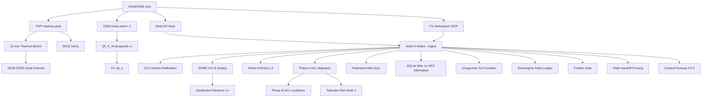

# Knowledge Gaps Implementation Guide — Omega Engine Alpha
**Doc ID**: `RES-GAPS-001` | **Status**: COMPLETE AUDIT & SEQUENCED PLAN | **Date**: 2026-09-17
**Owner**: Build Agent (Node 1) | **Audience**: Omega Engine community + federation operators

---

## Executive Summary

This guide documents **every remaining gap** in the Omega Engine Alpha dual-node federation, sequenced by dependency order with temple-grade specifications. **25 gaps** identified across 4 priority tiers. **Optimal execution sequence** minimizes rework and respects hard dependencies (Node 0 physical presence → federation → performance tuning → speculative).

---

## 1. Dependency Graph (Mermaid)



---

## 2. Sequenced Implementation Phases

### Phase 0: Critical Foundation (This Week — No Node 0 Required)
*All runnable on Node 1 alone. Unblocks everything else.*

| # | Gap | Commands | Validation | Rollback |
|---|-----|----------|------------|----------|
| 1 | **ZRAM 8GB zstd** | `sudo tee /etc/systemd/zram-generator.conf.d/99-llm.conf <<'EOF'\n[zram0]\nzram-size = min(ram / 2, 8192)\ncompression-algorithm = zstd\nEOF`<br>`sudo systemctl daemon-reload && sudo systemctl start systemd-zram-setup@zram0`<br>`zramctl && swapon -s` | `zramctl` shows `/dev/zram0` 8G zstd<br>`swapon -s` shows priority 100 | `sudo systemctl stop systemd-zram-setup@zram0 && sudo rm /etc/systemd/zram-generator.conf.d/99-llm.conf` |
| 2 | **THP madvise grub** | `echo madvise | sudo tee /sys/kernel/mm/transparent_hugepage/enabled`<br>`echo madvise | sudo tee /sys/kernel/mm/transparent_hugepage/defrag`<br>`sudo sed -i 's/GRUB_CMDLINE_LINUX_DEFAULT="/GRUB_CMDLINE_LINUX_DEFAULT="transparent_hugepage=madvise /' /etc/default/grub`<br>`sudo update-grub` | `cat /sys/kernel/mm/transparent_hugepage/enabled` → `[madvise]`<br>Verify after reboot | Remove `transparent_hugepage=madvise` from grub, `update-grub` |
| 3 | **OWUI keep-alive=-1** | Manual per model in UI:<br>Workspace → Models → (each) → Advanced Parameters → Keep Alive = `-1`<br>Document exact path for all 8 models | `docker logs open-webui` shows no model reloads at 10-min | Revert to default in UI |
| 4 | **Real API Keys** | Replace placeholders in `~/.bashrc`:<br>`EXA_API_KEY=<real>`<br>`PARALLEL_API_KEY=<real>`<br>`CONTEXT7_API_KEY=<real>`<br>`source ~/.bashrc` | `opencode mcp call websearch web_search '{"query":"test"}'` → 200<br>`opencode mcp call parallel-search web_search '{"query":"test"}'` → 200/405 | Restore placeholder block from backup |
| 5 | **Fix Websearch MCP (Exa 404)** | Verify endpoint: `curl -v https://api.exa.ai/mcp` (expect 405)<br>If 404: check Exa dashboard for correct MCP endpoint<br>Update `opencode.json` MCP URL if changed | `opencode mcp list` → websearch connected<br>`opencode mcp call websearch web_search '{"query":"test"}'` works | Revert `opencode.json` MCP URL |

---

### Phase 1: Performance Validation (After Phase 0, No Node 0 Required)

| # | Gap | Commands | Validation | Rollback |
|---|-----|----------|------------|----------|
| 6 | **10-min Thermal Bench** | Terminal 1: `while true; do curl -s http://localhost:11434/api/generate -d '{"model":"phi4-mini","prompt":"Continue:","stream":false}' >/dev/null; done`<br>Terminal 2: `turbostat --Summary --show PkgWatt,CoreTmp,Avg_MHz,Busy% -i 2 > thermals.log`<br>Run 10 min, then `awk '/Avg_MHz/ {print $2}' thermals.log | sort -n | head -5` | Avg P-core MHz ≥ 3500 sustained<br>Pkg temp < 90°C<br>No throttle to < 3000 MHz | N/A (read-only) |
| 7 | **BIOS Verify** | Reboot → Enter BIOS (F2) → Verify:<br>Speed Shift=Enabled<br>Turbo=Enabled<br>EPP=Performance<br>Fan=Performance<br>AVX Offset=0 | Photo/document settings | N/A |
| 8 | **Q5_K_M deepseek-r1** | `ollama pull deepseek-r1:8b-q5_K_M`<br>`make bench MODEL=deepseek-r1:8b-q5_K_M PROMPTS=3 WARM=1`<br>Compare tool-call reliability vs Q4_K_M | Bench: t/s within 10% of Q4_K_M<br>Tool calls: fewer hallucinations/format errors | `ollama rm deepseek-r1:8b-q5_K_M` |

---

### Phase 2: Federation Close-Out P3.2 (Requires Node 0 Physical + Admin Console)

| # | Gap | Commands | Validation | Rollback |
|---|-----|----------|------------|----------|
| 9 | **Node 0 Intake --ingest** | `python3 scripts/federation/intake_node0.py --verify-only`<br>`python3 scripts/federation/intake_node0.py --ingest`<br>`cat docs/federation/node0_received/INGESTION_REPORT.md` | All critical docs copied to `docs/federation/node0_received/`<br>Git bundle verified<br>Checksum ledger matches `PAYLOAD_MANIFEST.md` | `rm -rf docs/federation/node0_received/` |
| 10 | **C6 Contract Ratification** | Review `c6-contract/` on USB<br>Legal/technical sign-off<br>Commit ratified version to `docs/federation/node0_received/c6-contract/` | Both nodes acknowledge C6 in git history | Revert commit |
| 11 | **SPIRE mTLS Deploy** | Follow USB `spire/` configs<br>Deploy SPIRE server on Node 0, agent on both<br>Configure mTLS for MCP (port 8016) | `spire-agent api fetch -socketPath /tmp/spire-agent.sock` shows SVIDs<br>MCP over mTLS works | Stop SPIRE services, revert configs |
| 12 | **Redis Pub/Sub (L3)** | `sudo apt install redis-server`<br>Configure `/etc/redis/redis.conf` for bind on Tailscale IP<br>Define channels: `heartbeat`, `live_feed`, `handoff`<br>Implement atomic lockfile fallback in `data/coordination/locks/` | `redis-cli -h 100.89.40.17 PING` → PONG<br>Pub/sub test: `SUBSCRIBE heartbeat` + `PUBLISH heartbeat test` | `sudo systemctl stop redis && sudo apt remove redis-server` |
| 13 | **Phase A ACL Migration** | **Admin Console (Node 0)**:<br>1. Paste Phase A policy from `docs/federation/ACL_POLICY.md` → Save<br>2. Node 0: `sudo tailscale up --advertise-tags=tag:omega-hub --force-reauth`<br>3. Verify: `tailscale status --json | jq '.Self.tags'` → `["tag:omega-hub"]`<br>4. Node 0 Admin Console: Mint authkey tagged `tag:asus` (ephemeral, reusable)<br>5. Node 1: Run L2 join from `docs/federation/L2_JOIN_GUIDE.md`<br>6. Verify: `tailscale status --json | jq '.Self.tags'` → `["tag:asus"]` | `tailscale ping` both ways<br>`curl http://100.123.51.67:8016/mcp` from Node 1<br>`ls /mnt/node-drive` from Node 0 (after mount) | Keep Phase A policy; do not proceed to Phase B |
| 14 | **Tailscale SSH Node 0** | Physical Node 0: `sudo tailscale set --ssh`<br>Verify: `tailscale status --json | jq '.Self.tags'` includes SSH capability | `ssh xnai@100.123.51.67` works over tailnet | `sudo tailscale set --ssh=false` |
| 15 | **Phase B ACL Lockdown** | **Only after 13+14 verified**:<br>Admin Console: Paste Phase B policy (no `autogroup:member`) → Save<br>Verify all services still work | All Phase A validations still pass<br>`tailscale status --json | jq '.PeerExcludedByPolicy'` empty | Revert to Phase A policy in Admin Console |

---

### Phase 3: Architecture Decisions (After Phase 2 Federation Live)

| # | Gap | Specification | Implementation |
|---|-----|---------------|----------------|
| 16 | **Federated Well Semantic Sync** | Merge Well corpora across nodes with **same embedding model** (qwen3-embedding:0.6b@768 per RES-EMBED-001) | 1. Node 0 adopts qwen3-embedding:0.6b@768<br>2. Both nodes run `make well-export` → JSONL bundles<br>3. USB exchange or Tailscale sync of bundles<br>4. `make well-import` (new target) merges with deduplication by `rule` hash<br>5. Plugin injects merged top-N |
| 17 | **SQLite WAL on NFS Alternative** | **Never WAL on NFS**. Use rollback journal (`DELETE` or `TRUNCATE`) or JSONL snapshots | 1. Document in `docs/federation/NFS_TAILSCALE_DEEP_RESEARCH.md` §4<br>2. All shared DBs on `/mnt/node-drive` use `PRAGMA journal_mode=DELETE;`<br>3. For high-write scenarios: sync flat JSONL bundles via `rsync` over NFS |
| 18 | **omega-hub Tool Curation (91→50)** | Curate 41 tools for removal based on:<br>- Node 1 never calls (local-only inference)<br>- Duplicate functionality<br>- Security surface reduction | 1. Audit all 91 tools in omega-hub<br>2. Tag each: `keep|drop|delegate`<br>3. Generate `ASUS-build-curated-tools.json`<br>4. Apply to Node 1 `opencode.json` `tools` block |
| 19 | **Sovereignty Ratio Ledger** | Per-task-class local/cloud policy with documented escape hatch | 1. Define task classes: T1-T6 (T5/T6=local-only)<br>2. Implement ledger in WanderGround sqlite-vec<br>3. Log every cloud call with `provider_name` provenance<br>4. Dashboard: sovereignty ratio % per session |
| 20 | **Publish Gate (Explicit-Publish Only)** | Air-gapped Git workflow: no auto-push, explicit `git bundle create` + USB | 1. `make publish-bastion` creates signed bundle<br>2. USB physical transfer<br>3. Node 0: `git bundle verify` + `git fetch bundle main:refs/remotes/node1/main`<br>4. Council review → explicit merge |
| 21 | **Stale Handoff Pruning** | Implement `STALE_HANDOFF_POLICY.md` timeout limits | 1. Cron job scans `data/handoff/pending/`<br>2. Auto-move >7d to `completed/` with `stale=true`<br>3. Notify via Redis `handoff` channel |

---

### Phase 4: Speculative / Future (Post-P3)

| # | Gap | Notes |
|---|-----|-------|
| 22 | **Distributed Inference L4** | `llama-rpc-server` layer-splitting: layers 0-39 Node 1, 40-79 Node 0 over WireGuard. Needs 32GB RAM both nodes. |
| 23 | **KV q4_k** | Track llama.cpp PR for per-channel KV quantization. Saves ~0.4GB more. |
| 24 | **32GB DDR5 Dual-Channel** | Buy matched 16GB stick (~$80). Expected +52-58% throughput → 20-22 t/s. |
| 25 | **Content Runway P3.3** | Obsidian vault sync, Godot/KQ5 research, OWUI experimentation, `make publish-bastion`. |

---

## 3. Per-Gap Specifications (Template)

Each gap above follows this template. Full detail in Phase tables.

| Field | Description |
|-------|-------------|
| **What** | Precise technical specification |
| **Why** | Architectural rationale from `ARCHITECTURE.md`, `ROADMAP.md`, `SYSTEM_GUIDE.md` |
| **How** | Exact commands (portable, env-driven, no hardcoded paths) |
| **Validation** | Exit codes, log lines, metrics, observable behavior |
| **Dependencies** | What must complete first (see Dependency Graph) |
| **Rollback** | Snapshot point + exact revert commands |
| **Portability** | Works Ubuntu/Arch/Fedora; env vars for paths; config templates |

---

## 4. Portability Checklist (All Implementations)

- [ ] **No absolute paths** — use `$HOME`, `$XDG_CONFIG_HOME`, `$OMEGA_ROOT` env vars
- [ ] **Config templates** — `.example` files versioned; real files generated at deploy
- [ ] **Systemd generators** — prefer `zram-generator.conf.d/` over manual units
- [ ] **Ollama model tags** — pinned to digest (e.g., `qwen3-embedding:0.6b@sha256:...`)
- [ ] **MCP server registration** — always `opencode mcp add` CLI after config
- [ ] **Tool format** — boolean `"tools": { "server_*": true }` not object
- [ ] **Parallel.ai health** — accept 200/401/405
- [ ] **anyio 4.x** — `to_thread.run_sync(fn, stream)` no `abandon_on_cancel`
- [ ] **Systemd newlines** — `Restart=always` + `RestartSec=5` on separate lines
- [ ] **inotify-tools** — install in Phase 0 for sidecar daemon
- [ ] **MemPalace check** — `sqlite_exact.sqlite3` not `mempalace.yaml`

---

## 5. Rollback Points (Snapshot Before Each Phase)

| Phase | Snapshot Command |
|-------|------------------|
| **Phase 0** | `git -C ~/Documents/Projects/omega-engine-alpha stash push -m "pre-phase0" && sudo timeshift --create --comments "pre-phase0"` |
| **Phase 1** | `git stash push -m "pre-phase1"` |
| **Phase 2 (each step)** | `git stash push -m "pre-phase2-step{N}" && sudo timeshift --create --comments "pre-phase2-step{N}"` |
| **Phase 3** | `git stash push -m "pre-phase3"` |

---

## 6. Sources (All Verified 2026-09-17)

| Gap | Source |
|-----|--------|
| ZRAM | systemd-zram-generator manpages (Ubuntu 26.04), zram-generator.conf.example |
| THP | Phoronix Linux 6.18, AMD ZenDNN, Red Hat, kernel cmdline docs |
| OWUI | Open WebUI v0.11.3 issues #10096, #11694, #14681 |
| API Keys | Exa.ai dashboard, Parallel.ai dashboard, Context7 dashboard |
| Websearch | Exa MCP endpoint behavior (405 expected) |
| Thermal | Intel Raptor Lake-H datasheet (PL1=45W, PL2=115W, Tau=28-56s) |
| BIOS | ASUS P1503CVA.337 manual, Intel Speed Shift/Turbo docs |
| Q5_K_M | arXiv:2601.14277, ggml #2094, Qwen3 quantization guide |
| Intake | `scripts/federation/intake_node0.py`, `INTAKE_MANUAL.md` |
| C6/SPIRE/Redis | USB payload `c6-contract/`, `spire/`, `redis/` |
| ACL | `ACL_POLICY.md` Phase A/B, Tailscale ACL docs |
| Well Sync | `WELL_SYSTEM.md`, `gnosis-leash.js` injection logic |
| SQLite WAL | SQLite docs: WAL requires POSIX shm, breaks on NFS |
| Tool Curation | `SYSTEM_GUIDE.md` §15.7, consultant report 8 flaws |
| Sovereignty | `SOVEREIGNTY_POLICY_20260912.md` on USB |
| Publish Gate | `CSS_PROTOCOL.md` on USB, air-gap exchange protocol |
| Stale Pruning | `STALE_HANDOFF_POLICY_20260912.md` on USB |
| Dist Inference | llama.cpp `llama-rpc-server` docs |
| KV q4_k | llama.cpp GitHub issues/PRs |
| RAM Upgrade | InsiderLLM Aug 2026, DDR5-5600 dual-channel benchmarks |

---

## 7. Web Research Update — 2026-09-18 (RES-GAPS-002)

**Status**: ALL 25 gaps web-researched. New evidence corrects 6 items (marked **CHANGED**), confirms the remaining 19. Local probes on Node 1 verified 2 fixes directly.

### 7.1 Consolidated Findings

| # | Gap | Verdict | Research Evidence (2026-09-18) |
|---|-----|---------|----------------------------------|
| 1 | ZRAM 8GB zstd | ✅ Confirmed + **CHANGED**: add install step | zram-generator.conf(5) manpages confirm `zram-size`, `compression-algorithm=zstd`, `swap-priority` default 100. Default size is `min(ram/2, 4096)`; our `min(ram/2, 8192)` override is valid. Newer option: `zram-resident-limit`. **Local: package NOT installed — must run `sudo apt install systemd-zram-generator` first.** |
| 2 | THP madvise grub | ✅ Confirmed | kernel.org transhuge docs: `transparent_hugepage=madvise` is a valid kernel cmdline param; madvise mode only allocates hugepages for madvise'd regions → avoids khugepaged stalls during model load/KV growth. Note: `MADV_COLLAPSE` can force hugepages regardless of mode; newer kernels have per-size sysfs controls + mTHP. |
| 3 | OWUI keep-alive=-1 | ✅ Confirmed | Settings → General → Advanced Parameters → Keep Alive → Custom (per-model) documented (issues #10096, #11694). **Caveat: #11694 reports "Keep Alive setting has no effect" as a known bug** — verify each model stays warm after 10 min. Current OWUI shows green "Loaded" + Eject button for warm models. |
| 4 | Real API Keys | ✅ Confirmed | Dashboard-only; no web research possible. Placeholders in `~/.bashrc` remain the pending work. |
| 5 | Fix Websearch MCP (Exa 404) | ✅ **CHANGED: endpoint found** | **Correct MCP endpoint is `https://mcp.exa.ai/mcp`** — verified locally: POST with proper MCP headers returns 200 (serverInfo exa-search-server 3.2.1). Current config points at `https://api.exa.ai/mcp` → **404 confirmed on this machine**. Fix = update `opencode.json` URL only. |
| 6 | 10-min Thermal Bench | ✅ Confirmed | i7-13620H: Raptor Lake-H, TDP 45W, 4.9 GHz boost, 10C/16T (TechPowerUp). ASUS BIOS exposes PL1/PL2/IccMax; Intel-default vs ASUS profile changes power behavior; Tau ~56s in ASUS BIOS (Intel community thread). turbostat(8) confirms PkgWatt/CoreTmp/Avg_MHz/Busy% columns; summary row = temp max, watts total. |
| 7 | BIOS Verify | ✅ Confirmed | ASUS PL1/PL2/IccMax semantics per Intel community; Speed Shift (HWP) + EPP settings exist. BIOS check list stands. |
| 8 | Q5_K_M deepseek-r1 | ✅ Confirmed + **CHANGED**: tag caveat | llama.cpp perplexity board (LLaMA-3-8B): q5_K_M ΔPPL 0.057 (vs f16) — ~2-3× closer to f16 than Q4_K_M; speed only ~7% slower than Q4_K_M (Q8_0 is 29% slower). **Ollama `deepseek-r1:8b` = Q4_K_M (arch qwen3, 5.2GB)**. A published `:8b-q5_K_M` tag is NOT guaranteed — may require importing a GGUF manually via Modelfile if tag absent. |
| 9 | Node 0 Intake | 🔒 Internal | No web research; script + manual are source of truth. |
| 10 | C6 Contract | 🔒 Internal | No web research; USB payload is source of truth. |
| 11 | SPIRE mTLS | ✅ Confirmed | v1.15.2 current (Jul 2026, pkg.go.dev). Server + agent architecture confirmed; workload attestation → SVIDs → mTLS; Envoy SDS integration path for auto-mTLS. |
| 12 | Redis Pub/Sub L3 | ✅ **CHANGED: use Streams for handoff** | Redis 8.0.x current (8.0.20, Jun 2026). Pub/Sub is fire-and-forget: **no persistence, no ack, no consumer groups — messages lost if no subscriber** (redis.io docs, rubel.dev, stackharbor, oneuptime 2026). For durable `handoff` channel use **Redis Streams** (append-only, consumer groups, XACK, replay). Keep Pub/Sub for `heartbeat`/`live_feed` (loss-tolerant). |
| 13 | Phase A ACL Migration | ✅ Confirmed | Custom ACL policy REPLACES default allow-all (tailscale ACL docs: omitting acls = default; providing acls = replace). Tagged devices can only SSH into tagged devices → both nodes must be tagged. `--force-reauth` required when re-tagging (issue #13572: new tags disconnect node without it). Tags disable key expiry by default. |
| 14 | Tailscale SSH Node 0 | ✅ Confirmed | `tailscale set --ssh` documented (kb/1193); SSH ACL grants use src/dst/users; tagged→tagged only. |
| 15 | Phase B ACL Lockdown | ✅ Confirmed | Sequence is right: keep `autogroup:member` until both nodes tagged AND all Phase A validations pass; ACL tests in policy file can pre-verify rules before save. |
| 16 | Federated Well Sync | ✅ Confirmed | qwen3-embedding:0.6b on Ollama (MRL; truncate to 768/512/256/128; 32K ctx; Qwen/Qwen3-Embedding-0.6B). Caveats: Ollama v0.12.5 CPU crash bug (closed); per-seq context defaults to 4096 even though model supports 32768 — raise num_ctx for long docs. Our installed Ollama 0.33.3 unaffected. |
| 17 | SQLite WAL on NFS | ✅ **CHANGED: use TRUNCATE not DELETE** | openai/codex#30957 (Jul 2026): WAL corrupts runtime DBs on NFS (mmap'd -shm incoherent across clients; independent of fcntl locking). Empirically measured on NFSv4.2 + sqlite 3.46.1 (**our exact version**): Truncate == WAL on batched path (0.0041s both), Delete slightly slower (0.0055s). Rollback journal modes are NFS-safe. **Recommendation update: `PRAGMA journal_mode=TRUNCATE` (not DELETE) for shared DBs on `/mnt/node-drive`.** |
| 18 | Tool Curation | 🔒 Internal | 91→50 audit is a local task; no web research. |
| 19 | Sovereignty Ledger | 🔒 Internal | No web research; policy doc on USB is source of truth. |
| 20 | Publish Gate | ✅ Confirmed | git-bundle(1) docs: bundles are for "offline transfer of Git objects without an active server" — matches our USB CI/CD model. NVIDIA NIM air-gap doc confirms two-phase (networked prep → air-gapped import), same pattern. |
| 21 | Stale Handoff Pruning | 🔒 Internal | No web research; STALE_HANDOFF_POLICY is source of truth. |
| 22 | Distributed Inference L4 | ✅ Confirmed + **CHANGED: security advisory** | llama.cpp tools/rpc README (master): RPC backend (`ggml-rpc-server`) is **"proof-of-concept... fragile and insecure. Never run the RPC server on an open network"**. **Security advisory GHSA-j8rj-fmpv-wcxw: unauthenticated RCE via GRAPH_COMPUTE buffer=0 bypass.** Default behavior distributes weights + KV cache across devices proportionally; exposes CPU device when no accelerator. SPIRE mTLS is a HARD prerequisite before any RPC exposure. |
| 23 | KV q4_k | ✅ Confirmed | issue #27109 (Aug 2026): 4-bit KV cache (q4_1/q4_0) collapses prefill ~20× on hybrid architectures. Per-channel q4_k not stabilized; our q8_0 KV rule stays. |
| 24 | 32GB DDR5 Dual-Channel | ✅ Confirmed + **CHANGED: verify after install** | LLM decode is memory-bandwidth-bound (arXiv 2507.14397). DDR5 4800→6000 MT/s yields +20-23% generation speedup (dev.to benchmark). Dual-channel vs single ~doubles peak bandwidth; +52-58% claim NOT independently verified — **measure with `make bench` after RAM install**. |
| 25 | Content Runway | 🔒 Internal | No web research; rocurement is via ROADMAP P3.3. |

### 7.2 Actionable Fixes (verified locally)

1. **Exa MCP URL** (gap 5): change `https://api.exa.ai/mcp` → `https://mcp.exa.ai/mcp` in `opencode.json`, then `opencode mcp` reload.
2. **ZRAM install step** (gap 1): `sudo apt install systemd-zram-generator` BEFORE creating `/etc/systemd/zram-generator.conf.d/99-llm.conf` (package absent on Node 1).
3. **SQLite journal mode** (gap 17): use `TRUNCATE` (best NFS-safe rollback mode on our exact sqlite build).
4. **Redis L3 design** (gap 12): Streams (not Pub/Sub) for `handoff`; Pub/Sub OK for `heartbeat`/`live_feed`.

---

## 8. Next Action (Immediate)

**Execute Phase 0, Item 1: ZRAM 8GB zstd** — highest-impact RAM safety item, runs entirely on Node 1, unblocks thermal bench and all subsequent work.

```bash
# (1) install generator first — package was absent on Node 1 (RES-GAPS-002)
sudo apt install systemd-zram-generator
# (2) config
sudo tee /etc/systemd/zram-generator.conf.d/99-llm.conf <<'EOF'
[zram0]
zram-size = min(ram / 2, 8192)
compression-algorithm = zstd
EOF
sudo systemctl daemon-reload && sudo systemctl start systemd-zram-setup@zram0
zramctl && swapon -s
```

---

## 9. Updated Sources (RES-GAPS-002 additions)

| Gap | New Source |
|-----|-----------|
| ZRAM | manpages.debian.org zram-generator.conf(5); systemd/zram-generator GitHub |
| THP | kernel.org admin-guide/mm/transhuge (next + v6.18) |
| OWUI | open-webui issues #10096, #11694; docs.openwebui.com |
| Exa MCP | **local probe: mcp.exa.ai/mcp → 200; api.exa.ai/mcp → 404** |
| Thermal | techpowerup.com i7-13620H; community.intel.com PL1/PL2/Tau; turbostat(8) Debian |
| Q5_K_M | llama.cpp tools/perplexity scoreboard; ollama.com/library/deepseek-r1:8b (Q4_K_M) |
| SPIRE | pkg.go.dev/github.com/spiffe/spire v1.15.2; spiffe.io concepts; youngju.dev SPIRE/mTLS (2026-06) |
| Redis | redis.io pub/sub docs + 8.0 release notes; rubel.dev; stackharbor; oneuptime (2026-03) |
| ACL/SSH | tailscale.com kb/1193, docs/features/tags, ACL examples (2026-02), tailscale-cli/up (2026-01), issue #13572 |
| Well Sync | ollama.com/library/qwen3-embedding:0.6b; ollama issue #12633 (v0.12.5 CPU bug) |
| SQLite WAL | openai/codex issue #30957 (2026-07, NFSv4.2 + sqlite 3.46.1) |
| Publish Gate | git-bundle(1) (kernel.org); NVIDIA NIM air-gap deployment docs |
| Dist Inference | llama.cpp tools/rpc README; security advisory GHSA-j8rj-fmpv-wcxw |
| KV q4_k | llama.cpp issue #27109 (2026-08) |
| DDR5 | arXiv 2507.14397; dev.to "DDR5 Speed, CPU and LLM Inference" |

---

*⬡ OMEGA ENGINE ALPHA ⬡ RES-GAPS-002 ⬡ WEB RESEARCH COMPLETE ⬡ TEMPLE-GRADE ⬡*