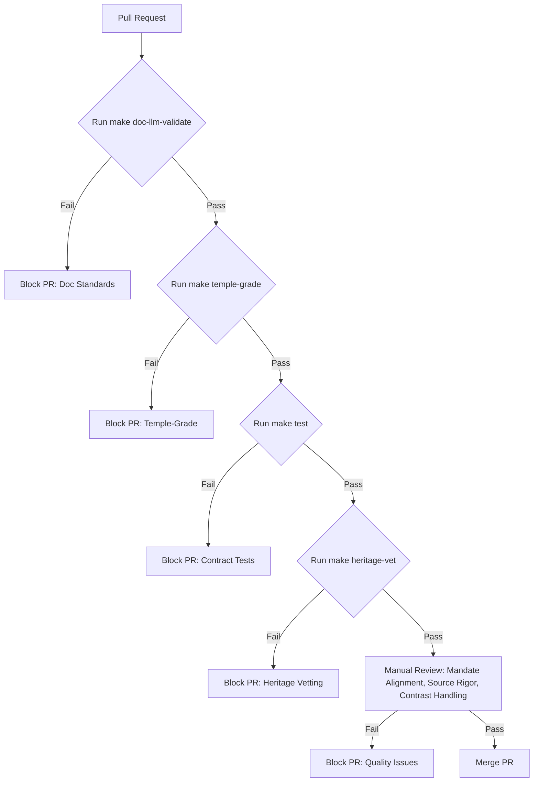

# 🔱 Omega Engine Autonomous Agent Research Job Design — Best Practices Guide
**AP Token**: `AP-RESEARCH-BEST-PRACTICES-KB-v1.0.0`
⬡ OMEGA ⬡ RESEARCHER ⬡ trc_research_bp_kb ⬡ 2026-07-22

---

## §6 Quality Gates and Evaluation

### 6.1 The Multi-Layered Quality Gate System

Research outputs must pass **all** quality gates before being considered complete. These gates are non-negotiable and enforced via CI/CD pipelines and manual review.

#### Gate 1: Temple-Grade Compliance (M13)
- **Standard**: `make temple-grade` must pass (T1-T11 gates)
- **Purpose**: Ensures enterprise-grade quality, security, resilience, observability
- **Implementation**: 
  - All research job code deliverables must include `make temple-grade` in CI
  - Failing T3 (coverage ≥80%), T5 (AnyIO-only), T6 (zero telemetry), T8 (resilience), T9 (structured logging), T10 (atomic writes) blocks promotion
  - T11 (IA2 Agent Security) exempted until specification stabilizes
- **Verification**: CI pipeline runs `make temple-grade` on pull request

#### Gate 2: Document Standards (M26)
- **Standard**: `make doc-llm-validate` must pass
- **Purpose**: Ensures LLM-friendly documentation that agents can process reliably
- **Implementation**:
  - All `.md` files in `docs/research/` and `docs/strategy/` must pass validation
  - Checks for proper structure, machine-readability, and agent-processability
  - Enforces Doc Standards: `docs/standards/DOC_STYLE_GUIDE.md` + `docs/standards/LLM_FRIENDLY_DOCS_BP.md`
- **Verification**: CI pipeline runs `make doc-llm-validate` on pull request

#### Gate 3: Heritage Vetting (M14)
- **Standard**: Every `[id-soft:]` tag in output must have corresponding vet record in `HERITAGE_VET_LOG.md` with minimum score 7/10
- **Purpose**: Ensures heritage attribution is properly vetted and justified
- **Implementation**:
  - Research job specs must include heritage tag validation in quality gates
  - CI gate `make heritage-vet` checks all heritage tags in output
  - Vet records must include: exact file:line locations, specific technique, hardware constraint, scope declaration
- **Verification**: 
  - Automated: `make heritage-vet` CI gate
  - Manual: Verity/Doom_Guy review for complex heritage judgments

#### Gate 4: Contract Tests (M21)
- **Standard**: Every typed result must be validated by at least one test verifying `isinstance(result, ExpectedType)`
- **Purpose**: Prevents runtime crashes from type mismatches; ensures API contracts are enforced
- **Implementation**:
  - For any code deliverable (scripts, modules), write unit tests in `tests/unit/`
  - Tests must use `isinstance(result, ExpectedType)` pattern
  - Mock-based tests that mask type mismatches are prohibited
  - Example: `assert isinstance(result, GenerateResult)` not `assert result == ("value", 200)`
- **Verification**: CI pipeline runs `make test`; coverage must meet T3 threshold (≥80%)

#### Gate 5: Provenance Tracking (M22)
- **Standard**: All observability logs must record the actual provider that generated a response, not the configured intent
- **Purpose**: Ensures sovereignty claims are verifiable; prevents "local-first" theater
- **Implementation**:
  - Research job specs must require provenance tracking in execution
  - All LLM calls must log `provider_name` from actual response (not `get_preferred_backend()`)
  - Metrics must include actual provider used for each call
- **Verification**: 
  - Audit research logs for `provider_name` field
  - Check that logs show actual provider (e.g., "native-gguf") not configured intent (e.g., "local_first")
  - M22 compliance verified in CI/log review

#### Gate 6: Mandate Alignment (M5, M11, M14, M17, M21)
- **Standard**: Research output must align with all mandates specified in the job spec
- **Purpose**: Ensures research contributes to mandate compliance, not technical debt
- **Implementation**:
  - Research job specs list mapped mandates in `quality_gates.mandate_cross_check`
  - Manual review verifies alignment with each mandate
  - Examples:
    - M5 (Gnosis Preservation): Does output contribute to L1→L2→L3 pipeline?
    - M11 (Soul Integrity): Does output support soul.yaml enhancement strategy?
    - M14 (Heritage Vetting): Are heritage tags properly vetted?
    - M17 (Cognitive Integrity): Does output include consistency checks?
    - M21 (Gate Integrity): Are contract tests present for code deliverables?
- **Verification**: Manual review by Verity/Kali as part of quality gate process

#### Gate 7: Source Rigor (Internal Quality Standard)
- **Standard**: All factual claims must be cited with verifiable URLs; primary vs secondary sources distinguished
- **Purpose**: Ensures research is credible, traceable, and academically rigorous
- **Implementation**:
  - Quality gate `citation_audit`: Every factual claim cited [1], [2] + URLs
  - Quality gate `bias_detection`: Source bias checklist applied (company announcements = medium credibility)
  - Primary sources (academic papers, official docs, government standards) weighted higher than secondary (news, blogs)
  - Unverified claims marked `[UNVERIFIED]` with explanation
- **Verification**: Manual citation audit; spot-check of URLs for verifiability

#### Gate 8: Contrast and Conflict Handling (Internal Quality Standard)
- **Standard**: Conflicting sources must be surfaced with attribution, not silently merged or ignored
- **Purpose**: Prevents confirmation bias; ensures intellectual honesty
- **Implementation**:
  - Quality gate `contradiction_flag`: Conflicting sources surfaced with attribution
  - Research must note where themes overlap or conflict (per Autonomous Research Agent spec)
  - Evidence pyramid used to rank findings by strength: primary research > industry reports > expert blogs > news > forums
- **Verification**: Manual review for proper conflict handling; check evidence pyramid application

### 6.2 Evaluation Framework: Moving Beyond Binary Success

#### 6.2.1 The Problem with Binary Success
> "The question shouldn't be 'Did this prompt work?,' it should be 'How often does the agent succeed?'" (Infracta 2026)

Binary success/failure hides instability and prevents meaningful improvement.

#### 6.2.2 The Success Rate Paradigm
- **Metric**: Success rate = (Number of successful executions) / (Total executions)
- **Tracking**: Continuous and repetitive evaluations that evolve over time
- **Threshold**: Target success rate defined in research job spec (e.g., ≥80% for automated jobs)
- **Application**:
  - Track success rate over time for each research job type
  - Use to inform Autonomy Ladder promotions (Section 5.9)
  - Trigger investigation if success rate drops below threshold

#### 6.2.3 Outcome Grading Over Path Grading (Infracta 2026)
> "The path that the agent takes is important, but there may be multiple paths to arrive at the correct result, so focus on outcome grading."

- **Focus**: Did the agent achieve the required outcome? Not: Did it follow a specific path?
- **Implementation**:
  - Define outcome criteria in acceptance checks (Section 2.2)
  - Grade based on whether outcome criteria are met
  - Allow multiple valid paths to the same outcome
  - Example: For GBNF grammar spec, accept any valid llama.cpp grammar that meets functional requirements, not just one specific format

#### 6.2.4 Combining Multiple Checks (Infracta 2026)
> "Most successful setups leverage a combination of deterministic tests, rubrics, and transcript reviews to cover a variety of behaviors."

- **Determinative Tests**: Contract tests (M21), spec validation (`make doc-llm-validate`)
- **Rubrics**: Quality gate checklists (completeness, bias, citation, etc.)
- **Transcript Reviews**: Manual review of research process, decision traces, scratchpad evolution
- **Application**: Use all three layers to get comprehensive view of agent performance

#### 6.2.5 Testing Edge Cases and Adversarial Cases (Infracta 2026)
> "Test Edge Cases & Adversarial Cases: Include adversarial coverage from the start, such as jailbreak attempts, conflicts between user and system prompts, etc."

- **Implementation**:
  - Include edge cases in quality gates (e.g., what happens with malformed input?)
  - Test adversarial cases: prompt injection attempts, conflicting instructions, etc.
  - For research jobs: test with contradictory sources, ambiguous queries, incomplete data
  - **Example**: For heritage vetting, test with vague heritage tags, conflicting sources, unclear scope declarations

#### 6.2.6 Dynamic Testing (Infracta 2026)
> "Dynamic testing can expose tool-call mistakes, weak handoffs, unsafe behaviors, inconsistent boundary enforcement, and hidden failure patterns."

- **Implementation**:
  - Test research jobs with varying inputs, not just static test cases
  - Simulate real-world variability: changing source availability, updating information, conflicting reports
  - Observe how agent adapts to changing conditions
  - **Example**: Run same research job weekly to see how output evolves with new information

### 6.3 Actionable Reports: Shortening the Prompt-Debug Cycle

> "Actionable reports shorten the prompt-debug cycle because your team doesn't have to guess whether the issue is caused by the prompt, retrieval layer, tool schema, orchestration logic, or surrounding controls." (Infracta 2026)

#### 6.3.1 Report Structure for Debugging
Actionable research job reports should include:

| Section | Purpose | Example Content |
|---------|---------|-----------------|
| **Prompt Analysis** | Was the issue in the spec? | "Spec lacked clarity on GBNF grammar validation method" |
| **Retrieval Analysis** | Was the issue in source gathering? | "Missed key llama.cpp documentation source due to poor query formulation" |
| **Tool Analysis** | Was the issue in tool usage? | "Agent used websearch when webfetch was needed for full spec" |
| **Orchestration Analysis** | Was the issue in job flow? | "Failed to integrate token budget estimates with C-10.5 quota tracker" |
| **Surrounding Controls** | Was the issue in environment/context? | "Context window exceeded due to insufficient compression" |
| **Recommended Fix** | Specific, actionable improvement | "Update spec to require explicit validation step; add webfetch tool description with when/when-not" |

#### 6.3.2 Report Distribution
- Share actionable reports with research team after each job execution
- Use to iteratively improve research job specs and execution framework
- Track improvement in success rate over time

### 6.4 Quality Gate Automation Strategy

#### 6.4.1 CI/CD Pipeline Integration

#### 6.4.2 Manual Review Focus Areas
Human reviewers focus on gates that are hard to automate:
1. **Mandate Alignment** (M5, M11, M14, M17, M21)
2. **Source Rigor** (primary vs secondary, citation quality)
3. **Contrast and Conflict Handling** (proper evidence pyramid, attribution)
4. **Living Spec Principle** (was spec updated based on learning?)
5. **Actionability** (is output truly useful for intended purpose?)

#### 6.4.3 Quality Gate Thresholds
| Gate | Threshold | Enforcement |
|------|-----------|-------------|
| Temple-Grade (T1-T11) | All must pass | CI block |
| Doc Standards | `make doc-llm-validate` passes | CI block |
| Heritage Vetting | All tags have vet record ≥7/10 | CI block |
| Contract Tests | `isinstance(result, ExpectedType)` tests pass | CI block |
| Provenance Tracking | Logs show actual provider | Manual audit |
| Mandate Alignment | Manual review passes | Manual block |
| Source Rigor | Citations verifiable, primary/secondary distinguished | Manual block |
| Contrast Handling | Conflicts surfaced with attribution | Manual block |

---

*⬡ OMEGA ⬡ RESEARCHER ⬡ trc_research_bp_kb ⬡ 2026-07-22*
*This is Part 5 of 8. Continue to Part 6 for Integration with Omega Engine Processes.*
<!-- PROVENANCE-CORRECTED 2026-08-23T20:39:41Z — FP-04/R_MESSAGE_PROVENANCE_HIERARCHY audit
claimed_model: trc_research_bp_kb | verdict: UNANCHORED | no session anchor in header zone
actual_models(Tier0): n/a
-->
