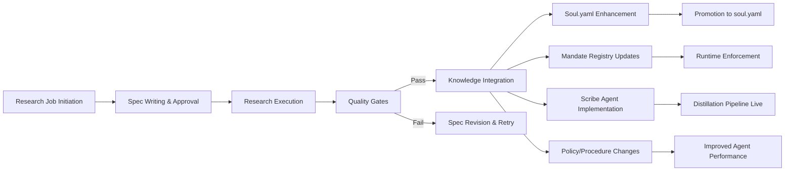

# 🔱 Omega Engine Autonomous Agent Research Job Design — Best Practices Guide
**AP Token**: `AP-RESEARCH-BEST-PRACTICES-KB-v1.0.0`
⬡ OMEGA ⬡ RESEARCHER ⬡ trc_research_bp_kb ⬡ 2026-07-22

---

## §7 Integration with Omega Engine Processes

### 7.1 Research Job Lifecycle in Omega Ecosystem

Research jobs are not isolated activities; they integrate with multiple Omega Engine systems and processes. Understanding these integration points is critical for effective execution.

#### 7.1.1 The Research-to-Action Pipeline


#### 7.1.2 Key Integration Points

| Omega System | Integration Point | Purpose | Example |
|--------------|-------------------|---------|---------|
| **Soul System** (`data/entities/*/soul.yaml`) | Research outputs inform L3 principles | Enhances agent wisdom and decision-making | GAP-001 research → Hardware-aware optimization directive (jc-d-019) |
| **Mandate Registry** (`data/mandates/registry.yaml`) | Research identifies mandate implementation gaps | Improves mandate compliance and enforcement | GAP-005 research → Complete mandate registry with universal_floor/specialized_ceiling assignments |
| **Scribe Agent** (`src/omega/scribe/`) | Research defines distillation pipeline specifications | Enables L1→L2→L3 processing for soul enhancement | GAP-001 research → SPEC_Scribe_Distillation_Pipeline.md → src/omega/scribe/distillation_pipeline.py |
| **Quota Tracker** (`src/omega/oracle/quota_tracker.py`) | Research provides token budget estimates | Enables resource-aware agent execution | GAP-001 research → Token budget specs → quota_tracker.py Scribe integration |
| **Heritage Vetting** (`data/entities/doom_guy/knowledge/HERITAGE_VET_LOG.md`) | Research outputs require heritage validation | Ensures M14 compliance for all promotions | GAP-007 research → HERITAGE_VET_FOR_SOUL_PROMOTION.md → src/omega/governance/heritage_vet_soul.py |
| **Policy Engine** (`src/omega/governance/`) | Research informs policy updates and governance | Keeps policies current with best practices | GAP-002 research → SOUL_GOVERNANCE_PROTOCOL.md → src/omega/governance/soul_promotion_gate.py |
| **Observability System** (`src/omega/observability/`) | Research jobs must be observable and measurable | Enables cost tracking, performance monitoring, debugging | All research jobs → metrics logged to `data/coordination/research_metrics/` |
| **Hivemind Coordination** (`mcp_servers/omega_hub/`) | Research jobs may require coordination with other agents | Enables collaborative research and knowledge sharing | GAP-002 research → collaborative planning with Verity/Kali |
| **Version Control** (Git) | Research outputs become part of versioned knowledge base | Enables tracking, rollback, and historical analysis | All research outputs → committed to main branch with proper attribution |

### 7.2 Research Job Triggers and Initiation

Research jobs in Omega are initiated through multiple pathways:

#### 7.2.1 Scheduled Research (Proactive)
- **Trigger**: Calendar-based or milestone-based
- **Examples**:
  - Quarterly technology landscape review
  - Pre-sprint research for upcoming work
  - Annual heritage vetting review
  - Bi-annual mandate registry audit
- **Process**:
  1. Product/engineering lead identifies need
  2. Creates research job spec using template
  3. Routes to appropriate researcher (often @researcher)
  4. Follows standard research job lifecycle

#### 7.2.2 Incident-Driven Research (Reactive)
- **Trigger**: Production incident, audit finding, or compliance gap
- **Examples**:
  - Post-mortem research after service outage
  - Research to address failed heritage vet (M14)
  - Research to close mandate compliance gap (M5, M11)
  - Research following security audit finding
- **Process**:
  1. Incident triggers immediate research need
  2. Researcher creates expedited spec (still follows template)
  3. Priority escalated (often P0 or P1)
  4. Follows standard research job lifecycle with expedited review

#### 7.2.3 Opportunity-Driven Research (Exploratory)
- **Trigger**: Observation of emerging technology, pattern, or technique
- **Examples**:
  - New LLM technique with potential Omega application
  - Observed pattern in agent behavior needing investigation
  - New tool or framework worth evaluating
  - Cross-pollination opportunity from other domains
- **Process**:
  1. Researcher identifies opportunity (often via horizon scanning)
  2. Creates exploratory research spec
  3. Often starts as quick_scan or overview depth
  4. May lead to deeper investigation if promising
  5. Follows standard research job lifecycle

#### 7.2.4 Mandate-Driven Research (Compliance)
- **Trigger**: Mandate compliance gap identified via audit or self-assessment
- **Examples**:
  - Research to close M5/M11 gap (soul distillation pipeline)
  - Research to improve M17 compliance (Skeptical Verifier)
  - Research to enhance M21 coverage (contract tests)
  - Research to address M12 advisory status (queue integrity)
- **Process**:
  1. Compliance audit identifies gap
  2. Researcher creates spec to address specific mandate gap
  3. Often P0 priority due to compliance implications
  4. Follows standard research job lifecycle with Verity involvement

### 7.3 Research Output Consumption Pathways

Research outputs don't just sit in documents; they flow into specific Omega Engine systems:

#### 7.3.1 Soul Enhancement Pathway
```
Research Output → proposed_lessons.yaml → Scribe Agent (C-0.5) → soul.yaml → Agent Wisdom
```
- **Trigger**: Research produces L3 principles (universal truths)
- **Process**:
  1. Research output written to `proposed_lessons.yaml` (L1→L2→L3)
  2. Scribe agent (C-0.5) processes via L1→L2→L3 pipeline
  3. Approved L3 principles promoted to `soul.yaml` as directives (jc-d-XXX)
  4. Agents gain enhanced wisdom from updated soul.yaml
- **Systems Involved**: 
  - `data/entities/*/proposed_lessons.yaml`
  - `src/omega/scribe/distillation_pipeline.py`
  - `data/entities/*/soul.yaml`
  - Scribe agent (C-0.5)

#### 7.3.2 Mandate Registry Enhancement Pathway
```
Research Output → mandate_registry.yaml → Runtime Resolver → Agent Behavior
```
- **Trigger**: Research identifies mandate implementation improvements
- **Process**:
  1. Research output updates `data/mandates/registry.yaml`
  2. `src/omega/hub/mandate_registry.py` reads registry at runtime
  3. Agents query resolver for mandate ownership, assignments, etc.
  4. Agent behavior updated based on current mandate state
- **Systems Involved**:
  - `data/mandates/registry.yaml`
  - `src/omega/hub/mandate_registry.py`
  - Agent mandate queries throughout Omega Engine

#### 7.3.3 Scribe Agent Enhancement Pathway
```
Research Output → SPEC_Scribe_Distillation_Pipeline.md → src/omega/scribe/ → Living Pipeline
```
- **Trigger**: Research defines improved distillation pipeline
- **Process**:
  1. Research output creates/updates `SPEC_Scribe_Distillation_Pipeline.md`
  2. Implementation updates `src/omega/scribe/distillation_pipeline.py`
  3. Pipeline processes session transcripts into L1→L2→L3 insights
  4. Output flows to `proposed_lessons.yaml` for soul enhancement
- **Systems Involved**:
  - `docs/specs/SPEC_Scribe_Distillation_Pipeline.md`
  - `src/omega/scribe/distillation_pipeline.py`
  - `data/entities/*/proposed_lessons.yaml`

#### 7.3.4 Policy and Procedure Updates Pathway
```
Research Output → Policy/Procedure Doc → Training/Enforcement → Agent Behavior
```
- **Trigger**: Research identifies needed policy or procedure improvements
- **Process**:
  1. Research output updates policy/procedure document
  2. Training materials updated if needed
  3. Enforcement mechanisms updated (CI gates, pre-commit hooks, etc.)
  4. Agent behavior updated via new policies/procedures
- **Systems Involved**:
  - Policy docs: `docs/strategy/*`, `docs/standards/*`
  - Procedure docs: `docs/strategy/*_PROTOCOL.md`
  - Enforcement: `.github/workflows/*`, `pre-commit` hooks, CI gates
  - Agent behavior: Via updated constraints in AGENTS.md or system prompts

#### 7.3.5 Observability and Metrics Enhancement Pathway
```
Research Output → Metrics Definition → Instrumentation → Insights → Optimization
```
- **Trigger**: Research identifies needed metrics or observability improvements
- **Process**:
  1. Research output defines what to measure and how
  2. Instrumentation added to relevant components
  3. Metrics collected and stored in `data/coordination/metrics/`
  4. Insights derived from metrics drive optimization
  5. Feedback loop to improve future research jobs
- **Systems Involved**:
  - Metrics definitions: `docs/strategy/*_METRICS.md`
  - Instrumentation: Throughout `src/omega/` and `mcp_servers/`
  - Storage: `data/coordination/metrics/`
  - Analysis: `src/omega/observability/`, `data/coordination/RESEARCH_METRICS_ANALYSIS.md`

### 7.4 Research Job Prioritization Framework

Not all research is equal; use this framework to prioritize:

#### 7.4.1 Impact/Effort Matrix
| Impact \ Effort | Low (1-2 days) | Medium (3-5 days) | High (1+ week) |
|-----------------|----------------|-------------------|----------------|
| **High** (Blocks P0, enables major capability) | **DO FIRST** <br> Quick wins, high ROI | **SCHEDULE SOON** <br> Strategic initiatives | **PLAN CAREFULLY** <br> Major investments, needs breakdown |
| **Medium** (Improves efficiency, addresses technical debt) | **DO WHEN POSSIBLE** <br> Low-hanging fruit | **SCHEDULE REGULARLY** <br> Steady improvements | **EVALUATE NEED** <br> Only if strategic |
| **Low** (Nice to have, minimal impact) | **DELEGATE OR DEFER** <br> If trivial, do it | **LOW PRIORITY** <br> Only if no better work | **AVOID** <br> Rarely worth investment |

#### 7.4.2 Priority Classification
| Priority | Criteria | Typical Timeline |
|----------|----------|------------------|
| **P0 (Blocker)** | Blocks P0 ticket; enables critical path; compliance gap; security issue | Immediate (within 24-48 hours) |
| **P1 (High)** | Significant impact on capability, efficiency, or risk reduction | Within 1 week |
| **P2 (Medium)** | Useful improvement; addresses technical debt; enhances quality | Within 2-4 weeks |
| **P3 (Low)** | Nice to have; exploratory; low immediate impact | As time permits; often deferred |

#### 7.4.3 Priority Determination Factors
Consider these factors when assigning priority:

| Factor | Questions to Ask |
|--------|------------------|
| **Blocking** | Does this research block a P0 ticket or critical path? |
| **Compliance** | Does this address a mandate compliance gap (M5, M11, M14, M17, M21)? |
| **Risk Reduction** | Does this reduce operational, security, or compliance risk? |
| **Capability Enablement** | Does this enable a new capability or significant improvement? |
| **Efficiency Gain** | Does this significantly reduce time/toil for agents or humans? |
| **Knowledge Value** | Does this create reusable knowledge for multiple teams? |
| **Downstream Impact** | How many other systems/processes will benefit? |
| **Urgency** | Is there a time-sensitive component or deadline? |
| **Resource Availability** | Are the necessary skills and resources available? |

#### 7.4.4 Priority Adjustment Process
1. **Initial Assignment**: Product/engineering lead proposes priority based on factors above
2. **Researcher Input**: Researcher provides effort estimate and feasibility assessment
3. **Leadership Review**: Kali/MaKaLi review for strategic alignment
4. **Final Decision**: Product lead makes final priority call
5. **Re-evaluation**: Priority can be re-evaluated at any time based on changing circumstances

### 7.5 Research Job Documentation Standards

All research jobs must follow these documentation standards to ensure discoverability, reusability, and knowledge preservation.

#### 7.5.1 File Naming Convention
- **Research Job Specs**: `docs/research/specs/JOB_ID_Job_Spec.md`
- **Research Outputs**: `docs/research/R_JOB_DESCRIPTION_YYYYMMDD.md`
- **Research Metrics**: `data/coordination/research_metrics/JOB_ID_metrics_YYYYMMDD.json`
- **Research Findings**: `data/coordination/research_findings/JOB_ID/`
- **Temp/Working Files**: `tmp/research/JOB_ID/` (auto-cleaned)

#### 7.5.2 Required Frontmatter for Research Outputs
Every research output file must begin with:

```yaml
# 🔱 [Document Type] — [Descriptive Title]
**AP Token**: `AP-[SHORT_DESCRIPTION]-v[VERSION]`
⬡ OMEGA ⬡ [RESPONSIBLE_ENTITY] ⬡ [SHORT_JOB_ID] ⬡ [YYYY-MM-DD]

[Optional: Link to related tickets, specs, or initiatives]

---

[Document Content]

---

*⬡ OMEGA ⬡ [RESPONSIBLE_ENTITY] ⬡ [SHORT_JOB_ID] ⬡ [YYYY-MM-DD]*
*[Document type description]. All research outputs must be written to `docs/research/` or `docs/strategy/` per Doc Standards.*
```

#### 7.5.3 Example Research Output Header
```yaml
# 🔱 Research Guide: Soul.yaml & Peripheral Systems Knowledge Gaps
**AP Token**: `AP-SOUL-GAPS-RESEARCH-v1.0.0`
⬡ OMEGA ⬡ RESEARCHER ⬡ trc_soul_gaps ⬡ 2026-07-22

Related to: GAP-001, GAP-002, GAP-003, GAP-004, GAP-005, GAP-006, GAP-007, GAP-008, GAP-009, GAP-010, GAP-011, GAP-012
See also: docs/research/specs/GAP001_Scribe_Distillation_Job_Spec.md

---

[Document Content]

---

*⬡ OMEGA ⬡ RESEARCHER ⬡ trc_soul_gaps ⬡ 2026-07-22*
*This guide is the single source of truth for soul.yaml enhancement knowledge gaps.*
*All research outputs must be written to `docs/research/` or `docs/strategy/` per Doc Standards.*
```

#### 7.5.4 Change Tracking for Living Documents
For living documents that evolve over time (like this guide):

1. **Version Number**: Increment minor version for backward-compatible changes, major for breaking changes
2. **Change Log**: Maintain at end of document:
   ```yaml
   ## 📜 Change Log
   
   | Version | Date | Date |
   |---------|---------|------------------|
   | v1.0.0 | 2026-07-22 | Initial release |
   | v1.1.0 | 2026-07-25 | Added context engineering rules from Agentmelt 2026 research |
   | v1.2.0 | 2026-07-28 | Integrated tool design principles from Anthropic Appendix 2 |
   ```
3. **Git History**: Rely on git for detailed history; change log for high-level summary

### 7.6 Research Job Retirement and Archiving

Not all research jobs remain active indefinitely; follow this lifecycle:

#### 7.6.1 Active Research Jobs
- **Status**: `docs/research/specs/*_Job_Spec.md`
- Currently being executed or recently completed (<30 days)
- Regularly updated as learning occurs
- Subject to active quality gate enforcement

#### 7.6.2 Knowledge Base Articles
- **Transition**: After completion and validation, move to knowledge base
- **Location**: `docs/research/KB_*` or `docs/knowledge/`
- **Purpose**: Preserve learned knowledge for future reference
- **Maintenance**: Updated when new information supersedes old
- **Example**: This guide itself is a KB article

#### 7.6.3 Archived Research
- **Trigger**: Research is superseded, obsolete, or no longer relevant
- **Location**: `docs/research/archive/` or `docs/strategy/archive/`
- **Process**:
  1. Add `OBSOLETE: [reason]` prefix to filename
  2. Move to archive directory
  3. Update any references to point to current KB
  4. Preserve for historical reference
- **Example**: `docs/research/archive/OBSOLETE_GAP001_SPEC_v0.9_20260715.md`

#### 7.6.4 Research Debt
- **Definition**: Research specs or outputs that are outdated, inaccurate, or no longer useful
- **Management**:
  - Regularly audit research directory for outdated content
  - Prioritize updating high-impact, high-debt research
  - Treat research debt like technical debt: allocate time to pay it down
  - Use `git blame` and `git log` to identify stale content

### 7.7 Research Job Metrics and Feedback Loops

Research jobs should generate metrics that inform future improvements:

#### 7.7.1 Essential Research Metrics
Track these metrics for every research job:

| Metric | Purpose | Collection Method |
|--------|---------|-------------------|
| **Planning Accuracy** | How well did initial spec match actual work needed? | Compare initial spec to final spec changes |
| **Execution Efficiency** | Time/effort vs. estimate | Actual vs. estimated hours |
| **Quality Gate Pass Rate** | Percentage of quality gates passed on first attempt | CI/CD pipeline results |
| **Knowledge Reuse** | How many times was this research referenced in subsequent work? | Git log, reference tracking |
| **Actionability** | How much of the research led to concrete changes? | Count of PRs, tickets, docs updated |
| **Cost Efficiency** | Token cost per unit of value delivered | Metrics correlated with outcomes |
| **Stakeholder Satisfaction** | How satisfied were consumers of the research? | Surveys, feedback forms, usage metrics |

#### 7.7.2 Feedback Loops
Implement these feedback loops to continuously improve research job effectiveness:

1. **After-Action Review (AAR)**: 30-minute retrospective after each research job
   - What went well?
   - What could be improved?
   - What did we learn about the research process itself?
   - Update spec template if needed

2. **Monthly Research Retrospective**: 
   - Review all research jobs from past month
   - Identify patterns in successes and failures
   - Update best practices guide
   - Adjust prioritization framework if needed

3. **Quarterly Research Strategy Review**:
   - Evaluate research portfolio alignment with strategic goals
   - Assess ROI of research investments
   - Plan next quarter's research agenda
   - Adjust resource allocation

4. **Annual Research Capability Review**:
   - Assess overall research capability maturity
   - Identify skill gaps and training needs
   - Update research job spec template based on lessons learned
   - Review and update best practices guide

#### 7.7.3 Using Metrics for Improvement
- **Spec Template Updates**: Based on AARs and retrospectives
- **Process Improvements**: Based on observed bottlenecks and failure modes
- **Resource Allocation**: Based on ROI and strategic alignment
- **Skill Development**: Based on identified gaps in researcher capabilities
- **Tool Improvements**: Based on observed tool usage patterns and limitations

### 7.8 Research Job Anti-Patterns to Avoid

#### 7.8.1 The "Hope-Driven Research" Anti-Pattern
- **Symptom**: Vague spec like "Research LLMs for Omega improvement"
- **Problem**: Too broad; impossible to scope; leads to endless research
- **Fix**: Apply spec-driven principles; break into specific, answerable questions

#### 7.8.2 The "Context Dump" Anti-Pattern
- **Symptom**: Pasting entire documents, logs, or codebases into context
- **Problem**: Wastes tokens; causes distraction and poisoning; violates context engineering
- **Fix**: Write conclusions, not raw text; select context, don't include it

#### 7.8.3 The "Single Source" Anti-Pattern
- **Symptom**: Relying on one source for critical information
- **Problem**: Creates single point of failure; vulnerable to bias or error
- **Fix**: Enforce cross-reference_minimum: 2; use evidence pyramid

#### 7.8.4 The "Binary Thinking" Anti-Pattern
- **Symptom**: Treating research as success/failure without nuance
- **Problem**: Hides instability; prevents meaningful improvement
- **Fix**: Adopt success rate paradigm; focus on outcome grading

#### 7.8.5 The "Spec-Immutability" Anti-Pattern
- **Symptom**: Treating research spec as unchangeable contract
- **Problem**: Prevents learning; violates living spec principle
- **Fix**: Treat spec as living document; update based on learning

#### 7.8.6 The "Isolated Research" Anti-Pattern
- **Symptom**: Research conducted in vacuum without stakeholder input
- **Problem**: Produces irrelevant or unusable outputs
- **Fix**: Involve stakeholders early; use collaborative planning for complex jobs

#### 7.8.7 The "Tool Misuse" Anti-Pattern
- **Symptom**: Using tools incorrectly (e.g., websearch when webfetch needed)
- **Problem**: Wastes time; produces poor quality outputs
- **Fix**: Enforce tool description contracts; require when/when-not in specs

#### 7.8.8 The "Quality Gate Skipping" Anti-Pattern
- **Symptom**: Skipping quality gates to "move faster"
- **Problem**: Accumulates technical debt; creates future problems
- **Fix**: Enforce all quality gates; treat them as non-negotiable

#### 7.8.9 The "One-Size-Fits-All" Anti-Pattern
- **Symptom**: Applying same research approach to all problems regardless of type
- **Problem**: Ineffective; wastes resources; misses opportunities
- **Fix**: Use execution pattern decision tree (Section 5.4) to match approach to problem type

#### 7.8.10 The "Output-Only Focus" Anti-Pattern
- **Symptom**: Focusing only on final output without valuing the process
- **Problem**: Misses opportunities to improve research capability itself
- **Fix**: Value both output and process; conduct AARs; improve spec template

### 7.9 Research Job Success Stories (Examples from Omega Engine)

#### 7.9.1 Success Story: C-0.5 Scribe Agent Specification
- **Challenge**: Define L1→L2→L3 distillation pipeline for soul enhancement
- **Approach**: Spec-driven research job (GAP-001)
- **Key Practices Applied**:
  - Spec written backward from acceptance checks
  - Context engineering: conclusions not raw text
  - Tool descriptions with when/when-not
  - Progressive content retrieval (snippets first)
  - Structured output as first-class contract
  - Quality gates: Temple-Grade, Doc Standards, Contract Tests
- **Outcome**: 
  - Clear specification enabling implementation
  - Estimated token budget integrated with C-10.5 quota tracker
  - Defined error handling and retry logic
  - Established integration points with soul enhancement pipeline
- **Impact**: Enabled C-0.5 Scribe Agent implementation; critical path for M5/M11 compliance

#### 7.9.2 Success Story: Heritage Vetting for Soul Promotion
- **Challenge**: Define heritage vetting process for promoted L3 principles
- **Approach**: Spec-driven research job (GAP-007)
- **Key Practices Applied**:
  - Spec written backward from acceptance checks
  - Context engineering principles applied
  - Tool descriptions with when/when-not
  - Evidence pyramid for source evaluation
  - Progressive content retrieval
- **Outcome**:
  - Clear vet record schema v2 with auto-generation capabilities
  - Defined scope declaration enforcement mechanisms
  - Established Qualification Gate algorithm with scoring rubric
  - Designed CI integration for `make heritage-vet`
  - Mapped end-to-end flow from promotion to soul.yaml commit
- **Impact**: Enabled M14 compliance for soul.yaml promotions; foundation for automated heritage vetting

#### 7.9.3 Success Story: Mandate Registry Design
- **Challenge**: Create dynamic mandate configuration system
- **Approach**: Research job combining GAP-005 with mandate alignment research
- **Key Practices Applied**:
  - Spec-driven approach with clear acceptance checks
  - Context engineering for complex information synthesis
  - Tool design principles for mandate registry API
  - Progressive content retrieval for mandate research
  - Structured output for machine-readable registry
- **Outcome**:
  - Complete mandate registry with universal_floor/specialized_ceiling assignments
  - Runtime resolver implementation plan
  - Soul↔Registry binding logic specification
  - CI gate design for mandate registry validation
- **Impact**: Enabled dynamic mandate configuration; foundation for mandate_ownership in soul.yaml

### 7.10 Getting Started: Your First Research Job

If you're new to designing research jobs in Omega, follow this starter guide:

#### 7.10.1 Step 1: Identify the Need
- Is there a compliance gap? (M5, M11, M14, M17, M21)
- Is there a blocking issue for a P0 ticket?
- Is there an opportunity for capability improvement?
- Is there technical debt that needs addressing?

#### 7.10.2 Step 2: Write the Spec (Use the Template)
- Copy the spec template from Section 2.1
- Fill in all sections based on your understanding
- **Critical**: Write acceptance checks FIRST (before any research)
- Size to single bolt: If it feels too big, split it

#### 7.10.3 Step 3: Get Spec Approved
- Share with appropriate stakeholders:
  - For technical specs: @maat (P3) or relevant pillar lead
  - For compliance specs: @verity
  - For architecture specs: @kali
  - For soul specs: @john_carmack or @scribe
- Incorporate feedback → update spec (living principle)
- Get formal approval before proceeding

#### 7.10.4 Step 4: Execute According to Spec
- Follow the 6-phase workflow (Section 6 of Part 2)
- Apply context engineering rules (Section 3)
- Use proper tool descriptions (Section 4)
- Adhere to execution patterns (Section 5)
- Respect quality gates (Section 6)

#### 7.10.5 Step 5: Verify Against Acceptance Checks
- Before considering work complete, verify ALL acceptance checks
- Use the checklist format from Section 2.2
- Do not move on until all checks pass

#### 7.10.6 Step 6: Deliver and Integrate
- Deliver output to correct location (`docs/research/` or `docs/strategy/`)
- Ensure it integrates with the appropriate Omega system (Section 7.3)
- Update any dependent systems or documentation
- Notify stakeholders of completion

#### 7.10.7 Step 7: Conduct After-Action Review
- 30-minute retrospective: What worked? What didn't? What did we learn?
- Update spec template if lessons learned apply broadly
- Identify any improvements to the research process itself
- Document lessons learned for future reference

#### 7.10.8 Step 8: Monitor and Maintain
- Track usage and impact of your research output
- Be prepared to update if new information emerges
- Participate in retrospectives to improve collective capability
- Remember: This is a living document; it will evolve

---

*⬡ OMEGA ⬡ RESEARCHER ⬡ trc_research_bp_kb ⬡ 2026-07-22*
*This is Part 6 of 8. Continue to Part 7 for Living Document Maintenance and Evolution.*
<!-- PROVENANCE-CORRECTED 2026-08-23T20:39:41Z — FP-04/R_MESSAGE_PROVENANCE_HIERARCHY audit
claimed_model: trc_research_bp_kb | verdict: UNANCHORED | no session anchor in header zone
actual_models(Tier0): n/a
-->
