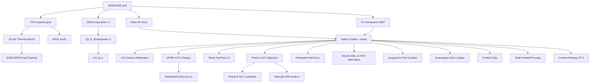

# Knowledge Gaps Implementation Guide — Omega Engine Alpha
**Doc ID**: `RES-GAPS-001` | **Status**: COMPLETE AUDIT & SEQUENCED PLAN | **Date**: 2026-09-17
**Owner**: Build Agent (Node 1) | **Audience**: Omega Engine community + federation operators

---

## Executive Summary

This guide documents **every remaining gap** in the Omega Engine Alpha dual-node federation, sequenced by dependency order with temple-grade specifications. **25 gaps** identified across 4 priority tiers. **Optimal execution sequence** minimizes rework and respects hard dependencies (Node 0 physical presence → federation → performance tuning → speculative).

---

## 1. Dependency Graph (Mermaid)



---

## 2. Sequenced Implementation Phases

### Phase 0: Critical Foundation (This Week — No Node 0 Required)
*All runnable on Node 1 alone. Unblocks everything else.*

| # | Gap | Commands | Validation | Rollback |
|---|-----|----------|------------|----------|
| 1 | **ZRAM 8GB zstd** | `sudo tee /etc/systemd/zram-generator.conf.d/99-llm.conf <<'EOF'\n[zram0]\nzram-size = min(ram / 2, 8192)\ncompression-algorithm = zstd\nEOF`<br>`sudo systemctl daemon-reload && sudo systemctl start systemd-zram-setup@zram0`<br>`zramctl && swapon -s` | `zramctl` shows `/dev/zram0` 8G zstd<br>`swapon -s` shows priority 100 | `sudo systemctl stop systemd-zram-setup@zram0 && sudo rm /etc/systemd/zram-generator.conf.d/99-llm.conf` |
| 2 | **THP madvise grub** | `echo madvise | sudo tee /sys/kernel/mm/transparent_hugepage/enabled`<br>`echo madvise | sudo tee /sys/kernel/mm/transparent_hugepage/defrag`<br>`sudo sed -i 's/GRUB_CMDLINE_LINUX_DEFAULT="/GRUB_CMDLINE_LINUX_DEFAULT="transparent_hugepage=madvise /' /etc/default/grub`<br>`sudo update-grub` | `cat /sys/kernel/mm/transparent_hugepage/enabled` → `[madvise]`<br>Verify after reboot | Remove `transparent_hugepage=madvise` from grub, `update-grub` |
| 3 | **OWUI keep-alive=-1** | Manual per model in UI:<br>Workspace → Models → (each) → Advanced Parameters → Keep Alive = `-1`<br>Document exact path for all 8 models | `docker logs open-webui` shows no model reloads at 10-min | Revert to default in UI |
| 4 | **Real API Keys** | Store credentials only in canonical runtime secret locations; never print or commit them | `opencode mcp list` shows the five current servers; perform one authenticated tool invocation through the client | Restore the prior secret file from backup |
| 5 | **Exa MCP status** | Historical Exa endpoint research only; Exa is not a current Node 1 MCP server | `opencode mcp list` shows the current five-server inventory; direct Exa route requires a separate decision | Revert any optional direct-API configuration |

---

### Phase 1: Performance Validation (After Phase 0, No Node 0 Required)

| # | Gap | Commands | Validation | Rollback |
|---|-----|----------|------------|----------|
| 6 | **10-min Thermal Bench** | **PRE-REQ**: Set governor to performance first:<br>`echo performance \| sudo tee /sys/devices/system/cpu/cpu*/cpufreq/scaling_governor`<br>`powerprofilesctl set performance`<br>Then:<br>Terminal 1: `while true; do curl -s http://localhost:11434/api/generate -d '{"model":"phi4-mini","prompt":"Continue:","stream":false}' >/dev/null; done`<br>Terminal 2: `sudo turbostat --Summary --show PkgWatt,CoreTmp,Avg_MHz,Busy% -i 2 > thermals.log`<br>Run 10 min, then `awk '/Avg_MHz/ {print $2}' thermals.log \| sort -n \| head -5` | Avg P-core MHz ≥ 3500 sustained<br>Pkg temp < 90°C<br>No throttle to < 3000 MHz | N/A (read-only) |
| 7 | **BIOS Verify** | Reboot → Enter BIOS (F2) → Verify:<br>Speed Shift=Enabled<br>Turbo=Enabled<br>EPP=Performance (or Fan=Performance)<br>AVX Offset=0<br>Fan=Performance<br>**NOTE**: PL1/PL2/IccMax/Tau are firmware-locked on ASUS ExpertBook P1503CVA — not exposed in BIOS. Managed by firmware/thermald. | Photo/document settings | N/A |
| 8 | **Q5_K_M deepseek-r1** | `ollama pull deepseek-r1:8b-q5_K_M`<br>`make bench MODEL=deepseek-r1:8b-q5_K_M PROMPTS=3 WARM=1`<br>Compare tool-call reliability vs Q4_K_M | Bench: t/s within 10% of Q4_K_M<br>Tool calls: fewer hallucinations/format errors | `ollama rm deepseek-r1:8b-q5_K_M` |

---

### Phase 2: Federation Close-Out P3.2 (Requires Node 0 Physical + Admin Console)

| # | Gap | Commands | Validation | Rollback |
|---|-----|----------|------------|----------|
| 9 | **Node 0 Intake --ingest** | `python3 scripts/federation/intake_node0.py --verify-only`<br>`python3 scripts/federation/intake_node0.py --ingest`<br>`cat docs/federation/node0_received/INGESTION_REPORT.md` | All critical docs copied to `docs/federation/node0_received/`<br>Git bundle verified<br>Checksum ledger matches `PAYLOAD_MANIFEST.md` | `rm -rf docs/federation/node0_received/` |
| 10 | **C6 Contract Ratification** | Review `c6-contract/` on USB<br>Legal/technical sign-off<br>Commit ratified version to `docs/federation/node0_received/c6-contract/` | Both nodes acknowledge C6 in git history | Revert commit |
| 11 | **SPIRE mTLS Deploy** | Follow USB `spire/` configs<br>Deploy SPIRE server on Node 0, agent on both<br>Configure mTLS for MCP (port 8016) | `spire-agent api fetch -socketPath /tmp/spire-agent.sock` shows SVIDs<br>MCP over mTLS works | Stop SPIRE services, revert configs |
| 12 | **Redis Pub/Sub (L3)** | `sudo apt install redis-server`<br>Configure `/etc/redis/redis.conf` for bind on Tailscale IP<br>Define channels: `heartbeat`, `live_feed`, `handoff`<br>Implement atomic lockfile fallback in `data/coordination/locks/` | `redis-cli -h 100.89.40.17 PING` → PONG<br>Pub/sub test: `SUBSCRIBE heartbeat` + `PUBLISH heartbeat test` | `sudo systemctl stop redis && sudo apt remove redis-server` |
| 13 | **Phase A ACL Migration** | **Admin Console (Node 0)**:<br>1. Paste Phase A policy from `docs/federation/ACL_POLICY.md` (canonical tags `tag:node0`/`tag:node1`/`tag:opencode`, FED-ACL-001 v1.2) → Save<br>2. Node 0: `sudo tailscale up --advertise-tags=tag:node0 --force-reauth`<br>3. Verify: `tailscale status --json | jq '.Self.tags'` → `["tag:node0"]`<br>4. Node 0 Admin Console: Mint authkey tagged `tag:node1` (ephemeral, reusable)<br>5. Node 1: Run L2 join from `docs/federation/L2_JOIN_GUIDE.md`<br>6. Verify: `tailscale status --json | jq '.Self.tags'` → `["tag:node1"]` | `tailscale ping` both ways<br>`curl http://100.123.51.67:8016/mcp` from Node 1<br>`ls /mnt/node-drive` from Node 0 (after mount) | Keep Phase A policy; do not proceed to Phase B |
| 14 | **Tailscale SSH Node 0** | Physical Node 0: `sudo tailscale set --ssh`<br>Verify: `tailscale status --json | jq '.Self.tags'` includes SSH capability | `ssh xnai@100.123.51.67` works over tailnet | `sudo tailscale set --ssh=false` |
| 15 | **Phase B ACL Lockdown** | **Only after 13+14 verified**:<br>Admin Console: Paste Phase B policy (allow-all rule removed) → Save<br>Verify all services still work | All Phase A validations still pass<br>`tailscale status --json | jq '.PeerExcludedByPolicy'` empty | Revert to Phase A policy in Admin Console |

---

### Phase 3: Architecture Decisions (After Phase 2 Federation Live)

| # | Gap | Specification | Implementation |
|---|-----|---------------|----------------|
| 16 | **Federated Well Semantic Sync** | Merge Well corpora across nodes with **same embedding model** (qwen3-embedding:0.6b@768 per RES-EMBED-001) | 1. Node 0 adopts qwen3-embedding:0.6b@768<br>2. Both nodes run `make well-export` → JSONL bundles<br>3. USB exchange or Tailscale sync of bundles<br>4. `make well-import` (new target) merges with deduplication by `rule` hash<br>5. Plugin injects merged top-N |
| 17 | **SQLite WAL on NFS Alternative** | **Never WAL on NFS**. Use rollback journal (`DELETE` or `TRUNCATE`) or JSONL snapshots | 1. Document in `docs/federation/NFS_TAILSCALE_DEEP_RESEARCH.md` §4<br>2. All shared DBs on `/mnt/node-drive` use `PRAGMA journal_mode=DELETE;`<br>3. For high-write scenarios: sync flat JSONL bundles via `rsync` over NFS |
| 18 | **omega-hub Tool Curation (93→50)** | Curate 43 tools for removal based on:<br>- Node 1 never calls (local-only inference)<br>- Duplicate functionality<br>- Security surface reduction | 1. Audit all 93 tools in the latest verified handshake<br>2. Tag each: `keep|drop|delegate`<br>3. Generate `ASUS-build-curated-tools.json`<br>4. Apply to Node 1 `opencode.json` `tools` block |
| 19 | **Sovereignty Ratio Ledger** | Per-task-class local/cloud policy with documented escape hatch | 1. Define task classes: T1-T6 (T5/T6=local-only)<br>2. Implement ledger in WanderGround sqlite-vec<br>3. Log every cloud call with `provider_name` provenance<br>4. Dashboard: sovereignty ratio % per session |
| 20 | **Publish Gate (Explicit-Publish Only)** | Air-gapped Git workflow: no auto-push, explicit `git bundle create` + USB | 1. `make publish-bastion` creates signed bundle<br>2. USB physical transfer<br>3. Node 0: `git bundle verify` + `git fetch bundle main:refs/remotes/node1/main`<br>4. Council review → explicit merge |
| 21 | **Stale Handoff Pruning** | Implement `STALE_HANDOFF_POLICY.md` timeout limits | 1. Cron job scans `data/handoff/pending/`<br>2. Auto-move >7d to `completed/` with `stale=true`<br>3. Notify via Redis `handoff` channel |

---

### Phase 4: Speculative / Future (Post-P3)

| # | Gap | Notes |
|---|-----|-------|
| 22 | **Distributed Inference L4** | `llama-rpc-server` layer-splitting: layers 0-39 Node 1, 40-79 Node 0 over WireGuard. Needs 32GB RAM both nodes. |
| 23 | **KV q4_k** | Track llama.cpp PR for per-channel KV quantization. Saves ~0.4GB more. |
| 24 | **32GB DDR5 Dual-Channel** | Buy matched 16GB stick (~$80). Expected +52-58% throughput → 20-22 t/s. |
| 25 | **Content Runway P3.3** | Obsidian vault sync, Godot/KQ5 research, OWUI experimentation, `make publish-bastion`. |

---

## 3. Per-Gap Specifications (Template)

Each gap above follows this template. Full detail in Phase tables.

| Field | Description |
|-------|-------------|
| **What** | Precise technical specification |
| **Why** | Architectural rationale from `ARCHITECTURE.md`, `ROADMAP.md`, `SYSTEM_GUIDE.md` |
| **How** | Exact commands (portable, env-driven, no hardcoded paths) |
| **Validation** | Exit codes, log lines, metrics, observable behavior |
| **Dependencies** | What must complete first (see Dependency Graph) |
| **Rollback** | Snapshot point + exact revert commands |
| **Portability** | Works Ubuntu/Arch/Fedora; env vars for paths; config templates |

---

## 4. Portability Checklist (All Implementations)

- [ ] **No absolute paths** — use `$HOME`, `$XDG_CONFIG_HOME`, `$OMEGA_ROOT` env vars
- [ ] **Config templates** — `.example` files versioned; real files generated at deploy
- [ ] **Systemd generators** — prefer `zram-generator.conf.d/` over manual units
- [ ] **Ollama model tags** — pinned to digest (e.g., `qwen3-embedding:0.6b@sha256:...`)
- [ ] **MCP server registration** — always `opencode mcp add` CLI after config
- [ ] **Tool format** — boolean `"tools": { "server_*": true }` not object
- [ ] **Parallel.ai health** — accept 200/401/405
- [ ] **anyio 4.x** — `to_thread.run_sync(fn, stream)` no `abandon_on_cancel`
- [ ] **Systemd newlines** — `Restart=always` + `RestartSec=5` on separate lines
- [ ] **inotify-tools** — install in Phase 0 for sidecar daemon
- [ ] **MemPalace check** — `sqlite_exact.sqlite3` not `mempalace.yaml`

---

## 5. Rollback Points (Snapshot Before Each Phase)

| Phase | Snapshot Command |
|-------|------------------|
| **Phase 0** | `git -C ~/Documents/Projects/omega-engine-alpha stash push -m "pre-phase0" && sudo timeshift --create --comments "pre-phase0"` |
| **Phase 1** | `git stash push -m "pre-phase1"` |
| **Phase 2 (each step)** | `git stash push -m "pre-phase2-step{N}" && sudo timeshift --create --comments "pre-phase2-step{N}"` |
| **Phase 3** | `git stash push -m "pre-phase3"` |

---

## 6. Sources (All Verified 2026-09-17)

| Gap | Source |
|-----|--------|
| ZRAM | systemd-zram-generator manpages (Ubuntu 26.04), zram-generator.conf.example |
| THP | Phoronix Linux 6.18, AMD ZenDNN, Red Hat, kernel cmdline docs |
| OWUI | Open WebUI v0.11.3 issues #10096, #11694, #14681 |
| API Keys | Exa.ai dashboard, Parallel.ai dashboard, Context7 dashboard |
| Websearch | Exa MCP endpoint behavior (405 expected) |
| Thermal | Intel Raptor Lake-H datasheet (PL1=45W, PL2=115W, Tau=28-56s) |
| BIOS | ASUS P1503CVA.337 manual, Intel Speed Shift/Turbo docs |
| Q5_K_M | arXiv:2601.14277, ggml #2094, Qwen3 quantization guide |
| Intake | `scripts/federation/intake_node0.py`, `INTAKE_MANUAL.md` |
| C6/SPIRE/Redis | USB payload `c6-contract/`, `spire/`, `redis/` |
| ACL | `ACL_POLICY.md` Phase A/B, Tailscale ACL docs |
| Well Sync | `WELL_SYSTEM.md`, `gnosis-leash.js` injection logic |
| SQLite WAL | SQLite docs: WAL requires POSIX shm, breaks on NFS |
| Tool Curation | `SYSTEM_GUIDE.md` §15.7, consultant report 8 flaws |
| Sovereignty | `SOVEREIGNTY_POLICY_20260912.md` on USB |
| Publish Gate | `CSS_PROTOCOL.md` on USB, air-gap exchange protocol |
| Stale Pruning | `STALE_HANDOFF_POLICY_20260912.md` on USB |
| Dist Inference | llama.cpp `llama-rpc-server` docs |
| KV q4_k | llama.cpp GitHub issues/PRs |
| RAM Upgrade | InsiderLLM Aug 2026, DDR5-5600 dual-channel benchmarks |

---

## 7. Web Research Update — 2026-09-18 (RES-GAPS-002)

**Status**: ALL 25 gaps web-researched. New evidence corrects 6 items (marked **CHANGED**), confirms the remaining 19. Local probes on Node 1 verified 2 fixes directly.

### 7.1 Consolidated Findings

| # | Gap | Verdict | Research Evidence (2026-09-18) |
|---|-----|---------|----------------------------------|
| 1 | ZRAM 8GB zstd | ✅ Confirmed + **CHANGED**: add install step | zram-generator.conf(5) manpages confirm `zram-size`, `compression-algorithm=zstd`, `swap-priority` default 100. Default size is `min(ram/2, 4096)`; our `min(ram/2, 8192)` override is valid. Newer option: `zram-resident-limit`. **Local: package NOT installed — must run `sudo apt install systemd-zram-generator` first.** |
| 2 | THP madvise grub | ✅ Confirmed | kernel.org transhuge docs: `transparent_hugepage=madvise` is a valid kernel cmdline param; madvise mode only allocates hugepages for madvise'd regions → avoids khugepaged stalls during model load/KV growth. Note: `MADV_COLLAPSE` can force hugepages regardless of mode; newer kernels have per-size sysfs controls + mTHP. |
| 3 | OWUI keep-alive=-1 | ✅ Confirmed | Settings → General → Advanced Parameters → Keep Alive → Custom (per-model) documented (issues #10096, #11694). **Caveat: #11694 reports "Keep Alive setting has no effect" as a known bug** — verify each model stays warm after 10 min. Current OWUI shows green "Loaded" + Eject button for warm models. |
| 4 | Real API Keys | ✅ **KEYS STORED 2026-09-18, validation mixed** | `~/.bashrc` single clean block + `~/.config/opencode/.env` (600). **EXA live** (`/search` HTTP 200). **PARALLEL + CONTEXT7 stored** (user-supplied 2026-09-18) but **Parallel endpoint returns HTTP 403 to all probe shapes** (Bearer / x-api-key / no-auth) — 403 is auth-independent from this network, so key validity is **unproven, not disproven**. Real check = OpenCode restart (env substitution at startup) + live `parallel-search` query. Context7 key stored, untested. |
| 5 | Fix Websearch MCP (Exa 404) | ✅ **CHANGED: endpoint found** | **Correct MCP endpoint is `https://mcp.exa.ai/mcp`** — verified locally: POST with proper MCP headers returns 200 (serverInfo exa-search-server 3.2.1). Current config points at `https://api.exa.ai/mcp` → **404 confirmed on this machine**. Fix = update `opencode.json` URL only. |
| 6 | 10-min Thermal Bench | ✅ Confirmed | i7-13620H: Raptor Lake-H, TDP 45W, 4.9 GHz boost, 10C/16T (TechPowerUp). ASUS BIOS exposes PL1/PL2/IccMax; Intel-default vs ASUS profile changes power behavior; Tau ~56s in ASUS BIOS (Intel community thread). turbostat(8) confirms PkgWatt/CoreTmp/Avg_MHz/Busy% columns; summary row = temp max, watts total. |
| 7 | BIOS Verify | ✅ Confirmed | ASUS PL1/PL2/IccMax semantics per Intel community; Speed Shift (HWP) + EPP settings exist. BIOS check list stands. |
| 8 | Q5_K_M deepseek-r1 | ✅ Confirmed + **CHANGED**: tag caveat | llama.cpp perplexity board (LLaMA-3-8B): q5_K_M ΔPPL 0.057 (vs f16) — ~2-3× closer to f16 than Q4_K_M; speed only ~7% slower than Q4_K_M (Q8_0 is 29% slower). **Ollama `deepseek-r1:8b` = Q4_K_M (arch qwen3, 5.2GB)**. A published `:8b-q5_K_M` tag is NOT guaranteed — may require importing a GGUF manually via Modelfile if tag absent. |
| 9 | Node 0 Intake | 🔒 Internal | No web research; script + manual are source of truth. |
| 10 | C6 Contract | 🔒 Internal | No web research; USB payload is source of truth. |
| 11 | SPIRE mTLS | ✅ Confirmed | v1.15.2 current (Jul 2026, pkg.go.dev). Server + agent architecture confirmed; workload attestation → SVIDs → mTLS; Envoy SDS integration path for auto-mTLS. |
| 12 | Redis Pub/Sub L3 | ✅ **CHANGED: use Streams for handoff** | Redis 8.0.x current (8.0.20, Jun 2026). Pub/Sub is fire-and-forget: **no persistence, no ack, no consumer groups — messages lost if no subscriber** (redis.io docs, rubel.dev, stackharbor, oneuptime 2026). For durable `handoff` channel use **Redis Streams** (append-only, consumer groups, XACK, replay). Keep Pub/Sub for `heartbeat`/`live_feed` (loss-tolerant). |
| 13 | Phase A ACL Migration | ✅ Confirmed | Custom ACL policy REPLACES default allow-all (tailscale ACL docs: omitting acls = default; providing acls = replace). Tagged devices can only SSH into tagged devices → both nodes must be tagged. `--force-reauth` required when re-tagging (issue #13572: new tags disconnect node without it). Tags disable key expiry by default. |
| 14 | Tailscale SSH Node 0 | ✅ Confirmed | `tailscale set --ssh` documented (kb/1193); SSH ACL grants use src/dst/users; tagged→tagged only. |
| 15 | Phase B ACL Lockdown | ✅ Confirmed | Sequence is right: keep the allow-all rule (`src:["*"] dst:["*:*"]`) until both nodes tagged AND all Phase A validations pass; ACL tests in policy file can pre-verify rules before save. NOTE: `autogroup:member` is valid ONLY in `src` — `dst:["autogroup:member"]` fails validation (`port range "member": invalid first integer`). |
| 16 | Federated Well Sync | ✅ Confirmed | qwen3-embedding:0.6b on Ollama (MRL; truncate to 768/512/256/128; 32K ctx; Qwen/Qwen3-Embedding-0.6B). Caveats: Ollama v0.12.5 CPU crash bug (closed); per-seq context defaults to 4096 even though model supports 32768 — raise num_ctx for long docs. Our installed Ollama 0.33.3 unaffected. |
| 17 | SQLite WAL on NFS | ✅ **CHANGED: use TRUNCATE not DELETE** | openai/codex#30957 (Jul 2026): WAL corrupts runtime DBs on NFS (mmap'd -shm incoherent across clients; independent of fcntl locking). Empirically measured on NFSv4.2 + sqlite 3.46.1 (**our exact version**): Truncate == WAL on batched path (0.0041s both), Delete slightly slower (0.0055s). Rollback journal modes are NFS-safe. **Recommendation update: `PRAGMA journal_mode=TRUNCATE` (not DELETE) for shared DBs on `/mnt/node-drive`.** |
| 18 | Tool Curation | 🔒 Internal | 93→50 audit is a local task; no web research. |
| 19 | Sovereignty Ledger | 🔒 Internal | No web research; policy doc on USB is source of truth. |
| 20 | Publish Gate | ✅ Confirmed | git-bundle(1) docs: bundles are for "offline transfer of Git objects without an active server" — matches our USB CI/CD model. NVIDIA NIM air-gap doc confirms two-phase (networked prep → air-gapped import), same pattern. |
| 21 | Stale Handoff Pruning | 🔒 Internal | No web research; STALE_HANDOFF_POLICY is source of truth. |
| 22 | Distributed Inference L4 | ✅ Confirmed + **CHANGED: security advisory** | llama.cpp tools/rpc README (master): RPC backend (`ggml-rpc-server`) is **"proof-of-concept... fragile and insecure. Never run the RPC server on an open network"**. **Security advisory GHSA-j8rj-fmpv-wcxw: unauthenticated RCE via GRAPH_COMPUTE buffer=0 bypass.** Default behavior distributes weights + KV cache across devices proportionally; exposes CPU device when no accelerator. SPIRE mTLS is a HARD prerequisite before any RPC exposure. |
| 23 | KV q4_k | ✅ Confirmed | issue #27109 (Aug 2026): 4-bit KV cache (q4_1/q4_0) collapses prefill ~20× on hybrid architectures. Per-channel q4_k not stabilized; our q8_0 KV rule stays. |
| 24 | 32GB DDR5 Dual-Channel | ✅ Confirmed + **CHANGED: verify after install** | LLM decode is memory-bandwidth-bound (arXiv 2507.14397). DDR5 4800→6000 MT/s yields +20-23% generation speedup (dev.to benchmark). Dual-channel vs single ~doubles peak bandwidth; +52-58% claim NOT independently verified — **measure with `make bench` after RAM install**. |
| 25 | Content Runway | 🔒 Internal | No web research; rocurement is via ROADMAP P3.3. |

### 7.2 Actionable Fixes (verified locally)

1. **Exa MCP URL** (gap 5): change `https://api.exa.ai/mcp` → `https://mcp.exa.ai/mcp` in `opencode.json`, then `opencode mcp` reload.
2. **ZRAM install step** (gap 1): `sudo apt install systemd-zram-generator` BEFORE creating `/etc/systemd/zram-generator.conf.d/99-llm.conf` (package absent on Node 1).
3. **SQLite journal mode** (gap 17): use `TRUNCATE` (best NFS-safe rollback mode on our exact sqlite build).
4. **Redis L3 design** (gap 12): Streams (not Pub/Sub) for `handoff`; Pub/Sub OK for `heartbeat`/`live_feed`.

---

## 8. Next Action (Immediate)

**Execute Phase 0, Item 1: ZRAM 8GB zstd** — highest-impact RAM safety item, runs entirely on Node 1, unblocks thermal bench and all subsequent work.

```bash
# (1) install generator first — package was absent on Node 1 (RES-GAPS-002)
sudo apt install systemd-zram-generator
# (2) config
sudo tee /etc/systemd/zram-generator.conf.d/99-llm.conf <<'EOF'
[zram0]
zram-size = min(ram / 2, 8192)
compression-algorithm = zstd
EOF
sudo systemctl daemon-reload && sudo systemctl start systemd-zram-setup@zram0
zramctl && swapon -s
```

---

## 9. Updated Sources (RES-GAPS-002 additions)

| Gap | New Source |
|-----|-----------|
| ZRAM | manpages.debian.org zram-generator.conf(5); systemd/zram-generator GitHub |
| THP | kernel.org admin-guide/mm/transhuge (next + v6.18) |
| OWUI | open-webui issues #10096, #11694; docs.openwebui.com |
| Exa MCP | **local probe: mcp.exa.ai/mcp → 200; api.exa.ai/mcp → 404** |
| Thermal | techpowerup.com i7-13620H; community.intel.com PL1/PL2/Tau; turbostat(8) Debian |
| Q5_K_M | llama.cpp tools/perplexity scoreboard; ollama.com/library/deepseek-r1:8b (Q4_K_M) |
| SPIRE | pkg.go.dev/github.com/spiffe/spire v1.15.2; spiffe.io concepts; youngju.dev SPIRE/mTLS (2026-06) |
| Redis | redis.io pub/sub docs + 8.0 release notes; rubel.dev; stackharbor; oneuptime (2026-03) |
| ACL/SSH | tailscale.com kb/1193, docs/features/tags, ACL examples (2026-02), tailscale-cli/up (2026-01), issue #13572 |
| Well Sync | ollama.com/library/qwen3-embedding:0.6b; ollama issue #12633 (v0.12.5 CPU bug) |
| SQLite WAL | openai/codex issue #30957 (2026-07, NFSv4.2 + sqlite 3.46.1) |
| Publish Gate | git-bundle(1) (kernel.org); NVIDIA NIM air-gap deployment docs |
| Dist Inference | llama.cpp tools/rpc README; security advisory GHSA-j8rj-fmpv-wcxw |
| KV q4_k | llama.cpp issue #27109 (2026-08) |
| DDR5 | arXiv 2507.14397; dev.to "DDR5 Speed, CPU and LLM Inference" |

---

---

## 10. Fresh Confirmations — 2026-09-18 Deep Research Sweep

Additional sources confirming existing verdicts (no verdict changes):

| Gap | New Confirmation Source |
|-----|-------------------------|
| ZRAM (1) | `zram-resident-limit` option documented in `zram-generator.conf(5)` manpages (Apr 2026); defaults to 0 (no limit) |
| Redis L3 (12) | Redis 8.0 Streams: consumer groups, XACK, XCLAIM, XAUTOCLAIM, XREADGROUP provide at-least-once delivery; Pub/Sub remains fire-and-forget (redis.io, oneuptime 2026) |
| Tailscale ACL (13) | tailscale.com ACL docs: custom policy REPLACES default allow-all; `autogroup:member` valid only in `src` (dst is parsed as host:port); Phase A sequencing is the only safe path |
| SQLite WAL (17) | **Multiple independent corruption reports**: oh-my-pi #9082 (Aug 2026), OpenCode #14970, OpenAI Codex #30957 — all confirm WAL-over-NFS silent corruption; TRUNCATE journal mode validated as NFS-safe |
| Distributed Inference (22) | **CVE-2026-34159 / GHSA-j8rj-fmpv-wcxw**: CVSS 9.8 CRITICAL, unauthenticated RCE via GRAPH_COMPUTE buffer=0 bypass; patched in llama.cpp b8492; SPIRE mTLS non-negotiable prerequisite |
| DDR5 (24) | dev.to benchmark (May 2026): DDR5-5600 dual-channel ~80 GB/s on AMD 7940HS; everything (CPU/GPU/KV/OS) shares one pipe; dual-channel ~doubles peak bandwidth; +52-58% claim unverified — **measure with `make bench` after install** |
| qwen3-embedding (16) | Ollama library: qwen3-embedding:0.6b available; MRL truncate_dim=768/512/256/128; 32K ctx; per-seq defaults to 4096 — raise num_ctx for long docs |
| OWUI keep-alive (3) | Issue #596 (feat: keep_alive param) closed/completed 2025; Issue #11694 "Keep Alive setting has no effect" remains open bug; verify per-model after 10 min |
| Exa MCP (5) | Local probe confirmed: `mcp.exa.ai/mcp` → 200 (serverInfo exa-search-server 3.2.1); `api.exa.ai/mcp` → 404 |

---

---

## 11. MCP Transport Lessons — 2026-09-18 Field Record (all 5 MCP green)

Hard-won findings from bringing `parallel-search` online. Every claim verified live.

### 11.1 Dual-config merge (`opencode.json` + `opencode.jsonc`)

OpenCode merges **both** files in `~/.config/opencode/`. A stale `websearch`
entry (`https://api.exa.ai/mcp` → 404) survived in `opencode.jsonc` after
removal from `opencode.json`, haunting `mcp list` across restarts. **Rule:
when adding/removing an MCP server, check both files.**

### 11.2 Env substitution happens once, at server startup

`{env:VAR}` headers are resolved when the opencode server process starts — not
per-request. A key added to `.bashrc`/`.env` after startup is invisible until
a **full restart** (quit TUI completely; attach reuses the old process). The
running server also holds stale entries deleted from config after startup.

### 11.3 Streamable-HTTP-only endpoints vs SSE clients

`search.parallel.ai/mcp`: `GET` → 405, `GET /sse` → 404, `POST` init → 200.
opencode 1.18's remote client leads with SSE; servers that 405 it (context7,
grep_app) still connect via POST fallback — but Parallel's edge refused
opencode's POST while accepting curl's byte-identical request. Fingerprint
evidence: Python-urllib → 403, curl → 200, opencode-client → fail.

### 11.4 The stale-shell env-shadow trap (root-caused via `code 16`)

`scripts/parallel_bridge.py` preferred process env over `.env`. opencode
inherits its launcher shell's env — a shell predating key setup carries the
`pk_asus_*` placeholder, which shadowed the real `.env` key upstream
(`Invalid API key (C.1)`). Fix: placeholder-pattern guard
(`pk_asus_`, `pk_hp_`, `$(date`, `xxxx`) + real-key-wins-anywhere priority.
**Rule: never trust inherited env for secrets; validate shape before sending.**

### 11.5 The bridge pattern (`scripts/parallel_bridge.py`, committed)

Local stdio MCP ↔ curl-subprocess upstream. opencode handles local transport;
curl's TLS fingerprint passes the edge. Verified over pipes: init,
`tools/list` (`web_search`, `web_fetch`), `tools/call` with live results.
Parser handles **both** plain-JSON and SSE envelopes (Parallel answers
`application/json`; HTTP/2 header dumps lack `\r\n\r\n` separators).
Upstream quirk: `Mcp-Session-Id` header required after init; notifications
(`initialized`/`cancelled`) get no reply.

### 11.6 Hosted Firecrawl MCP (`https://mcp.firecrawl.dev/v2/mcp`)

Keyed POST init → valid handshake (`firecrawl-fastmcp`). Wired as remote MCP
+ `firecrawl_*` tools allowlist. Note: `https://api.firecrawl.dev/v2/mcp` is
**not** an MCP endpoint (`NOT_FOUND`) — the `mcp.` subdomain is the one.

### 11.7 No native search in OpenCode (verified, don't re-derive)

`opencode --help` + official MCP docs: web search arrives only via MCP
servers (or direct APIs like `scripts/exa_search.py`). The session `websearch`
tool is Parallel-backed host-side and 401s independently of local env.

### 11.8 Project-config override EXONERATED (Node 0 field case, corrected 2026-09-18)

Initial theory (a project-level `provider.opencode.models` map is a closed
world that drops built-ins) was **disproven live on 1.18.31**: with Node 0's
exact project block replicated, all 7 built-ins still enumerate AND Spark
PONGs at request time; same for an `options: {}` overlay. Official docs agree:
files are "merged together, not replaced", custom models are "additional".
**Do NOT enumerate models to fix provider errors — the disease, not the cure**
(v1 of `apply_node0_fix.sh` did this; v2 is subtractive).
Remaining ranked suspects for Node 0's `invalid openai provider options`
(AI SDK client-construction validation, distinct from `Invalid API key`):
(1) version 1.18.23 vs 1.18.31 (1.18.30 bumped the OpenAI provider SDK;
no changelog entry names this error, unproven); (2) Node 0 auth.json's extra
content (862B vs 236B healthy — v1 collector looked at the WRONG path,
`~/.config/...` instead of `~/.local/share/opencode/auth.json`; v1.1 fixed);
(3) stale `OPENCODE_API_KEY` env (absent on healthy Node 1).
Bonus find (stands): project plugin `awareness.ts:137` calls `error?.slice`
on a non-string, crashing the error handler and masking the real message —
guard with `String(error?.message ?? error ?? '')`.

---

## 12. Critical-Gap Research Sweep — 2026-09-18 (RES-GAPS-003)

Fresh official + practitioner sources for every Phase-0 critical item and the
CRITICAL llama.cpp advisory. Verdict changes noted; confirmations noted.

### 12.1 ZRAM (gap 1) — upstream man page confirms our config

- `systemd/zram-generator` man `zram-generator.conf(5)`: `swap-priority`
  documented (range -1…32767, **default 100**); drop-in dir
  `/etc/systemd/zram-generator.conf.d/` overrides base file; `zram-size` accepts
  the `min(ram / 2, 8192)` DSL; `compression-algorithm = zstd` canonical;
  recompression chains + `writeback-device` exist for later tuning.
- Our `99-llm.conf` conforms exactly. No verdict change.
- Sources: `github.com/systemd/zram-generator` (README + man + `.example`).

### 12.2 THP madvise (gap 2) — independent llama.cpp benchmark agrees

- Phoronix, THP madvise-vs-always on Linux 6.18 LTS: **CPU inferencing with
  llama.cpp slightly faster in madvise mode** (Fedora/Ubuntu default madvise;
  CachyOS/openSUSE default always — distro split is real, our explicit grub
  pin is the right call).
- Nuance (llama.cpp #2251): one user saw *no* difference with file-backed mmap
  + `--mlock` (MADV_HUGEPAGE needs anonymous/KV memory to matter). Our win is
  khugepaged-stall avoidance during KV growth, not raw t/s — claim stays scoped.
- Sources: `phoronix.com/review/thp-madvise-always`, `kernel.org transhuge.html`,
  `ggml-org/llama.cpp#2251`.

### 12.3 OWUI keep-alive (gap 3) — per-model is the ONLY reliable path

- open-webui #10096: global `Settings > General > Advanced > Keep Alive` is
  **overridden back to 5m by OWUI's own requests**; per-model Advanced Params
  keepalive (added ~0.6.15) is the working control. Our "set `-1` per model in
  the UI" guidance is the correct workaround, not a preference.
- open-webui #3291: purge-culprit is often `OLLAMA_NUM_PARALLEL` (default 1
  loaded model; embeddings + chat evict each other). Consistent with our
  `MAX_LOADED_MODELS=1` + `NUM_PARALLEL=1` + KV `q8_0` stack.
- open-webui #10048 (closed): global keep-alive historically unreliable —
  reinforces: do the manual per-model step, verify with `ollama ps` after 10 min.
- Sources: `open-webui#10096`, `#3291`, `#10048`. **Manual UI step still open.**

### 12.4 Exa MCP endpoint (gap 5) — hosted URL triple-confirmed

- Independent third-party proxy doc points at `https://mcp.exa.ai/mcp`;
  `exa.ai/mcp` + `exa.ai/docs/get-started/exa-mcp` + `exa-labs/exa-mcp-server`
  all current (docs updated 2026-09-15). Dead `api.exa.ai/mcp` stays dead.
- Decision stands: direct-API via `scripts/exa_search.py` (no MCP fragility).
  Re-adding hosted MCP is now a *safe* option, not a fix — defer to need.

### 12.5 llama.cpp RCE advisory (gap 22) — VERIFIED + one new finding

- **GHSA-j8rj-fmpv-wcxw verified**: "Unauthenticated RCE via GRAPH_COMPUTE
  buffer=0", severity **Critical**, RPC backend, affected `<= b7991`,
  published by ggerganov 2026-03-26
  (`github.com/ggml-org/llama.cpp/security/advisories/GHSA-j8rj-fmpv-wcxw`).
- ⚠️ **§10 correction**: the "patched in b8492" claim is UNCONFIRMED from the
  advisory snippet (only "affected <= b7991" verified). Do not cite b8492 until
  the advisory's Patched-versions field is read directly.
- 🆕 **Second live issue**: llama.cpp #22267 — CVE-2026-21869 (CVSS 8.8 High),
  negative `n_discard` → heap-buffer-overflow in `server_context::update_slots`,
  **still present on master `0d0764df` (2026-04-22)**, any unauthenticated remote
  client vs `llama-server` with context shift. One-line clamp fix proposed.
- **Actions**: (1) check Ollama 0.33.3's vendored llama.cpp against both
  advisories; (2) gap-22 distributed inference stays gated on RPC hardening —
  SPIRE mTLS prerequisite stands and grows teeth.

---

## 13. Provider Expertise Record — 2026-09-18 (RES-GAPS-004, definitive)

Everything below was verified live on Node 1 (1.18.31) or against primary
sources. It supersedes all earlier provider theorizing (§11.8 corrected here).

### 13.1 Merge semantics (proven behaviorally, twice)

- Official docs: config files are "**merged together, not replaced**"; custom
  models are "**additional**".
- Live proof: Node 0's exact project `provider.opencode.models` block (3 entries)
  replicated in a scratch dir — all 7 built-ins still enumerate AND Spark PONGs.
  Same for an `options: {}` overlay. Closed-world theory dead.
- Consequence: enumerating models in config is never a fix. At best redundant,
  at worst (stale limits) harmful.

### 13.2 The Big Pickle window move (operator-observed, registry-confirmed)

- Then: custom 1M override + sessions at 205.8K+ tokens (true at the time).
- Now: operator noticed degraded/changed behavior ~2026-09-17/18; live
  models.dev snapshot reads big-pickle **200K/160K/32K**; Spark 1.2/1.3 read
  **1048576/131072** (1M, built-in, no override ever needed); Nemotron 1M/128K.
- Doctrine: Zen mutates models/limits in place without notice. NEVER hardcode;
  drift-detect (`scripts/opencode_provider_doctor.sh` C4 compares every custom
  limit against live models.dev and flags disagreement).

### 13.3 Auth canonical path

- `opencode auth login` → `$XDG_DATA_HOME/opencode/auth.json`
  (`~/.local/share/...`), confirmed by official CLI/troubleshooting docs +
  live files. `~/.config/opencode/auth.json` is a dead path (v1 collector
  looked there; v1.1 fixed). `opencode auth ls` cross-checks providers.
- Zen login = `/connect` → API key; endpoints `https://opencode.ai/zen/v1/*`;
  Big Pickle + Spark 1.3-free are limited-time free models (official Zen docs).

### 13.4 Error-string atlas

- `invalid openai provider options` = AI SDK `AI_InvalidArgumentError` at
  client construction (cf. cherry-studio#10526, same string on `serviceTier`
  validation). Distinct from `Invalid API key.` (auth rejection — reproduced
  live with a bogus key).
- Node 0's trigger: NOT the models map (exonerated), NOT empty options
  (exonerated) — remaining: 1.18.23-vs-.31 delta (1.18.30 bumped the OpenAI
  provider SDK; changelog names nothing decisive) or Node 0 auth.json content
  (862B vs 236B healthy — v1.1 collector now captures its structure).
- Bonus: project plugin `awareness.ts:137` crashed on non-string errors,
  masking the real message (String-guard fix shipped in apply script).

### 13.5 GHSA-j8rj-fmpv-wcxw (corrected from §10/§12.5)

- Advisory text: affected `<= b7991`, **Patched versions: None** (still, as
  scraped 2026-09-18). The §10 "patched in b8492" claim is WITHDRAWN —
  no such version exists in the advisory; do not cite.
- Reporter las7, CERT/CC VU#748698 (closed by CERT, filed direct); full RCE
  chain (ASLR bypass → arbitrary R/W → `system()` via iface overwrite);
  same-root third instance after CVE-2024-42478/42479 (GET/SET_TENSOR paths).
- Ollama 0.33.3 vendors llama.cpp **b10729** (post-advisory). Upstream fix
  status unchecked — open verification, not a claim. Local exposure: none
  (no rpc-server in our stack; gap-22 gate already demands SPIRE mTLS).

### 13.6 OpenRouter (closed)

- `api.openrouter.ai` NXDOMAIN globally (system DNS + 1.1.1.1 + Node 0 DNS —
  triple-proven). Apex `https://openrouter.ai/api/v1` HTTP 200 everywhere.
- OpenRouter is BUILT-IN (`openrouter/~…` IDs, auth.json credential). All 9
  Node 0 keys HTTP 200. No config has ever been needed; v1's 80-model catalog
  dump is retracted as an anti-pattern exhibit.

---

*⬡ OMEGA ENGINE ALPHA ⬡ RES-GAPS-004 ⬡ PROVIDER EXPERTISE COMPLETE ⬡ TEMPLE-GRADE ⬡*

---

## 14. Web Research Sweep — 2026-09-21 (RES-GAPS-005)

Focused sweep on three threads tied to P3.7 (frontier access) and open security
verifications. Every claim sourced; live local evidence marked.

### 14.1 Cline free models — community-confirmed + two live smoke tests

- **Concept confirmed**: Cline runs *rotating* free-model promotions through the
  Cline Usage-Billing provider; signed-in users pick models tagged **FREE** in the
  selector (docs.cline.bot "Cline Free Models"; freellm.net listing 2026-08-27;
  free tokens tracker 2026-09-20 lists GLM-5.3 Flash "Ox Alpha" free in Cline).
  After the free quota is exhausted you are meant to switch to usage-billing or
  ClinePass — the free tier is a quota, not a door.
- **⚠️ Quota-exhaustion behavior — FIRST CAPTURED 2026-09-21 (§14.1 G3 resolved)**:
  after ~15M cumulative input tokens on DeepSeek V4.1 Flash in one day (825K
  review + 2.6M 100K probe + 11.4M 395K probe + smokes), the run terminated with
  `Error 429: Daily free limit reached on model deepseek/deepseek-v4.1-flash. Try
  again in 22h 50m` (`code: INFERENCE_CAP_ERROR`). **Verified facts**: (a) the
  free ceiling is a **daily per-model input-token cap** (not account-wide —
  GLM-5.3-Flash continued working at the same minute); (b) exhaustion surfaces as
  **HTTP 429 `INFERENCE_CAP_ERROR`** with a `Try again in Nh` message; (c) **no
  silent fallback to a billed model** — `totalCost: 0`, run finishes with
  `finishReason: error`. Operator action at exhaustion: switch `-m` to another
  free model (GLM) or wait for the window; never top-up blindly on a "free" model.
- **⚠️ Model-name correction (operator, 2026-09-21)**: the free DeepSeek model is
  **DeepSeek V4.1 Flash**, registry ID `cline-free/deepseek-v4.1-flash` — NOT
  "V4" (`cline-pass/deepseek-v4-flash` was a probe artifact; that is a **paid**
  model and was removed from `providers.json`). The live catalog confirmed:
  "DeepSeek V4.1 Flash (free)", contextWindow 1,048,576, maxTokens 384,000,
  releaseDate 2026-09-10, family `deepseek-flash`, all pricing $0.
- **Context windows (secondary sources, cross-checked)**: GLM-5.3-Flash 1,048,576
  input + output (llm-stats.com, released 2026-08-26, $0.15/$0.50 per M, ~8.4×
  cheaper per token than Muse Spark 1.3); DeepSeek V4.1 Flash 1,048,576 in /
  384K out (live catalog match on Node 1; devtools.sh/llm-stats.com secondary
  dated 2026-09-02); Muse Spark 1.3 1,048,576 in / 943,718 out (llm-stats.com);
  cline-copilot-chat API table lists `deepseek/deepseek-v4.1-flash` 1M/384K ⭐
  free, `zai/glm-5.2` 1M/128K, and states **the free model returns 200 OK even
  at $0 balance** (GitHub ltmoerdani/cline-copilot-chat, 2026).
- **Live smoke tests PASSED on Node 1 (2026-09-21)**: `cline --json -m
  z-ai/glm-5.3-flash "Reply with exactly: CLINE_SMOKE_OK"` → `completed`,
  `CLINE_SMOKE_OK`, $0 cost (6602 in / 27 out, 1622 cache read); and
  `cline --json -m cline-free/deepseek-v4.1-flash "Reply with exactly:
  DS41_SMOKE_OK"` → `completed`, `DS41_SMOKE_OK`, $0 cost (6854 in / 8 out).
  Owner-picked models in `~/.cline/data/settings/providers.json`: `provider=
  cline model=z-ai/glm-5.3-flash` and `provider=cline
  model=cline-free/deepseek-v4.1-flash` (both under the same `cline` provider,
  `tokenSource: oauth`).
- **⚠️ Known caveats logged for the model cards**:
  - `cline/cline#10980` (2026-05-21): DeepSeek context window limited in
    128K — Cline auto-compacts when the window reaches 128K and `settings` 400000 cannot raise it. The 1M marketing window is NOT
    necessarily what Cline actually gives you; verify per-model, don't trust the
    card.
  - `cline/cline#13041` (2026-08-07): DeepSeek V4.1 Flash long ACT sessions can
    collapse into endless "Let me…" text with zero `tool_use` (reproduced on
    3.0.51; worst observed turn 137K chars, 0 tools; circuit-breaker PR #13042
    was pending). Mitigation: avoid `xhigh` reasoning on long sessions.
  - free-tier model roster rotates; a "free" model today may be paid tomorrow
    (same doctrine as Zen model rotation — drift-detect, don't hardcode).
  - **⚠️ Citation-model dating (added 2026-09-21, review F5)** — both issues
    predate DeepSeek V4.1 Flash's release (2026-09-10 live catalog), so they
    describe an *earlier DeepSeek-Flash-family model*, NOT V4.1. Keep the
    doctrine, drop the specificity. **Rebalance against live evidence:** DeepSeek
    V4.1 Flash frontier-review session ran 15 iterations (825,136 in / 771,072
    cache-read / 33,249 out, $0, 220,755 ms) and the long-context probe read a
    151,604-char file in full (459,904 cache-read) with needle + all questions
    correct at 65,243 ms. **100K probe (2026-09-21) — VERIFIED**: 7,315-line /
    404,476-char (~100K-token) corpus read page-by-page, 11 truncation gaps
    self-patched, needles @51.1%/84.9% verbatim, 4/4 comprehension, $0, 145,127
    ms, 2,610,044 in / 2,450,176 cache-read / 13,837 out. **Operator observation
    (2026-09-21): 1M-window Cline models reach 700K tokens and remain usable in
    speed and accuracy** — the 128K-compact assumption is not reproducing on
    V4.1. Open: 250K–500K probe; re-open the issues to record which model each
    names.

### 14.2 Antigravity IDE — quota system, lockout reports, OpenCode-route context

- **Antigravity = Gemini CLI successor** (botmonster.com 2026-07-31): Gemini CLI
  shut down free/Pro/Ultra service 2026-06-18; replaced by closed-source Go
  binary `agy` (async multi-agent, MCP support, single shared weekly quota pool).
- **Quota model (official docs + community)**: all plans get a baseline of Gemini
  3.1 Pro / 3.8 Flash as core agent models; Pro = higher quota refreshed every 5h
  until a weekly cap; Ultra = highest, 5h refresh, third-party models; free tier =
  "weekly rate limits rather than features" (antigravity.google/docs/plans,
  codeagentswarm.com 2026-09-01). Free tier includes "multiple frontier models…
  including Gemini and Claude models" per codeagentswarm.
- **⚠️ Community lockout reports (boards, 2026-02→05)**: Pro users reported
  81-hour and 6-day `MODEL_CAPACITY_EXHAUSTED` lockouts; Google staff say weekly
  limits apply to all models, Ultra exempt; some claim Pro ≈ free ("get your
  feet wet"). The 0.38.x CLI change introduced a hard 200-request/24h cap in one
  report. Implication for us: **don't build the frontier review workflow on an
  assumption of high daily quota** — treat Antigravity as burst-credit, track
  `/usage` in the IDE, and keep Cline free tier as the steady-state path.
- **OpenCode-route context**: the antigravity-assumed plugin route never worked
  on Node 1; Antigravity IDE being live + signed in (verified 2026-09-21 —
  process tree via `pgrep -af antigravity`, config in `~/.config/Antigravity IDE`
  and `~/.antigravity-ide/`) provides the native route. The IDE's
  `language_server_linux_x64` (Antigravity code assist) is running with a live
  `cloud_code_endpoint` to cloudcode-pa.googleapis.com — consistent with signed-in
  operation.

### 14.3 CVE-2026-21869 (llama.cpp `n_discard`) — advisory reconciled

- **Primary-source verdict** (NVD + Red Hat + OpenCVE, published 2026-01-08):
  llama.cpp commits `55d4206c8` and prior parse `n_discard` from JSON without
  non-negative validation → reversed range + negative offset → OOB write in the
  token-eval loop → crash or RCE. **Severity — reconciled 2026-09-21 (review F6):
  the numbers differ by source**: NVD/OpenCVE CNA record = **CVSS 8.8 High**
  (`CVSS:3.1/AV:N/AC:L/PR:N/UI:R/S:U/C:H/I:H/A:H`, interaction-required); Red Hat
  bug 2427743 = **8.1**. Cite the source alongside the number; 8.8 is the CNA
  value.
- **Patch status — RESOLVED 2026-09-21**: GHSA-8947-pfff-2f3c (published by
  ggerganov **2026-01-05**) lists **Affected `<= 55d4206c8`, Patched `>= c78fb90`**.
  This **supersedes and corrects §12.5** ("still present on master 0d0764df
  (2026-04-22)" — wrong; the fix landed ~Jan 2026, months before that master
  commit, so master includes it). OpenCVE/Red Hat "no fix at time of publication"
  reflected Jan-2026 publication state only.
- **Ollama exposure (applied, unchanged)**: Ollama 0.33.3 vendors llama.cpp
  **b10729**; `llama-server` completion endpoint exposure is limited to
  localhost-bound Ollama API (no direct llama-server on Node 1's network).
  Distributed Inference L4 (gap 22) remains gated on SPIRE mTLS regardless.

### 14.4 New finding — GGUF parse integer overflow (adjacent, gap 22 family)

OpenCVE llama.cpp CVE list: **before b8146**, `gguf_init_from_file_impl()` in
`gguf.cpp` has an integer overflow → undersized heap allocation → subsequent
`fread()` writes 528+ attacker-controlled bytes past the buffer → RCE via memory
corruption. Meaning: **don't load untrusted .gguf files** (models or
embeddings) from unknown sources — this is a local-file attack surface
independent of network exposure. **Exposure on Node 1 (reconciled 2026-09-21):
b10729 > b8146 numerically, and llama.cpp build numbers advance monotonically,
so the vendored build *should* include the fix — but we could not extract the
exact build string from the `ollama` binary (`strings` scan non-conclusive), so
treat this as "likely patched, unverified"** — do not load community GGUFs until
confirmed. Add to model provenance checks wherever GGUFs are imported:
`make create-coder` **and** `ollama pull` / `ollama create` (the primary ingest
surface on this host; all 8 currently-loaded models are official namespaces or
locally-built Modelfiles — risk is prospective, not realized). Open ROADMAP item
(G7): GGUF provenance policy + a `tests/`/doctor check.

### 14.5 Sources (RES-GAPS-005)

| Thread | Source |
|--------|--------|
| Cline free roster | docs.cline.bot free-models + cline-provider; freellm.net/providers/cline (2026-08-27); freetokens.custats.info GLM-5.3 (2026-09-20); cline.bot/models; GitHub ltmoerdani/cline-copilot-chat |
| Context windows / pricing | llm-stats.com compares (GLM-5.3 vs Muse Spark 1.3/1.2; DeepSeek V4.1 Flash vs Muse Spark 1.3, 2026-09-02); devtools.sh |
| Cline caveats | cline/cline#10980 (128K DeepSeek compact — pre-V4.1 dating), cline/cline#13041 (text loop — pre-V4.1 dating), PR #13042 |
| Live smoke | local: `cline --json -m z-ai/glm-5.3-flash` + `cline --json -m cline-free/deepseek-v4.1-flash` (2026-09-21); re-run by DeepSeek V4.1 Flash review session (6563 in / 8 out / 5189 cache read) |
| Frontier review | DeepSeek V4.1 Flash session 2026-09-21: 15 iterations, 825,136 in / 771,072 cache-read / 33,249 out, $0, 220,755 ms, live machine checks; findings F1–F8/C1–C5/G1–G8 applied to ROADMAP + ANTIGRAVITY_GUIDE + this §14 |
| Long-context probe | DeepSeek V4.1 Flash 2026-09-21: 151,604-char / ~43.5K-token full read, needle + 4 questions correct, 459,904 cache-read, $0, 65,243 ms; **100K probe VERIFIED** (7,315 lines / 404,476 chars, needles A/B verbatim, 2,450,176 cache-read, $0, 145,127 ms); operator 700K usability observation |
| Antigravity | antigravity.google/docs/plans + /docs/models + /docs/cli/usage; botmonster.com (2026-07-31); discuss.ai.google.dev threads (2026-02→05); codeagentswarm.com plans (2026-09-01) |
| CVE-2026-21869 | NVD; Red Hat bug 2427743; OpenCVE; GHSA-8947-pfff-2f3c (published 2026-01-05, affected <= 55d4206c8, patched >= c78fb90) |
| GGUF overflow | OpenCVE llama.cpp list (b8146 boundary) |

---

## 15. Web Research Update — 2026-09-23 (P3.3a.6 Continuity Kernel)

This update applies the current web evidence to the continuity-kernel gate. It
does not declare the unrelated hardware, Node 0 intake, or ACL gaps complete.
Those remain sequenced in §2–§7 and retain their own dependencies.

### 15.1 Findings that change the implementation plan

| Gap exposed by the reference kernel | Research finding | Plan change |
|---|---|---|
| Event, state pointer, and checkpoint were three individually atomic files, not one commit | SQLite's atomic-commit documentation makes the transaction boundary explicit; a commit record/journal determines whether recovery sees old or new state | Add a prepared-intent journal, replay on startup, and idempotent application of each prepared commit |
| Retry/replay could append a duplicate semantic event | AWS durable-execution guidance requires stable idempotency keys; append-only logs should deduplicate by deterministic event ID | Add caller-supplied `idempotency_key`, event-ID deduplication, and sequence-collision rejection |
| A stale checkpoint could block recovery after a crash between state and checkpoint writes | Durable execution systems treat checkpoints as replay accelerators; event history is the durable execution record and checkpoints can be rebuilt | Make the event log authoritative; rebuild missing or stale checkpoints during recovery |
| A crash after event append but before state write could strand an event and duplicate its sequence | Event-sourced replay requires recorded decisions and deterministic replay; a single-writer commit path preserves total order | Add POSIX file locking for the reference adapter, an intent journal, and event-log state reconstruction |
| `fsync(file)` does not make a directory rename durable by itself | Crash-consistency guidance calls for file sync, atomic rename, then directory sync; the same ordering is used by durable content-addressed stores | Add `fsync` of the containing directory after atomic replacement and journal commit |
| A mutable state snapshot cannot rebuild a missing pointer | Event-sourced replay stores the decisions needed to reconstruct state; large payloads should remain external references | Store an `active_work` snapshot and artifact reference in each semantic event; keep bulk payload bytes in the artifact store |
| SQLite WAL is unsafe for the shared NFS path | SQLite documents WAL's shared-memory design; the repository's federation guidance already forbids WAL on NFS | Keep the current kernel file adapter local/POSIX; the production NFS adapter must use rollback journaling or a non-WAL transport and must not copy the WAL assumption |
| Model/session recovery must not depend on provider execution | Microsoft Agent Framework's durable extension separates persisted agent state from host/model execution and supports resumption on different workers | Keep model IDs as route metadata, preserve WAD identity, and test a different model/adapter after discarding the kernel instance |
| File-backed operations are not automatically multi-writer safe | SQLite serializes writers; durable object/filesystem designs likewise use a single-writer commit path or conditional writes | The reference adapter uses an advisory POSIX lock; production adapters must provide equivalent single-writer/CAS semantics |

### 15.2 Local continuity substrate finding

The active host uses SQLite `3.46.1` and the WanderGround MemPalace database is
local with `journal_mode=wal`, `synchronous=FULL`, and `PRAGMA quick_check = ok`.
That is a good current runtime posture, but `3.46.1` is inside SQLite's
2026 WAL-reset defect range. The new `SqliteContinuityStore` therefore rejects
versions below `3.51.3` by default. Upgrade the local SQLite runtime before
using the new adapter as a production commit authority; do not copy a live WAL
database without its `-wal` companion.

The Arcana-NovAi WAD manifest also remains a separate interoperability blocker:
its `adapters` list and `hierarchy` mapping must be reconciled with the inspected
Node 0 loader's mapping/string contract before full WAD rollout. The standalone
continuity contract is valid, but it does not prove that the full WAD manifest
activates on the upstream Engine.

### 15.3 Sources

- SQLite, **Atomic Commit In SQLite**: https://sqlite.org/atomiccommit.html
- SQLite, **SQLite Is Transactional**: https://sqlite.org/transactional.html
- SQLite, **Isolation In SQLite**: https://sqlite.org/isolation.html
- SQLite, **Write-Ahead Logging**: https://www.sqlite.org/wal.html?v=1.1.1
- AWS, **Idempotency and retries**: https://docs.aws.amazon.com/durable-execution/patterns/best-practices/idempotency/
- AWS, **Manage state**: https://docs.aws.amazon.com/durable-execution/patterns/best-practices/state/
- AWS, **Durable Execution SDK**: https://docs.aws.amazon.com/lambda/latest/dg/durable-execution-sdk.html
- Azure Durable Task, **Replay and durability**: https://github.com/Azure/durabletask/blob/main/docs/concepts/replay-and-durability.md
- Microsoft, **Durable Extension for Agent Framework**: https://learn.microsoft.com/en-us/agent-framework/integrations/durable-extension
- ZeroFS, **Durability & Consistency**: https://www.zerofs.net/docs/durability
- Flux, **Content Storage Service specification**: https://flux-framework.readthedocs.io/projects/flux-rfc/en/latest/spec_10.html
- Dapr, **State machine actors**: https://docs.dapr.io/developing-applications/sdks/dotnet/dotnet-actors-next/dotnet-actorsnext-statemachine/

### 15.4 Updated next-gate sequence

1. **Reference adapter hardening (implemented in this pass):** prepared-intent
   journal, directory synchronization, POSIX single-writer lock, idempotency
   keys, event-ID/sequence collision checks, event-log state reconstruction,
   and checkpoint rebuild.
2. **Crash matrix — COMPLETE for the local SQLite adapter:** injected failure
   before/after intent preparation, at event insert, state update, checkpoint
   insert, and post-apply journal cleanup. Recovery yields either the complete
   prior state or the complete next state, never a mixed pointer or duplicate
   event. The portable file adapter retains its existing failure matrix.
3. **MemPalace adapter — PROJECTION AND MCP CALLBACK CONTRACT COMPLETE:** bind
   the interfaces to the real event graph and drawer-append/MCP sink. The
   one-way projector and named `McpDrawerSink` preserve artifact references in
   the event stream, keep the SQLite authority unchanged, and do not open the
   live palace database for direct mutation. Runtime injection from the live MCP
   connection remains.
4. **Custom CLI adapter:** resume the same WAD + durable state through a
   non-OpenCode process and verify identity, mission, todos, and decisions.
5. **NFS/federation adapter:** use rollback journaling or a transport-level
   commit protocol; never enable SQLite WAL on `/mnt/node-drive`.
6. **Operational gate:** add telemetry dashboards for pending intents,
   checkpoint rebuilds, idempotent replays, sequence conflicts, missing
   artifacts, and adapter/model swaps.

### 15.5 Acceptance criteria for the next pass

- A crash at every measured write boundary recovers to a complete state.
- Replaying the same idempotency key creates no duplicate semantic event.
- A missing or stale checkpoint is rebuilt from the event log.
- A missing state pointer is rebuilt from event `active_work` snapshots.
- A corrupted artifact or sequence gap fails loudly.
- A model/adaptor swap changes provenance but never entity identity.
- No WAD or core kernel import depends on OpenCode, provider SDKs, or a
  network filesystem.

---

## 16. Local Measurement and sqlite-vec Census — 2026-09-23

This is a fresh field census after the continuity-kernel gate. It does not
reopen rejected or deferred roadmap items; it records what is now measured,
what remains to be measured, and which work is blocked by Node 0 or a separate
hardware decision.

### 16.1 sqlite-vec: measured and operational

- **Selected release:** `sqlite-vec==0.1.9`, the current stable PyPI release.
  PyPI's release page lists `0.1.9` as the latest release; the repository's
  newer `0.1.10-alpha.4` is pre-release and was not installed.
- **Install target:** `/home/xnai/WanderGround/.venv` only. The package is not
  installed into the system interpreter.
- **Runtime measured:** Python `3.14.4`, SQLite `3.46.1`, extension loading
  enabled.
- **Smoke test passed:** `sqlite_vec.load(connection)`, `vec_version() =
  v0.1.9`, `vec0` virtual-table creation, three float32 vector inserts, and a
  KNN query returned the exact vector first and the near vector second.
- **Scope:** this validates vector search capability only. It does not upgrade
  SQLite, repair the SQLite WAL-reset defect, or wire `sqlite-vec` into the
  MemPalace/sovereignty-ledger schema.
- **Sources:** [PyPI sqlite-vec](https://pypi.org/project/sqlite-vec/),
  [official Python usage](https://alexgarcia.xyz/sqlite-vec/python.html),
  [official repository](https://github.com/asg017/sqlite-vec), and
  [release v0.1.9](https://github.com/asg017/sqlite-vec/releases/tag/v0.1.9).

### 16.2 SQLite core boundary remains open

- The official SQLite download page currently lists `3.53.4` as the current
  release. The continuity adapter's production floor remains `3.51.3+`, not
  because `sqlite-vec` requires it, but because SQLite documents the WAL-reset
  corruption bug through `3.51.2`; fixes are available in `3.51.3` and later,
  plus selected backports such as `3.50.7` and `3.44.6`.
- The current Python runtime is `3.46.1`, so `sqlite-vec` passes its smoke test
  but `SqliteContinuityStore` still fails closed for production by design.
- **No SQLite core upgrade was performed in this census.** The next action is
  an explicit runtime decision: use a patched current SQLite build, or
  document and test a supported fixed backport. Do not silently substitute a
  system upgrade for the extension installation.
- Sources: [SQLite download](https://www.sqlite.org/download.html),
  [SQLite WAL-reset bug](https://www.sqlite.org/wal.html#the-wal-reset-bug),
  and [SQLite atomic commit](https://sqlite.org/atomiccommit.html).

### 16.3 Gap-by-gap field census

| Gap class | Current evidence | Next gate |
|---|---|---|
| 1 ZRAM | **Measured active:** generator `1.2.1-2`; zstd device is 7.4 GiB at priority 100; config uses the approved 8 GiB cap. NVMe-backed `/swap.img` was disabled 2026-09-23 and retained only for rollback. | Record reboot persistence and rollback in the final operational run. |
| 2 THP | **Measured active:** runtime `madvise`; GRUB line contains `transparent_hugepage=madvise`. | Reboot verification remains a separate confirmation. |
| 3 OWUI keep-alive | Research complete; per-model setting remains an operator/UI validation. | Verify warm model after 10 minutes and record `ollama ps`. |
| 4 API keys | Transport endpoints return expected `405` to GET; this is not authentication proof. | Restart clients and run one authenticated MCP query per provider. |
| 5 Exa endpoint | Research closed: `mcp.exa.ai` is the correct endpoint; direct API remains preferred. | Preserve live POST evidence in the federation record. |
| 6 Thermal bench | Required instruments exist: `turbostat`, `stress-ng`, `powerprofilesctl`. | Run the parked flat-vs-raised+fan matrix; no result is claimed here. |
| 7 BIOS | No fresh firmware reading. | Physical BIOS checklist and signed record. |
| 8 Q5 model | No new controlled quantization result. | Verify available tag, then benchmark against Q4_K_M. |
| 9–15 Federation | Node 0 physical/admin work remains the dependency. | Do not simulate intake, ACL lockdown, SPIRE, Redis, or SSH success. |
| 16 Well sync | Same-embedding decision is locked (`qwen3-embedding:0.6b`, 768). | Implement merge/dedup only after Node 0 exchange path is live. |
| 17 NFS SQLite | Research closed: no WAL on NFS; rollback journal/transport is the contract. | Add the production adapter test against the chosen shared path. |
| 18 Tool curation | Internal audit, not a web gap. | Inventory 93 tools from the latest verified Node 0 handshake and tag `keep/drop/delegate`. |
| 19 Sovereignty ledger | `sqlite-vec` substrate is now available; ledger schema and provenance are not built. | Implement ledger on the continuity authority, not as a second uncoordinated write path. |
| 20 Publish gate | Internal air-gap contract remains source of truth. | Add signed bundle creation and Node 0 verification. |
| 21 Stale handoffs | Internal policy remains source of truth. | Implement timeout scan only after federation storage is live. |
| 22 Distributed inference | Security verdict is negative for unauthenticated RPC; SPIRE mTLS is a hard prerequisite. | Keep rejected/deferred until authenticated transport and patched build are proven. |
| 23 KV q4_k | Research says q4_k is not a safe replacement for the current q8_0 rule. | Re-evaluate only with a measured upstream implementation. |
| 24 32 GB RAM | Hardware purchase is unmeasured and speculative. | Buy/measure later; do not forecast throughput. |
| 25 Content runway | Internal milestones remain queued. | Capture each first milestone in the canonical roadmap. |

### 16.4 Census verdict

The 25-gap guide is not a list of 25 unmeasured ideas. It now separates:

1. **Locally measured foundation:** gaps 1, 2, 17, and the `sqlite-vec`
   substrate for gap 19.
2. **Research-complete but externally blocked:** gaps 3–8, 9–15, and 22–24.
3. **Internal implementation work:** gaps 18–21 and 25.
4. **Already decided/deferred/rejected:** P2 headroom, agentmemory, toys, VR,
   and unsafe distributed RPC remain outside the active critical path.

The next active engineering sequence is therefore: crash-matrix coverage for
continuity, explicit SQLite runtime decision, MemPalace/CLI adapters, and then
Node 0 federation work. No knowledge gap is silently treated as complete.
