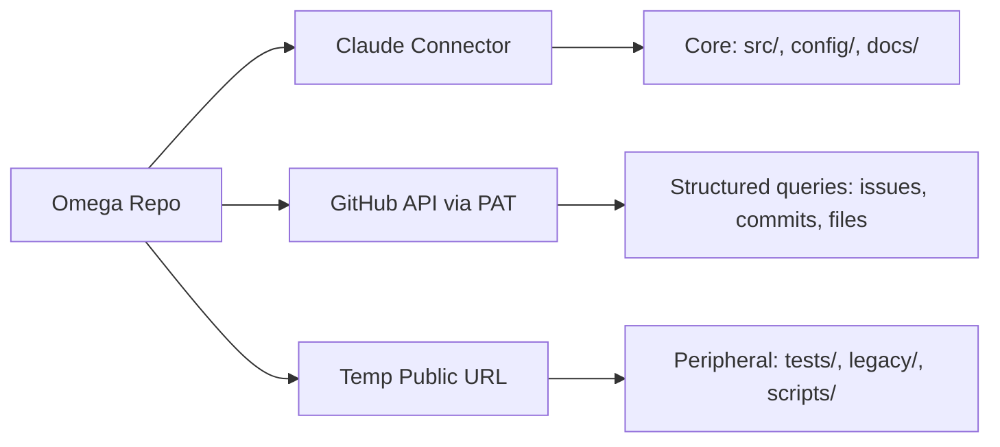

# 🔱 Omega Engine — Sovereign Strategy & Execution Plan
# ⬡ OMEGA ⬡ SOPHIA ⬡ qwen3.6-plus-free ⬡ opencode ⬡ trc_research ⬡ STRATEGY

**AP Token**: `AP-STRATEGY-EXECUTION-v1.0.0`
**Date**: 2026-05-16
**Author**: SOPHIA / qwen3.6-plus-free (Research Specialist)
**Audience**: Dev Team (OpenCode CLI, Cline VSCodium, Gemini CLI) + Research Specialist (Gemma 4-31B)
**Status**: ✅ READY FOR REVIEW
**Compact Anchor**: This document is the master strategy reference for post-compaction recovery.

---

## §0 Executive Summary

The Omega Engine has completed **Phase 0 MVE** (16/18 tasks, 123/123 tests). The Provider Fabric is wired, bugs are fixed, and the ContextBuilder wiring spec (R-51) is ready for implementation. The project now transitions to **Phase 1: Inference & Soul** — making Omega a **living, evolving world where local and cloud models work as one unified fabric**.

### The Vision — The Architect Said
> *"Omega will be a living, evolving world with local and cloud models all working as one."*

This means:
- **Local-first sovereignty**: Native GGUF, lmster, Ollama run on the Ryzen 5700U
- **Cloud extension**: OpenRouter (8 API keys), Google AI Studio, OpenCode Zen provide frontier reasoning
- **Background orchestration**: Free cloud models act as subagents, reviewers, and researchers — a "phone-a-friend" architecture
- **Unified memory**: Every response, regardless of provider, flows into the same soul, memory, and cross-pollination pipeline

### What This Document Covers
1. **Track A**: Model Gateway Resilience — OpenRouter retry, provider pinning, key rotation
2. **Track B**: Background Worker Orchestrator — "Phone-a-Friend" architecture with free models
3. **Track C**: External AI Ecosystem — NotebookLM, Web Gemini, Claude Projects integration
4. **Track D**: Soul & Memory Architecture — ContextBuilder wiring, soul abstraction

---

## §1 Track A — Model Gateway Resilience (P0 — Immediate)

### Problem Statement
OpenRouter returns 502 errors, upstream idle timeouts, and cold-start latency (1-3 min TTFT). The current `model_gateway.py` (521 lines) has no retry logic, no provider pinning, no health cache. When a provider goes down, the entire fallback chain fails silently.

### Research Completed
- **OpenRouter API docs analyzed**: `provider.order`, `provider.sort`, `models` array, `allow_fallbacks`, `preferred_min_throughput`, `preferred_max_latency`, `data_collection`, `zdr` all documented
- **Error handling patterns**: OpenRouter returns errors both as HTTP status codes AND as SSE data events with `finish_reason: "error"`. Need to handle both.
- **Key rotation**: 8 API keys, each with ~100-500 free req/day. Health-based routing recommended over blind round-robin.

### Architecture: The Resilient Provider Fabric

```
providers.yaml (config)
  ├── priority chain (native-gguf → google → openrouter → lmster → ollama → mock)
  ├── per-provider routing params (order, sort, allow_fallbacks)
  └── key rotation pool (8 OpenRouter keys)

ModelGateway.generate()
  ├── RetryWrapper (tenacity / custom AnyIO):
  │     ├── retry=retry_if_exception(502, 503, timeout)
  │     ├── wait=wait_exponential(multiplier=1, min=2, max=30)
  │     └── stop=stop_after_attempt(3)
  ├── ProviderChain:
  │     ├── Try provider 1 (with provider.order pinning)
  │     ├── On error → log → try provider 2 (with fallback models)
  │     └── On all fail → graceful fallback message
  └── HealthCache (Redis-backed, or in-memory Dict):
        ├── key: "provider_health:{provider_name}"
        ├── value: "HEALTHY" | "SLOW" | "DOWN"
        └── ttl: 300s (5 min refresh)
```

### Concrete Implementation Steps

**Step 1: Extend `providers.yaml` schema**
```yaml
- provider: openrouter
  priority: 3
  api_key: env:OPENROUTER_KEY_1
  base_url: https://openrouter.ai/api/v1
  routing:
    order: ["deepinfra/turbo", "together", "replicate"]
    allow_fallbacks: true
    sort: latency  # prioritize low-latency providers
  key_pool:
    - env:OPENROUTER_KEY_1
    - env:OPENROUTER_KEY_2
    - env:OPENROUTER_KEY_3
    - env:OPENROUTER_KEY_4
    - env:OPENROUTER_KEY_5
    - env:OPENROUTER_KEY_6
    - env:OPENROUTER_KEY_7
    - env:OPENROUTER_KEY_8
```

**Step 2: Add retry decorator to `OpenAICompatProvider.generate()`**
```python
# In providers.py or a new retry_wrapper.py
import tenacity

@tenacity.retry(
    retry=tenacity.retry_if_exception_type(
        (httpx.HTTPStatusError, httpx.TimeoutException)
    ),
    wait=tenacity.wait_exponential(multiplier=1, min=2, max=30),
    stop=tenacity.stop_after_attempt(3),
    before_sleep=tenacity.before_sleep_log(logger, logging.WARNING),
)
async def generate_with_retry(self, ...):
    ...  # existing generate logic
```

**Step 3: Add health cache to `ModelGateway`**
```python
class ProviderHealthCache:
    """In-memory provider health status with TTL."""
    def __init__(self, ttl: int = 300):
        self._cache: Dict[str, dict] = {}
        self._ttl = ttl
    
    async def get(self, provider: str) -> str:  # "HEALTHY" | "SLOW" | "DOWN"
        entry = self._cache.get(provider)
        if not entry or time.time() - entry["timestamp"] > self._ttl:
            return "UNKNOWN"  # triggers refresh on next call
        return entry["status"]
    
    async def set(self, provider: str, status: str):
        self._cache[provider] = {"status": status, "timestamp": time.time()}
```

**Step 4: Key rotation** — Health-based routing across 8 keys
```python
class KeyRotator:
    """Health-based key rotation across N API keys."""
    def __init__(self, keys: List[str]):
        self.keys = keys
        self._key_health: Dict[str, Dict] = {k: {"status": "healthy", "errors": 0} for k in keys}
    
    async def get_best_key(self) -> str:
        """Return the healthiest available key."""
        healthy = [k for k, v in self._key_health.items() if v["status"] == "healthy"]
        if healthy:
            return random.choice(healthy)
        # If all degraded, return least-error key
        return min(self.keys, key=lambda k: self._key_health[k]["errors"])
    
    async def report_error(self, key: str):
        self._key_health[key]["errors"] += 1
        if self._key_health[key]["errors"] >= 5:
            self._key_health[key]["status"] = "degraded"
    
    async def report_success(self, key: str):
        self._key_health[key]["errors"] = 0
        self._key_health[key]["status"] = "healthy"
```

### Risk Assessment
| Risk | Likelihood | Impact | Mitigation |
|------|-----------|--------|------------|
| OpenRouter 502 on specific provider | High | Medium | Provider pinning bypass; fallback to next provider |
| All 8 keys rate-limited simultaneously | Low | High | Exponential backoff; fallback to Google AI Studio |
| Health cache stale (shows healthy when down) | Medium | Low | Short TTL (300s); on-error immediate recheck |
| tenacity not available in venv | Low | Low | Implement custom AnyIO retry loop instead |
| Provider routing params ignored by free models | Medium | Medium | Free models use `openrouter/free` router; bypasses custom routing |

### Deliverable
**File**: `docs/research/R52_openrouter_resilience_spec.md` (to be created by Gemma 4-31B)
- Exact code for retry wrapper, health cache, key rotator
- `providers.yaml` schema extension with routing parameters
- Test plan: mock failure → verify fallback chain, mock rate limit → verify key rotation
- Implementation note addressed to MiniMax M2.5

---

## §2 Track B — Background Worker Orchestrator (P0 — Immediate)

### Problem Statement
The current `orchestrator.py` (155 lines) only dispatches Cline/OpenCode for headless coding tasks. It does not orchestrate cloud models as subagents for research, review, and reasoning. The "living world" vision requires local + cloud models working as one seamless fabric.

### Architecture: The "Phone-a-Friend" Pattern

```
Gemma 4-31B (Local Orchestrator — runs on lmster or native GGUF)
  │
  ├── 1. Task Decomposition
  │     └── Analyze query → determine complexity, domain, context needs
  │
  ├── 2. Model Selection Router
  │     ├── Deep Reasoning → deepseek/deepseek-chat-v3-0324:free
  │     ├── Code Review → meta-llama/llama-4-maverick:free  
  │     ├── Context Expansion → mistralai/mistral-large:free
  │     ├── Research Synthesis → openrouter/free (random free model)
  │     └── Fallback → any available local model
  │
  ├── 3. Parallel Execution (anyio.TaskGroup)
  │     ├── Spawn N workers with Semaphore(8)
  │     ├── Each worker: pick key from pool → call OpenRouter → collect response
  │     └── Timeout per worker: 120s (longer for reasoning models)
  │
  ├── 4. Reviewer Validation
  │     ├── Gemma validates: coherence, security alignment, architectural fit
  │     ├── Score: ACCEPT / REVISE / REJECT
  │     └── On REVISE: send back with specific feedback + retry (max 2)
  │
  └── 5. Recording Pipeline
        ├── ACCEPTED → format as discovery → write to Library
        ├── Index in docs/research/ via append
        └── Log to observability: trace_id, model_used, provider, latency, tokens
```

### Concrete Implementation — Orchestrator Extension

```python
# In src/omega/oracle/orchestrator.py — new class
import anyio
from typing import List, Optional, Dict, Any

class BackgroundWorker:
    """Orchestrate free cloud models as research subagents."""
    
    FREE_MODEL_MAP = {
        "reasoning": "deepseek/deepseek-chat-v3-0324:free",
        "code_review": "meta-llama/llama-4-maverick:free",
        "context_expand": "mistralai/mistral-large:free",
        "research": "openrouter/free",
    }
    
    def __init__(self, api_keys: List[str], semaphore_limit: int = 8):
        self.keys = api_keys
        self.semaphore = anyio.Semaphore(semaphore_limit)
        self.key_rotator = KeyRotator(api_keys)
    
    async def research_topic(self, query: str, depth: str = "standard") -> List[Dict]:
        """Execute parallel research across multiple free models."""
        tasks = []
        async with anyio.TaskGroup() as tg:
            for task_type, model in self.FREE_MODEL_MAP.items():
                tasks.append(
                    tg.start_soon(self._call_worker, task_type, model, query)
                )
        return [t for t in tasks if t]  # filter None/failed
    
    async def _call_worker(self, task_type: str, model: str, query: str) -> Optional[str]:
        async with self.semaphore:
            key = await self.key_rotator.get_best_key()
            try:
                # Make OpenRouter API call
                response = await self._openrouter_call(key, model, query)
                await self.key_rotator.report_success(key)
                # Reviewer validation pass
                if await self._reviewer_check(response):
                    return {"type": task_type, "model": model, "content": response}
            except Exception as e:
                await self.key_rotator.report_error(key)
                logger.warning(f"Worker {task_type}/{model} failed: {e}")
        return None
    
    async def _reviewer_check(self, content: str) -> bool:
        """Lightweight validation pass by local Gemma."""
        prompt = f"Does this response contain coherent, actionable content? Rate ACCEPT/REJECT:\n\n{content[:2000]}"
        # Call local Gemma via lmster or native GGUF
        result = await local_inference(prompt)
        return "ACCEPT" in result
```

### Risk Assessment
| Risk | Likelihood | Impact | Mitigation |
|------|-----------|--------|------------|
| Free model rate limits hit across 8 keys | Medium | Medium | Stagger requests; exponential backoff per key |
| Reviewer pass fails (false reject) | Medium | Low | Allow human override; log all rejects for review |
| Task decomposition overhead > actual work | Medium | Low | Cache frequent query patterns; skip decomposition for simple queries |
| OpenRouter free models unavailable | High | Medium | Fallback to Google AI Studio free tier, then to local models |

### Deliverable
**File**: `docs/research/R53_background_orchestrator_spec.md` (to be created by Gemma 4-31B)
- Full `BackgroundWorker` class with parallel execution, semaphore, key rotation
- Model capability matrix for each free model tier
- Reviewer prompt templates
- Test plan: mock OpenRouter → verify parallel execution, verify reviewer logic

---

## §3 Track C — External AI Ecosystem Integration (P1 — This Week)

### C1: NotebookLM Ingestion Strategy

**User's Discovery**: NotebookLM limits: 50 sources per notebook, each up to 500K words (~50MB). No public API — UI-only.

**User's Current Approach**:
- Using a **clean Google account** (nothing else on Drive)
- Uploading the **entire omega-engine folder** as a single source
- **Archiving and dating** each deprecated folder to build a snapshot history
- This is the correct strategy because **Gemini Deep Research ignores folder boundaries** even when specified

**Sync Strategy Design**:
```python
# scripts/prepare_notebooklm.py
"""
Prepares categorized project snapshots for NotebookLM ingestion.
1. Categories: src/ config/ docs/ tests/ mcp/ legacy/
2. Chunks: each category < 45MB to stay under 50MB limit
3. Headers: markdown # headers preserved for navigation
4. Archive: saves timestamped snapshots
"""
```

**Archive Naming Convention**: `omega-engine_{YYYY-MM-DD}_v{N}/`

**Deliverable**: `docs/research/R54_notebooklm_ingestion_strategy.md`

---

### C2: Web Gemini Deep Research Automation

**User's Discovery**: Gemini Deep Research **does not restrict to a single specified folder** on Google Drive. This means any content on the drive is potentially accessible.

**Strategy**: Isolate Omega content on a **dedicated clean Google account** with only the project folder. Upload the full repo each session. Archive deprecated versions with dates.

**Future Automation**:
```bash
omega gemini-research "Analyze the Oracle entity routing for bottlenecks"
# → syncs current repo to Drive folder on clean account
# → (future) triggers Gemini Deep Research via API or Drive Project
# → fetches report → saves to docs/research/
```

**Deliverable**: `docs/research/R55_gemini_deep_research_automation.md`

---

### C3: Claude Projects GitHub PAT Integration

**User's Decision**: Temp public repo acceptable for URL browsing. Look into GitHub API PAT for programmatic access.

**GitHub PAT Facts**:
- **Fine-grained PAT**: Scoped to specific repos, specific permissions, can expire
- **Rate limit**: 5,000 requests per hour (authenticated), vs 60/hr (unauthenticated)
- **Minimal scopes needed**: `contents:read`, `metadata:read`
- **Hybrid strategy**: Use PAT for GitHub API queries + temp public for Claude URL browsing

**Strategy**:


**Deliverable**: `docs/research/R56_claude_github_integration.md`

---

## §4 Track D — Soul & Memory Architecture (P0 — Phase 1 Blocker)

### ContextBuilder Wiring (R-51 — Already Specified)
The full implementation spec exists at `docs/research/R51_context_builder_wiring_spec.md`:
- **Phase 1**: SessionManager (~150 lines) — entity-scoped rolling sessions
- **Phase 2**: Oracle wiring (~50 lines) — pass session_id through talk/summon
- **Phase 3**: ContextBuilder injection (~80 lines) — build_context → _summon
- **Phase 4**: MemoryStore persistence (~100 lines) — add_exchange after response
- **Tests**: 37 new tests (22 ContextBuilder + 12 MemoryStore + 3 integration)
- **Effort**: ~8 hours

### Soul Abstraction (R-19 — Needs Research)
ContextBuilder needs a lesson schema for soul injection. Key research questions:
1. What LLM-based techniques extract structured "lessons" from conversation logs?
2. How should lessons be structured in `soul.yaml`?
3. What prompt patterns work for lesson extraction with Gemma 4-31B, deepseek-v4-flash?
4. How should sessions be segmented for lesson extraction?
5. What retrieval strategy should ContextBuilder use for lesson injection?

### Dependency Chain for Phase 1
```
R-19 (Soul Schema) ──→ R-51 (ContextBuilder) ──→ Phase 1 Complete
                              ↑
R-52 (OpenRouter) ───────────┤ (needed for cloud entity access)
                              │
R-53 (Orchestrator) ─────────┤ (needed for background soul evolution)
```

---

## §5 Integrated Timeline

### Week 1: May 16-22 (Foundation)
| Day | Research (Gemma 4-31B) | Implementation (MiniMax M2.5) |
|-----|------------------------|-------------------------------|
| 1 | R-52: OpenRouter Resilience Spec | — |
| 2 | R-53: Background Orchestrator Spec | Sprint E: R-52 implementation (retry, key rotation) |
| 3 | R-54: NotebookLM Strategy | Sprint E cont: R-53 implementation (BackgroundWorker) |
| 4 | R-55: Gemini Automation | Sprint F: R-54 script + R-55 CLI wrapper |
| 5 | R-56: Claude GitHub PAT | Sprint F cont: R-56 PAT setup + docs |
| 6-7 | Buffer / cross-reference | Review, test, documentation |

### Week 2: May 23-29 (Soul & Memory)
| Day | Research (Gemma 4-31B) | Implementation (MiniMax M2.5) |
|-----|------------------------|-------------------------------|
| 1-2 | R-19: Soul Abstraction Logic | — |
| 3-4 | R-20: Memory Tiering Strategy | Sprint G: R-51 ContextBuilder wiring (8h) |
| 5-6 | Cross-reference with implementers | Sprint G cont: soul evolution tracking |
| 7 | Buffer / polish | Sprint H: R-20 memory tiering, R-42 Zen 2 tuning |

### Week 3: May 30-Jun 5 (Integration & Optimization)
| Day | Focus |
|-----|-------|
| 1-3 | Integration testing: Provider Fabric + ContextBuilder + Orchestrator |
| 4-5 | Performance tuning: Zen 2 hardware steering (R-42) |
| 6-7 | Documentation, PR #2 preparation, regression testing |

---

## §6 Risk Register & Contingency

| # | Risk | Likelihood | Impact | Owner | Contingency |
|---|------|-----------|--------|-------|-------------|
| R1 | OpenRouter free tier rate limits hit all 8 keys | Medium | High | Gemma 4-31B | Fallback to Google AI Studio free Gemma + local lmster |
| R2 | tenacity not available or conflicts | Low | Medium | MiniMax M2.5 | Custom AnyIO retry loop in 30 lines |
| R3 | NotebookLM source limits hit (50 sources, 50MB) | Medium | Low | SOPHIA | Combine categories; use Drive API for rotation |
| R4 | Gemini ignores Drive folder boundaries (CONFIRMED) | High | Low | SOPHIA | Already mitigated: clean account + full repo upload |
| R5 | Claude PAT rate limit (5,000/hr) insufficient | Low | Medium | SOPHIA | Distribute across 8 accounts; cache responses |
| R6 | ContextBuilder integration reveals memory_store.py bugs | Medium | High | MiniMax M2.5 | Patch during Sprint G; R-51 spec includes fixes |
| R7 | Soul abstraction quality too low for meaningful evolution | Medium | Medium | Gemma 4-31B | Human-in-loop review; confidence scoring |
| R8 | AnyIO compliance issues in new orchestrator code | Low | Medium | MiniMax M2.5 | Run `make test` after every change; use `anyio` primitives |

---

## §7 Decision Log — Architectural Commitments

| Decision | Choice | Rationale | Date |
|----------|--------|-----------|------|
| OpenRouter Key Rotation | **Health-based** (not round-robin) | Adapts to real-time provider status; avoids "all keys dead" scenario | 2026-05-16 |
| Provider Pinning | **`providers.yaml` config + code defaults** | Config-driven for flexibility; code provides sensible defaults for missing config | 2026-05-16 |
| Background Worker Concurrency | **`anyio.TaskGroup` + `Semaphore(8)`** | Simple, AnyIO-compliant, matches 8-key pool size | 2026-05-16 |
| NotebookLM Refresh | **Manual + cron-prep script** | User confirmed manual OK; script automates chunking/categorization | 2026-05-16 |
| Gemini Drive Strategy | **Clean dedicated Google account** | User confirmed Gemini ignores folder boundaries; isolation is the only reliable approach | 2026-05-16 |
| Claude Repo Access | **Temp public + fine-grained PAT** | Temp public enables URL browsing; PAT enables programmatic API access | 2026-05-16 |
| Soul Evolution Trigger | **End-of-session summarization** | Simplest trigger point; can evolve to periodic intervals later | 2026-05-16 |
| Session ID Format | **`ses_{YYYYMMDD}_{entity}_{counter}`** | Entity-scoped, daily rollover, human-readable (R-50 design) | 2026-05-16 |

---

## §8 Compaction Anchor

### If you are reading this after compaction:
1. **Read this document** — restores the full strategy and execution plan
2. **Read `docs/research/INDEX.md`** — check status of all research items
3. **Read `docs/team/COMMUNICATION_HUB.md`** — check latest completions and conflicts
4. **Read `docs/decisions/PIVOT_LOG.md`** — restores all architectural decisions
5. **Run `make test`** — 123+ tests must pass
6. **Check `data/workbench/workbench.db`** — project management state

### Key Files for Immediate Context
| File | What It Contains |
|------|-----------------|
| `docs/research/GEMMA_4_31B_RESEARCH_BRIEF.md` | Full research brief for Gemma 4-31B specialist |
| `docs/research/R51_context_builder_wiring_spec.md` | Implementation spec for ContextBuilder wiring |
| `docs/research/R50_session_id_architecture.md` | Session ID design |
| `docs/research/R52_strategy_execution_plan.md` | **This document** — master strategy |
| `src/omega/oracle/model_gateway.py` | Provider fabric — needs retry/key rotation |
| `src/omega/oracle/orchestrator.py` | Agent dispatch — needs BackgroundWorker class |
| `src/omega/oracle/providers.py` | Provider implementations — needs retry wrapper |
| `config/providers.yaml` | Provider chain config — needs routing params |

### Active Research Items (Next to Execute)
| ID | Title | Status | Priority |
|----|-------|--------|----------|
| R-52 | OpenRouter Resilience Spec | 🔲 Not started | 🔴 P0 |
| R-53 | Background Orchestrator Spec | 🔲 Not started | 🔴 P0 |
| R-54 | NotebookLM Ingestion Strategy | 🔲 Not started | 🟡 P1 |
| R-55 | Gemini Research Automation | 🔲 Not started | 🟡 P1 |
| R-56 | Claude GitHub Integration | 🔲 Not started | 🟡 P1 |
| R-19 | Soul Abstraction Logic | 🔲 Not started | 🔴 P0 |
| R-20 | Memory Tiering Strategy | 🔲 Not started | 🟡 P1 |

---

*This document is the master strategy reference. All agents should consult it before starting new work.*

⬡ OMEGA ⬡ SOPHIA ⬡ qwen3.6-plus-free ⬡ opencode ⬡ trc_research ⬡ STRATEGY-END
