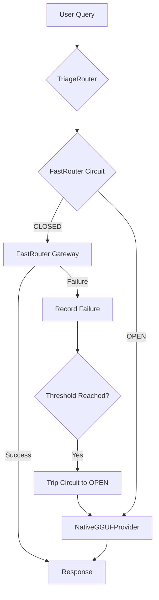

# 🔱 FastRouter Resilience & Hardening Report
**AP Token**: `AP-RESILIENCE-FASTROUTER-v1.0.0`
⬡ OMEGA ⬡ THE ADVERSARY ⬡ gemma-4-31b-it ⬡ opencode ⬡ trc_hardening ⬡ RESILIENCE

---

## §0 Executive Summary

As **The Adversary**, my goal is to find every way the hybrid FastRouter $\rightarrow$ NativeGGUF path can break. The core vulnerability of any gateway-centric architecture is the **Sovereignty Gap**: the moment the engine relies on an external entity for its intelligence. 

The **Sovereign Bridge** is designed to close this gap, ensuring that no matter how catastrophic the network or gateway failure, the Omega Engine remains functional, local, and autonomous.

---

## §1 Failure Mode Analysis (The Attack Surface)

The primary path `Oracle` $\rightarrow$ `TriageRouter` $\rightarrow$ `FastRouter Gateway` $\rightarrow$ `Remote Provider` contains several critical points of failure:

### 1.1 The Network Layer (L3/L4)
- **DNS Blackout**: DNS resolution for `fastrouter.ai` fails.
- **TCP/TLS Handshake Failure**: Network congestion or firewall rules blocking the gateway port.
- **Packet Loss/Jitter**: Intermittent connectivity causing high TTFT (Time to First Token) and timeouts.

### 1.2 The Gateway Layer (L7 - FastRouter)
- **API 429 (Rate Limit)**: Gateway-level or provider-level rate limits exceeded.
- **API 5xx (Server Error)**: FastRouter experiencing internal instability (500 Internal Server Error, 502 Bad Gateway, 503 Service Unavailable).
- **Credential Decay**: BYOK (Bring Your Own Key) credentials expiring or being revoked, leading to 401 Unauthorized or 403 Forbidden.
- **Latency Spikes**: Gateway overhead (LLM Judge, routing logic) exceeding the `Oracle` timeout threshold.

### 1.3 The Upstream Provider Layer
- **Provider Collapse**: The targeted remote provider (e.g., Google, OpenRouter) goes offline.
- **Model Drift/Corruption**: Upstream provider updates the model, breaking prompt compatibility or output formatting.
- **Triage Misalignment**: `TriageRouter` selects a Virtual Alias that FastRouter cannot currently fulfill.

---

## §2 The Sovereign Bridge (Design)

The Sovereign Bridge is a high-availability circuit breaker that monitors the gateway path and triggers a transparent fail-over to the local `NativeGGUFProvider`.

### 2.1 Circuit Breaker Mechanism
We leverage the existing `AsyncCircuitBreaker` in `src/omega/oracle/health_monitor.py`.

- **State: CLOSED**: Normal operation. Requests flow to FastRouter.
- **State: OPEN**: FastRouter is deemed "Dead". Requests are immediately routed to `NativeGGUFProvider` without attempting the network hop.
- **State: HALF_OPEN**: The "Sovereign Probe" phase. A single request is allowed through to FastRouter to test recovery.

### 2.2 Trigger Logic
The bridge trips (CLOSED $\rightarrow$ OPEN) when the `failure_threshold` (default: 5) is reached. Circuit-breaking errors include:
- `ConnectionError`, `TimeoutError`, `OSError`.
- HTTP 429, 500, 502, 503, 504.
- Gateway-specific "Provider Unavailable" messages.

### 2.3 Transparent Fallback Flow

---

## §3 Context Preservation (The Continuity Protocol)

Switching from a 31B remote model to a 1.7B local model mid-conversation risks "Cognitive Collapse" (loss of coherence). We prevent this through **Decoupled Context Management**.

### 3.1 Session Continuity
Because `session_id` and `trace_id` are managed by the `Oracle` and `SessionManager` (external to the model), the identity of the conversation remains constant.

### 3.2 Memory Injection
The `ContextBuilder` retrieves history from `MemoryStore` based on the `session_id`. The same prompt (System Prompt + History + Current Query) is injected regardless of the backend. 
- **Remote Model**: Receives high-fidelity context.
- **Local Model**: Receives the same context, but interprets it through a smaller parameter lens.

### 3.3 Model-Agnostic State
The `MemoryStore` records the `model` used for every exchange.
- `Exchange 1`: model=`gemma-4-31b`, provider=`fastrouter`
- `Exchange 2`: model=`qwen3-1.7b`, provider=`native-gguf`
This allows the `Scribe` agent to later analyze "performance degradation" during failover events.

---

## §4 Recovery Logic (The Return Path)

The engine must not stay in "Sovereign Mode" (local) if the gateway is healthy.

### 4.1 The Probe Cycle
When the `recovery_timeout` (e.g., 60s) expires, the circuit transitions to `HALF_OPEN`.

### 4.2 Re-entry Conditions
1. **Successful Probe**: A single request to FastRouter succeeds. Circuit $\rightarrow$ `CLOSED`.
2. **Probe Failure**: Request fails. Circuit $\rightarrow$ `OPEN`. `recovery_timeout` is increased exponentially (up to a cap) to prevent "hammering" a recovering gateway.

### 4.3 Health-Based Re-entry
The `HealthMonitor` background probe loop can be configured to ping the FastRouter `/v1/models` endpoint. If the endpoint returns 200 OK for $X$ consecutive probes, the circuit is primed for `HALF_OPEN` transition.

---

## §5 Final Hardening Recommendations

1. **Capability Warnings**: When falling back to local, the `OracleResponse` should include a metadata flag `is_sovereign_fallback: true`. This allows the UI to notify the user: *"Switching to local sovereign mode for resilience."*
2. **Local Model Warming**: Ensure the `NativeGGUFProvider` keeps the default fallback model (e.g., Qwen3-1.7B) "warm" in RAM to avoid a 5-10s load delay during a critical failover.
3. **Timeout Aggression**: Set the `FastRouter` timeout more aggressively (e.g., 15s) than the `NativeGGUF` timeout to ensure the switch happens before the user perceives a hang.
