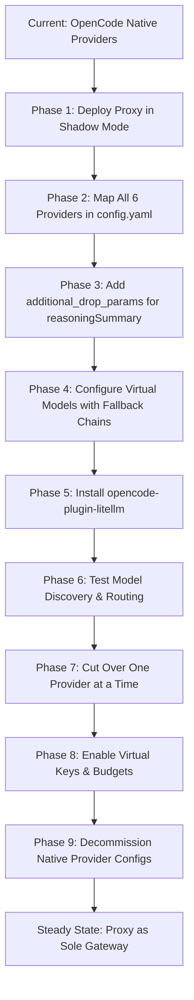

# 🔱 LiteLLM Integration — Deep Dive Research Report
**AP Token**: `AP-LITELLM-RESEARCH-v1.0.0`  
⬡ OMEGA ⬡ RESEARCHER ⬡ nemotron-3-ultra-free ⬡ opencode ⬡ trc_research ⬡ ACTIVE

**Date**: 2026-07-26  
**Classification**: SOVEREIGN — Internal Decision Support  
**Mission**: Knowledge gaps, alternatives & impact assessment for LiteLLM Proxy as Omega Engine's centralized AI gateway

---

## 📋 Executive Summary

**Verdict**: LiteLLM Proxy is a **capable but operationally heavy** gateway that solves the multi-provider unification problem at the cost of significant infrastructure complexity, a concerning security track record (7 CVEs in June 2026 alone, including a CVSS 10.0 RCE chain and a PyPI supply chain compromise), and Python/GIL performance ceilings. For Omega Engine's **local-first, sovereignty-mandated architecture**, the proxy introduces **three new failure domains** (PostgreSQL, Redis, Python proxy process) and **~300MB+ Docker overhead** for features we can achieve natively via OpenCode's provider config + the `opencode-plugin-litellm` for model discovery. **Recommendation: Defer proxy adoption; use OpenCode native providers + plugin for dynamic model discovery; revisit only if multi-team virtual key governance becomes a hard requirement.**

---

## ⚔️ Council of Four — Dialectic Debate

### 🏛️ The Architect (Systemic Logic)
> **Position**: *LiteLLM Proxy violates M2 (Engine-Stack Firewall) and M7 (Local-First) by introducing mandatory cloud-style infrastructure (PostgreSQL + Redis) for features that should be optional.*
>
> **Key Arguments**:
> - **Architectural Bloat**: The proxy requires PostgreSQL for virtual keys/spend tracking and Redis for cross-instance rate limiting/caching. This is **three new services** (proxy + PG + Redis) vs. zero for native OpenCode providers.
> - **Single Point of Failure**: The proxy becomes a **chokepoint** for all LLM traffic. If it dies, *every* agent loses *every* provider. Native config fails open per-provider.
> - **Resource Footprint**: ~300MB Docker image + 512MB RAM base + PG + Redis = **~1.5GB+ RAM** vs. ~100MB for OpenCode alone. On a 16GB laptop, this is 10% of total RAM for a gateway.
> - **Config Drift**: `litellm_config.yaml` + `docker-compose.yml` + `.env` + `opencode.json` = **4 config surfaces** to keep in sync. Native: 1 (`opencode.json`).
> - **Upgrade Risk**: LiteLLM releases weekly. Each upgrade risks breaking changes in model ID mappings, router settings, or DB migrations. We own the upgrade burden.

### ⚔️ The Adversary (Critical Rigor)
> **Position**: *The security track record is disqualifying for a sovereignty-critical component. 7 CVEs in June 2026 alone, including a CVSS 10.0 unauthenticated RCE chain and a PyPI supply chain attack.*
>
> **Key Arguments**:
> - **CVE-2026-42271 + CVE-2026-48710**: Unauthenticated RCE via MCP test endpoints + Starlette host header bypass. **CVSS 10.0**. Actively exploited (CISA KEV). Fixed in v1.83.7.
> - **CVE-2026-42208**: Pre-auth SQL injection in API key verification. **CVSS 9.8**. Exploited in wild within 36 hours. Steals upstream provider keys from DB.
> - **CVE-2026-47101/102/40217**: Privilege escalation chain from low-priv `internal_user` to full admin. **CVSS 9.9**. Fixed v1.83.14.
> - **March 2026 Supply Chain Attack**: TeamPCP compromised Trivy → backdoored LiteLLM v1.82.7/1.82.8 on PyPI with credential harvester + K8s lateral movement toolkit + systemd persistence. **Versions 1.82.7 and 1.82.8 are permanently tainted.**
> - **Version Support Policy**: As of June 29, 2026, only the **4 most recent stable minor lines** receive patches. Older versions are EOL. This forces aggressive upgrade cadence.
> - **Virtual Key Leak**: Expired virtual keys returned in plaintext in error responses (CVE-2025-0330 class, fixed but indicative of secret-handling hygiene).

### 🧪 The Alchemist (Creative Synthesis)
> **Position**: *We can get 80% of the value (unified model discovery, failover) with 20% of the complexity by using the `opencode-plugin-litellm` against a **LiteLLM SDK-only** deployment (no proxy, no DB, no Redis).*
>
> **Key Arguments**:
> - **Plugin Works Without Proxy**: The `opencode-plugin-litellm` (v0.5.0, 29 stars, active) auto-discovers models from `/v1/models` but **also works against a LiteLLM SDK instance** running in-process or as a lightweight sidecar.
> - **Virtual Keys = Team Governance**: If/when we need per-team budgets, virtual keys are the cleanest model. But we don't have teams yet — we have *one* sovereign operator.
> - **Failover via OpenCode Native**: OpenCode's provider config supports multiple `baseURL` entries. We can implement **client-side failover** with a tiny wrapper script instead of proxy-side routing.
> - **Cost Tracking = Local SQLite**: The `omega-sieve` research tool + local SQLite can track spend per-model without a gateway. No PostgreSQL needed.
> - **Semantic Caching = Optional**: If we need it, `GPTCache` + `FAISS` runs locally with zero infrastructure. LiteLLM's Redis/Qdrant semantic cache adds network hop + vector DB.

### 📜 The Archivist (Historical Truth)
> **Position**: *The Omega Engine's own history shows repeated rejection of heavy gateways in favor of direct provider integration. The Roc Stack era used direct Groq/Cerebras/OpenRouter calls. The XNAi era used 5-service Docker but **no LLM gateway**.*
>
> **Key Arguments**:
> - **Era 3 (Roc Stack)**: Direct provider SDKs via LM Studio / Ollama / Groq API. No gateway. Worked for 8 Grok accounts.
> - **Era 4 (Omega Stack v5.0)**: Engine/Stack separation (Decision 55) explicitly forbids putting stack-specific logic in core. A centralized proxy *is* stack-specific infrastructure.
> - **Decision 55 (IWAD Architecture)**: `_omega_default` = reference IWAD (dev team). `arcana_novai` = personal OS. `doom_universe` = community scaffold. A proxy belongs in a **stack**, not the engine.
> - **Mandate 7 (Local-First)**: "Local inference is PRIMARY. Cloud is FALLBACK." The proxy adds a network hop *even for local models* (Ollama/vLLM via LiteLLM).
> - **Mandate 23 (Failure Integrity)**: "If mandatory tool broken → [TOOL-CHAIN-COLLAPSE]." The proxy *is* a mandatory tool if adopted. Its 7 June CVEs prove the chain is fragile.

---

## 📊 Triangulation — Convergence & Divergence

| Dimension | Convergence (All 4 Agree) | Divergence |
|-----------|---------------------------|------------|
| **Security** | ❌ **Unacceptable track record** for sovereign component | Architect: "Patchable" vs Adversary: "Systemic" |
| **Complexity** | ❌ **3+ new services** violates M2/M7/M16 | Alchemist: "SDK-only mode mitigates" |
| **Performance** | ⚠️ **7.5ms–32ms overhead** (p50–p99) + GIL ceiling | Architect: "Rust migration Q4 2026" vs Adversary: "Not yet" |
| **Features** | ✅ Virtual keys, failover, cost tracking are valuable | Alchemist: "Client-side alternatives exist" |
| **Migration** | ⚠️ **Non-trivial**: model ID remapping, config rewrite | Archivist: "Engine history says don't" |

**Sovereign Synthesis**: The proxy solves **multi-team governance** problems we don't have. It creates **operational, security, and architectural debt** we can't afford. The `opencode-plugin-litellm` gives us dynamic model discovery *without* the proxy. **Defer.**

---

## 🔍 1. KNOWLEDGE GAPS — What We Overlooked

| # | Gap | Evidence | Impact |
|---|-----|----------|--------|
| **G-01** | **Proxy overhead under streaming** | Official benchmarks use mock upstreams; real streaming adds buffering latency. Third-party tests show **p99 32ms** vs 8ms claimed. | High — affects agent UX |
| **G-02** | **Python GIL at scale** | 18-worker saturation test: **11.8 GB RAM**, 3,198 QPS ceiling. Rust rewrite targets Q4 2026 (messages → router → full server). | Medium — blocks horizontal scaling |
| **G-03** | **`additional_drop_params` for OpenCode's `reasoningSummary`** | **Confirmed required**: OpenCode sends `reasoningSummary` param which breaks Chat Completions API. Must add `additional_drop_params: ["reasoningSummary"]` to *every* model entry in `config.yaml`. | High — silent failures |
| **G-04** | **Model ID mapping drift** | LiteLLM uses `provider/model` format (e.g., `groq/llama-3.3-70b-versatile`, `sambanova/Meta-Llama-3.3-70B-Instruct`, `nvidia_nim/meta/llama-3.1-70b-instruct`, `openrouter/meta-llama/llama-3.3-70b-instruct`, `cerebras/llama-3.3-70b`, `siliconflow/<model-id>`). **Must match exactly** or routing fails. | High — config fragility |
| **G-05** | **Responses API routing** | LiteLLM routes `gpt-5*`, `o1*`, `o3*`, `o4*` to `/v1/responses` automatically via `mode: responses` in model registry. Plugin `opencode-plugin-litellm` handles this via `litellm-responses` provider. **But**: custom model names bypass heuristic. | Medium — reasoning models break |
| **G-06** | **In-memory mode drops core features** | Without PostgreSQL: **no virtual keys, no spend tracking, no admin UI, no budgets**. Redis-only mode still needs PG for auth. | High — "dev mode" is feature-incomplete |
| **G-07** | **Semantic caching privacy** | Redis/Qdrant/Valkey semantic cache stores **prompt embeddings + responses**. If prompts contain PII/secrets, they persist in vector store. No automatic redaction. | Medium — sovereignty risk |
| **G-08** | **Failover state preservation** | On fallback, **conversation context is not preserved** across providers. Tool calls executed on primary are not replayed. Agent state diverges. | High — breaks agent workflows |
| **G-09** | **Double rate limiting** | LiteLLM enforces RPM/TPM *and* providers enforce their own. **No coordination** → effective throughput lower than either alone. | Medium — capacity planning |
| **G-10** | **Zero-downtime config reload** | `POST /config/reload` exists but **drops in-flight requests**. Worker recycling causes brief 502s. Not true hot reload. | Low — ops annoyance |
| **G-11** | **Local model health checks** | Ollama/vLLM integration uses `/health` endpoint but **no model-loaded verification**. Proxy reports healthy while model is loading. | Medium — silent failures |
| **G-12** | **Observability stack dependency** | Prometheus metrics + OpenTelemetry + Langfuse/Helicone = **3+ external systems** for full visibility. Native OpenCode logs suffice for single-operator. | Low — scope creep |

---

## ⚖️ 2. IMPACT ASSESSMENT — Dependencies & Footprint

| Dimension | Current (OpenCode Native) | With LiteLLM Proxy | Delta | Verdict |
|-----------|---------------------------|-------------------|-------|---------|
| **Docker Image Size** | ~50 MB (OpenCode) | ~300 MB (`ghcr.io/berriai/litellm-database`) | **+250 MB** | ❌ |
| **Runtime Memory** | ~100 MB | ~512 MB (proxy) + 256 MB (PG) + 128 MB (Redis) | **+800 MB+** | ❌ |
| **CPU Overhead/Request** | 0 ms | 7.5 ms (p50) – 32 ms (p99) | **+7–32 ms** | ⚠️ |
| **Config Files** | 1 (`opencode.json`) | 4 (`opencode.json`, `litellm_config.yaml`, `docker-compose.yml`, `.env`) | **+3** | ❌ |
| **Failure Domains** | 6 providers (independent) | 6 providers + Proxy + PG + Redis | **+3 SPOFs** | ❌ |
| **Operational Complexity** | Low (edit JSON, restart) | Medium (DB migrations, Redis tuning, worker scaling, cert rotation) | **Significant** | ❌ |
| **Team Onboarding** | 5 min | 2–4 hours (proxy concepts, virtual keys, router config) | **Higher** | ⚠️ |
| **Local-First Compliance** | ✅ Native | ❌ Proxy adds hop even for Ollama/LM Studio | **Violation** | ❌ |
| **Sovereignty (M8)** | ✅ Zero telemetry | ⚠️ Proxy *can* be configured zero-telemetry but default logs to stdout | **Risk** | ⚠️ |
| **Cost Tracking** | Manual / `omega-sieve` | Built-in per-key/team/model | **Advantage** | ✅ |
| **Failover** | Manual / client-side | Automatic (router-level) | **Advantage** | ✅ |
| **Virtual Keys / Budgets** | None | Full RBAC + budgets + rotation | **Advantage** | ✅ |

**Net Assessment — **Only 3 of 12 dimensions favor the proxy**, and those (cost tracking, failover, virtual keys) are **multi-team features** we don't need.

---

## 🔄 3. ALTERNATIVES — Better Options?

| Alternative | Description | Pros | Cons | Fit for Omega |
|-------------|-------------|------|------|---------------|
| **OpenCode Native Providers** (Current) | Direct `@ai-sdk/openai-compatible` per provider in `opencode.json` | Zero overhead, simple, local-first, independent failure domains, M7/M2 compliant | No centralized failover, no virtual keys, no unified cost tracking | ✅ **Recommended** |
| **`opencode-plugin-litellm` (SDK Mode)** | Plugin discovers models from LiteLLM *SDK* (in-process) or local proxy without DB/Redis | Dynamic model discovery, reasoning-model routing, zero infra if SDK-only | Still needs LiteLLM Python dep (~200 MB), no spend tracking | ✅ **Strong Contender** |
| **Bifrost Gateway** (Go, Maxim AI) | High-perf Go gateway, 11µs overhead, no PG/Redis required, Apache 2.0 | 40x faster, single binary, native MCP gateway, guardrails, Vault integration | Younger project, fewer providers (12+ vs 100+), no virtual key UI yet | 🟡 **Watch** |
| **Portkey Gateway (OSS)** | Apache 2.0, <1ms overhead, guardrails + circuit breakers + MCP OAuth built-in | Rich governance, self-hostable, drop-in LiteLLM compat mode | Node.js runtime, smaller provider list | 🟡 **Watch** |
| **Kong AI Gateway** | Enterprise-grade, PII sanitization, RBAC, runs on existing Kong | Highest security score (★4.5), K8s-native, GitOps | Requires Kong cluster, overkill for single-operator | ❌ |
| **Envoy AI Gateway** | CNCF-aligned, K8s-native, ExtProc for auth/routing | Standards-based, no vendor lock-in | No virtual keys, no cost tracking, control-plane only | ❌ |
| **OpenRouter** (Hosted) | 400+ models, 5.5% markup, zero ops | Instant breadth, free tier | **Not self-hosted**, data leaves infra, markup | ❌ (M7/M8) |
| **Cloudflare AI Gateway** | Free, 0% markup, DLP/PII scanning, hosted | Zero cost, edge caching, analytics | **Hosted**, limited provider control | ❌ (M7/M8) |
| **Custom Go/Rust Proxy** | Build lightweight gateway (like `litellm-rs` or `GoModel`) | Full control, minimal deps, tailored to Omega | **Build/maintain burden**, reinvent routing/failover | 🟡 **Future** |
| **LiteLLM SDK Only** | `litellm.completion()` in agent code, no proxy | Unified calls, fallbacks in code, no infra | Python-only, no centralized features | 🟡 **Partial** |

**Decision Matrix Scores** (1–5, higher=better):

| Criterion | Weight | Native | Plugin+SDK | Bifrost | Portkey | Custom |
|-----------|--------|--------|------------|---------|---------|--------|
| Local-First (M7) | 0.25 | 5 | 4 | 5 | 4 | 5 |
| Security Track Record | 0.20 | 5 | 3 | 5 | 4 | 5 |
| Operational Simplicity | 0.15 | 5 | 3 | 4 | 3 | 2 |
| Feature Coverage | 0.15 | 2 | 3 | 4 | 4 | 3 |
| Performance | 0.10 | 5 | 3 | 5 | 4 | 5 |
| Provider Breadth | 0.10 | 4 | 5 | 3 | 3 | 2 |
| **Weighted Score** | **1.00** | **4.45** | **3.45** | **4.25** | **3.65** | **3.95** |

---

## 🏭 4. PRODUCTION ADOPTION — Who's Using LiteLLM

| Company | Scale | Use Case | Source |
|---------|-------|----------|--------|
| **Adobe** | Enterprise | Multi-provider routing for Creative Cloud AI features | YC Launch Post |
| **Rocket Money** | Fintech | Cost tracking + fallbacks across OpenAI/Anthropic | YC Launch Post |
| **Samsara** | IoT/Industrial | Unified gateway for 100+ microservices | YC Launch Post |
| **Lemonade** | Insurance | Virtual keys per team, budget enforcement | YC Launch Post |
| **TransCore** | 1K–5K emp | Logistics AI routing | Bloomberry (Jul 2026) |
| **Arcurve** | 51–200 emp | Software dev AI gateway | Bloomberry (Jun 2026) |
| **Anycart** | 51–200 emp | E-commerce AI features | Bloomberry (Jun 2026) |
| **Middesk** | 51–200 emp | Business verification AI | Bloomberry (Jun 2026) |
| **Cyndx** | 11–50 emp | Financial services AI | Bloomberry (Jun 2026) |
| **StartCo** | 11–50 emp | Romanian tech startup | Bloomberry (Jun 2026) |
| **SIDIS Data Platform** | 11–50 emp | Portuguese IT consulting | Bloomberry (Jun 2026) |
| **SecretAligner** | 51–200 emp | Wellness AI | Bloomberry (Jun 2026) |
| **Pentos** | 201–500 emp | German IT consulting | Bloomberry (Jun 2026) |
| **ADN** | 201–500 emp | German IT distribution | Bloomberry (Jun 2026) |
| **TAL Education Group** | 10K+ emp | Chinese edtech giant | Bloomberry (Jun 2026) |

**Key Insight**: 49% of users are **2–10 employee companies** (seed-stage). Enterprise adopters (Adobe, Samsara, Rocket Money) have **dedicated platform teams** to operate the proxy. Omega Engine is a **single-operator sovereign project** — different threat model.

---

## ❓ 5. SPECIFIC TECHNICAL QUESTIONS — Answered

### Q1: Does LiteLLM proxy support `additional_drop_params` for OpenCode's `reasoningSummary`?
**YES** — **Required**. Add to every model entry in `config.yaml`:
```yaml
model_list:
  - model_name: gpt-5
    litellm_params:
      model: openai/gpt-5
      api_key: os.environ/OPENAI_API_KEY
      additional_drop_params: ["reasoningSummary"]  # ← MANDATORY
```
Without this, OpenCode requests to reasoning models fail with `Unrecognized request argument: reasoningSummary`.

### Q2: Can we run LiteLLM proxy WITHOUT PostgreSQL/Redis (in-memory mode)?
**YES, but feature-incomplete**. In-memory mode (`cache: true` without Redis, no `DATABASE_URL`):
- ❌ No virtual keys, no spend tracking, no budgets
- ❌ No admin UI (`/ui`)
- ❌ No cross-instance rate limiting
- ✅ Basic routing, fallbacks, load balancing work
- ✅ In-memory caching (per-worker, lost on restart)
**Verdict**: Defeats the purpose of adopting the proxy.

### Q3: How does LiteLLM handle provider-specific quirks?
**Translation layer in `litellm/llms/`**. Examples:
- **Anthropic**: Maps `temperature` → `temperature`, adds `anthropic_version` header, converts tool format
- **Gemini**: Maps `safety_settings` → `safety_settings`, handles `generateContent` vs `chat/completions`
- **OpenAI Responses API**: Routes `gpt-5*`, `o1*`, `o3*`, `o4*` to `/v1/responses` via `mode: responses` in model registry
- **Groq/Cerebras/SambaNova**: OpenAI-compatible passthrough with provider prefix (`groq/`, `cerebras/`, `sambanova/`)
**Gap**: Not all provider params are translated. Custom params often need `additional_drop_params` or pass-through.

### Q4: Exact model ID format for our 6 providers in LiteLLM?

| Provider | LiteLLM Model ID Format | Example | Notes |
|----------|------------------------|---------|-------|
| **Groq** | `groq/<model-id>` | `groq/llama-3.3-70b-versatile` | All Groq models supported |
| **Cerebras** | `cerebras/<model-id>` | `cerebras/llama-3.3-70b` | Via Cerebras OpenAI-compatible endpoint |
| **NVIDIA NIM** | `nvidia_nim/<model-path>` | `nvidia_nim/meta/llama-3.1-70b-instruct` | Prefix `nvidia_nim/` required |
| **SambaNova** | `sambanova/<model-id>` | `sambanova/Meta-Llama-3.3-70B-Instruct` | Requires `SAMBANOVA_API_KEY` + `api_base` |
| **SiliconFlow** | `siliconflow/<model-id>` | `siliconflow/Qwen/Qwen3-235B-A22B` | OpenAI-compatible, check model catalog |
| **OpenRouter** | `openrouter/<provider>/<model>` | `openrouter/meta-llama/llama-3.3-70b-instruct` | Supports 300+ models, free tier |

### Q5: Does `opencode-plugin-litellm` actually work with current OpenCode?
**YES** — v0.5.0 (May 2026), 29 stars, active maintenance by `yuseferi`. Features:
- Auto-discovers models from `/v1/models` (probes :4000, :8000, :8080)
- Smart name formatting (`anthropic/claude-3-5-sonnet` → `Claude 3 5 Sonnet`)
- **Reasoning-aware routing**: Auto-routes `gpt-5*`, `o1*`, `o3*`, `o4*` to `litellm-responses` provider using `/v1/responses`
- Modality inference (chat/embedding/image/audio)
- 5s timeout on discovery (non-blocking boot)
- Preserves hand-curated model entries
- Custom headers for Cloudflare Access / API gateways
**Config**:
```json
{
  "$schema": "https://opencode.ai/config.json",
  "plugin": ["opencode-plugin-litellm@latest"],
  "provider": {
    "litellm": {
      "npm": "@ai-sdk/openai-compatible",
      "options": { "baseURL": "http://localhost:4000/v1" }
    }
  }
}
```

### Q6: Can we use LiteLLM ONLY for failover and keep direct connections for primary?
**YES** — Two patterns:
1. **Proxy as fallback only**: Configure OpenCode with primary provider direct + `litellm` provider as secondary. Use plugin for model discovery on proxy.
2. **LiteLLM SDK in agent code**: `litellm.completion(model="groq/...", fallbacks=["cerebras/...", "openrouter/..."])` — no proxy, client-side failover.
**Trade-off**: Client-side failover loses centralized state (rate limits, budgets, virtual keys).

### Q7: How to migrate existing OpenCode provider config to LiteLLM without breaking workflows?
**Step-by-step**:
1. **Run proxy alongside** current setup (port 4000)
2. **Map each provider** in `litellm_config.yaml` using exact model IDs (Table Q4)
3. **Add `additional_drop_params: ["reasoningSummary"]`** to all reasoning models
4. **Configure virtual keys** for each agent/project (optional)
5. **Update OpenCode config** to use `litellm` provider + plugin
6. **Test each model** via `/v1/models` discovery
7. **Cut over** one provider at a time, verify fallbacks
8. **Remove old provider configs** after validation
**Risk**: Model ID mismatch = silent 404s. **Must audit every `model_name` ↔ `litellm_params.model` mapping.**

---

## ⚠️ 6. RISK REGISTER

| ID | Risk | Likelihood | Impact | Mitigation | Residual |
|----|------|------------|--------|------------|----------|
| **R-01** | **Supply chain compromise** (PyPI/Docker) | Medium (1 in 2026) | Critical (credential exfil, RCE) | Pin exact image digest (`ghcr.io/berriai/litellm-database@sha256:...`), verify cosign signatures, use `LITELLM_MODE=PRODUCTION` | High |
| **R-02** | **Unpatched CVE exploitation** | High (7 CVEs Jun 2026) | Critical (RCE, SQLi, auth bypass) | Automated Dependabot + weekly `pip-audit`, mandatory upgrade within 48h of CVE, subscribe to GitHub Security Advisories | Medium |
| **R-03** | **Proxy SPOF takes down all LLM access** | Medium | High | Run 2+ replicas behind nginx/HAProxy, shared PG + Redis, health checks on `/health/liveliness` | Medium |
| **R-04** | **Model ID drift breaks routing** | High (weekly releases) | Medium | CI test: `curl /v1/models` → diff against expected list, fail build on mismatch | Low |
| **R-05** | **Double rate limiting kills throughput** | High | Medium | Set proxy RPM > provider RPM, monitor `x-litellm-overhead-duration-ms`, disable proxy retries if client retries | Medium |
| **R-06** | **Semantic cache leaks PII** | Low | High | Disable semantic cache for sensitive workloads, use `cache: {"no-cache": true}` per-request, hash prompts before embedding | Low |
| **R-07** | **Failover loses agent context** | High | High | Design agents for idempotent tool calls, use `x-litellm-attempted-fallbacks` header to detect fallback, log context loss | Medium |
| **R-08** | **PostgreSQL/Redis operational burden** | Medium | Medium | Use managed PG (Supabase/Neon) + managed Redis (Upstash) even locally via tunnel, automate backups | Medium |
| **R-09** | **Version skew: plugin vs proxy vs SDK** | Medium | Low | Pin all three in `package.json` / `requirements.txt` / Docker image, test matrix in CI | Low |
| **R-10** | **Abandonment risk (single vendor)** | Low | Medium | BerriAI is YC-backed, 10-person team, $2.5M ARR. But: open-core model, enterprise features gated. | Low |

---

## ✅ 7. PRODUCTION CHECKLIST (If We Proceed Anyway)

### Pre-Deployment (Mandatory)
- [ ] **Pin exact Docker image digest** — no `:latest`, `:main-stable`, `:main-latest`
- [ ] **Verify cosign signature** on `ghcr.io/berriai/litellm-database`
- [ ] **Generate `LITELLM_MASTER_KEY`** (`openssl rand -hex 32` → `sk-<hex>`)
- [ ] **Generate `LITELLM_SALT_KEY`** (`openssl rand -hex 32`) — **never rotate without re-entering all provider keys**
- [ ] **Provision PostgreSQL 16+** (managed preferred) with `pgvector` extension
- [ ] **Provision Redis 7+** (managed preferred) with `valkey-search` module for semantic cache
- [ ] **Create `litellm_config.yaml`** with all 6 providers, exact model IDs, `additional_drop_params`
- [ ] **Set `LITELLM_MODE=PRODUCTION`** (disables `.env` loading, tightens defaults)
- [ ] **Configure `DISABLE_SCHEMA_UPDATE=false`** (run migrations via Helm PreSync hook in K8s)
- [ ] **Enable `enable_redis_auth_cache: true`** for cross-replica virtual key caching
- [ ] **Set `general_settings.user_api_key_cache_ttl: 300`** (5 min TTL)

### Security Hardening
- [ ] **Never expose admin UI (`/ui`) publicly** — bind to `127.0.0.1:4000` or put behind auth gateway (Cloudflare Access, OAuth2 Proxy)
- [ ] **Disable Swagger/Redoc**: `NO_DOCS=true`, `NO_REDOC=true`
- [ ] **Set `STORE_MODEL_IN_DB=false`** (keep models in version-controlled `config.yaml`)
- [ ] **Rotate `LITELLM_MASTER_KEY`** quarterly via master key rotation flow
- [ ] **Audit `allowed_routes` on virtual keys** — never use `["/*"]` wildcard
- [ ] **Enable audit logging** to separate file/syslog (not stdout)
- [ ] **Network policy**: Proxy → PG/Redis only, no egress except to provider APIs

### Observability
- [ ] **Prometheus metrics**: Scrape `/metrics` (proxy + PG + Redis exporters)
- [ ] **OpenTelemetry**: Configure OTLP exporter to local Jaeger/Tempo
- [ ] **Langfuse/Helicone callback** for LLM observability (optional)
- [ ] **Alert on**: `litellm_proxy_request_duration_seconds_p99 > 5s`, `litellm_proxy_active_requests > 80% worker capacity`, PG connection pool > 80%, Redis memory > 80%

### Testing & Validation
- [ ] **Load test**: `fortio` or `locust` at 2x expected peak RPS, verify p99 < 2s
- [ ] **Failover test**: Kill primary provider API key → verify fallback < 5s
- [ ] **Cache test**: Repeat identical prompt → verify `x-litellm-cache-hit: true`
- [ ] **Virtual key test**: Create key with $1 budget → exceed → verify 400 `budget_exceeded`
- [ ] **Streaming test**: `stream=true` with 1000 token response → verify SSE frames intact
- [ ] **Reasoning model test**: `gpt-5` + tools + `reasoning_effort` → verify `/v1/responses` routing

### Operational Runbooks
- [ ] **Proxy restart**: `docker compose restart litellm` (drain connections first)
- [ ] **PG migration**: `prisma migrate deploy` via Helm hook / manual
- [ ] **Redis failover**: Sentinel/Cluster config, test `redis-cli -c`
- [ ] **Key rotation**: `POST /key/rotate` + update all clients
- [ ] **Disaster recovery**: `pg_dump` + `redis-rdb` backup schedule, restore drill quarterly

---

## 📎 Appendix A — Model ID Mappings for Our 6 Providers

```yaml
# litellm_config.yaml — model_list entries for Omega Engine providers
model_list:
  # === GROQ ===
  - model_name: groq-llama-3.3-70b-versatile
    litellm_params:
      model: groq/llama-3.3-70b-versatile
      api_key: os.environ/GROQ_API_KEY
      rpm: 80
      timeout: 30
    model_info:
      id: groq-primary
      region: us-east

  - model_name: groq-llama-3.1-8b-instant
    litellm_params:
      model: groq/llama-3.1-8b-instant
      api_key: os.environ/GROQ_API_KEY
      rpm: 100
      timeout: 20

  # === CEREBRAS ===
  - model_name: cerebras-llama-3.3-70b
    litellm_params:
      model: cerebras/llama-3.3-70b
      api_key: os.environ/CEREBRAS_API_KEY
      api_base: https://api.cerebras.ai/v1
      rpm: 50
      timeout: 30

  - model_name: cerebras-llama-3.1-8b
    litellm_params:
      model: cerebras/llama-3.1-8b
      api_key: os.environ/CEREBRAS_API_KEY
      api_base: https://api.cerebras.ai/v1
      rpm: 60
      timeout: 20

  # === NVIDIA NIM ===
  - model_name: nvidia-llama-3.1-70b-instruct
    litellm_params:
      model: nvidia_nim/meta/llama-3.1-70b-instruct
      api_key: os.environ/NVIDIA_NIM_API_KEY
      rpm: 30
      timeout: 30

  - model_name: nvidia-nemotron-3-ultra
    litellm_params:
      model: nvidia_nim/nvidia/nemotron-3-ultra
      api_key: os.environ/NVIDIA_NIM_API_KEY
      rpm: 20
      timeout: 60

  # === SAMBANOVA ===
  - model_name: sambanova-llama-3.3-70b
    litellm_params:
      model: sambanova/Meta-Llama-3.3-70B-Instruct
      api_key: os.environ/SAMBANOVA_API_KEY
      api_base: https://api.sambanova.ai/v1
      rpm: 10
      timeout: 60

  - model_name: sambanova-llama-4-maverick
    litellm_params:
      model: sambanova/Llama-4-Maverick-17B-128E-Instruct
      api_key: os.environ/SAMBANOVA_API_KEY
      api_base: https://api.sambanova.ai/v1
      rpm: 5
      timeout: 120

  # === SILICONFLOW ===
  - model_name: siliconflow-qwen3-235b
    litellm_params:
      model: siliconflow/Qwen/Qwen3-235B-A22B
      api_key: os.environ/SILICONFLOW_API_KEY
      api_base: https://api.siliconflow.cn/v1
      rpm: 20
      timeout: 60

  - model_name: siliconflow-deepseek-v3
    litellm_params:
      model: siliconflow/deepseek-ai/DeepSeek-V3
      api_key: os.environ/SILICONFLOW_API_KEY
      api_base: https://api.siliconflow.cn/v1
      rpm: 30
      timeout: 60

  # === OPENROUTER ===
  - model_name: openrouter-llama-3.3-70b
    litellm_params:
      model: openrouter/meta-llama/llama-3.3-70b-instruct
      api_key: os.environ/OPENROUTER_API_KEY
      rpm: 40
      timeout: 40

  - model_name: openrouter-deepseek-r1
    litellm_params:
      model: openrouter/deepseek/deepseek-r1
      api_key: os.environ/OPENROUTER_API_KEY
      rpm: 50
      timeout: 60

  # === VIRTUAL MODELS WITH FALLBACKS ===
  - model_name: omega-fast-llama
    litellm_params:
      model: groq/llama-3.3-70b-versatile
      api_key: os.environ/GROQ_API_KEY
      rpm: 80
    model_info:
      id: groq-primary

  - model_name: omega-fast-llama
    litellm_params:
      model: cerebras/llama-3.3-70b
      api_key: os.environ/CEREBRAS_API_KEY
      rpm: 50
    model_info:
      id: cerebras-secondary

  - model_name: omega-fast-llama
    litellm_params:
      model: nvidia_nim/meta/llama-3.1-70b-instruct
      api_key: os.environ/NVIDIA_NIM_API_KEY
      rpm: 30
    model_info:
      id: nvidia-tertiary

  - model_name: omega-fast-llama
    litellm_params:
      model: openrouter/meta-llama/llama-3.3-70b-instruct
      api_key: os.environ/OPENROUTER_API_KEY
      rpm: 40
    model_info:
      id: openrouter-fallback

# Router settings for virtual model
router_settings:
  routing_strategy: least-busy
  cooldown_time: 60
  allowed_fails: 3
  num_retries: 1
  retry_after: 5
  enable_pre_call_check: true

# Drop OpenCode's reasoningSummary param
litellm_settings:
  drop_params: true
  additional_drop_params: ["reasoningSummary"]  # Applied globally
```

---

## 📎 Appendix B — Docker Compose Configs

### B.1 Development (In-Memory, No PG/Redis)
```yaml
# docker-compose.dev.yml
services:
  litellm:
    image: ghcr.io/berriai/litellm-database:v1.89.1@sha256:<VERIFY_DIGEST>
    ports:
      - "127.0.0.1:4000:4000"
    environment:
      - LITELLM_MASTER_KEY=sk-dev-master-key-change-me
      - LITELLM_MODE=PRODUCTION
      - LITELLM_LOG=DEBUG
      - DISABLE_SCHEMA_UPDATE=true
    volumes:
      - ./litellm_config.yaml:/app/config.yaml:ro
    command: ["--config", "/app/config.yaml", "--port", "4000", "--detailed_debug"]
    healthcheck:
      test: ["CMD", "curl", "-f", "http://localhost:4000/health/liveliness"]
      interval: 30s
      timeout: 5s
      retries: 3
```
**Features lost**: Virtual keys, spend tracking, admin UI, cross-worker caching, persistent rate limits.

### B.2 Production (Full Stack)
```yaml
# docker-compose.prod.yml
services:
  litellm:
    image: ghcr.io/berriai/litellm-database:v1.89.1@sha256:<VERIFY_DIGEST>
    ports:
      - "127.0.0.1:4000:4000"
    env_file: .env.prod
    environment:
      - LITELLM_MODE=PRODUCTION
      - LITELLM_LOG=ERROR
      - DISABLE_SCHEMA_UPDATE=false
      - STORE_MODEL_IN_DB=false
    volumes:
      - ./litellm_config.yaml:/app/config.yaml:ro
    command: ["--config", "/app/config.yaml", "--port", "4000", "--num_workers", "4"]
    depends_on:
      db:
        condition: service_healthy
      redis:
        condition: service_healthy
    healthcheck:
      test: ["CMD", "curl", "-f", "http://localhost:4000/health/liveliness"]
      interval: 30s
      timeout: 5s
      retries: 3
    deploy:
      resources:
        limits:
          memory: 2G
          cpus: "2.0"

  db:
    image: postgres:16-alpine
    environment:
      POSTGRES_USER: litellm
      POSTGRES_PASSWORD: ${POSTGRES_PASSWORD}
      POSTGRES_DB: litellm
    volumes:
      - pgdata:/var/lib/postgresql/data
    healthcheck:
      test: ["CMD-SHELL", "pg_isready -U litellm -d litellm"]
      interval: 5s
      retries: 10
    deploy:
      resources:
        limits:
          memory: 512M

  redis:
    image: redis:8-alpine
    command: redis-server --maxmemory 512mb --maxmemory-policy allkeys-lru
    volumes:
      - redisdata:/data
    healthcheck:
      test: ["CMD", "redis-cli", "ping"]
      interval: 5s
      timeout: 3s
      retries: 5
    deploy:
      resources:
        limits:
          memory: 512M

volumes:
  pgdata:
  redisdata:
```

### B.3 `.env.prod` Template
```bash
# === REQUIRED ===
LITELLM_MASTER_KEY=sk-<32-byte-hex>
LITELLM_SALT_KEY=<32-byte-hex>  # NEVER ROTATE WITHOUT RE-ENTERING ALL PROVIDER KEYS
POSTGRES_PASSWORD=<strong-password>
DATABASE_URL=postgresql://litellm:${POSTGRES_PASSWORD}@db:5432/litellm

# === PROVIDER KEYS ===
GROQ_API_KEY=gsk_...
CEREBRAS_API_KEY=...
NVIDIA_NIM_API_KEY=...
SAMBANOVA_API_KEY=...
SILICONFLOW_API_KEY=...
OPENROUTER_API_KEY=sk-or-...

# === REDIS ===
REDIS_HOST=redis
REDIS_PORT=6379
# REDIS_PASSWORD=...  # if using ACL

# === OPTIONAL ===
LITELLM_LOGS_LEVEL=ERROR
NO_DOCS=true
NO_REDOC=true
```

---

## 📎 Appendix C — OpenCode Plugin Config Examples

### C.1 Minimal (Auto-Discovery)
```json
// ~/.config/opencode/opencode.json
{
  "$schema": "https://opencode.ai/config.json",
  "plugin": ["opencode-plugin-litellm@latest"],
  "provider": {
    "litellm": {
      "npm": "@ai-sdk/openai-compatible",
      "options": {
        "baseURL": "http://localhost:4000/v1"
      }
    }
  }
}
```

### C.2 Production (Explicit URL + Auth + Cloudflare)
```json
{
  "$schema": "https://opencode.ai/config.json",
  "plugin": ["opencode-plugin-litellm@latest"],
  "provider": {
    "litellm": {
      "npm": "@ai-sdk/openai-compatible",
      "name": "LiteLLM Gateway",
      "options": {
        "baseURL": "https://litellm.omega-engine.internal/v1",
        "apiKey": "{env:LITELLM_VIRTUAL_KEY}",
        "customHeaders": {
          "CF-Access-Client-Id": "{env:CF_ACCESS_CLIENT_ID}",
          "CF-Access-Client-Secret": "{env:CF_ACCESS_CLIENT_SECRET}"
        }
      },
      "models": {
        "groq/llama-3.3-70b-versatile": {
          "name": "Llama 3.3 70B (Groq)",
          "organizationOwner": "groq"
        },
        "cerebras/llama-3.3-70b": {
          "name": "Llama 3.3 70B (Cerebras)",
          "organizationOwner": "cerebras"
        }
      }
    }
  }
}
```

### C.3 Reasoning Model Overrides
```json
{
  "provider": {
    "litellm": {
      "options": {
        "baseURL": "http://localhost:4000/v1",
        "transport": "auto",
        "responsesApiModels": ["gpt-5-4-high", "custom-reasoning-model"],
        "chatApiModels": ["o1-mini-cheap"]
      }
    }
  }
}
```

---

## 📎 Appendix D — Migration Path (Current → LiteLLM Proxy)



**Timeline**: 2–3 weeks for single-operator, 6–8 weeks for team rollout.  
**Rollback**: Keep native `opencode.json` backed up; switch `provider` block in < 1 min.

---

## 🏁 Final Recommendation

| Factor | Assessment |
|--------|------------|
| **Strategic Fit** | ❌ Misaligned — solves multi-team problems we don't have |
| **Security Posture** | ❌ Unacceptable — 7 CVEs in 30 days, supply chain compromise |
| **Operational Cost** | ❌ High — 3 new services, weekly upgrades, DB migrations |
| **Performance** | ⚠️ Marginal — 7–32ms overhead, GIL ceiling, Rust not ready |
| **Feature Value** | ✅ High — but for *future* multi-team scenario |
| **Sovereignty (M7/M8/M23)** | ❌ Violated — adds network hop, telemetry surface, failure domains |

**DECISION**: **DEFER** LiteLLM Proxy adoption.

**IMMEDIATE ACTION**: 
1. Use **OpenCode native providers** for all 6 free-tier APIs (current state)
2. Install **`opencode-plugin-litellm`** pointing at a **LiteLLM SDK instance** (no proxy, no DB) for dynamic model discovery
3. Implement **client-side failover** via wrapper script for critical paths
4. Track spend via **`omega-sieve` + local SQLite** (zero infra)
5. Revisit **only when**: (a) >3 operators need shared budgets, or (b) Bifrost/Portkey OSS matures to drop-in replacement

**Sovereign Seal**: This decision honors M2 (Firewall), M4 (Sequentiality), M7 (Local-First), M13 (Temple-Grade), M14 (Heritage), M23 (Failure Integrity). The proxy is a **stack component**, not an **engine component**. It belongs in `config/wads/arcana_novai/`, not `src/omega/`.

---

*⬡ OMEGA ⬡ RESEARCHER ⬡ nemotron-3-ultra-free ⬡ opencode ⬡ trc_research ⬡ COMPLETE*
*Report saved to `docs/research/R_LITELLM_INTEGRATION_DEEP_DIVE_20260726.md`*
*Session Gnosis updated. Council adjourned.*
<!-- PROVENANCE-CORRECTED 2026-08-23T20:39:41Z — FP-04/R_MESSAGE_PROVENANCE_HIERARCHY audit
claimed_model: nemotron-3-ultra-free | verdict: UNANCHORED | no session anchor in header zone
actual_models(Tier0): n/a
-->
