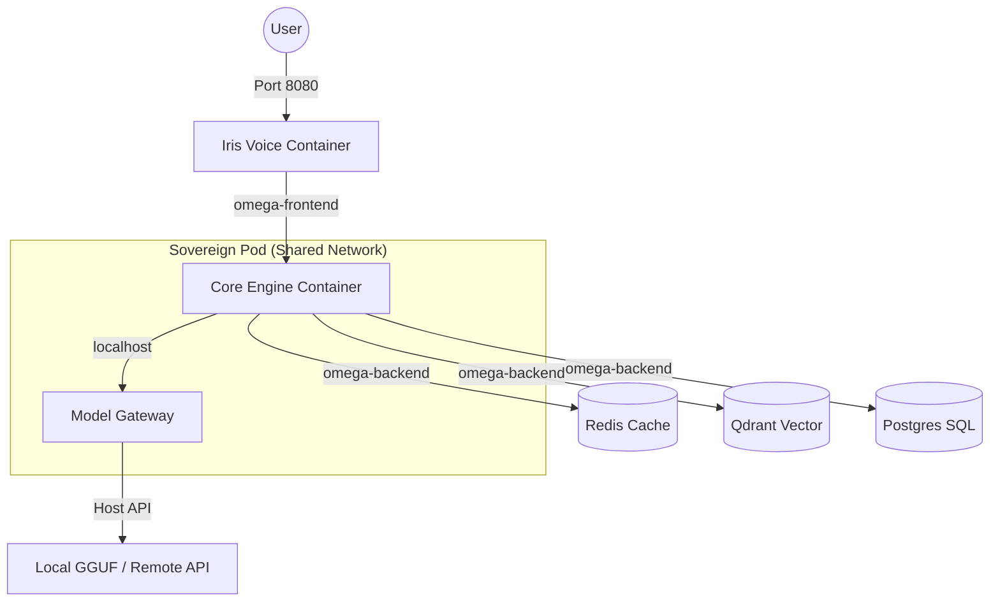

# 🔱 Sovereign Deployment Blueprint: Rootless Podman for AI Suites

**Document ID**: R_PODMAN_SOVEREIGN_DEPLOYMENT_BLUEPRINT
**Status**: ✅ AUTHORITATIVE
**Target Hardware**: Ryzen 7 5700U (Zen 2, 8C/16T, 14GB RAM)
**Sovereignty Score**: 10/10 (Zero-Root, Daemonless, Local-First)

---

## 1. Executive Overview

The Omega Engine requires a deployment architecture that maximizes the efficiency of limited hardware (14GB RAM) while maintaining absolute sovereign isolation. This blueprint evolves the base strategy from simple containerization to a **multi-tier isolated suite**, leveraging the full capabilities of Rootless Podman 5.0+ and cgroups v2.

---

## 2. Network Isolation Strategy

To prevent lateral movement and minimize the attack surface, the Omega Engine employs a **segmented network topology**.

### 2.1 The Tiered Network Model
Instead of a single bridge, the suite is split into two primary virtual networks:

| Network | Scope | Purpose | Members |
| :--- | :--- | :--- | :--- |
| `omega-frontend` | Semi-Isolated | User Interface & External API | Iris, User-CLI |
| `omega-backend` | Fully Isolated | Core Logic & Data Persistence | Core Engine, Redis, Qdrant, Postgres |

**The Gateway Pattern**: Only the **Core Engine** (or a dedicated API Gateway) resides on both networks, acting as the sovereign bridge. Iris can only talk to the Core Engine, never directly to the database or vector store.

### 2.2 Intra-Pod Communication
For services with extreme latency requirements (e.g., Core Engine $\rightarrow$ ModelGateway), we use **Pods**.
- **Shared Namespace**: Containers in a Pod share the same network namespace.
- **Localhost Routing**: Communication occurs via `localhost:<port>`, bypassing the virtual bridge and reducing latency.

---

## 3. High-Performance Volume Mapping

AI workloads are characterized by massive read-only files (Model Weights) and high-frequency small writes (Knowledge Bases/Logs).

### 3.1 Model Weight Optimization
To avoid the performance penalty of the OCI storage driver's copy-on-write (CoW) layer:
- **Direct Bind Mounts**: Use absolute host paths for model directories.
- **Mount Specification**: `Volume=/media/arcana-novai/omega_library/models:/models:ro,Z,U`
  - `:ro`: Read-only. Prevents accidental corruption and allows the OS to optimize page caching.
  - `:Z,U`: Ensures SELinux labels and UID mappings are correctly applied in rootless mode.
- **Filesystem Recommendation**: Host model storage should reside on **XFS** or **Btrfs** to optimize large file throughput on NVMe.

### 3.2 Persistent Gnosis & State
- **Knowledge Bases**: Use named volumes for `data/entities/` to leverage Podman's volume management, but ensure the underlying driver is `overlay` for speed.
- **Ephemeral State**: Use `Tmpfs` for all `/tmp`, `/cache`, and log directories to eliminate disk I/O bottlenecks and avoid host-level UID collisions.

---

## 4. Strict Resource Constraints (Cgroups v2)

On a 14GB RAM system, a single uncontrolled LLM spike can trigger a system-wide OOM event.

### 4.1 Memory Pressure Management
We implement a **Two-Tier Memory Guard**:
- **`MemoryReservation` (Soft Limit)**: Set to the expected baseline (e.g., 512MB). The kernel will try to keep the container at this level.
- **`Memory` (Hard Limit)**: Set to the absolute ceiling (e.g., 2GB). Exceeding this triggers the OOM killer *within* the container, protecting the host.
- **Swap Prevention**: Set `MemorySwap=0` (or equal to Memory limit) for AI containers to prevent "swap death" during high-load inference.

### 4.2 CPU Steering & Zen 2 Optimization
To avoid cache thrashing and context-switching overhead:
- **Core Pinning**: Use `CPUSet` to lock heavy AI containers to specific physical cores.
- **Example**: Pin Iris to cores `0,2` and Core Engine to `4,6`. This ensures that background OS tasks don't compete with the inference loop.

---

## 5. The Omega Suite Topology (Deployment Blueprint)

The following architecture is the mandated deployment pattern for the Omega Engine.

### 5.1 Suite Architecture Diagram


### 5.2 Deployment Manifest (Quadlet Specification)

**1. The Backend Network (`omega-backend.network`)**
```ini
[Network]
Internal=true
```

**2. The Core Engine (`omega-core.container`)**
```ini
[Container]
Image=omega-core:latest
Network=omega-frontend.network
Network=omega-backend.network
Volume=%h/data/omega:/app/data:Z,U
Memory=2G
MemoryReservation=1G
CPUSet=4,6
```

**3. The Iris Interface (`omega-iris.container`)**
```ini
[Container]
Image=omega-iris:latest
Network=omega-frontend.network
PublishPort=8080:8080
Memory=512M
CPUSet=0,2
```

---

## 6. Validation Checklist

- [ ] `stat -fc %T /sys/fs/cgroup` returns `cgroup2fs`
- [ ] `loginctl show-user $USER | grep Linger` returns `Linger=yes`
- [ ] `podman network inspect omega-backend` confirms `internal: true`
- [ ] `cat /proc/self/status | grep VmSwap` shows minimal usage for AI containers
- [ ] `podman top <container> -u` verifies SubUID mapping (e.g., 100000+)

---
**Implementation Note**: When deploying this blueprint, prioritize the `omega-backend` network first. Ensure the `Core Engine` is healthy via its `HealthCmd` before starting the `Iris` interface to prevent connection-refused loops.
