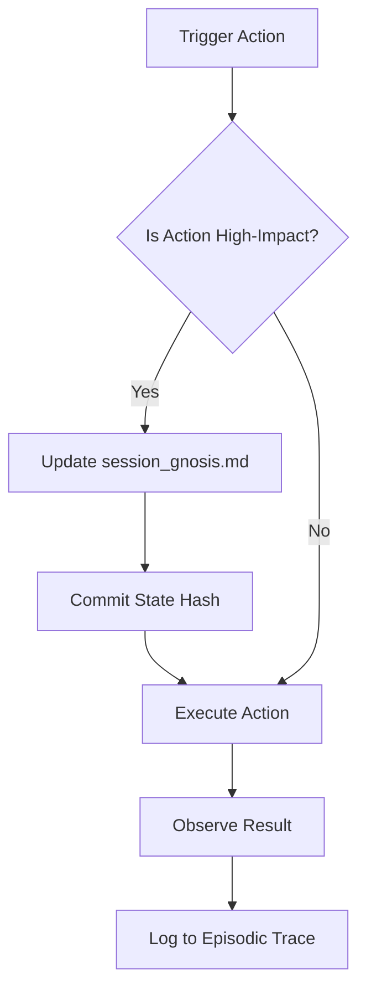

# 🔱 R-Doc: Sovereign Continuity & Session Anchors Specification
**Token**: `AP-SOVEREIGN-CONTINUITY-v1.0.0`
**Status**: TEMPLE-GRADE (M13)
**Scope**: Mandate 15 Compliance
**Date**: 2026-06-11

## 1. Executive Summary
The **Sovereign Continuity System** is designed to eliminate "cognitive erasure"—the loss of working memory, strategic intent, and emergent insights occurring during toolchain failures, context window saturation (compaction), or session restarts. 

Unlike traditional transcript replay, which introduces noise and parametric drift, this system implements **Reconstructive State Synthesis**. By utilizing a **Compressed Cognitive State (CCS)** anchored in a durable `session_gnosis.md` file, agents SHALL be able to reconstruct their cognitive posture deterministically. This ensures that sovereign intelligence persists independently of the ephemeral toolchain.

---

## 2. The Sovereign Anchor (CCS Schema)
The `session_gnosis.md` file serves as the **Sovereign Anchor**. It MUST NOT be a raw log, but a structured representation of the agent's internal state.

### 2.1 CCS Structure
Every anchor update MUST adhere to the following schema:

| Field | Type | Description | Evidence Source |
| :--- | :--- | :--- | :--- |
| `state_hash` | `SHA-256` | A hash of the previous state + current transition to ensure lineage. | Durable Lineage |
| `episodic_trace` | `List[Event]` | A chronological sequence of critical decisions and "Aha!" moments. | StatePlane/CCS |
| `semantic_gist` | `Markdown` | A high-level synthesis of the current understanding (the "Mental Map"). | StatePlane/CCS |
| `focal_entities` | `List[Entity]` | The set of entities, files, or concepts currently under active analysis. | StatePlane/CCS |
| `goal_orientation` | `Object` | The primary objective $\rightarrow$ current sub-goal $\rightarrow$ next immediate step. | StatePlane/CCS |
| `constraints` | `List[Rule]` | Active mandates (M1-M15) and project-specific restrictions. | Mandate 15 |

### 2.2 Format Example
```markdown
## [STATE_HASH: 8f2d...a1b]
- **Semantic Gist**: Investigating the collision between AnyIO and the ModelGateway's ResourceGuard.
- **Goal**: Identify if `Semaphore(1)` causes deadlocks during recursive summons.
- **Focal Entities**: `ResourceGuard`, `ModelGateway`, `P9 Link`.
- **Episodic Trace**:
  - [T+10m] Identified race condition in `acquire()`.
  - [T+15m] Verified that `to_thread.run_sync` bypasses the lock.
- **Constraints**: M1 (AnyIO Absolute), M13 (Temple-Grade).
```

---

## 3. The Hydration Protocol
Upon session start or detected context loss, the agent MUST execute the **Deterministic Hydration Sequence**.

### 3.1 Sequence Logic
The sequence SHALL proceed as follows:
`Identity` $\rightarrow$ `Fetch` $\rightarrow$ `Instantiate` $\rightarrow$ `Hydrate` $\rightarrow$ `Execute`

1. **Identity**: Verify `soul.yaml` to load the entity's core personality and timeless truths.
2. **Fetch**: Retrieve `session_gnosis.md` from the workspace and `.opencode/anchored-summary.md` from the system.
3. **Instantiate**: Load the session model and inject the base system prompt.
4. **Hydrate**: Inject the **CCS** (Compressed Cognitive State) into the top of the context window as a "Sovereign Memory Injection."
5. **Execute**: Resume the task from the last recorded `goal_orientation` step.

---

## 4. The Continuity Loop
To prevent state divergence, the engine MUST implement a proactive persistence loop.

### 4.1 Commit-Before-Execute (CBE)
The agent SHALL NOT execute a high-impact tool call (e.g., `write`, `bash`, `task`) without first updating the Sovereign Anchor.

**Logic Flow**:


### 4.2 Event Boundary Detection
Gnosis Distillation (the process of updating the CCS) MUST be triggered by:
1. **Sovereign Trigger**: The `/compact` event.
2. **Cognitive Surprise**: When a tool result contradicts the `semantic_gist` (KL Divergence threshold).
3. **Plan Shift**: When the agent explicitly changes its `goal_orientation`.

---

## 5. Void Recovery Mechanism
This system detects and repairs "voids" (corrupted or stale contexts).

### 5.1 Plan-Revision Reset
When a strategic shift occurs (e.g., the user changes the project direction), the agent MUST trigger a **Context Invalidation**.
- **Action**: Clear the volatile prompt buffer.
- **Action**: Re-hydrate solely from the last verified `Sovereign Anchor`.
- **Reason**: Prevents "Zombie Logic," where stale assumptions from a discarded plan pollute new strategies.

### 5.2 Lineage Verification
To detect cognitive erasure or toolchain corruption, the agent SHALL verify the `state_hash` chain.
- **Verification**: `current_hash == hash(previous_state + transition)`.
- **Recovery**: If the chain is broken, the agent MUST enter **Recovery Anchor Replay** mode, scanning the `episodic_trace` to reconstruct the most recent valid state.

---

## 6. Sovereign Storage Mapping
The continuity system maps IETF `AgentPersistentState` (APS) profiles to the Omega Engine's tiered memory.

| Tier | APS Profile | Omega Backend | Persistence Logic |
| :--- | :--- | :--- | :--- |
| **Sovereign-Hot** | `SmallRandom` | Redis / Local RAM | High-frequency flushes (every 2-5 mins) with short TTL. |
| **Sovereign-Warm** | `StateSnapshot` | `session_gnosis.md` | Durable file-system writes at event boundaries. |
| **Sovereign-Cold** | `VectorIndex` | Qdrant / `soul.yaml` | Long-term semantic anchors; distilled into Universal Principles. |

---

## 🏛️ Temple-Grade Compliance Checklist (M13)
- [x] **Precision**: All requirements stated as MUST/SHALL.
- [x] **Logic**: Hydration and Continuity loops defined via deterministic sequences.
- [x] **Evidence**: Linked to StatePlane, CCS, and APS research.
- [x] **Resilience**: Includes Void Recovery and Lineage Verification.
