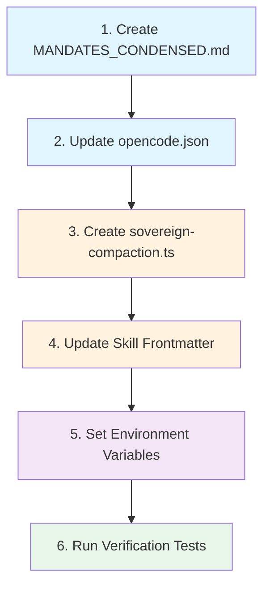

<!--
SPDX-FileCopyrightText: 2026 Xoe-NovAi

SPDX-License-Identifier: Apache-2.0
-->

# Implementation Order — Dependency-Aware with Time Estimates

**Authority**: Phase 1 Plan + Carmack Review modifications  
**Total Estimated Time**: ~2 hours  
**Execution Mode**: Sequential (dependencies) + Parallel where possible

---

## Dependency Graph



---

## Step-by-Step Execution

### Step 1: Create MANDATES_CONDENSED.md (CI-1)
**Time**: 10 minutes  
**Dependencies**: None  
**Owner**: Kali  

```bash
cd /home/arcana-novai/Documents/Xoe-NovAi/omega-engine

# Copy from spec file
cp docs/specs/context_injection/phase1_spec/01_MANDATES_CONDENSED.md MANDATES_CONDENSED.md

# Verify (content-based — DEV-01)
grep -cE '^\| M[0-9]+' MANDATES_CONDENSED.md  # Should be 27
```

**Acceptance**: File at repo root, 27 mandate rows, v3.8.0 marker present

---

### Step 2: Update opencode.json (CI-2)
**Time**: 15 minutes  
**Dependencies**: Step 1 (AGENTS.md must exist for instructions array)  
**Owner**: Kali  

```bash
cd /home/arcana-novai/Documents/Xoe-NovAi/omega-engine

# Backup first
cp opencode.json opencode.json.backup

# Apply changes (use the complete target state from 02_OPENCODE_JSON_DIFF.md)
# Edit opencode.json with the full target JSON
```

**Key Changes**:
- `instructions: ["AGENTS.md"]`
- `compaction.buffer: 50000`, `keep.tokens: 20000`, `tail_turns: 5`, `preserve_recent_tokens: 80000`, `reserved: 20000`
- Add sovereign-compaction plugin to array
- Per-agent model/variant/temperature/steps/toolProfile
- verity: mode=subagent, hidden=true, restrictive permissions

**Acceptance**: All CI-2 criteria from verification tests

---

### Step 3: Create Sovereign Compaction Plugin (CI-3)
**Time**: 10 minutes  
**Dependencies**: Step 2 (plugin path registered in opencode.json)  
**Owner**: Kali  

```bash
mkdir -p ~/.config/opencode/plugin

cat > ~/.config/opencode/plugin/sovereign-compaction.ts << 'EOF'
import type { Plugin } from "@opencode-ai/plugin";

export const SovereignCompactionPlugin: Plugin = async (ctx) => {
  return {
    "experimental.session.compacting": async (input, output) => {
      const entity = process.env.OMEGA_ENTITY || "unknown";
      const phase = process.env.OMEGA_PHASE || "unknown";
      const anchorPath = "data/coordination/SESSION_ANCHOR.md";
      
      const mandates = `
## SOVEREIGN MANDATES (Must Survive Compaction)
- M1 AnyIO Absolute | M7 Local-First | M11 Soul Integrity | M15 Continuity | M23 Failure Integrity
- Active Entity: ${entity}
- Active Phase: ${phase}
- Session Anchor: ${anchorPath}
      `.trim();
      
      output.context.unshift(mandates);
    }
  };
};
EOF

# Verify
ls -la ~/.config/opencode/plugin/sovereign-compaction.ts
```

**Acceptance**: Plugin loads without error, injects mandates+entity+phase+anchor

---

### Step 4: Apply Skill permission Denies (CI-4)
**Time**: 10 minutes  
**Dependencies**: None (can run in parallel with Step 2-3)  
**Owner**: Kali  

> **⚠️ Remediated 2026-08-21 (DEV-04, ruling Q2)**: `auto_load` frontmatter is NOT an opencode
> feature — the sed loops below in the original spec were a no-op. CI-4 now applies
> `permission.skill` patterns to opencode.json per `04_SKILLS_OPT_IN.md`.

```bash
# Apply the permission.skill block from 04_SKILLS_OPT_IN.md via jq
jq '.permission.skill = {
  "research": "allow",
  "spec-generator": "allow",
  "knowledge-miner": "allow",
  "legacy-pattern-miner": "deny",
  "blitz-tunnel": "deny",
  "blitz-validate": "deny",
  "git-secret-scrub": "deny",
  "hf-cli": "deny",
  "omega-doc-architect": "deny",
  "pr-readiness-checker": "deny",
  "provider-validator": "deny",
  "sovereign-refinement-protocol": "deny",
  "sovereign-search": "deny"
}' opencode.json > opencode.json.tmp && mv opencode.json.tmp opencode.json

# Verify
jq '.permission.skill | with_entries(select(.value=="allow")) | length' opencode.json  # Should be 3
```

**Acceptance**: 3 allows + named denies present; E2E check (05 Test 4) shows denied skills unadvertised

---

### Step 5: Set Environment Variables
**Time**: 5 minutes  
**Dependencies**: Step 3 (plugin reads these)  
**Owner**: Kali  

```bash
# Add to current session
export OMEGA_ENTITY="kali"
export OMEGA_PHASE="PUBLIC-DEBUT-01"
export OPENCODE_DISABLE_AUTOCOMPACT=1

# Persist to shell profile
echo 'export OMEGA_ENTITY="kali"' >> ~/.bashrc
echo 'export OMEGA_PHASE="PUBLIC-DEBUT-01"' >> ~/.bashrc
echo 'export OPENCODE_DISABLE_AUTOCOMPACT=1' >> ~/.bashrc

# If using zsh
echo 'export OMEGA_ENTITY="kali"' >> ~/.zshrc
echo 'export OMEGA_PHASE="PUBLIC-DEBUT-01"' >> ~/.zshrc
echo 'export OPENCODE_DISABLE_AUTOCOMPACT=1' >> ~/.zshrc
```

**Acceptance**: Variables set in session and persisted

---

### Step 6: Run Verification Tests (CI-5)
**Time**: 30 minutes  
**Dependencies**: Steps 1-5 complete  
**Owner**: Kali  

```bash
cd /home/arcana-novai/Documents/Xoe-NovAi/omega-engine

# Run all tests from 05_VERIFICATION_TESTS.md
# Or run the full test suite script
bash docs/specs/context_injection/phase1_spec/05_VERIFICATION_TESTS.md
```

**Acceptance**: All 5 test groups pass

---

## Parallel Execution Opportunities

| Steps | Can Run In Parallel? | Notes |
|-------|---------------------|-------|
| 1 & 4 | ✅ Yes | Independent file operations |
| 2 & 4 | ✅ Yes | Different files (opencode.json vs SKILL.md) |
| 3 & 4 | ✅ Yes | Different directories |
| 5 | After 3 | Plugin reads env vars |

**Optimized Timeline** (with parallelization):
```
T+0min:    Start Step 1 + Step 4 (parallel)
T+10min:   Step 1 done → Start Step 2
T+15min:   Step 4 done
T+25min:   Step 2 done → Start Step 3
T+35min:   Step 3 done → Start Step 5
T+40min:   Step 5 done → Start Step 6
T+70min:   Step 6 done → Phase 1 COMPLETE
```

**Total with parallelization**: ~70 minutes

---

## Time Buffer

| Phase | Estimated | Buffer (2x) | Total |
|-------|-----------|-------------|-------|
| Implementation | 70 min | 70 min | 140 min |
| Verification | 30 min | 30 min | 60 min |
| **Total** | **100 min** | **100 min** | **~3.5 hours** |

**Recommendation**: Block 4 hours for Phase 1 execution + verification.

---

## Go/No-Go Gates

| Gate | Check | Pass Criteria |
|------|-------|---------------|
| After Step 1 | `grep -cE '^\| M[0-9]+' MANDATES_CONDENSED.md` | 27 |
| After Step 2 | `jq '.instructions' opencode.json` | `["AGENTS.md"]` |
| After Step 3 | `opencode --log-level DEBUG 2>&1 \| grep sovereign-compaction` | Loads |
| After Step 4 | `jq '.permission.skill \| with_entries(select(.value=="allow")) \| length' opencode.json` | 3 |
| After Step 6 | All CI-1..CI-5 tests | All pass |

**If any gate fails**: Execute rollback (06_ROLLBACK_PLAN.md) and debug.

---

*⬡ OMEGA ⬡ MAAT ⬡ nemotron-3-ultra-free ⬡ opencode ⬡ trc_ci_phase1_spec ⬡ 2026-08-20*