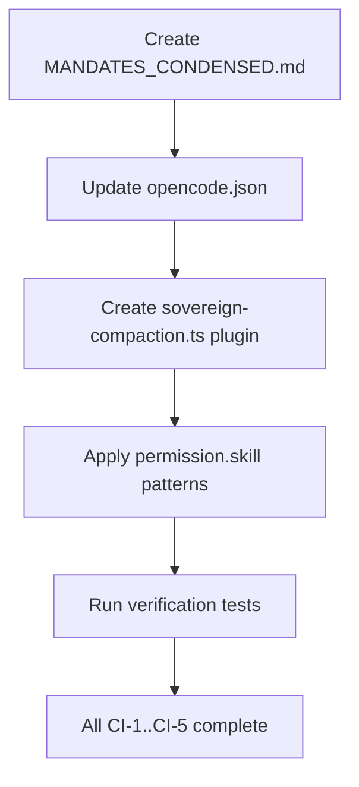

<!--
SPDX-FileCopyrightText: 2026 Xoe-NovAi

SPDX-License-Identifier: Apache-2.0
-->

# Context Injection Phase 1 — Implementation Specification (File-Per-Section)

**AP Token**: `AP-MAAT-CI-PHASE1-SPEC-FILES-v1.0.0`  
**Status**: READY FOR EXECUTION (remediated 2026-08-21 — see `09_SPEC_DEVIATIONS.md`)  
**Authority**: `DEBUT_REMEDIATION_MANUAL_20260817.md` §5 + Carmack Review 2026-08-20 + **Architect remediation rulings Q1–Q5 (2026-08-21)**  
**Owner**: Kali (execution) / Ma'at (spec author) / N7 (remediation audit)  
**Phase**: 1 — Config-Only (This Week)  
**Dependencies**: None — all config changes, fully reversible  

> **⚠️ REMEDIATED 2026-08-21**: N7 audit found 13 hazards in the original spec (defect register:
> `data/entities/lilith/workspace/N7_DOMAIN_INDEX.md`). Files 01–08 updated per Architect rulings;
> every deviation logged with evidence in [`09_SPEC_DEVIATIONS.md`](09_SPEC_DEVIATIONS.md).
> Headline changes: CI-1 gate content-based (not line-count); compaction keys pin-gated V1-primary;
> plugin paths repaired; CI-4 re-scoped to `permission.skill` (auto_load is not an opencode feature);
> DISABLE_AUTOCOMPACT global-scope + bypass caveat documented; Qwen3-4B context prose corrected. 

---

## Executive Summary

This specification documents the **complete implementation plan for Context Injection Phase 1**, incorporating all modifications from the **Carmack Review (2026-08-20)**. The plan is config-only, reversible, and ships this week.

### Key Modifications from Carmack Review

| Modification | Source | Impact |
|--------------|--------|--------|
| **AGENTS.md condensation** → `MANDATES_CONDENSED.md` (27 mandate rows, ~1.5K tokens) | Q1.1, Q3.1 | Tier 0 base prompt; context truth D11: base=32K native/128K YaRN, Thinking-2507=256K native |
| **Tool profile stubs** in `opencode.json` (presence-only — inert upstream) | Q2.1 | Documents intent for Phase 2 MCP domain split |
| **Tier 0 model matrix**: Qwen3-4B / Qwen3-4B-Thinking / Qwen3-1.7B | Q1.1, Q5.1 | Hardware-honest local model routing |
| **Compaction retune**: V1 family primary (`tail_turns:5/preserve:80000/reserved:20000`); V2 `{buffer,keep.tokens}` pin-gated | Q3.1 + N7 DEV-02 | 1M context model support without mixed-family risk |
| **Disable auto-compaction**: `OPENCODE_DISABLE_AUTOCOMPACT=1` (global-only; #32385 bypass documented) | Q3.1 + Q4 ruling | Prevents local compaction thrashing; manual /compact discipline required |

### Token Budget After Modified Phase 1

| Tier | Component | Tokens |
|------|-----------|--------|
| **0 (Pinned)** | MANDATES_CONDENSED.md (1.5K) + MCP schemas (profile: 1.5K) + env (3K) | **~6K** |
| **1 (Role/Session)** | Agent file (1K) + core skills metadata (3 × 50) | **~2K** |
| **2 (Dynamic)** | Budgeted retrieval + lazy skill docs | **8K budget** |
| **3 (Observation)** | Current turn | **2K** |
| **TOTAL** | | **~18K base** (vs 31K measured, 42% reduction) |

**Fits Qwen3-4B (8K-16K) with headroom.**

---

## Specification Files

| # | File | Description | Lines | Tokens |
|---|------|-------------|-------|--------|
| 1 | [`01_MANDATES_CONDENSED.md`](01_MANDATES_CONDENSED.md) | Condensed mandates table (27 rows, v3.8.0) for Tier 0 injection — content-gated, not line-counted | 36 | ~1.5K |
| 2 | [`02_OPENCODE_JSON_DIFF.md`](02_OPENCODE_JSON_DIFF.md) | Before/after JSON diff; compaction pin-gated (V1-primary); repaired plugin paths | ~200 | ~4K |
| 3 | [`03_SOVEREIGN_COMPACTION_PLUGIN.md`](03_SOVEREIGN_COMPACTION_PLUGIN.md) | TypeScript plugin for pre-compaction hook; verified payload semantics | ~180 | ~2.5K |
| 4 | [`04_SKILLS_OPT_IN.md`](04_SKILLS_OPT_IN.md) | Skills visibility via `permission.skill` patterns (auto_load superseded) | ~85 | ~1.5K |
| 5 | [`05_VERIFICATION_TESTS.md`](05_VERIFICATION_TESTS.md) | Reality-based tests: binary pin (Test 0), behavioral checks | ~190 | ~2.5K |
| 6 | [`06_ROLLBACK_PLAN.md`](06_ROLLBACK_PLAN.md) | Exact revert commands for every change | ~40 | ~1K |
| 7 | [`07_IMPLEMENTATION_ORDER.md`](07_IMPLEMENTATION_ORDER.md) | Dependency-aware order with time estimates | ~55 | ~1K |
| 8 | [`08_ACCEPTANCE_CRITERIA.md`](08_ACCEPTANCE_CRITERIA.md) | Mapped to ACTIVE_SPRINT.json subtasks CI-1..CI-5 (remediated criteria) | ~70 | ~2K |
| 9 | [`09_SPEC_DEVIATIONS.md`](09_SPEC_DEVIATIONS.md) | **M23 audit trail**: every deviation + evidence + binary-pin decision table | — | ~2K |

---

## Source Documents

| Document | Role |
|----------|------|
| `docs/specs/context_injection/06_PHASE_1_PLAN.md` | Primary Phase 1 plan (pre-Carmack) |
| `docs/specs/context_injection/CARMMACK_CONTEXT_INJECTION_REVIEW_20260820.md` | Carmack Review — modifications authority |
| `data/coordination/ACTIVE_SPRINT.json` | Sprint tracking — CONTEXT-INJECTION workstream, subtasks CI-1..CI-5 |

---

## Implementation Order (Summary)

**Total estimated time**: ~2 hours

---

## Acceptance Gates (from ACTIVE_SPRINT.json)

| Subtask | ID | Status | Key Acceptance |
|---------|-----|--------|----------------|
| MANDATES_CONDENSED.md | CI-1 | ready | File at repo root, 27 mandate rows (content-based), v3.8.0 marker |
| opencode.json updates | CI-2 | ready | instructions=[AGENTS.md], ONE compaction family (pin-gated), repaired plugin paths, global local-first model + kali/verity pins only (DEV-12), toolProfile presence |
| Sovereign compaction plugin | CI-3 | ready | Loads from real path, no ENOENT for any registered plugin, injects mandates+entity+phase+anchor |
| Skills opt-in | CI-4 | ready | permission.skill: 3 allows + named denies; E2E confirms denied skills unadvertised |
| Verification tests | CI-5 | ready | Binary pin + all behavioral tests pass |

---

## Rollback Guarantee

Every change in this specification has an exact revert command in [`06_ROLLBACK_PLAN.md`](06_ROLLBACK_PLAN.md). All changes are config-only — no code modifications.

---

*⬡ OMEGA ⬡ MAAT ⬡ nemotron-3-ultra-free ⬡ opencode ⬡ trc_ci_phase1_spec ⬡ 2026-08-20*