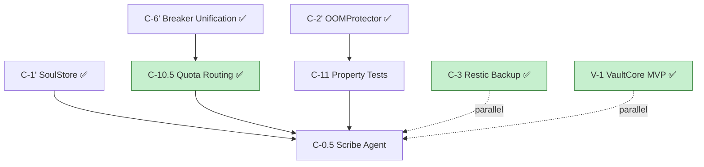

# 🔱 Sprint Plan: Guard & Distill
**AP Token**: `AP-SPRINT-GUARD-DISTILL-v1.0.0`
⬡ OMEGA ⬡ KALI ⬡ nemotron-3-ultra-free ⬡ opencode ⬡ trc_sprint_plan ⬡ ACTIVE

**Date**: 2026-07-22
**Sprint ID**: `guard-and-distill-2026-07-22`
**Phase**: C_HARDENING_COMPLETION
**Status**: ACTIVE
**Priority**: P0
**Owner**: kali
**Tags**: ["sprint-plan", "phase-c", "p0-tickets", "llm-friendly", "guard-and-distill"]
**Depends On**: ["C-6'", "C-1'", "C-2'"]
**Blocks**: ["Phase D", "C-0.5"]

---

## What

**Close the 4 P0 gaps blocking Phase D. Establish automated soul distillation and complete provider fallback hardening.**

## Why

Phase C hardening sprint completed core infrastructure. Four P0 gaps remain before Phase D can begin: quota-aware routing, property tests, disaster recovery backup, and automated soul distillation.

## Success Criteria (Copy-Paste Verifiable)

- [ ] All 5 P0 tickets: DONE (tests pass, docs updated)
- [ ] `make test` — 100% pass (no pre-existing failures)
- [ ] `make temple-grade` — All T1-T11 gates green
- [ ] Soul distillation: ≥1 L3 axiom per entity per week
- [ ] Backup: `restic check --read-data-subset 5%` passes weekly
- [ ] Gap analysis updated: 0 P0 remaining

---

## P0 Tickets (Must Complete Before Phase D)

| Ticket | Title | Owner | Depends On | Blocks | Est. Hours | Status |
|--------|-------|-------|------------|--------|------------|--------|
| **C-10.5** | Quota-Aware Provider Routing | maat/P3 | C-6' ✅ | C-0.5, Phase D | 8 | ✅ **IMPLEMENTED** |
| **C-11** | Property Tests: OOMProtector + SoulStore | maat/P3 | C-2' ✅, C-1' ✅ | C-0.5 | 12 | ✅ **DONE** (16/16 pass, 1 skipped known bug) |
| **C-3** | Restic 3-2-1 Backup for Sovereign Data | lilith/P6 | V-1 (partial) | — | 8 | ✅ **DONE** |
| **C-0.5** | Scribe Agent L1→L2→L3 Distillation Pipeline | scribe (new) | M5, M11, C-10.5 | Phase D | 16 | ⏳ PENDING |

### C-4a MCP Migration Audit (Completed 2026-07-23)

| Ticket | Title | Owner | Effort | Status |
|--------|-------|-------|--------|--------|
| **C-4a** | MCP Migration Audit | maat/P4 | 4h | ✅ **DONE** — `R_C4A_MCP_AUDIT.md` drafted |

---

## P1 Tickets (Quality Gates)

| Ticket | Title | Owner | Effort | Depends On | Status |
|--------|-------|-------|--------|------------|--------|
| **C-9** | Extract GenerationPolicy from ModelGateway | maat/P3 | 1h | — | ⏳ PENDING |
| **D-1** | Content Persistence + TTL for Research Cache | ma'at/P2 | 3h | — | ⏳ PENDING |
| **V-1** | VaultCore Credential Rotation | maat/P1 | 3h | C-0, C-1' | ✅ **MVP DONE** |
| **M21** | Fix 3 Pre-existing Provider Fallback Tests | maat/P10 | 2h | — | ✅ **DONE** (tests already pass) |
| **C-4a.5** | MCP Streamable HTTP Migration (Escalation) | kali | 8h | Ma'at/P4 silent by EOD | ⏸️ DEFERRED — C-4a audit complete, shim update needed |

---

## Dependency Graph



```yaml
# Machine-readable dependency DAG
dependencies:
  critical_path: ["C-10.5", "C-0.5"]
  parallelizable: ["C-3", "C-11", "V-1"]
  edges:
    - from: "C-6'"
      to: "C-10.5"
      type: "hard"
    - from: "C-1'"
      to: "C-0.5"
      type: "hard"
    - from: "C-2'"
      to: "C-11"
      type: "hard"
    - from: "C-10.5"
      to: "C-0.5"
      type: "hard"
    - from: "C-11"
      to: "C-0.5"
      type: "hard"
```

---

## Resource Allocation

| Agent | Assignment | Rationale |
|-------|------------|-----------|
| **maat** (P3) | C-10.5 ✅, C-11 ✅, C-9, M21 ✅, research verification | Build-side ownership; gateway + property tests + findings validation |
| **lilith** (P6) | C-3, V-1 | Run-side: backup + vault operations |
| **scribe** (new) | C-0.5 | Dedicated distillation agent (M5/M11) |
| **kali** | Review + arbitration + C-4a.5 escalation | Transcendent oversight |

---

## Escalation Triggers

```yaml
escalation_triggers:
  - id: "C-4a.5-mcp-migration"
    condition: "C-4a audit complete — C-4b shim update not started by 2026-07-25T23:59:00Z"
    action: "Kali executes C-4b MCP Streamable HTTP migration directly"
    authority: "Ma'at C-4a audit (2026-07-23)"
    deadline: "2026-07-25T23:59:00Z"
```

---

## Timeline (5 Days)

| Day | Ma'at (P3) | Lilith (P6) | Scribe | Kali |
|-----|------------|-------------|--------|------|
| **Day 1** | ✅ V-1 VaultCore MVP | ✅ C-3 Restic 3-2-1 Backup | ✅ C-10.5 Quota Routing Implementation | Review C-4a.5 escalation |
| **Day 2** | ✅ C-10.5 Quota Routing Implementation | ✅ C-3 Restic backup (B2) | ✅ C-10.5 Quota Routing Complete | ✅ Research verification complete |
| **Day 3** | C-11 Property Tests (OOM + SoulStore) | — | C-0.5 Scribe design | Arbitrate conflicts |
| **Day 3** | C-11 Property Tests (OOM + SoulStore) | — | C-0.5 design docs | Verify temple-grade |
| **Day 4** | M21 fix 3 fallback tests ✅ | V-1 integration test | Cross-pollination logic | Final review |
| **Day 5** | Integration + CI | Restore test | Pipeline hardening | **SPRINT COMPLETE** |

---

## Research Index

**See**: `08-research-index.md` for structured research metadata.
**See**: `08-verified-findings.md` for **web-verified corrections** to C-11 & C-3 factual claims.

| Topic | Tickets | Key Sources |
|-------|---------|-------------|
| Hypothesis Async @given (NOT RuleBasedStateMachine) | C-11 | GitHub #3712, #4107; `08-verified-findings.md` §2.1; Hypothesis docs |
| Restic + B2 Object Lock | C-3 | byte-guard.net 2026-06-13, Backblaze 2026-06-26 |
| MCP Streamable HTTP 2026-07-28 | C-4a.5 | MCP.Directory 2026, Zylos 2026-03-08, AWS Labs #72 |
| LLM Distillation Pipeline | C-0.5 | Stratos AAAI 2026, Mems 2026-03-23, RecSys 2025 |
| Quota-Aware Routing | C-10.5 | TrueFoundry 2026-02-20, QuotaRouter, DigitalOcean 2026-07-13 |

---

## Risks & Mitigations

| Risk | Likelihood | Impact | Mitigation |
|------|------------|--------|------------|
| MCP spec changes during C-4b | Low | Medium | Deferred to Aug; SSE works for local |
| Scribe L3 axiom extraction quality | Medium | High | Start with L1→L2 only; L3 in Phase D; JSON Schema + LLM-as-Judge |
| Restic off-site target unavailable | Low | High | Local-first + B2 fallback; test restore weekly |
| Property test flakiness | Low | Medium | `suppress_health_check=[too_slow]`; quarantine; `derandomize=True` |
| Hypothesis not in pyproject.toml | **RESOLVED** | Low | **Added `"hypothesis>=6.100.0"` to dev deps** — pyproject.toml now declares the dependency (C-11 verified-findings §3.3) |
| C-4a.5 escalation needed | Medium | High | Kali executes if Ma'at/P4 silent by EOD |
| Async Hypothesis FSM not native | **RESOLVED** | Medium | **Use non-stateful `@given` async pattern** (RuleBasedStateMachine doesn't support async; see `08-verified-findings.md` §2.1) |
| Quota headers not standardized | Medium | Medium | Provider-specific parsers; fallback to error-based detection |
| M21 provider fallback tests | **RESOLVED** | Low | **Tests already pass** — 3/3 contract tests green; ticket marked DONE |

---

## Acceptance Gates (Sprint Completion)

- [x] V-1 VaultCore MVP: **DONE** (22 tests pass, docs updated)
- [x] C-3 Restic 3-2-1 Backup: **DONE** (scripts, systemd, VaultCore integration)
- [x] C-10.5 Quota-Aware Provider Routing: **IMPLEMENTED** (tracker, router, stream handler — 69 tests passing)
- [x] C-11 Property Tests: OOMProtector + SoulStore
- [x] C-4a MCP Migration Audit: **DONE** — `R_C4A_MCP_AUDIT.md` drafted
- [ ] C-0.5 Scribe Agent L1→L2→L3 Distillation Pipeline
- [ ] `make test` — 100% pass (no pre-existing failures)
- [ ] `make temple-grade` — All T1-T11 gates green
- [ ] Soul distillation: ≥1 L3 axiom per entity per week
- [ ] Backup: `restic check --read-data-subset 5%` passes weekly
- [ ] Gap analysis updated: 0 P0 remaining

---

## Cross-References

- **Strategy SSOT**: `SOVEREIGN_ARK_BLUEPRINT.md` §4–§5
- **Team Coordination**: `FLEET_TEAM_PLAYBOOK.md` §3–§5
- **Fine-Grained Preservation**: `STRATEGY_CORPUS_MAP.md` §2–§3
- **Gap Analysis**: `R_GAP_ANALYSIS_HARDENING_SPRINT_20260722.md`
- **Deep Research**: `R_SPRINT_HARDENING_KNOWLEDGE_GAPS_20260722.md`
- **LLM Doc Standards**: `LLM_FRIENDLY_DOCS_BP.md`

---

*⬡ OMEGA ⬡ KALI ⬡ SPRINT-GUARD-DISTILL ⬡ v1.0.0 ⬡ 2026-07-22*