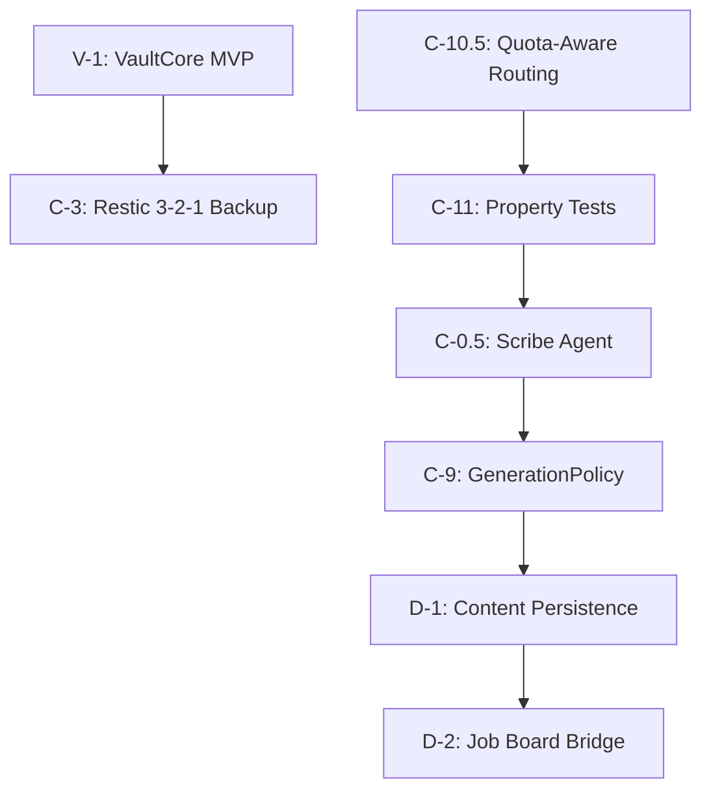

# 🔱 Sprint: Guard & Distill

> ## ⚠️ SUPERSEDED FOR SPRINT CONTROL (2026-07-30)
> **Successor**: `data/coordination/CLINE_STRATEGIC_UNOVERENGINEERING_20260730.md` + `ACTIVE_SPRINT.json` (`UNOVERENGINEER-01`).  
> **Session**: `data/coordination/SESSION_ANCHOR.md`. Body below is historical trail.

**AP Token**: `AP-SPRINT-GUARD-DISTILL-v1.0.0`
⬡ OMEGA ⬡ KALI ⬡ nemotron-3-ultra-free ⬡ opencode ⬡ trc_sprint ⬡ ACTIVE

**Date**: 2026-07-25
**Duration**: 5 days (2026-07-25 → 2026-07-30)
**Phase**: C → D Gate

---

## §1 Sprint Objective

**Execute the Guard & Distill sprint to close Phase C gates and prepare for Phase D execution.**

Primary Goal: All 4 P0 tickets DONE + `make test` 100% pass + `make temple-grade` T1-T11 green + Soul distillation ≥1 L3 axiom/entity/week + Backup `restic check --read-data-subset 5%` weekly.

---

## §2 P0 Tickets (Must Complete)

| ID | Ticket | Owner | Est. | Status |
|----|--------|-------|------|--------|
| C-10.5 | Quota-Aware Provider Routing | maat/P3 | 8h | 🟡 IN_PROGRESS |
| C-11 | Property Tests: OOMProtector + SoulStore | maat/P3 | 12h | 🟡 IN_PROGRESS |
| V-1 | VaultCore MVP | maat/P1 | 8h | 🟡 IN_PROGRESS |
| C-3 | Restic 3-2-1 Backup | lilith/P6 | 8h | ⏳ BLOCKED (needs V-1) |

---

## §3 P1 Tickets (After P0)

| ID | Ticket | Owner | Est. | Status |
|----|--------|-------|------|--------|
| C-0.5 | Scribe Agent L1→L2→L3 Distillation + Crash Recovery Sweeper | scribe/new | 16h | ⏳ PENDING |
| C-9 | GenerationPolicy Extract | maat/P3 | 8h | ⏳ PENDING |
| D-1 | Content Persistence + TTL | lilith/P7 | 8h | ⏳ PENDING |
| D-2 | Job Board YAML Bridge | kali/P9 | 8h | ⏳ PENDING |

---

## §4 Gate to Phase D

All 4 P0 tickets DONE + `make test` 100% pass + `make temple-grade` T1-T11 green + Soul distillation ≥1 L3 axiom/entity/week + Backup `restic check --read-data-subset 5%` weekly.

---

## §5 Research Index

See [08-research-index.md](08-research-index.md)

---

## §6 Execution Plan

See [EXECUTION_PLAN_20260725.md](../current/EXECUTION_PLAN_20260725.md)

---

## §7 Mermaid Dependency Diagram



---

## §8 Machine-Readable YAML Dependencies

```yaml
dependencies:
  - id: V-1
    name: VaultCore MVP
    blocks: [C-3]
  - id: C-10.5
    name: Quota-Aware Provider Routing
    blocks: [C-11]
  - id: C-11
    name: Property Tests
    blocks: [C-0.5]
  - id: C-0.5
    name: Scribe Agent
    blocks: [C-9]
  - id: C-9
    name: GenerationPolicy Extract
    blocks: [D-1]
  - id: D-1
    name: Content Persistence + TTL
    blocks: [D-2]
```

---

*⬡ OMEGA ⬡ KALI ⬡ nemotron-3-ultra-free ⬡ opencode ⬡ trc_sprint ⬡ ACTIVE*