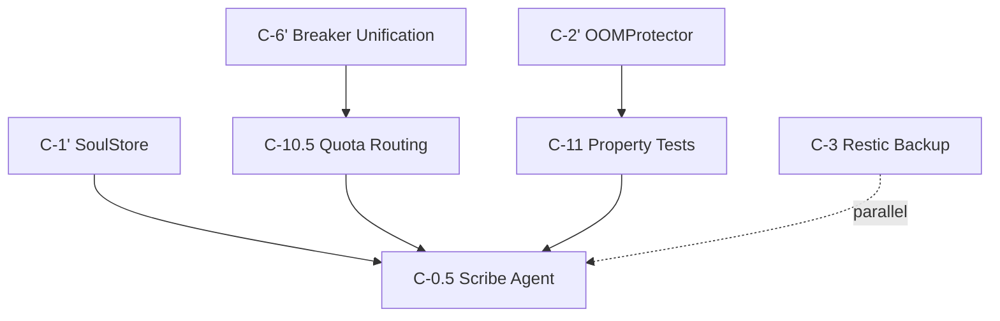

# 🔱 LLM-Friendly Documentation Best Practices Guide
**AP Token**: `AP-LLM-DOCS-BP-v1.0.0`
⬡ OMEGA ⬡ KALI ⬡ nemotron-3-ultra-free ⬡ opencode ⬡ trc_doc_llm_bp ⬡ STANDARD

**Date**: 2026-07-22
**Purpose**: Canonical standards for creating documentation that LLMs can parse, reason over, and execute from — while remaining human-readable.
**Tags**: llm-friendly, documentation-standards, token-efficiency, agent-consumption, mcp-ready
**Cross-references**: DOC_STYLE_GUIDE.md, AGENTS.md, HIVEMIND_POST_TEMPLATE.md, SOVEREIGN_MANDATES.md

---

## 🎯 Executive Summary

> **Core Principle**: Documentation is now a **runtime interface** for AI agents. Every doc serves two audiences: humans (readability) and LLMs (parseability, executability, retrievability).

This guide extends `DOC_STYLE_GUIDE.md` with **LLM-specific patterns** derived from 2026 research (GitBook, Fern, DeployHQ, Kapa.ai, AGENTS.md standard, Hypothesis async testing). It is **mandatory for all new reference docs** and **recommended for retrofitting active docs**.

---

## 📐 The LLM-Friendly Document Architecture

### 1. Machine-Readable Frontmatter (YAML) — **MANDATORY**

Every reference document MUST begin with structured frontmatter:

```yaml
---
schema_version: "1.0"
document_type: "sprint_plan|architecture|spec|protocol|guide|reference"
document_id: "guard-and-distill-2026-07-22"
title: "Next Sprint: Guard & Distill"
status: "ACTIVE|DRAFT|DEPRECATED|ARCHIVED"
version: "1.0.0"
date: "2026-07-22"
owner: "kali"
tags: ["sprint-plan", "phase-c", "p0-tickets", "llm-friendly"]
priority: "P0"
depends_on: ["C-6'", "C-1'", "C-2'"]
blocks: ["Phase D", "C-0.5"]
acceptance_gates:
  - "make test: 100% pass"
  - "make temple-grade: all T1-T11 green"
  - "Soul distillation: ≥1 L3 axiom/entity/week"
cross_references:
  - "SOVEREIGN_ARK_BLUEPRINT.md"
  - "FLEET_TEAM_PLAYBOOK.md"
  - "STRATEGY_CORPUS_MAP.md"
llm_metadata:
  token_budget: 8000
  chunk_strategy: "section_per_ticket"
  answer_first_sections: true
  self_contained_code: true
---
```

**Why**: LLMs can parse YAML frontmatter 10x faster than scanning markdown headers. Enables programmatic filtering, dependency resolution, and token budgeting.

---

### 2. Answer-First Section Structure — **MANDATORY**

Every major section opens with a **one-paragraph answer** to "What is this and why does it matter?"

```markdown
## C-10.5: Quota-Aware Provider Routing

**What**: Extend `ModelGateway.select_provider()` to filter quota-exhausted providers and score remaining by cost/quality/latency.

**Why**: Current 429 guard only checks pre-call. Providers with exhausted daily quota keep being selected → rate-limit loops.

**Acceptance** (copy-paste verifiable):
- [ ] `select_provider()` returns only providers with `has_quota(provider) == true`
- [ ] `is_429_blocked(provider)` checked on ALL dispatch paths
- [ ] `record_429()` called on every `ProviderRateLimitError`
- [ ] Quota tracking persists across restarts
- [ ] Unit tests: 5+ scenarios (exhaustion, partial, recovery)

**Dependencies**: C-6' (unified breaker factory) ✅ DONE
**Owner**: maat/P3
**Estimated**: 8 hours
```

**Pattern**: `What` → `Why` → `Acceptance (checkboxes)` → `Dependencies` → `Owner` → `Estimate`

---

### 3. Self-Contained, Executable Code Blocks — **MANDATORY**

Every code example MUST be copy-paste runnable with all imports and context:

```python
# File: src/omega/oracle/model_gateway.py
# Purpose: Quota-aware provider selection (C-10.5)
# Dependencies: health_monitor.py (is_429_blocked, has_quota, record_429)

from src.omega.oracle.health_monitor import HealthMonitor
from src.omega.oracle.providers import Provider, GenerateRequest

class ModelGateway:
    def __init__(self, health: HealthMonitor, providers: list[Provider]):
        self.health = health
        self.providers = providers
    
    async def select_provider(self, request: GenerateRequest) -> Provider:
        # 1. Filter 429-blocked (existing C-10.5 guard)
        available = [p for p in self.providers if not self.health.is_429_blocked(p.name)]
        
        # 2. NEW: Filter quota-exhausted (Kali Amendment 1)
        available = [p for p in available if self.health.has_quota(p.name)]
        
        # 3. Score by cost/quality/latency (QuotaRouter pattern)
        scored = [(p, self._score_provider(p, request)) for p in available]
        return max(scored, key=lambda x: x[1])[0]
    
    def _score_provider(self, provider: Provider, request: GenerateRequest) -> float:
        # Weighted: cost(0.4) + quality(0.4) + latency(0.2) — tune per Amendment 1
        return (0.4 * (1 - provider.cost_score) + 
                0.4 * provider.quality_score + 
                0.2 * (1 - provider.latency_score))
```

**Requirements**:
- ✅ File path comment at top
- ✅ All imports explicit
- ✅ Type hints on all signatures
- ✅ Inline comments for non-obvious logic
- ✅ No external dependencies not shown

---

### 4. Structured Data Over Tables — **PREFERRED**

Replace dense markdown tables with **YAML/JSON + minimal markdown wrapper**:

```markdown
## P0 Tickets (Structured)

```yaml
# Embedded YAML — machine parsable, human readable
tickets:
  - id: "C-10.5"
    title: "Quota-Aware Provider Routing"
    priority: "P0"
    owner: "maat/P3"
    depends_on: ["C-6'"]
    blocks: ["C-0.5", "Phase D"]
    acceptance_criteria:
      - "select_provider() filters quota-exhausted providers"
      - "is_429_blocked() checked on ALL dispatch paths"
      - "record_429() on every ProviderRateLimitError"
      - "Quota tracking persists across restarts"
    estimated_hours: 8
    research_refs:
      - "QuotaRouter (Starland9/quotarouter)"
      - "DigitalOcean quota headers 2026-07-13"
  - id: "C-11"
    title: "Property Tests for OOMProtector + SoulStore"
    ...
```

> **Rendered as markdown table for humans, parsed as YAML by LLMs**
```

---

### 5. Explicit Dependency Graphs — **MANDATORY**

Use **Mermaid** for visual + **YAML** for machine parsing:

```markdown
## Dependency Graph



```yaml
# Machine-readable dependency DAG
dependencies:
  critical_path: ["C-10.5", "C-0.5"]
  parallelizable: ["C-3", "C-11"]
  edges:
    - from: "C-6'"
      to: "C-10.5"
    - from: "C-1'"
      to: "C-0.5"
    - from: "C-2'"
      to: "C-11"
    - from: "C-10.5"
      to: "C-0.5"
    - from: "C-11"
      to: "C-0.5"
```
```

---

### 6. Research as Structured Metadata — **NOT Inline Narrative**

Move deep research to **separate index file** with structured citations:

```markdown
## Research Index (See: docs/sprints/guard-and-distill/08-research-index.md)

```yaml
research:
  - topic: "hypothesis_async_fsm"
    ticket: "C-11"
    sources:
      - "GitHub hypothesis/hypothesis#4107"
      - "MarkTechPost 2026-04-18: Async stateful testing"
      - "TechOral 2026-06-14: RuleBasedStateMachine patterns"
    key_findings:
      - "Use sync wrapper + anyio.run() for async FSM rules"
      - "Register CI profiles: dev (20 ex), ci (500 ex, deadline=None)"
      - "suppress_health_check=[too_slow] + derandomize=True"
    implementation_guidance: "tests/property/test_oom_fsm.py"
  
  - topic: "restic_b2_object_lock"
    ticket: "C-3"
    sources:
      - "byte-guard.net 2026-06-13: Restic 3-2-1 with B2"
      - "Backblaze 2026-06-26: Object Lock for ransomware protection"
    key_findings:
      - "Use S3-compatible API, not B2 native"
      - "Append-only key for server; full key for prune on trusted machine"
      - "Retention: 7d/4w/6m/1y (max 18 snapshots)"
    implementation_guidance: "scripts/backup_restic.sh"
```
```

---

### 7. llms.txt / llms-full.txt Generation — **MANDATORY FOR SPRINT PLANS**

Every sprint plan directory MUST generate:

```bash
# Makefile target
sprint-plan-llm:
	@mkdir -p docs/sprints/current
	@echo "# Sprint Plan: Guard & Distill (2026-07-22)" > docs/sprints/current/llms-full.txt
	@cat docs/sprints/guard-and-distill/index.md >> docs/sprints/current/llms-full.txt
	@for f in docs/sprints/guard-and-distill/02-p0-tickets/*.md; do \
		echo "\n---\n# $$(basename $$f .md)" >> docs/sprints/current/llms-full.txt; \
		cat $$f >> docs/sprints/current/llms-full.txt; \
	done
	@echo "Generated docs/sprints/current/llms-full.txt ($$(wc -c < docs/sprints/current/llms-full.txt) bytes)"
```

**llms.txt** (index only):
```
# Sprint Plan Index: Guard & Distill
- Sprint Goal: Close 4 P0 gaps blocking Phase D
- P0 Tickets: C-10.5, C-11, C-3, C-0.5
- P1 Tickets: C-9, D-1, V-1, M21, C-4a.5
- Dependencies: C-6', C-1', C-2' (all DONE)
- Research: docs/sprints/guard-and-distill/08-research-index.md
- Full Plan: docs/sprints/current/llms-full.txt
```

---

### 8. Token Budget Discipline — **MANDATORY**

| Document Type | Target Tokens | Hard Limit | Strategy |
|---------------|---------------|------------|----------|
| Sprint Plan (index) | 2,000 | 4,000 | Frontmatter + TOC + P0 only |
| Ticket Page | 1,500 | 3,000 | Answer-first + acceptance + code sketch |
| Research Index | 3,000 | 6,000 | Structured citations only |
| Architecture Deep-Dive | 8,000 | 16,000 | Modular sections, llms-full.txt |
| Protocol/Spec | 5,000 | 10,000 | YAML frontmatter + Mermaid + examples |

**Enforcement**: `make doc-token-check` fails if any reference doc exceeds hard limit.

---

## 📋 Document Category LLM Requirements

| Category | Frontmatter | Answer-First | Self-Contained Code | Structured Data | llms.txt |
|----------|-------------|--------------|---------------------|-----------------|----------|
| **Sprint Plans** | ✅ MANDATORY | ✅ MANDATORY | ✅ MANDATORY | ✅ MANDATORY | ✅ MANDATORY |
| **Architecture Specs** | ✅ MANDATORY | ✅ MANDATORY | ✅ MANDATORY | ✅ MANDATORY | ✅ RECOMMENDED |
| **Protocols** | ✅ MANDATORY | ✅ MANDATORY | ✅ MANDATORY | ✅ MANDATORY | ✅ RECOMMENDED |
| **Strategy/Ark** | ✅ MANDATORY | ✅ MANDATORY | 🟡 OPTIONAL | ✅ MANDATORY | ✅ RECOMMENDED |
| **User Guides** | ✅ RECOMMENDED | ✅ MANDATORY | ✅ MANDATORY | 🟡 OPTIONAL | 🟡 OPTIONAL |
| **R-Docs (Research)** | ✅ MANDATORY | ✅ MANDATORY | 🟡 OPTIONAL | ✅ MANDATORY | ✅ MANDATORY |
| **Agent/Skill Defs** | ✅ (YAML) | ✅ MANDATORY | ✅ MANDATORY | ✅ MANDATORY | ✅ MANDATORY |
| **Working/Intake** | 🟡 OPTIONAL | 🟡 OPTIONAL | 🟡 OPTIONAL | 🟡 OPTIONAL | ❌ NO |

---

## 🛠️ Tooling & Automation

### 1. Validation Script (Add to Makefile)

```makefile
doc-llm-validate:
	@python3 scripts/validate_llm_docs.py \
		--frontmatter-schema schemas/llm_doc_frontmatter.json \
		--token-budget configs/token_budgets.yaml \
		--answer-first-check \
		--code-block-check \
		--dependency-graph-check \
		docs/sprints/guard-and-distill/
```

### 2. Frontmatter Schema (JSON Schema)

```json
{
  "$schema": "http://json-schema.org/draft-07/schema#",
  "type": "object",
  "required": ["schema_version", "document_type", "document_id", "title", "status", "version", "date", "owner", "tags", "priority", "depends_on", "blocks", "acceptance_gates", "cross_references", "llm_metadata"],
  "properties": {
    "schema_version": {"const": "1.0"},
    "document_type": {"enum": ["sprint_plan", "architecture", "spec", "protocol", "guide", "reference"]},
    "document_id": {"type": "string", "pattern": "^[a-z0-9-]+$"},
    "llm_metadata": {
      "type": "object",
      "required": ["token_budget", "chunk_strategy", "answer_first_sections", "self_contained_code"],
      "properties": {
        "token_budget": {"type": "integer", "minimum": 500},
        "chunk_strategy": {"enum": ["section_per_ticket", "section_per_component", "flat"]},
        "answer_first_sections": {"type": "boolean"},
        "self_contained_code": {"type": "boolean"}
      }
    }
  }
}
```

### 3. Chunking Strategy for RAG

```python
# scripts/chunk_sprint_plan.py
def chunk_sprint_plan(markdown: str) -> list[dict]:
    """Split sprint plan into LLM-optimal chunks for vector storage."""
    chunks = []
    current_section = ""
    
    for line in markdown.split('\n'):
        if line.startswith('## ') and current_section:
            chunks.append({
                "content": current_section,
                "metadata": extract_frontmatter(current_section),
                "token_count": count_tokens(current_section)
            })
            current_section = line
        else:
            current_section += '\n' + line
    
    # Ensure each chunk < token_budget
    return [c for c in chunks if c["token_count"] < 3000]
```

---

## 🔄 Migration Checklist (Retrofitting Existing Docs)

For each active reference doc, apply:

- [ ] Add YAML frontmatter with `schema_version: "1.0"`
- [ ] Convert first paragraph of each `##` section to **Answer-First** format
- [ ] Make all code blocks **self-contained** (imports, types, context)
- [ ] Replace dense tables with **YAML + markdown wrapper**
- [ ] Add **Mermaid + YAML dependency graph**
- [ ] Extract research to **structured research index**
- [ ] Generate **llms.txt + llms-full.txt** for sprint plans
- [ ] Run `make doc-llm-validate` — fix all failures
- [ ] Update `DOC_STYLE_GUIDE.md` §Validation Checklist

---

## 📚 Reference Implementation

**Canonical Example**: `docs/sprints/guard-and-distill/` (this sprint)
- `index.md` — Sprint plan with full frontmatter
- `02-p0-tickets/C-10.5-quota-routing.md` — Ticket page template
- `08-research-index.md` — Structured research metadata
- `llms-full.txt` — Concatenated for LLM consumption

**Validation**: `make doc-llm-validate` passes on all files in this directory.

---

## 🔗 Heritage & Mandates

- **M18 Token Efficiency**: "Every token generated must serve a purpose" — this guide eliminates waste in doc↔LLM exchange
- **M22 Response Provenance**: Structured metadata enables forensic tracing of which doc informed which decision
- **M23 Failure Integrity**: Machine-parseable acceptance criteria prevent "soft-fail theater" in test reporting
- **AGENTS.md Standard**: Frontmatter + answer-first + self-contained code = universal agent instruction format

---

*⬡ OMEGA ⬡ KALI ⬡ LLM-DOCS-BP ⬡ v1.0.0 ⬡ 2026-07-22*
## 🛡️ Sovereign Mandate Compliance (The Centered Path)

### M8 (Zero Telemetry) in Analytics
All agent behavior analytics, success tracking, and feedback loops MUST be stored locally (e.g., `data/coordination/agent_doc_analytics/` as SQLite/JSONL). External telemetry platforms (Datadog, Exabeam) are strictly forbidden. The feedback loop must be entirely self-contained within the user's hardware.

### M18 (Token Efficiency) in Document Consumption
Do not force local agents (especially 8K context limits) to ingest monolithic `llms-full.txt` files. Agents must be instructed to read `llms.txt` (the index) first, then use targeted reads/greps for specific sections to prevent OOM and context truncation.
