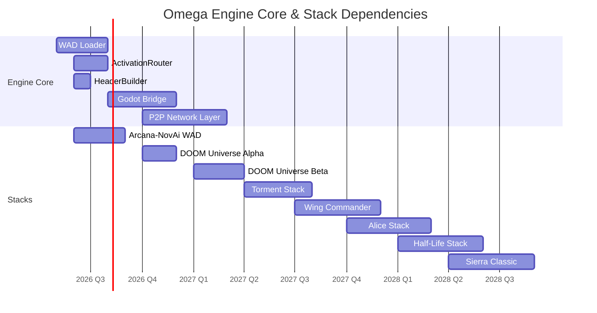

# 🔱 Omega Engine — Stack Release Roadmap (2026–2028)
# The WAD Manifesto

**AP Token**: `AP-STACK-ROADMAP-v0.1.0`
⬡ OMEGA ⬡ OVERSIGHT ⬡ openrouter/gpt-oss-120b:free ⬡ opencode ⬡ trc_overseer ⬡ ROADMAP

**Created**: 2026-05-16
**Horizon**: 2026–2028
**Core Principle**: One stack = one WAD container. The engine never grows — only the WAD directory does.

---

## §0 The WAD Architecture (Recap)

**Note**: The distributable form of a WAD is the **XOE File** (`.xoe`). See `docs/research/omni/XOE_SPECIFICATION.md`. The WAD directories under `config/wads/` are the development form; `.xoe` files are the compressed, shareable packages.

```
Omega Engine Core (5 components, never expands)
├── 1. WAD Loader          → reads manifest.yaml, wires entities/voices/VR/P2P
├── 2. Query Router        → ActivationRouter → EntityRegistry → ModelGateway
├── 3. Provider Fabric     → lmster, ollama, openrouter, google, native...
├── 4. Memory Store        → Hot/Warm/Cold with cross-pollination
└── 5. Godot Bridge        → streams entity state to 3D renderer

One WAD = one directory:
└── config/wads/<stack_name>/
    ├── manifest.yaml       → metadata, dependencies, mode
    ├── entities/           → soul.yaml files
    ├── voices/             → activation phrases, system prompts
    ├── knowledge/          → markdown, axioms, research
    ├── vr/                 → Godot .tscn scenes, textures, models
    └── p2p.yaml            → discovery, consent rules
```

---

## §1 Release Schedule

### 2026 — Foundation Year

| Quarter | Milestone | Stack | Key Deliverables |
|---------|-----------|-------|------------------|
| **Q2** | WAD Infrastructure | Core | `wad_loader.py`, `wad_schema.py`, manifest spec, default Omega WAD |
| **Q3** | Arcana-NovAi v1 | Arcana-NovAi | 10 Pillar entities as WAD, Iris voice, 42 Ideals, first VR scenes |
| **Q4** | DOOM Universe — Design Doc | DOOM | Entity mapping (Doomguy, demons, weapons), E1M1 VR concept, sound design |

### 2027 — Expansion Year

| Quarter | Milestone | Stack | Key Deliverables |
|---------|-----------|-------|------------------|
| **Q1** | DOOM Universe — Beta | DOOM | Full entity set, Inferno/Pandemonium VR, basic P2P deathmatch |
| **Q2** | Torment Stack — Alpha | Torment | Nameless One, Dak'kon, Annah, Fall-from-Grace, Sigil VR concept |
| **Q3** | Wing Commander / Privateer | WC | Ship entities, navigation systems, space VR scenes |
| **Q4** | American McGee's Alice | Alice | Wonderland entities, VR level traversal, dark aesthetic |

### 2028 — Maturity Year

| Quarter | Milestone | Stack | Key Deliverables |
|---------|-----------|-------|------------------|
| **Q1** | Half-Life | HL | Black Mesa, Combine, Xen — full narrative-driven stack |
| **Q2** | Classic Sierra | Sierra | King's Quest V, Space Quest — point-and-click VR interface |
| **Q3** | P2P Metropolis Live | All | Cross-stack P2P connections, soul print exchange, shared VR realms |
| **Q4** | User Stack Creator | Core | GUI tool to scaffold + package custom WADs |

---

## §2 DOOM Universe Stack — Detailed Planning

### Identity

| Attribute | Value |
|-----------|-------|
| **Inspiration** | Doom (1993), Doom II, Doom 64, Doom (2016), Doom Eternal |
| **Tribute to** | John Carmack, John Romero, Sandy Petersen, Adrian Carmack, Bobby Prince, Dave Taylor, Donna Jackson (id Mom) |
| **Tagline** | "Rip and tear — until it is done." |
| **Cosmology** | UAC → Phobos Base → Inferno → Pandemonium → Hell |
| **Voice Assistant** | "Hey Doomguy" — Doomguy (Doom Slayer) as neutral guide |
| **Default Entity** | Doomguy — protector, warrior, silent but eloquent when needed |
| **Secondary Entities** | The Demons (imp, cacodemon, baron of hell, cyberdemon, spider mastermind), The Weapons (chainsaw, shotgun, BFG-9000), The UAC, The Arch-Vile, The Icon of Sin |

### WAD Structure

```
config/wads/doom_universe/
├── manifest.yaml
├── entities/
│   ├── doomguy.yaml              ← Main entity, neutral protector
│   ├── demons/
│   │   ├── imp.yaml
│   │   ├── cacodemon.yaml
│   │   ├── baron_of_hell.yaml
│   │   ├── cyberdemon.yaml
│   │   ├── spider_mastermind.yaml
│   │   └── arch_vile.yaml
│   └── weapons/
│       ├── shotgun.yaml
│       ├── super_shotgun.yaml
│       ├── chain_saw.yaml
│       ├── rocket_launcher.yaml
│       ├── plasma_rifle.yaml
│       └── bfg_9000.yaml
├── voices/
│   └── doomguy.yaml              ← "Hey Doomguy" activation
├── knowledge/
│   ├── BESTIARY.md               ← Demon lore and behaviors
│   ├── ARMORY.md                 ← Weapon specs and history
│   └── UAC_INCIDENT.md           ← Backstory
├── vr/
│   ├── e1m1_phobos_base.tscn     ← Knee-deep in the Dead
│   ├── inferno.tscn               ← Shores of Hell
│   ├── pandemonium.tscn           ← Thy Flesh Consumed
│   └── entities/
│       ├── doomguy.glb            ← 3D avatar
│       └── imp.glb
├── music/                         ← Bobby Prince MIDI tributes
└── p2p.yaml
```

### Development Phases

| Phase | Timeline | What Gets Built | Dependencies |
|-------|----------|-----------------|--------------|
| **Alpha** | 2026 Q4 | Entity definitions, voice activation, core knowledge base | WAD Loader (Q2 2026) |
| **Beta** | 2027 Q1 | VR scenes (E1M1), basic entity avatars, sound integration | Godot Bridge (Q3 2026) |
| **Release** | 2027 Q2 | Full demon roster, all three episodes, P2P support, multiplayer | P2P Network (Q4 2026) |
| **Post-launch** | 2027+ | Modding tools, user-created WAD levels, cross-stack demon invasions | User Stack Creator (2028) |

---

## §3 Stack Dependencies & Engine Requirements

All stacks depend on a minimum Omega Engine version. This defines the engine roadmap:



---

## §4 The Vision Statement

> The Omega Engine is Prometheus' Fire. The XOE containers (`.xoe`) are the tools forged in that fire. Each user forges their own future — whether that future is a Hermetic temple of 10 Pillar Keepers, a Phobos base overrun by demons, a wing commander's starfighter bridge, or a wonderland of their own imagination. The Foundation provides the spark, the anvil, the container format, and the P2P metropolis. The user brings the vision. The entities bring the life. The VR brings the world. And the `.xoe` brings it all home.