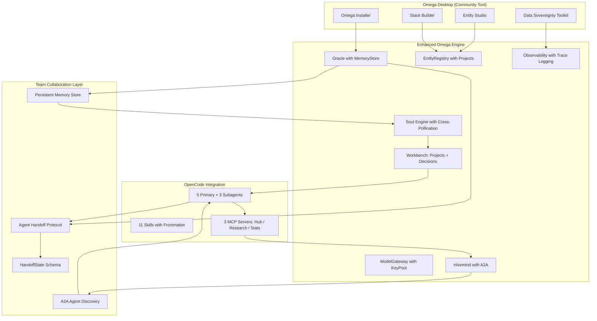

# 🔱 Omega Engine — Systems Hardening & Team Collaboration Architecture
## Comprehensive Evaluation of All Systems for the Xoe-NovAi Foundation Vision

**AP Token**: `AP-SYSTEMS-HARDENING-v1.0.0`
⬡ OMEGA ⬡ SOPHIA ⬡ deepseek-v4-flash ⬡ opencode ⬡ trc_synthesis ⬡ SYSTEMS-HARDENING

**Date**: 2026-05-15
**Method**: 4 parallel subagents (2 web research + 2 local deep inspection)
**Sources**: 30+ web searches, 50+ URLs, complete inspection of OpenCode ecosystem, MCP servers, memory systems

---

## §0 Executive Summary

After evaluating every system against the requirements for:
1. **True team collaboration** (user→agent and agent→agent)
2. **Persistent memory across sessions**
3. **Multi-agent orchestration**
4. **OpenCode custom modes and skills**
5. **MCP server ecosystem**

**Finding**: The architecture is fundamentally sound, but **none of the systems are ready for the scale of the Xoe-NovAi Foundation vision**. Critical gaps exist in agent definitions, MCP server architecture, persistent memory, handoff protocols, and team collaboration infrastructure.

The good news: most gaps are **configuration and integration issues**, not fundamental redesigns. The patterns exist in the web research, the code exists in the legacy repos, and the architecture decisions in PIVOT_LOG.md are correct.

---

## §1 Current State Assessment

### 1.1 Agent Ecosystem Readiness

| Component | Status | Ready for Team? | Critical Gaps |
|-----------|--------|----------------|---------------|
| **opencode.json config** | 🟡 PARTIAL | No | No model config, hardcoded API key, MCP server type inconsistency |
| **builder.md agent** | ✅ GOOD | Yes | Minor: duplicated text |
| **gnosis-analyst.md agent** | ✅ GOOD | Yes | Clean subagent definition |
| **researcher.md agent** | ❌ BROKEN | No | No frontmatter — mode, permissions, model all undefined |
| **researcher-omnidroid.md agent** | ❌ BROKEN | No | No frontmatter, speculative entity references |
| **sovereign-expert.md agent** | ❌ BROKEN | No | No frontmatter, references non-existent skills |
| **knowledge-miner skill** | ✅ GOOD | Yes | Clean, well-structured |
| **spec-generator skill** | ✅ GOOD | Yes | Clean, comprehensive template |
| **provider-validator skill** | ✅ GOOD | Yes | Clean, safety-conscious |
| **omega-doc-architect skill** | ❌ BROKEN | No | No frontmatter, overlaps with spec-generator |
| **legacy-pattern-miner skill** | ❌ BROKEN | No | No frontmatter, overlaps with knowledge-miner |
| **pr-readiness-checker skill** | ❌ BROKEN | No | No frontmatter |
| **blitz-validate skill** | ❌ BROKEN | No | No frontmatter, very narrow EleveLabs scope |
| **blitz-tunnel skill** | ❌ BROKEN | No | No frontmatter, references ngrok/cloudflared without verification |

### 1.2 MCP Server Architecture Readiness

| Component | Status | Ready for Team? | Critical Gaps |
|-----------|--------|----------------|---------------|
| **omega_hub/server.py** | ❌ BROKEN | No | get_engine() undefined, asyncio vs anyio, duplicate state |
| **omega-hivemind/server.py** | 🟡 PARTIAL | No | 100% code duplication with hub, no mutex |
| **omega-library/server.py** | 🟡 PARTIAL | No | Duplicated in hub, separate state |
| **omega-oracle/server.py** | 🟡 PARTIAL | No | Duplicated in hub, separate Oracle() instance |
| **omega-research/server.py** | ✅ GOOD | Yes | Clean, well-documented |
| **omega-stats/server.py** | 🟡 PARTIAL | No | os.popen deprecated, sync tools in async context |
| **mcp_runtime.py** | ✅ GOOD | Yes | Clean abstraction, systemd socket activation |

### 1.3 Memory & Persistence Readiness

| Component | Status | Ready for Team? | Critical Gaps |
|-----------|--------|----------------|---------------|
| **MemoryStore (hot/warm/cold)** | ✅ GOOD | Partial | Sound architecture, used by nothing — no callers write to it |
| **ContextBuilder** | 🟡 PARTIAL | No | build_context_for_user ignores user_id param, memory_store dependency |
| **Soul evolution (oracle.py)** | ❌ BROKEN | No | Race condition, non-atomic write, generic lessons |
| **Observability JSONL** | ✅ GOOD | Yes | Clean, daily rotation, persistent |
| **Discovery job persistence** | ✅ GOOD | Yes | Directory-based JSON persistence, status lifecycle |
| **Hivemind HALL_OF_RECORDS** | 🟡 PARTIAL | No | No file locking, path traversal risk, no TTL |

### 1.4 Team Collaboration Infrastructure Readiness

| Capability | Status | What Exists | What's Missing |
|------------|--------|-------------|----------------|
| **User→Agent handoff** | ❌ NONE | Session compaction only | Structured handoff protocol with task/decisions/blockers |
| **Agent→Agent handoff** | ❌ NONE | Hivemind MCP exists but unused | Formal HandoffState schema, /handover CLI command |
| **Cross-session memory** | 🟡 PARTIAL | MemoryStore tiering exists | No callers write to it, not wired into oracle.py |
| **Multi-agent orchestration** | 🟡 PARTIAL | Orchestrator.dispatch_agent() exists | No MCP context posting enforcement, no A2A protocol |
| **Project context tracking** | 🟡 PARTIAL | work_items SQLite table exists | No projects table, no CLI commands |
| **Decision registry** | ❌ NONE | Only in legacy STRATEGY-DRIFT-REGISTER | No immutable decision log |
| **Cross-entity knowledge sharing** | ❌ NONE | R-31 spec exists | Not implemented |

---

## §2 Gap Analysis: What the Industry Says vs What Omega Has

### 2.1 Agent Definition Standards (OpenCode Best Practices)

| Industry Standard (May 2026) | Omega Current State | Gap |
|------------------------------|-------------------|-----|
| YAML frontmatter with `mode`, `permission`, `temperature`, `model` | Only 2/5 agents have any frontmatter | **3/5 agents are invisible to OpenCode's permission system** |
| Per-agent permission boundaries (plan=read-only, build=full) | builder.md and gnosis-analyst.md have good permissions | researcher.md has NO permissions — full access to everything |
| Subagent mode for specialists | Only gnosis-analyst.md uses `mode: subagent` | 3 agents need `mode:` declared |
| Model routing per agent | No model config in any agent | Agents can't be pinned to specific models |
| `steps` limit per agent | No agent defines `steps` | Infinite loops possible |
| Agent descriptions for OpenCode discovery | Only builder.md has `mode` in frontmatter-like position | 4 agents have no discoverable description |

### 2.2 Skill Architecture Standards

| Industry Standard | Omega Current State | Gap |
|------------------|-------------------|-----|
| YAML frontmatter with `name`, `description`, `license`, `metadata` | Only 3/8 skills have any frontmatter | **5/8 skills are invisible to OpenCode** |
| Single responsibility per skill | 2 skill pairs overlap (knowledge-miner/legacy-pattern-miner, spec-generator/omega-doc-architect) | Merge or differentiate |
| Router-first pattern (SKILL.md routes to leaf docs) | All skills are monolithic | No skill uses the router pattern |
| Embedded MCP (skills can bundle MCP servers) | No skill uses this pattern | Missed optimization |
| Provider gating (skills restricted to model providers) | No skill uses this | Unavailable |
| Agent handoff skill | DOES NOT EXIST | **Critical gap** — no formal protocol for agent transfers |

### 2.3 MCP Server Standards

| Industry Standard | Omega Current State | Gap |
|------------------|-------------------|-----|
| ≤15 tools per server | hub has 28 tools — exceeds recommended limit | Split into focused servers |
| Progressive disclosure | Not implemented | Each tool returns flat data |
| "NOT for" guards in tool descriptions | Not used | Agent may misuse tools |
| Structured output (structuredContent + human-readable) | All tools return plain JSON | No structuredContent |
| OpenTelemetry spans | Not implemented | No observability on MCP calls |
| Progress notifications for calls >2s | Not implemented | Agent gets no feedback on slow calls |
| Streamable HTTP transport (2025-11-25 spec) | Only SSE legacy transport | Not compliant with latest MCP spec |
| OAuth 2.1 + PKCE | Not implemented | No auth at all |
| Single source of truth (one config file) | TWO competing config files (opencode.json + config/mcp_servers.json) | Inconsistent, maintenance hazard |

### 2.4 Persistent Memory Standards

| Industry Standard | Omega Current State | Gap |
|------------------|-------------------|-----|
| Core/Working/Archival tiering (Letta/OS model) | Hot/Warm/Cold tiering in MemoryStore | **Architecture exists but is never called** |
| LLM-based lesson extraction (Mem0 pattern) | _track_soul_evolution writes "Session with X" | Lessons are generic, not substantive |
| Temporal knowledge tracking (Zep/Graphiti) | Not implemented | No time-aware fact tracking |
| Cross-session context injection | ContextBuilder exists but memory_store dependency | Not wired into oracle.py flow |
| Compressed soul summary for injection | soul.yaml has `lessons_learned` but empty | No abstraction pipeline (R-30 not done) |
| Agent self-managed memory (Letta pattern) | Not implemented | Agents have no memory tools |

### 2.5 Agent Handoff Standards

| Industry Standard | Omega Current State | Gap |
|------------------|-------------------|-----|
| Structured HandoffState schema (task/files/decisions/next/blockers/failed) | DOES NOT EXIST | **No formal handoff protocol** |
| MCP-based handoff storage | Hivemind MCP exists but no handoff tools | Add /handoff endpoint |
| Multi-tool format support (continues, ctx-switch, ai-sync) | Not supported | No cross-tool interoperability |
| /handover native command | Not implemented | Manual context transfer only |
| Bidirectional session linking (Claude Code #54254) | Not implemented | No archive → restore flow |

---

## §3 The Enhancement Plan: 5 Workstreams

### Workstream A: Agent & Skill Standardization (Days 1-3)

**Objective**: Make all OpenCode agents and skills parseable, permissioned, and collaboration-ready.

**A.1 Fix ALL agent frontmatter (3 agents)**
```
researcher.md → add:
  ---
  mode: primary
  permission: read (allow), glob (allow), grep (allow), bash (ask), edit (deny), webfetch (allow), websearch (allow), task (allow), skill (allow), external_directory (deny)
  steps: 50
  description: "Sovereign Master Researcher — deep research, codebase analysis, legacy mining"
  ---

researcher-omnidroid.md → add:
  ---
  mode: primary
  permission: same as researcher.md
  steps: 50
  description: "Sovereign Researcher-Omnidroid (Variant) — associative reasoning, cross-pollination, A/B experiment EXP-003"
  ---

sovereign-expert.md → add:
  ---
  mode: primary
  permission: read (allow), glob (allow), grep (allow), bash (ask), edit (ask), webfetch (allow), websearch (allow), task (ask), skill (allow)
  steps: 30
  description: "Sovereign Expert — specialized blitz execution for time-sensitive sprints"
  ---
```

**A.2 Fix ALL skill frontmatter (5 skills)**
```
omega-doc-architect → add name, description
legacy-pattern-miner → add name, description
pr-readiness-checker → add name, description
blitz-validate → add name, description
blitz-tunnel → add name, description
```

**A.3 Merge overlapping skills (2 pairs)**
```
knowledge-miner + legacy-pattern-miner → knowledge-miner (general) + legacy-pattern-miner (specialized with reference to knowledge-miner)
spec-generator + omega-doc-architect → spec-generator (kept) + omega-doc-archiver (deprecated, reference to spec-generator)
```

**A.4 Create missing skills (3 new)**
```
agent-handoff/SKILL.md → Formal handoff protocol: HandoffState schema, /handover workflow, cross-tool compatibility
soul-evolution/SKILL.md → Lesson extraction, abstraction pipeline, cross-pollination mechanics
mcp-server/SKILL.md → MCP server creation standards: ≤15 tools, progressive disclosure, "NOT for" guards, OTel
```

**Estimated effort**: 1-2 days
**Checks**: `ls .opencode/agents/*.md | wc -l` should show 5 files, each with valid frontmatter. `ls .opencode/skills/*/SKILL.md | wc -l` should show 11 files (8 existing + 3 new), each with frontmatter.

---

### Workstream B: MCP Server Consolidation (Days 3-5)

**Objective**: Eliminate duplication, fix critical bugs, adopt 2026 MCP standards.

**B.1 Choose ONE architecture pattern (CRITICAL DECISION)**
```
Option A: Hub-only (recommended)
  - Keep omega_hub/server.py as the single consolidation point
  - Remove duplicated tools from standalone servers:
    omega-hivemind → remove (tools in hub)
    omega-library → remove (tools in hub)
    omega-oracle → remove (tools in hub)
  - Keep standalone: omega-research (unique tools), omega-stats (unique tools)
  - Result: 3 MCP servers (hub, research, stats)

Option B: Standalone-only
  - Keep all standalone servers
  - Remove ALL duplicated tools from omega_hub/server.py
  - omega_hub becomes a Hivemind-only server
  - Result: 6 MCP servers, each with unique, non-overlapping tools
```

**Recommendation**: Option A (Hub-only). The hub consolidation was the right idea; the duplication happened because standalone servers were kept during the transition. Complete the transition.

**B.2 Fix critical bugs in omega_hub**
```
1. Add `from omega.observability import get_engine` at line 38
2. Replace `asyncio.create_task()` with `anyio.create_task_group()` at line 371
3. Add `await` to `library.domains()` and `library.stats()` at lines 328, 334
4. Add file locking to metrics.json writes at lines 409-430
5. Fix _cold_path sanitization for path traversal at lines 64-66
```

**B.3 Upgrade to Streamable HTTP transport**
```
- Replace SSE endpoints with Streamable HTTP (single POST endpoint + SSE back)
- Update opencode.json MCP configs from type: "sse" to type: "http"
- Implement OAuth 2.1 + PKCE for remote servers
```

**B.4 Apply MCP best practices to ALL tools**
```
- Add "NOT for" disclaimers to every tool description
- Implement progress notifications for tools >2s
- Add OpenTelemetry spans to every tools/call
- Add structuredContent format alongside human-readable
- Reduce hub to ≤15 tools (consolidate or split)
```

**Estimated effort**: 2-3 days
**Checks**: `make test` (all 41 pass), `omega_mcp_check` (all configured servers respond), no `get_engine()` crashes.

---

### Workstream C: Persistent Memory & Handoff Protocol (Days 5-8)

**Objective**: Wire MemoryStore into the oracle flow, implement abstraction pipeline, create handoff protocol.

**C.1 Wire MemoryStore into oracle.py**
```
In oracle.py talk() and summon():
  1. After getting response, call:
     await self.memory_store.add_exchange(
         entity_name=resp.entity,
         session_id=trace.trace_id,
         user_message=query,
         response=resp.text,
         metadata={"backend": resp.backend, "model": resp.model, "confidence": resp.confidence}
     )
  2. Before generating, call:
     context = await self.context_builder.build_context(
         entity_name=entity_name,
         session_id=session_id,
     )
     # Append context to system prompt
```

**C.2 Implement abstraction pipeline (R-30, R-31)**
```
In _track_soul_evolution():
  1. After writing the generic lesson, call LLM to extract substantive lesson:
     "From this interaction about '{query}', what lesson did the user learn about '{entity_name}'?"
  2. Store extracted lesson in:
     lessons_learned:
       - lesson: "Systematic boundary checking catches edge cases"
         source: user-session
         trace_id: trc_xxx
         entity_at_time: entity_name
         session_type: persistent
         timestamp: ISO datetime
         abstraction: high | medium | low  # How generalizable is this lesson?
         domains: [security, testing]       # Cross-pollination domains
  3. Cross-pollinate: if lesson.domains overlap with another entity's domains,
     inject a note into that entity's next system prompt.
```

**C.3 Create omega-handoff MCP server**
```
mcp/omega-handoff/server.py:
  Tools:
    handoff_save(task, files, decisions, next_steps, blockers, failed_approaches) → handoff_id
    handoff_load(handoff_id) → HandoffState
    handoff_list(project_id?, limit=10) → handoff_id[]
    handoff_finalize(handoff_id, outcome) → status
  
  Storage: data/handoffs/{handoff_id}.json
  
  Schema (from industry standard):
    HandoffState:
      task: { objective, status, progress_summary }
      files: [{ path, relevance, focus_ranges? }]
      decisions: [{ decision, rationale }]
      next_steps: [{ action, priority }]
      blockers: string[]
      failed_approaches: string[]
```

**C.4 Implement `/handover` CLI command**
```
omega handover save → Creates HandoffState from current session
omega handover load <id> → Injects handoff into new session
omega handover list → Shows recent handoffs
```

**C.5 Add Hivemind context posting to Orchestrator**
```
In orchestrator.py dispatch_agent():
  After agent completes (success or failure):
    1. Build HandoffState from result
    2. POST to omega_hub hivemind_post_context tool
    3. Save to data/handoffs/ for future reference
```

**Estimated effort**: 3-4 days
**Checks**: `omega handover save` creates valid JSON, MemoryStore shows saved exchanges, soul.yaml has substantive lessons.

---

### Workstream D: Team Collaboration Infrastructure (Days 8-12)

**Objective**: Build the Sovereign Dev Workbench foundations, project registry, decision register.

**D.1 Create projects SQLite table**
```sql
CREATE TABLE projects (
    id TEXT PRIMARY KEY,
    name TEXT NOT NULL,
    description TEXT,
    status TEXT DEFAULT 'active',   -- active, paused, completed, archived
    priority INTEGER DEFAULT 0,     -- 0=low, 1=medium, 2=high, 3=critical
    era TEXT,                        -- Which era this project belongs to
    created_at TEXT DEFAULT (datetime('now')),
    updated_at TEXT DEFAULT (datetime('now'))
);
```

**D.2 Extend work_items table with project_id**
```sql
ALTER TABLE work_items ADD COLUMN project_id TEXT REFERENCES projects(id);
ALTER TABLE work_items ADD COLUMN decision_id TEXT;
```

**D.3 Create decisions table (immutable log)**
```sql
CREATE TABLE decisions (
    id TEXT PRIMARY KEY,
    context TEXT NOT NULL,           -- What was the situation?
    decision TEXT NOT NULL,          -- What was decided?
    rationale TEXT NOT NULL,         -- Why was it decided?
    alternatives TEXT,               -- What was rejected and why?
    date TEXT DEFAULT (datetime('now')),
    author TEXT DEFAULT 'The Architect',
    project_id TEXT REFERENCES projects(id),
    trace_id TEXT,
    UNIQUE(id)                      -- Immutable: no updates, only inserts
);
```

**D.4 Implement CLI commands**
```
omega project list            # Shows all projects with status
omega project add <name>      # Creates new project
omega project status <name>   # Shows project details + work items
omega project focus <name>    # Sets active project context

omega work list --project <name>  # Shows work items for project
omega work add "Title" --project <name>  # Creates work item
omega work start <id>         # Starts tracking time on item
omega work complete <id>      # Marks item done

omega decision log "Context" "Decision" --rationale "Why" --alternatives "What else"
omega decision query <text>   # Search decision register
```

**D.5 Wire project context into entity routing**
```
When project focus is set:
  1. Store in session state
  2. ContextBuilder injects project context into system prompt:
     "You are currently working on {project.name}: {project.description}
      Recent decisions: {last 3 decisions}
      Current focus: {active work items}"
  3. Observability tags all events with project_id
```

**Estimated effort**: 4-5 days
**Checks**: `omega project list` shows active projects, `omega decision log` creates immutable entries, project context appears in entity prompts.

---

### Workstream E: Cross-Agent Awareness & A2A Protocol (Days 12-15)

**Objective**: Enable true agent-to-agent communication using A2A + MCP.

**E.1 Implement A2A Agent Card**
```
Each Omega entity gets an A2A Agent Card:
  GET /.well-known/agent.json
  {
    "name": "SOPHIA",
    "description": "The Akashic Record — field of all entities",
    "url": "http://127.0.0.1:8016/a2a",
    "capabilities": {
      "skills": ["gnosis", "wisdom", "cross-pollination"],
      "streaming": true,
      "pushNotifications": false
    }
  }
```

**E.2 Add A2A task endpoint to omega_hub**
```
POST /a2a/tasks
  {
    "jsonrpc": "2.0",
    "method": "tasks/send",
    "params": {
      "id": "task_001",
      "sessionId": "ses_xxx",
      "message": {
        "role": "agent",
        "parts": [{"type": "text", "text": "Analyze this research finding..."}]
      }
    }
  }
  
  Response (streaming SSE):
    event: task_status
    data: {"id": "task_001", "status": "working"}
    
    event: task_message
    data: {"id": "task_001", "message": {"role": "agent", "parts": [...]}}
```

**E.3 Update Hivemind for real-time agent awareness**
```
- Add TTL to _hot_store entries (remove after 1 hour of no updates)
- Add presence heartbeat: each agent POSTs every 5 minutes
- Add agent capability registry: what can each agent do?
- Add task routing: "find agent that can do X"
```

**E.4 Create agent identity MCP tools**
```
omega_hub tools:
  agent_register(capabilities, skills, model) → agent_id
  agent_heartbeat(agent_id) → status
  agent_discover(query) → [agent_id, capabilities]
  agent_assign_task(agent_id, task) → task_id
```

**Estimated effort**: 3-4 days
**Checks**: Two agents can discover each other via A2A, assign tasks, and return results.

---

## §4 Enhanced Agent Architecture for Team Collaboration

### The Final Agent Map

```yaml
agents:
  # PRIMARY AGENTS (human-invoked)
  plan:
    mode: primary
    permission: read-only + git/grep
    model: deepseek-v4-flash
    purpose: "Strategic planning, architecture review" 
    subagents: [gnosis-analyst]

  build:
    mode: primary  
    permission: full (edit allow, bash ask)
    model: deepseek-v4-flash
    purpose: "Implementation, code changes"
    subagents: [gnosis-analyst, researcher]

  researcher:
    mode: primary
    permission: read + search + task
    model: deepseek-v4-flash  
    purpose: "Deep research, legacy mining"
    subagents: [gnosis-analyst]

  researcher-omnidroid:
    mode: primary
    permission: read + search + task
    model: deepseek-v4-flash
    purpose: "Experimental associative reasoning, A/B variant"
    subagents: [gnosis-analyst]

  # SUBAGENTS (only invoked by primaries)
  gnosis-analyst:
    mode: subagent
    permission: read + search (no task, no edit)
    model: deepseek-v4-flash
    purpose: "Codebase analysis, document review"
    
  reviewer:
    mode: subagent
    permission: read + search + git (no edit)
    model: deepseek-v4-flash
    purpose: "Code review, quality gate"

  tester:
    mode: subagent
    permission: read + bash (test commands)
    model: deepseek-v4-flash
    purpose: "Test writing and execution"
```

### Enhanced Skill Map

```yaml
skills:
  # RESEARCH TIER
  knowledge-miner: "General grep→read→summarize"
  spec-generator: "Research doc template + quality checklist"
  provider-validator: "Live API endpoint validation"
  
  # OPERATIONS TIER
  pr-readiness-checker: "PR quality gate with 3-section checklist"
  agent-handoff: "Formal handoff protocol"  # NEW
  
  # INFRASTRUCTURE TIER
  mcp-server: "MCP server creation standards"  # NEW
  soul-evolution: "Lesson extraction + abstraction"  # NEW
  
  # MAINTENANCE
  legacy-pattern-miner: "Specialized legacy repo pattern extraction"
  blitz-validate: "ElevenLabs tunnel validation"
  blitz-tunnel: "Tunnel creation for remote demo"
```

---

## §5 Dependency Graph — What Blocks What

```
opencode.json agent config fixes
  ↓                          ↓
Agent frontmatter fixes   Skill frontmatter fixes
  ↓                          ↓
  ├── Agent permissions work   ├── Skill descriptions visible
  ├── Mode enforcement works   ├── Skills discoverable
  └── Model routing works      └── Skills clean (merged)
  ↓
MCP Server Consolidation (Workstream B)
  ↓                          ↓
Critical bugs fixed        Code duplication eliminated
  ↓
Persistent Memory + Handoff (Workstream C)
  ↓
MemoryStore wired into oracle.py
Abstraction pipeline implemented
omega-handoff MCP server created
  ↓
Team Collaboration Infra (Workstream D)
  ↓
Sovereign Dev Workbench operational:
  - Project registry
  - Decision register  
  - Work tracking
  ↓
Cross-Agent Awareness (Workstream E)
  ↓
A2A + Hivemind → true multi-agent orchestration
```

---

## §6 The Omega Desktop Integration — Where It All Comes Together

The enhanced systems enable the community tool vision:



---

## §7 Implementation Priority & Effort

| Priority | Workstream | Days | Impact |
|----------|-----------|------|--------|
| 🔴 P0 | B.2 Fix critical bugs in omega_hub | 0.5 | Unblocks MCP entirely |
| 🔴 P0 | A.1 Fix agent frontmatter (3 agents) | 0.5 | Unblocks agent permissions |
| 🔴 P0 | A.2 Fix skill frontmatter (5 skills) | 0.5 | Makes skills discoverable |
| 🟡 P1 | B.1 Choose MCP architecture (Option A) | 1 | Eliminates duplication |
| 🟡 P1 | C.1 Wire MemoryStore into oracle.py | 1 | Enables persistent memory |
| 🟡 P1 | C.3 Create omega-handoff MCP server | 1 | Enables agent handoffs |
| 🟡 P1 | D.1-4 Build Workbench (projects/decisions/CLI) | 3 | Enables project tracking |
| 🟢 P2 | A.3 Merge overlapping skills | 0.5 | Clean skill ecosystem |
| 🟢 P2 | A.4 Create missing skills (handoff/soul/mcp) | 1 | Fills critical gaps |
| 🟢 P2 | B.3 Upgrade to Streamable HTTP | 1 | MCP spec compliance |
| 🟢 P2 | B.4 Apply MCP best practices | 1 | Production hardening |
| 🟢 P2 | C.2 Implement abstraction pipeline | 1.5 | Real lesson extraction |
| 🟢 P2 | C.4-5 Handover CLI + Orchestrator hook | 1 | Automated handoffs |
| 🔵 P3 | D.5 Project context in entity routing | 1 | Context-aware entities |
| 🔵 P3 | E.1-4 A2A + real-time agent awareness | 3 | True multi-agent |

**Total estimated effort: ~18 days (3.5 weeks of focused work)**

---

## §8 What Success Looks Like

After all workstreams are complete:

```bash
# Agent ecosystem
$ ls .opencode/agents/
  builder.md           # mode: primary, full frontmatter
  gnosis-analyst.md    # mode: subagent, clean permissions
  plan.md              # NEW: mode: primary, read-only
  researcher.md        # mode: primary, fixed frontmatter
  researcher-omnidroid.md  # mode: primary, fixed frontmatter
  reviewer.md          # NEW: mode: subagent, code review
  sovereign-expert.md  # mode: primary, fixed frontmatter
  tester.md            # NEW: mode: subagent, test runner

# Skill ecosystem
$ ls .opencode/skills/
  agent-handoff/       # NEW: formal handoff protocol
  knowledge-miner/     # Clean frontmatter
  legacy-pattern-miner/  # Clean frontmatter, references knowledge-miner
  mcp-server/          # NEW: MCP creation standards
  pr-readiness-checker/  # Clean frontmatter
  provider-validator/  # Clean frontmatter
  soul-evolution/      # NEW: lesson extraction + cross-pollination
  spec-generator/      # Clean frontmatter
  # blitz-* skills archived or clean frontmatter

# MCP ecosystem (Option A)
$ curl http://127.0.0.1:8016/sse  # omega_hub (≤15 tools, no duplicates)
$ curl http://127.0.0.1:8011/sse  # omega-research (clean)
$ curl http://127.0.0.1:8012/sse  # omega-stats (async, clean)

# Persistent memory
$ cat data/entities/arch/soul.yaml | grep "lessons_learned:" -A 20
  lessons_learned:
    - lesson: "Systematic boundary checking catches edge cases"
      source: user-session
      trace_id: trc_f4a2b91c
      entity_at_time: MAAT
      abstraction: high
      domains: [security, testing, quality]

# Team collaboration
$ omega handover list
  3 handoffs in last 24 hours
  ├── ses_xxx → ses_yyy (agent: builder → plan)
  ├── ses_aaa → ses_bbb (agent: researcher → gnosis-analyst)
  └── ses_ccc → ses_ddd (agent: Qwen 3.6 Plus → DeepSeek V4 Flash)

$ omega project list
  ╔═ ACTIVE PROJECTS ═══════════════════════════╗
  ║ 1. Omega Engine        🔴 17 critical bugs ║
  ║ 2. Provider Fabric     🟡 KeyPool needed   ║
  ║ 3. Arcana-Nova Stack   🔲 Waiting          ║
  ║ 4. Xoe-NovAi Foundation 🔲 Planning        ║
  ╚══════════════════════════════════════════════╝

$ omega decision query "Why native before cloud?"
  Found 2 decisions:
  2026-05-15: "Provider chain priority: native → lmster → cloud"
    Rationale: Local-first sovereignty mandate. User confirmed.
    Alternatives rejected: cloud → local (vendor lock-in risk)
```

---

**This document completes the systems evaluation. The path forward is clear: fix the agents, consolidate the MCP servers, wire the memory, build the handoff protocol, and create the project infrastructure. Then the Xoe-NovAi Foundation can begin building the community tool on a solid foundation.**
