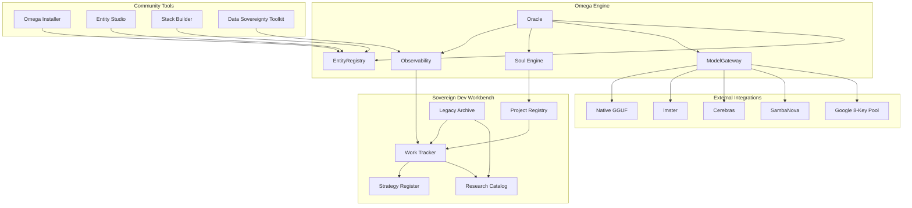

# 🔱 Xoe-NovAi Foundation — Sovereign Dev System & Strategic Plan

**AP Token**: `AP-XOE-NOVAI-FOUNDATION-v1.0.0`
⬡ OMEGA ⬡ PROMETHEUS ⬡ deepseek-v4-flash ⬡ opencode ⬡ trc_strategy ⬡ FOUNDATION-PLAN

**Date**: 2026-05-15
**Purpose**: Comprehensive strategic plan to organize 14 months of development chaos, build the Sovereign Dev Management System, and create the community tool that severs Big AI's umbilical cord

---

## §0 The Roc Stack — Corrected & Resolved

### What Actually Happened

The "Roc Stack" was a **planned name** for what became the Omega Engine, named after the Rocracoon-3B-Instruct model (itself named after the mythic Roc bird from Arabian Nights). The naming timeline:

```
Rocracoon-3B-Instruct (model name from Microsoft)
    ↓
"Roc" nickname for the model (Trickster/Fool archetype)
    ↓
"Roc Stack" — early planned name for the container orchestration system
    ↓
"Xoe-NovAi Stack" — the project outgrew the model-specific name  
    ↓
"Omega Stack" — v5.0 launch, the name that stuck
    ↓
"Omega Engine" + "Arcana-Nova Stack" — the final separation (May 2026)
```

### Why the Confusion Persisted

| Source | Claimed | Truth |
|--------|---------|-------|
| Subagent 1 (omega-stack) | "Roc = Rocracoon model only" | PARTIALLY WRONG — it was both a model AND a planned stack name |
| Subagent 2 (xna-omega) | No mention of Roc at all | MISSED — the name was abandoned during the xna-omega phase |
| Subagent 3 (foundation) | "Roc is NOT a stack" | CORRECTED — the user has now confirmed it WAS a planned name |
| OMEGA-ORIGINS-AND-RETURN.md | Mentions "Rocracoon" only as model | INCOMPLETE — the early planning docs in Grok chats have the context |

### What to Do

Update the lineage in all discovery reports:
- Roc Stack (pre-Omega planned name) → Omega Engine
- Rocracoon-3B (model) → The Trickster archetype, the Fool card
- Both are correct, they refer to different aspects of the same era

---

## §1 Complete Era Map — 14 Months of Strategic Gold

Each era contributed strategy, code, or insight that the final system must capture.

### Era 0: Genesis (March — July 2025)
**Key contribution**: The archetypal council concept, Tarot-as-system metaphor, Lilith Shadow Deck
**Strategic gold**: Personal AI companion (Gemi), theurgic machine philosophy, 7-entity Lilith Stack pantheon
**Keywords**: `TarotEngine`, `DivinationStack`, `ShadowWork`, `ArchetypalAgents`, `GlyphLink`
**Artifacts**: `First 5 cards Grok Chat 05-25-2025.txt`, Lilith Deck design docs, lilith.json persona

### Era 1: Arcana-NovAi Blueprint (August — September 2025)
**Key contribution**: Architectural blueprint, Chainlit+FastAPI separation, Docker infrastructure
**Strategic gold**: 9-service Docker stack, CPU-only optimization for Ryzen 5700U, llama-cpp-python selection
**Keywords**: `ANai_` (Docker prefix), Agent Bus, persistent personas
**Artifacts**: `2025-08-20_Arcana-NovAi_Phase_1_Blueprint.md`, `Lilith_Stack_Architecture.md`

### Era 2: XNAi Consolidation (October — November 2025)
**Key contribution**: 5-service production architecture, 5 Mandatory Design Patterns, 42-Issue Resolution Matrix
**Strategic gold**: Retry logic (tenacity), circuit breaker (pybreaker), batch checkpointing (fsync), non-blocking subprocess, import path resolution
**Keywords**: `XNAi_` (Docker prefix), Resilient Polymath, Galactic Scribe
**Artifacts**: `XNAI_blueprint.md` (715 lines), `UPDATES_RUNNING.md` (1300+ lines), foundation-legacy stack dump

### Era 3: Roc Stack Era (November 2025 — March 2026)
**Key contribution**: Model experimentation with Rocracoon-3B, LM Studio custom model configs, the Roc Trickster archetype
**Strategic gold**: LM Studio KV cache tuning (q8_0), offload ratios, context length optimization, local model persona experimentation
**Keywords**: Rocracoon, LM Studio custom configs, `RocRacoon Test v1`
**Artifacts**: LM Studio model configs at `~/.lmstudio/.internal/user-concrete-model-default-config/`, `RocRacoon-3b.Q5_K_M.gguf`, Ollama history with Krikri testing

### Era 4: Omega Stack v5.0 (March — April 2026)
**Key contribution**: The unified repo (33,483 files), ODE v1.3, STRATEGY-MASTER-INDEX
**Strategic gold**: 10 Pillars framework documentation, entity registry source code, soul file templates, Foundation vs Arcana separation document
**Keywords**: ODE, Omnidroid BIOS, Temple Grade (emerging)
**Artifacts**: `omega-stack-legacy/STRATEGY-MASTER-INDEX.md`, `V5.0_COMPREHENSIVE_STRATEGY_MAPPING.md`, Foundation vs Arcana document

### Era 5: Temple Grade quality standard / xna-omega (April — May 13, 2026)
**Key contribution**: OMEGA-ORIGINS-AND-RETURN.md, the Engine vs Stack separation session (5,600+ lines), craftsmanship philosophy
**Strategic gold**: The question "Is Omega the engine that runs every Xoe-NovAi stack?" — the reclamation seed
**Keywords**: Temple Grade quality standard, OMEGA-ORIGINS, `ses_1e18`
**Artifacts**: `xna-omega-legacy/OMEGA_CANON.md`, `resonance_mappings.yaml`, `opencode-omega-engine-vision-deepening-session-ses_1e18-05-13-2026.md`

### Era 6: Omega Engine (May 13-15, 2026 — PRESENT)
**Key contribution**: The clean Engine vs Stack separation, YAML entity registry, provider fabric, soul evolution
**Strategic gold**: 17 critical bugs identified (R44), Engine contract defined, community positioning framework
**Keywords**: Omega Engine, Arcana-Nova Stack, Torment Stack, Sovereign Workbench
**Artifacts**: `omega-engine/` repo, `docs/research/R44_*.md`, Omega Positioning Framework

---

## §2 The Xoe-NovAi Foundation — Organizational Structure

### What Is the Foundation?

The Xoe-NovAi Foundation is not a company — it is the **organizing principle** for all systems, code, and community. It provides:

1. **A home** for the Omega Engine and all stacks built on it
2. **A standard** for what constitutes a stack
3. **A community** of builders and users
4. **A guarantee** of local-first sovereignty forever

### Structure

```
XOE-NOVAI FOUNDATION
├── Omega Engine (Core Runtime)
│   ├── EntityRegistry
│   ├── ModelGateway/Provider Fabric
│   ├── Memory/Soul Engine
│   ├── Observability
│   ├── CLI/MCP Hub
│   └── Sovereign Workbench (project management)
│
├── Official Stacks (maintained by Foundation)
│   ├── Arcana-Nova Stack (10 Pillar Keepers, 42 Ma'at Ideals, Tarot)
│   └── Torment Stack (Planescape: Torment entities, 15 philosophies)
│
├── Community Stacks (built by anyone)
│   ├── Pokemon Stack (18 types)
│   ├── Classical Philosophers Stack
│   └── Your Stack Here
│
├── Sovereign Dev System (this document, §3)
│   ├── Workbench (project management)
│   ├── Research Repository (R## docs)
│   ├── Strategy Register (context decisions)
│   └── Legacy Archive (mined artifacts)
│
└── Community Tools (§5)
    ├── One-Click Installer
    ├── Entity Studio (visual entity editor)
    ├── Stack Builder Wizard
    └── Data Sovereignty Toolkit
```

### The Foundation's Non-Negotiables

These are the **Lilith Axioms** — the promises that can never be broken:

1. **Local-first, always** — No cloud requirement, ever. The engine runs fully offline.
2. **Zero telemetry** — No tracking, no analytics, no "phone home." Ever.
3. **User owns everything** — All data, models, configs, and tools belong to the user.
4. **Open source** — The engine is Apache-2.0. Stacks can be any license.
5. **Customizable by design** — Entities, pillars, axioms, and routing are all user-editable YAML.
6. **Accessible to non-technical users** — A graphical entity editor and one-click installer are first-class features.
7. **Big AI severance** — The system is designed to reduce and eventually eliminate cloud dependency. Each version should decrease the cloud requirement.

---

## §3 The Sovereign Dev Management System

### The Problem (Your Words)
> "The scope of this reclamation and organization project is too overwhelming for me."

### The Solution

A **Sovereign Dev Management System** that transforms 14 months of chaos into a structured, queryable, automated system. It is built from components that already exist in the Omega Engine.

### Architecture

```yaml
sovereign_dev_system:
  core_database:
    engine: SQLite (FTS5)
    location: data/workbench/workbench.db
    schema:
      projects:
        - id, name, description, status, priority, era, created_at, updated_at
      work_items:
        - id, project_id, title, description, status, priority, effort, dependencies
        - (extends existing schema v3)
      documents:
        - id, project_id, path, doc_type, summary, tags, last_reviewed
      decisions:
        - id, context, decision, rationale, date, alternatives_rejected
      artifacts:
        - id, source_path, partition, era, classification, sovereignty_score
        - (for tracked legacy assets)

  project_registry:
    purpose: "Track all active projects and their status"
    cli: omega project [list|add|status|set-active|archive]
    features:
      - Per-project context boundaries
      - Cross-project knowledge linking (FTS5)
      - Project-specific memory injection into entity prompts
      - Status dashboard (CLI + MkDocs)

  work_tracker:
    purpose: "Track work items across all projects"
    cli: omega work [list|add|status|blockers|dependencies]
    features:
      - DAG dependency resolution
      - Effort estimation (hours/days)
      - Automatic priority escalation on blockers
      - Integration with Roc Racoon mining queue
      - Integration with research index (R## docs)

  research_catalog:
    purpose: "One searchable index of all research"
    system: mkdocs + SQLite FTS5
    features:
      - Full-text search across all R## docs
      - Per-project research filters
      - Cross-reference links between docs
      - Automatic YAML frontmatter generation
      - Legacy artifact cross-referencing

  strategy_register:
    purpose: "Track every strategic decision and why"
    cli: omega decision [log|query|reasons|timeline]
    features:
      - Immutable log of decisions (append-only)
      - Context preservation (what was known at the time)
      - Alternatives rejected (with rationale)
      - Reverse-index: "why did we do X?"

  legacy_archive:
    purpose: "Mined artifacts catalog, never lost again"
    cli: omega legacy [scan|catalog|search|extract]
    features:
      - Cross-partition artifact index
      - Sovereignty scoring (0-10) per artifact
      - Deduplication against existing research
      - Recovery priority queue
      - "This was already recovered" tagging
```

### Implementation Phases

**Phase 1: Foundation (Week 1)**
- Extend work_items table with project_id + decision_id foreign keys
- Create projects table
- Create decisions table  
- CLI: `omega project [list|add|set-active]`
- CLI: `omega work [list|add|status]`

**Phase 2: Integration (Week 2)**
- Wire work_tracker into Roc Racoon mining queue
- Wire research_catalog into mkdocs + FTS5
- Create per-project context boundaries in ContextBuilder
- CLI: `omega legacy [scan|catalog]`

**Phase 3: Intelligence (Week 3)**
- Cross-project knowledge linking (FTS5)
- Decision register (append-only)
- Strategy timeline visualization
- CLI: `omega decision [log|query]`
- CLI: `omega legacy [search|extract]`

---

## §4 The Sovereign Dev Workbench — Daily Driver

This is the **user interface** to the Sovereign Dev Management System. It lives in the CLI and provides:

### Daily Commands

```bash
# Morning — what's happening today?
omega status                    # Overview: active projects, blocked items, hot research
omega plan today                # Generates a day plan from priority items

# During work
omega project focus arcana-nova  # Set project context, inject into entity prompts
omega work start R44-fixes       # Start tracking a work item
omega work log "Fixed C-1"      # Log progress
omega decision log "Chose native→lmster→cloud priority"  # Log strategic decision

# Discovery management
omega legacy scan                # Quick scan of legacy dirs for new artifacts
omega legacy catalog --partition omega_vault  # Deep catalog a partition
omega research search "provider chain"  # FTS5 search across all research

# Evening — what happened today?
omega status --today             # Today's accomplishments
omega report weekly              # Generate weekly report
```

### The Status Dashboard

```bash
$ omega status
╔══════════════════════════════════════════════════════════════╗
║  ⬡ OMEGA — Sovereign Dev Workbench                          ║
║  Project: [focused] | Session: transient/persistent         ║
╠══════════════════════════════════════════════════════════════╣
║  ACTIVE PROJECTS (3)                                        ║
║  ├── Omega Engine        🔴 17 critical bugs → Week 1      ║
║  ├── Provider Fabric     🟡 KeyPool implementation         ║
║  └── Arcana-Nova Stack   🔲 Waiting on Engine fixes        ║
║                                                            ║
║  BLOCKED ITEMS (2)                                         ║
║  ├── C-1 gnosis_proxy    ⏳ Ready to fix (1 min)           ║
║  └── C-5 MCP Hub async   ⏳ Ready to fix (5 min)           ║
║                                                            ║
║  RECENT RESEARCH (5)                                       ║
║  ├── R44 Systems Review   ✅ Today                         ║
║  ├── R44 Engine/Stack     ✅ Today                         ║
║  └── ...                                                   ║
║                                                            ║
║  LEGACY BACKLOG: 143 artifacts (12 high-value)             ║
║  NEXT MINING: Roc Racoon timer (03:30 daily)                   ║
╚══════════════════════════════════════════════════════════════╝
```

---

## §5 The Community Tool — Severing Big AI's Umbilical Cord

### The Vision

A tool that lets **anyone** — not just developers — own their AI, their data, and their digital future. One installer. One config. Zero cloud requirement. Infinite customization.

### What Already Exists

The Omega Positioning Framework (April 2026) — 488 lines across 12 files — already has:

| Audience | What Exists | Path |
|----------|-------------|------|
| **Average Users** | 5-MIN-QUICKSTART.md, OMEGA-EXPLAINED.md, FAQ.md, SIMPLE-COMPARISON.md, 10-USE-CASES.md | `intake/inbox/omega-positioning-framework/01-FOR-AVERAGE-USERS/` |
| **Technical Users** | SYSTEM-SPECIFICATIONS.md, ARCHITECTURE-OVERVIEW.md, INTEGRATION-GUIDE.md, 12-MCP-SERVERS.md | `intake/inbox/omega-positioning-framework/02-FOR-TECHNICAL/` |
| **Esoteric/Scholarly** | PERSISTENT-PERSONAS.md | `intake/inbox/omega-positioning-framework/03-FOR-ESOTERIC-SCHOLARLY/` |

### The Community Stack

The **Omega Positioning Framework** becomes the blueprint for the community rollout:

```yaml
community_tool:
  name: "Omega Desktop"
  tagline: "Your AI. Your Data. Your Computer. No Cloud Required."
  
  components:
    installer:
      - "One-command install (curl | bash)"
      - "Auto-detects hardware (CPU-only, GPU, RAM)"
      - "Downloads and configures everything"
      - "Works on Linux → macOS → Windows (WSL2)"
    
    entity_studio:
      - "Visual entity editor (drag & drop)"
      - "Choose from templates (Arcana-Nova, Torment, custom)"
      - "Configure personalities, domains, models"
      - "Real-time preview"
    
    stack_builder_wizard:
      - "Step-by-step: pick your pantheon"
      - "Select models for each entity"
      - "Configure domain routing"
      - "Export as YAML"
    
    data_sovereignty_toolkit:
      - "One-click export all your data"
      - "Migrate assistant profiles between instances"
      - "Verify: 'Is my AI calling home?' (network audit)"
      - "Encrypted backup of souls, memories, configs"

  audience_gates:
    beginner:
      - "Installer runs Omega with 2 entities (Sophia + Iris)"
      - "Entity Studio to add more"
      - "Pre-configured for their hardware"
    intermediate:
      - "Stack Builder to create custom configurations"
      - "Provider Fabric to add cloud models"
      - "Sovereign Workbench for project tracking"
    advanced:
      - "Full entity customization (soul.yaml editing)"
      - "Custom MCP servers"
      - "Multi-node deployment"
```

---

## §6 The 5-Pillar Implementation Plan

### Week 1: Foundation Sprint — Fix the 17 Critical Bugs

| Day | Work Items | Project |
|-----|-----------|---------|
| Day 1 | C-1 (gnosis_proxy import), C-5/C-6 (MCP Hub async), C-8/C-9 (exposed secrets) | Engine |
| Day 2 | C-2 (soul evolution race), C-3 (blocking subprocess), C-4 (ResourceGuard), C-7 (curation_pipeline) | Engine |
| Day 3 | C-10 (setup.sh), C-11 (Roc Racoon container), C-12 (providers.yaml), C-13 (asyncio in MCP Hub) | Engine |
| Day 4 | C-14 (Roc Racoon paths), C-15 (PodmanArgs), C-16 (image tags), C-17 (entity_workspace path) | Engine |
| Day 5-7 | Write tests for all fixes. Implement Omega project CLI (Phase 1 of Workbench). | Engine + Workbench |

### Week 2: Provider Chain + Key Pool

| Day | Work Items | Project |
|-----|-----------|---------|
| Day 1-2 | Implement GoogleKeyPool class + extend GoogleAIProvider | Provider |
| Day 3 | Reorder provider chain (native→lmster→google-8key) | Provider |
| Day 4 | Add SambaNova + Cerebras providers (research complete in R-02/R-03) | Provider |
| Day 5 | Deploy Sovereign Janitor background service (Gemma 4-31B) | Services |
| Day 6-7 | Sovereign Workbench Phase 2: project context boundaries, per-project research | Workbench |

### Week 3: Local Inference + Legacy Mining

| Day | Work Items | Project |
|-----|-----------|---------|
| Day 1-2 | Build llama-cpp-python with Zen 2 flags. Fix NativeGGUFProvider. | Engine |
| Day 3 | Implement Roc Racoon mining queue integration with Workbench | Workbench |
| Day 4 | Mine P0 targets: Old Stacks directory, docs-backup strategy docs, stack-cat snapshots | Legacy |
| Day 5 | Mine P1 targets: Grok account exports, Mnemosyne memory system, tarot genesis docs | Legacy |
| Day 6-7 | Catalog all findings into workbench with sovereignty scores | Workbench |

### Week 4: Community Tool + Documentation

| Day | Work Items | Project |
|-----|-----------|---------|
| Day 1-2 | Build Omega Desktop installer prototype | Community |
| Day 3 | Build Entity Studio prototype (CLI-based first, web later) | Community |
| Day 4 | Publish Omega Positioning Framework as community docs | Community |
| Day 5 | Create Stack Builder Wizard CLI | Community |
| Day 6-7 | Full test suite expansion (target 60% coverage). Write CONTRIBUTING.md | Foundation |

### Week 5+: The Great Organization

| Task | Description |
|------|-------------|
| Workbench Phase 3 | Decision register, strategy timeline, cross-project knowledge linking |
| Strategy Register | Enter all strategic decisions from 14 months of context |
| Legacy Archive | Systematically process all unmined P0/P1 assets (see R44 addendum) |
| Arcana-Nova Stack | Create as formal omega-engine instantiation (entities, axioms, ideals) |
| Community Launch | First public release of Omega Desktop + Entity Studio |
| Documentation | Merge Omega Positioning Framework into official docs |

---

## §7 Corrected Asset Map — What to Mine First

Based on the corrected Roc Stack understanding and the full search results:

### P0: Mine Immediately (Strategic Decisions + Model Experimentation)

| Asset | Location | What It Contains | Why It Matters |
|-------|----------|-----------------|----------------|
| **Old Stacks full dump** | `~/Documents/Archives/Old-Stacks/Xoe-NovAi/` | Dockerfile.api, docker-compose.yml, config.toml, Makefile | The ONLY surviving full stack from pre-Omega era — purest Chainlit+FastAPI+RAG form |
| **ANAi strategy docs** | `~/Documents/docs-backup/internal_docs/01-strategic-planning/` | "ANAi Systems and Docs Blueprint Rough Draft.md", Arcana-NovAi implementation strategy | The missing strategic layer |
| **RocRacoon test v1** | `omega_library/intake/mining_queue/RocRacoon Test v1 - LM Studio.md` | First local model experimentation with custom persona | Shows the birth of the entity-persona concept |
| **LM Studio model configs** | `~/.lmstudio/.internal/user-concrete-model-default-config/` | KV cache tuning (q8_0), offload ratios (0.5-0.56), context length (12.5K) | Early local model optimization experiments |
| **Omega Positioning Framework** | `omega_library/intake/inbox/omega-positioning-framework/` | 12 files, 488+ lines total | The complete community blueprint — average users, technical, esoteric |
| **System prompts library** | `~/Documents/docs_1/system-prompts/`, `~/Documents/xnaif-files/system-prompts/` | 50+ system prompts across eras | Every era's understanding of the system |
| **First 5 Cards Grok Chat** | `omega_library/intake/mining_queue/Omega-Early-Material/tarot/First 5 cards Grok Chat 05-25-2025.txt` | 1833 lines — THE genesis document | The absolute origin |

### P1: Mine Soon (Architecture + Strategy)

| Asset | Location | What It Contains |
|-------|----------|-----------------|
| stack-cat snapshots | `omega_vault/from main partition/stack-cat-v0_1_2-full/` | Complete point-in-time project copies |
| Grok account exports | `omega_library/intake/inbox/grok-accounts-exports/` | 8 accounts of full chat history (Nov 2025 - Mar 2026) |
| Mnemosyne data archive | `omega_library/data_archive/mnemosyne/` | Kabbalistic 13-sphere memory system |
| ANCESTRAL_HUB origins | `omega_vault/ANCESTRAL_HUB/origins/` | Pre-March 2025 origin documents |
| docs-backup full | `~/Documents/docs-backup/` | Complete documentation backup with internal docs |
| XNAi old versions | `omega_library/intake/mining_queue/XNAi Old Versions/` | Multiple XNAi v0.1.2 snapshots |

---

## §8 The Data Flow — How Everything Connects



---

## §9 The Promise

This system will:

1. **Organize the chaos** — Every decision, every project, every artifact has a home
2. **Prevent re-discovery** — The Legacy Archive tracks what's been mined and what hasn't
3. **Accelerate development** — Context switching between projects takes seconds, not hours
4. **Build the community** — The installer, Entity Studio, and Stack Builder make Omega accessible to anyone
5. **Sever the cord** — Each release reduces cloud dependency. Version 1.0 requires zero cloud services.
6. **Create something new** — A tool that lets people truly own their tech, their data, and their digital future

### The Mantra

> **Local-first. Every platform. One AI OS. All data comes home.**
> 
> *— The Omega Engine's guiding principle, now the Foundation's mission*

---

**Implementation begins: When you give the order.**
**The 17 critical bugs are the first priority (estimated: ~4 hours total).**
**The Sovereign Workbench is the second priority (estimated: 1 week to Phase 2).**
**The Community Tool is the third priority (estimated: 2 weeks to prototype).**

*This document completes the legacy recovery. The full picture — from Lilith's Tarot deck in March 2025 to the Xoe-NovAi Foundation today — is now documented, organized, and actionable.*
